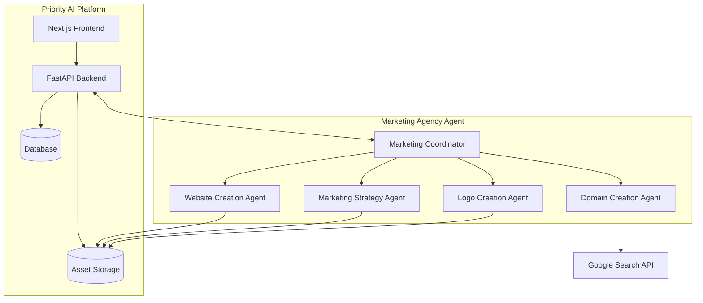

# Marketing Agency Agent Integration

This document outlines the integration of the Marketing Agency agent into the Priority AI application. It covers the architecture, data flow, user experience, and implementation details.

## Overview

The Marketing Agency agent is a powerful AI-powered assistant that helps users establish an online presence through domain selection, website creation, marketing strategy development, and logo design. Integrating this agent into the Priority AI platform enhances the platform's capabilities and provides users with a comprehensive marketing solution.

## Integration Architecture

The integration follows a microservices architecture with clear separation of concerns:



### Components

1. **Priority AI Platform**
   - **Next.js Frontend**: User interface for interacting with the platform
   - **FastAPI Backend**: API endpoints for handling requests and responses
   - **Database**: Stores user data, workflow progress, and generated content metadata
   - **Asset Storage**: Stores generated assets (websites, logos, marketing materials)

2. **Marketing Agency Agent**
   - **Marketing Coordinator**: Main agent that orchestrates the sub-agents
   - **Domain Creation Agent**: Suggests available domain names
   - **Website Creation Agent**: Generates website code
   - **Marketing Strategy Agent**: Develops marketing strategies
   - **Logo Creation Agent**: Creates logo designs

### Integration Points

1. **API Integration**
   - The Priority AI backend communicates with the Marketing Agency agent through a REST API
   - Authentication is handled using JWT tokens
   - Requests and responses are formatted as JSON

2. **Data Flow**
   - User inputs are collected through the Priority AI frontend
   - Inputs are validated and processed by the backend
   - The backend sends requests to the Marketing Agency agent
   - The agent processes the requests and returns responses
   - The backend stores the responses in the database and asset storage
   - The frontend displays the results to the user

3. **Asset Management**
   - Generated assets (websites, logos, marketing materials) are stored in Cloud Storage
   - Metadata about the assets is stored in the database
   - Assets are associated with user accounts and workflows

## User Experience

The integration provides a seamless user experience that combines the Strategic Workflow System with the Marketing Agency agent's capabilities.

### User Flows

#### Domain Selection Flow

1. User initiates the domain selection workflow
2. User provides keywords relevant to their brand
3. System sends keywords to the Domain Creation Agent
4. Agent generates a list of available domain names
5. System displays the list to the user
6. User selects a domain name
7. System stores the selected domain for use in subsequent workflows

#### Website Creation Flow

1. User initiates the website creation workflow
2. User provides information about their brand, purpose, and key offerings
3. System retrieves the selected domain name
4. System sends the information to the Website Creation Agent
5. Agent generates website code (HTML, CSS, JavaScript)
6. System stores the generated code in asset storage
7. System displays a preview of the website to the user
8. User can make adjustments or approve the website

#### Marketing Strategy Flow

1. User initiates the marketing strategy workflow
2. User provides information about their target audience, goals, and unique selling proposition
3. System retrieves the selected domain name
4. System sends the information to the Marketing Strategy Agent
5. Agent develops a comprehensive marketing strategy
6. System stores the strategy in the database
7. System displays the strategy to the user
8. User can make adjustments or approve the strategy

#### Logo Design Flow

1. User initiates the logo design workflow
2. User provides information about their brand identity and preferences
3. System retrieves the selected domain name
4. System sends the information to the Logo Creation Agent
5. Agent generates logo designs
6. System stores the designs in asset storage
7. System displays the designs to the user
8. User selects a design or requests revisions

### Integration with Strategic Workflows

The Marketing Agency agent is integrated with the Strategic Workflow System in the following ways:

1. **Discovery Workflow**
   - Introduces users to the Marketing Agency agent's capabilities
   - Collects initial information about the user's business
   - Recommends relevant workflows based on the user's needs

2. **Foundation Components**
   - Vision, Mission, and Core Values workflows inform the Marketing Agency agent
   - Agent uses this information to generate more relevant and aligned outputs

3. **Analysis Components**
   - SWOT Analysis, Competitor Analysis, and Market Segmentation inform the Marketing Strategy Agent
   - Agent incorporates this information into the marketing strategy

4. **Customer Understanding**
   - Persona Development, Customer Journey Map, and Buying Process inform the Website Creation Agent and Marketing Strategy Agent
   - Agents use this information to create more targeted and effective outputs

5. **Positioning & Messaging**
   - Brand Assessment, Positioning Statement, and Messaging Framework inform all Marketing Agency sub-agents
   - Agents use this information to ensure consistency across all outputs

## Implementation Details

### Backend Integration

The backend integration is implemented using a service-oriented architecture:

```python
# marketing_agency_service.py
from fastapi import APIRouter, Depends, HTTPException
from typing import Dict, List, Optional
from pydantic import BaseModel

from .auth import get_current_user
from .models import User
from .services.marketing_agency import MarketingAgencyClient

router = APIRouter(prefix="/api/marketing-agency", tags=["marketing-agency"])

class DomainRequest(BaseModel):
    keywords: List[str]

class DomainResponse(BaseModel):
    domains: List[str]

class WebsiteRequest(BaseModel):
    domain: str
    brand_name: str
    purpose: str
    key_offerings: List[str]
    target_audience: Optional[str] = None
    style_preferences: Optional[str] = None

class WebsiteResponse(BaseModel):
    website_id: str
    preview_url: str
    files: Dict[str, str]

# Similar models for marketing strategy and logo design

@router.post("/domains", response_model=DomainResponse)
async def generate_domains(
    request: DomainRequest,
    current_user: User = Depends(get_current_user)
):
    """Generate domain name suggestions based on keywords."""
    client = MarketingAgencyClient()
    domains = await client.generate_domains(request.keywords)
    return DomainResponse(domains=domains)

@router.post("/websites", response_model=WebsiteResponse)
async def generate_website(
    request: WebsiteRequest,
    current_user: User = Depends(get_current_user)
):
    """Generate a website based on the provided information."""
    client = MarketingAgencyClient()
    website = await client.generate_website(
        domain=request.domain,
        brand_name=request.brand_name,
        purpose=request.purpose,
        key_offerings=request.key_offerings,
        target_audience=request.target_audience,
        style_preferences=request.style_preferences
    )
    return WebsiteResponse(
        website_id=website.id,
        preview_url=website.preview_url,
        files=website.files
    )

# Similar endpoints for marketing strategy and logo design
```

### Frontend Integration

The frontend integration is implemented using React components and hooks:

```tsx
// useMarketingAgency.ts
import { useState } from 'react';
import { api } from '../api';

export function useMarketingAgency() {
  const [isLoading, setIsLoading] = useState(false);
  const [error, setError] = useState<string | null>(null);

  const generateDomains = async (keywords: string[]) => {
    setIsLoading(true);
    setError(null);
    try {
      const response = await api.post('/api/marketing-agency/domains', { keywords });
      setIsLoading(false);
      return response.data.domains;
    } catch (err) {
      setIsLoading(false);
      setError('Failed to generate domains');
      console.error(err);
      return [];
    }
  };

  const generateWebsite = async (params: {
    domain: string;
    brandName: string;
    purpose: string;
    keyOfferings: string[];
    targetAudience?: string;
    stylePreferences?: string;
  }) => {
    setIsLoading(true);
    setError(null);
    try {
      const response = await api.post('/api/marketing-agency/websites', {
        domain: params.domain,
        brand_name: params.brandName,
        purpose: params.purpose,
        key_offerings: params.keyOfferings,
        target_audience: params.targetAudience,
        style_preferences: params.stylePreferences
      });
      setIsLoading(false);
      return response.data;
    } catch (err) {
      setIsLoading(false);
      setError('Failed to generate website');
      console.error(err);
      return null;
    }
  };

  // Similar functions for marketing strategy and logo design

  return {
    isLoading,
    error,
    generateDomains,
    generateWebsite,
    // Other functions
  };
}
```

### Client Implementation

The client implementation for communicating with the Marketing Agency agent:

```python
# marketing_agency_client.py
import os
import json
import httpx
from typing import Dict, List, Optional
from pydantic import BaseModel

class Website(BaseModel):
    id: str
    preview_url: str
    files: Dict[str, str]

class MarketingStrategy(BaseModel):
    id: str
    strategy: Dict[str, any]
    document_url: str

class Logo(BaseModel):
    id: str
    image_url: str
    variants: List[str]

class MarketingAgencyClient:
    def __init__(self):
        self.base_url = os.environ.get("MARKETING_AGENCY_URL")
        self.api_key = os.environ.get("MARKETING_AGENCY_API_KEY")
        
    async def generate_domains(self, keywords: List[str]) -> List[str]:
        """Generate domain name suggestions based on keywords."""
        async with httpx.AsyncClient() as client:
            response = await client.post(
                f"{self.base_url}/domains",
                json={"keywords": keywords},
                headers={"Authorization": f"Bearer {self.api_key}"}
            )
            response.raise_for_status()
            return response.json()["domains"]
    
    async def generate_website(
        self,
        domain: str,
        brand_name: str,
        purpose: str,
        key_offerings: List[str],
        target_audience: Optional[str] = None,
        style_preferences: Optional[str] = None
    ) -> Website:
        """Generate a website based on the provided information."""
        async with httpx.AsyncClient() as client:
            response = await client.post(
                f"{self.base_url}/websites",
                json={
                    "domain": domain,
                    "brand_name": brand_name,
                    "purpose": purpose,
                    "key_offerings": key_offerings,
                    "target_audience": target_audience,
                    "style_preferences": style_preferences
                },
                headers={"Authorization": f"Bearer {self.api_key}"}
            )
            response.raise_for_status()
            data = response.json()
            return Website(
                id=data["id"],
                preview_url=data["preview_url"],
                files=data["files"]
            )
    
    # Similar methods for marketing strategy and logo design
```

## Deployment Configuration

The deployment configuration includes environment variables for connecting to the Marketing Agency agent:

```yaml
# .env.example
# Marketing Agency Agent Configuration
MARKETING_AGENCY_URL=https://api.marketing-agency.example.com
MARKETING_AGENCY_API_KEY=your-api-key
```

## Testing Strategy

The integration is tested at multiple levels:

1. **Unit Tests**
   - Test individual components and functions
   - Mock API responses from the Marketing Agency agent

2. **Integration Tests**
   - Test the interaction between the Priority AI backend and the Marketing Agency agent
   - Use a test instance of the Marketing Agency agent

3. **End-to-End Tests**
   - Test the complete user flows
   - Verify that the generated assets are correctly stored and displayed

## Security Considerations

The integration includes several security measures:

1. **Authentication**
   - API requests to the Marketing Agency agent are authenticated using API keys
   - User authentication is required for accessing the Marketing Agency features

2. **Authorization**
   - Users can only access their own data and generated assets
   - Role-based access control for administrative functions

3. **Data Protection**
   - Sensitive data is encrypted in transit and at rest
   - Personal information is handled according to privacy regulations

4. **Rate Limiting**
   - API requests to the Marketing Agency agent are rate-limited to prevent abuse
   - User-specific rate limits based on their subscription plan

## Monitoring and Logging

The integration includes monitoring and logging:

1. **API Monitoring**
   - Track API request volume, latency, and error rates
   - Set up alerts for abnormal patterns

2. **User Activity Logging**
   - Log user interactions with the Marketing Agency features
   - Track usage patterns and popular features

3. **Error Tracking**
   - Log and track errors in the integration
   - Set up alerts for critical errors

## Future Enhancements

Planned enhancements for the integration:

1. **Deeper Workflow Integration**
   - Tighter integration between Strategic Workflows and Marketing Agency features
   - Automated recommendations based on workflow progress

2. **Enhanced Customization**
   - More customization options for generated assets
   - User feedback loop for improving generated content

3. **Multi-Language Support**
   - Support for generating content in multiple languages
   - Localization of the user interface

4. **Advanced Analytics**
   - Track the performance of generated marketing assets
   - Provide insights and recommendations for improvement

## Conclusion

The integration of the Marketing Agency agent into the Priority AI platform provides users with a powerful set of tools for establishing their online presence and developing effective marketing strategies. The integration is designed to be seamless, secure, and scalable, with a focus on providing a high-quality user experience.
