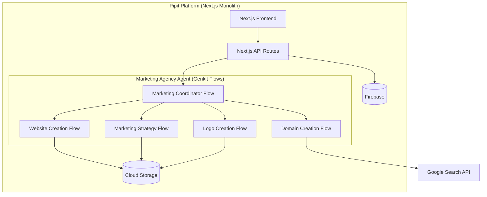

# Marketing Agency Agent Integration

This document outlines the integration of the Marketing Agency agent into the Pipit application. It covers the architecture, data flow, user experience, and implementation details.

## Overview

The Marketing Agency agent is a powerful AI-powered assistant that helps users establish an online presence through domain selection, website creation, marketing strategy development, and logo design. Integrating this agent into the Pipit platform enhances the platform's capabilities and provides users with a comprehensive marketing solution.

## Integration Architecture

The integration uses a **Genkit-native** approach, where the Marketing Agency agent is a collection of Genkit flows that are part of the main Next.js application.



### Components

1.  **Next.js Frontend**: The user interface for interacting with the platform.
2.  **Next.js API Routes**: API endpoints for handling requests and responses. These routes will invoke the Genkit flows.
3.  **Database (Firebase)**: Stores user data, workflow progress, and generated content metadata.
4.  **Asset Storage (Cloud Storage)**: Stores generated assets (websites, logos, marketing materials).
5.  **Marketing Agency Agent (Genkit Flows)**: A collection of TypeScript files in `src/ai/agents` that define the logic for the Marketing Agency.

### Data Flow

1.  User inputs are collected through the React components on the frontend.
2.  The frontend calls a Next.js API route with the user's input.
3.  The API route invokes the appropriate Genkit flow (e.g., `runFlow(websiteCreationFlow, ...)`).
4.  The Genkit flow orchestrates the AI calls and tool use to generate the desired output.
5.  The results are stored in the database and asset storage.
6.  The API route returns the results to the frontend, which then displays them to the user.

## Implementation Details

### Backend Integration (Genkit Flow)

The backend integration is implemented as a Genkit flow.

```typescript
// src/ai/agents/website-creation.ts
import { defineFlow, runFlow } from '@genkit-ai/flow';
import { geminiPro } from 'genkitx-vertexai';
import { z } from 'zod';

// Define tools for website creation (e.g., saveToStorage, searchWeb)

export const websiteCreationFlow = defineFlow(
  {
    name: 'websiteCreationFlow',
    inputSchema: z.object({
        domain: z.string(),
        brandName: z.string(),
        purpose: z.string(),
        keyOfferings: z.array(z.string()),
    }),
    outputSchema: z.object({
        websiteId: z.string(),
        previewUrl: z.string(),
    }),
  },
  async (input) => {
    // 1. Generate website content using an LLM
    const llmResponse = await generate({
        model: geminiPro,
        prompt: `Create website content for ${input.brandName}...`,
    });

    // 2. Save the generated content to Cloud Storage
    // const storageResult = await runTool('saveToStorage', llmResponse.text());
    
    // 3. Return the website ID and preview URL
    return {
        websiteId: '12345',
        previewUrl: 'https://storage.googleapis.com/...'
    };
  }
);
```

### Frontend Integration (React Hook)

The frontend integration is implemented using a React hook that calls our Next.js API route.

```tsx
// src/hooks/use-marketing-agency.ts
import { useState } from 'react';

export function useMarketingAgency() {
  const [isLoading, setIsLoading] = useState(false);
  const [error, setError] = useState<string | null>(null);

  const generateWebsite = async (params: {
    domain: string;
    brandName: string;
    purpose: string;
    keyOfferings: string[];
  }) => {
    setIsLoading(true);
    setError(null);
    try {
      const response = await fetch('/api/marketing-agency/create-website', {
          method: 'POST',
          headers: { 'Content-Type': 'application/json' },
          body: JSON.stringify(params),
      });
      
      if (!response.ok) {
        throw new Error('Failed to generate website');
      }

      const data = await response.json();
      setIsLoading(false);
      return data;
    } catch (err: any) {
      setIsLoading(false);
      setError(err.message);
      return null;
    }
  };

  return { isLoading, error, generateWebsite };
}
```

This updated documentation now accurately reflects our Genkit-based architecture.
