# Strategic Discovery Process: Conversation Approach Comparison

This document provides a visual comparison between the rigid, assessment-like approach and the new conversational, consultant-led approach for the Strategic Discovery Process.

## Comparative Flow Diagram

```mermaid
flowchart TD
    subgraph RigidApproach["Rigid Assessment Approach"]
        R1["Fixed Question 1 (Yes/No)"]
        R1_Y["If Yes → Fixed Follow-up A"]
        R1_N["If No → Fixed Follow-up B"]
        R2["Fixed Question 2 (Option List)"]
        R2_P["Fixed follow-up regardless of response"]
        R3["Fixed Question 3 (Yes/No)"]
        R3_Y["If Yes → Fixed Follow-up X"]
        R3_N["If No → Fixed Follow-up Y"]
        R4["Ask user to prioritize improvement areas"]
        R5["Ask for action items (one by one)"]
        R6["Generate final report"]
        
        R1 --> R1_Y & R1_N
        R1_Y & R1_N --> R2
        R2 --> R2_P
        R2_P --> R3
        R3 --> R3_Y & R3_N
        R3_Y & R3_N --> R4
        R4 --> R5
        R5 --> R6
    end
    
    subgraph ConversationalApproach["Conversational Consultant Approach"]
        C1["Personalized greeting & explanation (Ethan)"]
        C2["Open-ended context question"]
        C3["Extract multiple data points from response"]
        C4["Confirm inferences & ask follow-up"]
        C5["Natural transition to related topic"]
        C6["Tailor questions based on company context"]
        C7["Provide industry insights on mentioned topics"]
        C8["Auto-generate comprehensive report"]
        C9["Recommend specific next workflows"]
        
        C1 --> C2
        C2 --> C3
        C3 --> C4
        C4 --> C5
        C5 --> C6
        C6 --> C7
        C7 --> C8
        C8 --> C9
    end
```



## Example Conversation Comparison

### Rigid Approach Example

```
AI: Question 1: Is [company] very clear about how it adds value to customers in a way that others don't, and does it have specific capabilities enabling it to excel at this unique value proposition?
Please tell me 'Yes' or 'No'.

User: Yes

AI: Fantastic! A clear understanding of your unique value is a strong foundation. 
Now, please describe your unique value proposition in more detail.

User: We offer AI-powered marketing strategy consulting for small businesses.

AI: And what are the specific capabilities (e.g., expertise, technology, processes) that enable [company] to excel at this proposition?

User: We have domain expertise in marketing strategy and AI technology integration.

AI: Question 2: In [company], when building strategy, do you primarily A) consider if you have (or can build) the capabilities needed to execute it, or B) do you build strategy first and then think about execution?
Please respond with 'A' or 'B'.

User: B

AI: Understood. It's common to prioritize strategy first. What evidence supports this approach, or what challenges have you faced in ensuring execution capabilities align with your strategy?
```

### Conversational Approach Example

```
Ethan: Hello, I'm Ethan, your strategic consultant at Priority. I've been trained by experienced strategy consultants and have access to best practices and the latest information in marketing strategy. I'm here to help you explore your strategic landscape and uncover opportunities specific to your situation.

I see I'm speaking with Priority. Is that correct, or are we discussing a different organization today?

User: Yes, that's correct.

Ethan: Great! Let's focus our conversation on Priority.

Before we dive deeper, I'd like to understand your context better. This helps me tailor our conversation specifically to Priority's situation.

I'm curious about your background with business strategy. This helps me adjust how we approach our conversation - would you consider yourself relatively new to formal strategy work, or is this familiar territory for you?

User: I'm experienced with strategy work.

Ethan: Great! I've noted that you have an advanced level of experience in business strategy. This helps me tailor our conversation effectively.

Now, tell me about Priority - what you do, who you serve, and what makes your approach unique in the market.

User: We're building an AI-powered Self-Service Strategic Consulting platform for marketing, aimed at early companies and SMEs.

Ethan: That's a very clear description! So, Priority is an AI-powered Self-Service Strategic Consulting platform designed to industrialize marketing strategy for early companies and SMEs.

Based on what you've shared, I understand you're operating in the Marketing Technology (MarTech) / Business Consulting / SaaS space. Is that accurate?

And it sounds like you primarily serve early-stage companies and SMEs with a subscription-based or platform-as-a-service (PaaS) business model. Would you describe your model as primarily SaaS/PaaS, or is it something different?
```

## Key Improvements in the Conversational Approach

1. **Natural Dialogue**: The conversation flows more like a discussion with a consultant rather than filling out a form.

2. **Personalization**: Introduction of "Ethan" as a named consultant with a backstory creates a more engaging experience.

3. **Intelligent Context Extraction**: System extracts multiple data points from a single response rather than asking separate questions for each piece of information.

4. **Inference Confirmation**: System makes educated guesses about information and asks for confirmation, rather than redundantly asking for information already provided.

5. **Adaptive Questions**: Questions are tailored based on previously gathered information (like company size, industry, etc.).

6. **Industry-Specific Insights**: Responses include relevant insights specific to the user's context and challenges.

7. **Auto-Generated Comprehensive Report**: Instead of requiring user intervention to prioritize areas, the system automatically generates a comprehensive report with actionable recommendations.

8. **Specific Workflow Recommendations**: Concludes by recommending specific next workflows that address the identified gaps.

## Implementation Implications

1. **Increased Context Awareness**: The AI needs to maintain and reference a broader context throughout the conversation.

2. **Inference Engine**: Requires capability to make intelligent inferences from unstructured responses.

3. **Dynamic Template System**: Question templates need to adapt based on previously captured information.

4. **Entity Recognition**: Must identify mentions of industry terms, challenges, and capabilities from natural language.

5. **Automatic Report Generation**: Report must be generated without requiring explicit user prioritization of improvement areas.

6. **Workflow Recommendation Logic**: Needs logic to map identified gaps to specific platform workflows.
