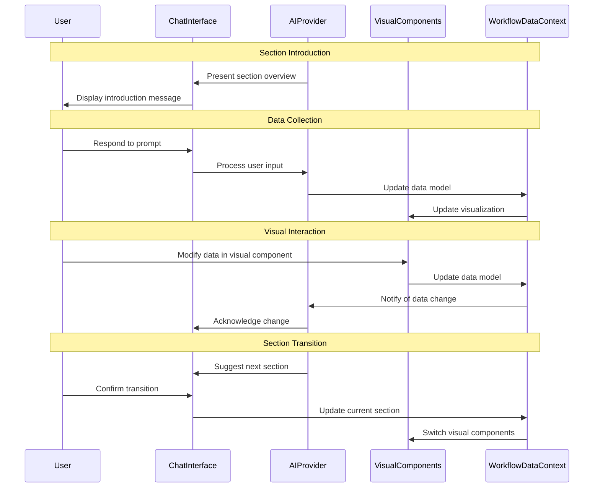

# Chat-Driven Workflow Pattern

## Overview

The chat-driven workflow pattern creates an interactive guided experience that combines conversational AI with dynamic visual components. This pattern is used throughout the marketing strategy workflow to lead users through complex processes while collecting and visualizing data.

## Core Principles

1. **Conversation-First**: The primary interaction method is conversational
2. **Visual Augmentation**: Visual components enhance the conversation
3. **Bidirectional Updates**: Changes in chat update visuals and vice versa
4. **Progressive Disclosure**: Information is revealed as needed
5. **Persistent Context**: The AI maintains awareness of the entire workflow state

## Architecture

### Component Structure

```
┌─────────────────────────────────────────────────────────────┐
│ Workflow Page Container                                     │
│ ┌─────────────────────┐      ┌─────────────────────────┐    │
│ │                     │      │                         │    │
│ │   ChatInterface     │<────>│   VisualComponents      │    │
│ │                     │      │                         │    │
│ └─────────────────────┘      └─────────────────────────┘    │
│          ▲                             ▲                    │
│          │                             │                    │
│          ▼                             ▼                    │
│ ┌─────────────────────────────────────────────────────┐     │
│ │              WorkflowDataContext                    │     │
│ └─────────────────────────────────────────────────────┘     │
│          ▲                             ▲                    │
│          │                             │                    │
│          ▼                             ▼                    │
│ ┌─────────────────────┐      ┌─────────────────────────┐    │
│ │    AIProvider       │      │      API Services       │    │
│ └─────────────────────┘      └─────────────────────────┘    │
└─────────────────────────────────────────────────────────────┘
```

### Key Components

1. **ChatInterface**: Handles the conversational UI
   - Message rendering
   - User input
   - AI response processing
   - Conversation flow management

2. **VisualComponents**: Section-specific visual elements
   - Form-based components
   - Tables and data grids
   - Charts and visualizations
   - Interactive elements

3. **WorkflowDataContext**: Manages shared workflow state
   - Current section/step tracking
   - Component data storage
   - Progress tracking
   - Event coordination between chat and visuals

4. **AIProvider**: Manages AI integration
   - Conversation history
   - Context tracking
   - AI model communication
   - Response processing

## Conversation Flow

### Conversation States

1. **Guidance**: AI provides explanations and guidance
2. **Data Collection**: AI asks questions to gather information
3. **Data Validation**: AI validates and refines collected data
4. **Analysis**: AI analyzes collected data to provide insights
5. **Transition**: AI helps user move between workflow sections

### Example Conversation Pattern



## Implementation Patterns

### Chat Message Types

1. **System Messages**: Explanations, guidance, and workflow information
2. **User Messages**: Questions, responses, and commands from the user
3. **AI Responses**: Analysis, questions, and guidance from the AI
4. **Visual Updates**: Notifications about changes in visual components
5. **Navigation Cues**: Suggestions to move between workflow sections

### Chat-to-Visual Coordination

#### Visual State Updates from Chat

```typescript
// Example: Update table data from chat
function handleChatResponse(response) {
  if (response.hasDataUpdate) {
    const updatedData = response.extractDataUpdate();
    setTableData(prevData => ({
      ...prevData,
      ...updatedData
    }));
  }
}
```

#### Visual Events to Chat Context

```typescript
// Example: Notify chat of visual component change
function handleTableChange(newData) {
  setTableData(newData);
  
  // Update chat context
  chatContext.updateContext({
    dataUpdated: true,
    updatedFields: getChangedFields(tableData, newData),
    currentData: newData
  });
}
```

### Progressive Disclosure Pattern

The chat interface uses progressive disclosure to manage complex workflows:

1. **Initial Simplicity**: Start with basic explanations and simple questions
2. **Gradual Complexity**: Introduce more complex concepts as user progresses
3. **Contextual Help**: Provide help and explanations when needed
4. **Visual Expansion**: Progressively reveal more complex visualizations

```typescript
// Example: Progressive component disclosure
function determineVisibleComponents(userProgress) {
  return {
    showSimpleForm: true,
    showDetailedTable: userProgress.hasCompletedBasics,
    showAdvancedChart: userProgress.hasCompletedIntermediate,
    showAnalysisPanel: userProgress.hasCompletedAdvanced
  };
}
```

## User Experience Patterns

### Interaction Modes

1. **Chat-Focused**: User primarily interacts via conversation
   - AI asks questions
   - User types responses
   - AI processes and updates visuals

2. **Visual-Focused**: User primarily interacts with visual components
   - User edits data in tables/forms
   - Visual components update
   - AI acknowledges changes

3. **Hybrid Mode**: User switches between chat and visuals
   - Conversation establishes context
   - User refines details in visuals
   - Conversation continues with updated context

### Context Maintenance

The AI maintains awareness of:

1. **Current Section**: Which part of the workflow is active
2. **Completion Status**: What has been completed so far
3. **User Preferences**: How the user prefers to work
4. **Data History**: What data has been entered and changed
5. **Interaction Patterns**: How the user typically interacts

### Transition Patterns

When transitioning between workflow sections:

1. **Summarize**: AI summarizes what was accomplished
2. **Preview**: AI explains what's coming next
3. **Context Carry**: Relevant data carries forward
4. **Visual Transition**: Visuals animate between states
5. **Progress Update**: Progress indicators update

## Reference Implementation

The Break-Even Analysis and Sales Funnel pages demonstrate this pattern:

- **ResizablePanelGroup**: Creates the split-panel layout
- **AIProvider**: Manages the AI conversation context
- **AnimatePresence**: Handles smooth transitions between views

## Best Practices

1. **Keep Chat Focused**: Each message should have a clear purpose
2. **Minimize Cognitive Load**: Introduce concepts gradually
3. **Use Visual Cues**: Help users understand what to focus on
4. **Provide Escape Hatches**: Allow users to skip or expedite steps
5. **Maintain Context**: Ensure the AI remembers important information
6. **Support Different Work Styles**: Allow chat-primary or visual-primary approaches
7. **Progressive Enhancement**: Start simple and add complexity gradually

## Implementation Checklist

- [ ] Set up AI Provider with appropriate context
- [ ] Create chat interface with message types
- [ ] Implement visual components with state management
- [ ] Connect chat and visual state
- [ ] Add transition animations and logic
- [ ] Implement progress tracking
- [ ] Add context awareness across sections
