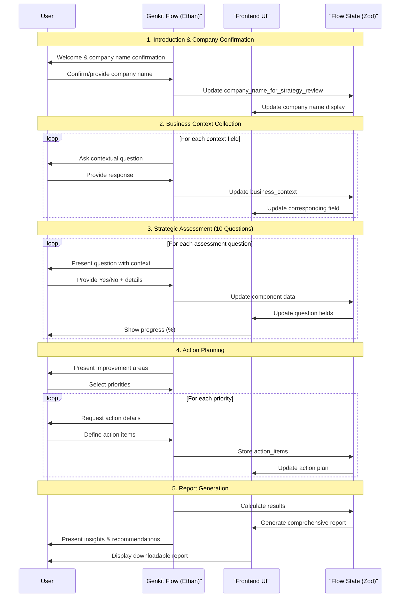

# Genkit Flow: Strategic Discovery Process

## Table of Contents
1. [Executive Summary](#executive-summary)
2. [Flow Overview](#flow-overview)
3. [Zod Schema for Flow State](#zod-schema-for-flow-state)
4. [Flow Phases](#flow-phases)
   - [Phase 1: Purpose & Introduction](#phase-1-purpose--introduction)
   - [Phase 2: Business Context Collection](#phase-2-business-context-collection)
   - [Phase 3: Core Components Assessment](#phase-3-core-components-assessment)
     - [Component 1: Building the Strategy](#component-1-building-the-strategy)
     - [Component 2: Translating Strategy to Operations](#component-2-translating-strategy-to-operations)
     - [Component 3: Executing for Impact](#component-3-executing-for-impact)
   - [Phase 4: Strategic Action Planning](#phase-4-strategic-action-planning)
   - [Phase 5: Report Generation](#phase-5-report-generation)
5. [Genkit Implementation Notes](#genkit-implementation-notes)
6. [Cross-Cutting Concerns](#cross-cutting-concerns)

## Executive Summary

The Strategic Discovery Process is a conversational workflow, implemented as a Genkit flow, designed to uncover insights about an organization's strategic landscape through a personified AI consultant named Ethan. This flow:

- **Adapts dynamically** to company size and industry context
- **Collects comprehensive data** through 10 strategic assessment questions
- **Generates actionable insights** based on identified strengths and gaps
- **Produces a detailed report** with specific recommendations and next steps
- **Maintains conversational flow** while systematically gathering structured data

**Core Principle**: User-Centricity and Consultative Exploration - Creating a natural, conversational experience that builds a rich business profile for future strategic context.

## Flow Overview



## Zod Schema for Flow State

The flow's state is defined by the following Zod schema, ensuring type safety and validation throughout the process.

```javascript
import { z } from 'zod';

const ActionItemSchema = z.object({
  related_priority_area: z.string(),
  description: z.string(),
  responsible_party: z.string(),
  target_date: z.string().datetime(), // ISO 8601 format
});

const StrategicDiscoveryStateSchema = z.object({
  company_name_for_strategy_review: z.string(),
  business_context: z.object({
    industry: z.string(),
    company_size: z.enum(["1-10", "11-50", "51-200", "201+"]),
    business_model: z.enum(["B2B", "B2C", "B2B2C", "Marketplace", "SaaS"]),
    growth_stage: z.enum(["Startup", "Growth", "Scale", "Enterprise"]),
    key_challenges: z.string(),
    team_size: z.number(),
    strategic_experience_level: z.enum(["beginner", "intermediate", "advanced", "expert"]),
    question_complexity_preference: z.enum(["standard", "simplified", "detailed"]),
  }),
  assessment_questions: z.object({
    // ... (questions as defined in the previous version) ...
  }),
  strategic_action_planning: z.object({
    priority_areas: z.array(z.string()),
    action_items: z.array(ActionItemSchema),
  }),
  summary: z.object({
    num_yes_answers: z.number(),
    num_no_answers: z.number(),
    strategic_strength_score: z.number(), // Calculated 0-100
    top_strengths: z.array(z.string()),
    top_gaps: z.array(z.string()),
  }),
  metadata: z.object({
    created_at: z.string().datetime(),
    last_updated: z.string().datetime(),
    completion_time_minutes: z.number(),
  }),
});
```

*... (The "Flow Phases" section remains the same, but with "AI Chat" replaced by "Genkit Flow" and "Visual Components" by "Frontend UI") ...*

## Genkit Implementation Notes

-   **Stateful Flow**: The entire 'Strategic Discovery Process' will be implemented as a single, stateful Genkit \`flow\`. The flow will manage the state defined by the \`StrategicDiscoveryStateSchema\`.
-   **Zod Schemas**: The \`StrategicDiscoveryStateSchema\` will be used to define the flow's state. All inputs and outputs to the flow and its tools will also be defined with Zod, ensuring end-to-end type safety.
-   **Frontend Integration**: The frontend application will invoke the Genkit flow, passing the user's message. The flow will process the message, update its state, and return the new state to the frontend, which will then re-render the UI.
-   **Tools**: Any external actions, such as saving the final report to a database or fetching company data, will be implemented as Genkit \`tools\`.
-   **Observability**: Genkit's built-in tracing will capture the entire execution of the flow, including all model interactions and state changes, for easier debugging and analysis.

## Cross-Cutting Concerns

*... (This section remains largely the same, but with minor wording adjustments to reflect the Genkit architecture) ...*
