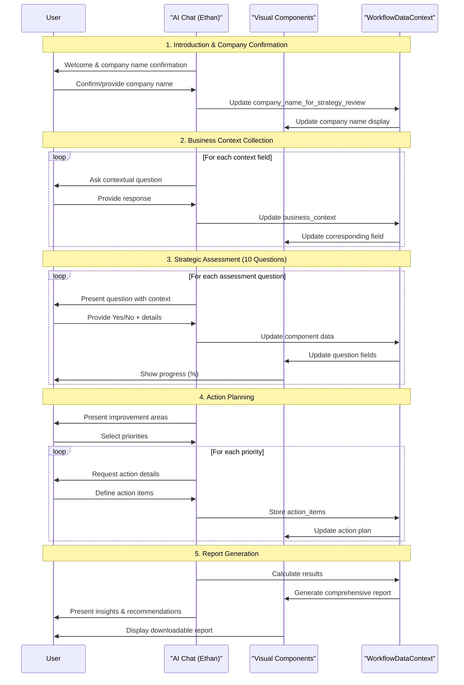

# Strategic Discovery Process Workflow

## Table of Contents
1. [Executive Summary](#executive-summary)
2. [Workflow Overview](#workflow-overview)
3. [Data Structure](#data-structure)
4. [Workflow Phases](#workflow-phases)
   - [Phase 1: Purpose & Introduction](#phase-1-purpose--introduction)
   - [Phase 2: Business Context Collection](#phase-2-business-context-collection)
   - [Phase 3: Core Components Assessment](#phase-3-core-components-assessment)
     - [Component 1: Building the Strategy](#component-1-building-the-strategy)
     - [Component 2: Translating Strategy to Operations](#component-2-translating-strategy-to-operations)
     - [Component 3: Executing for Impact](#component-3-executing-for-impact)
   - [Phase 4: Strategic Action Planning](#phase-4-strategic-action-planning)
   - [Phase 5: Report Generation](#phase-5-report-generation)
5. [Technical Specifications](#technical-specifications)
6. [Cross-Cutting Concerns](#cross-cutting-concerns)

## Executive Summary

The Strategic Discovery Process is a conversational workflow designed to uncover insights about an organization's strategic landscape through a personified AI consultant named Ethan. This workflow:

- **Adapts dynamically** to company size and industry context
- **Collects comprehensive data** through 10 strategic assessment questions
- **Generates actionable insights** based on identified strengths and gaps
- **Produces a detailed report** with specific recommendations and next steps
- **Maintains conversational flow** while systematically gathering structured data

**Core Principle**: User-Centricity and Consultative Exploration - Creating a natural, conversational experience that builds a rich business profile for future strategic context.

## Workflow Overview



## Data Structure

The workflow captures and stores the following data structure in `WorkflowDataContext`:

```javascript
{
  "company_name_for_strategy_review": "string",
  "business_context": {
    "industry": "string",
    "company_size": "string", // Options: "1-10", "11-50", "51-200", "201+"
    "business_model": "string", // Options: "B2B", "B2C", "B2B2C", "Marketplace", "SaaS"
    "growth_stage": "string", // Options: "Startup", "Growth", "Scale", "Enterprise"
    "key_challenges": "string",
    "team_size": number,
    "strategic_experience_level": "string", // Options: "beginner", "intermediate", "advanced", "expert"
    "question_complexity_preference": "string" // Options: "standard", "simplified", "detailed"
  },
  "assessment_questions": {
    // Component 1: Building the Strategy
    "Q1_unique_value_proposition": {
      "has_clarity": boolean,
      "value_proposition": "string",
      "specific_capabilities": "string"
    },
    "Q2_strategy_development": {
      "approach": "string", // "capabilities_first" | "strategy_then_execution"
      "evidence_or_improvements": "string"
    },
    "Q3_market_disruption": {
      "approach": "string", // "driving_change" | "reacting_to_change"
      "evidence_or_improvements": "string"
    },
    
    // Component 2: Translating Strategy to Operations
    "Q4_execution_communication": {
      "has_strong_processes": boolean,
      "methods": "string",
      "challenges": "string"
    },
    "Q5_capability_programs": {
      "has_visible_programs": boolean,
      "existing_programs": ["string"],
      "missing_programs": ["string"]
    },
    "Q6_resource_alignment": {
      "has_strong_alignment": boolean,
      "budget_connection_methods": "string",
      "fund_reallocation_methods": "string",
      "personal_goals_alignment": "string",
      "ai_suggestions_offered": boolean
    },
    "Q7_employee_motivation": {
      "employees_motivated": boolean,
      "motivation_methods": "string",
      "improvement_areas": "string"
    },
    "Q8_cross_functional_collaboration": {
      "has_strong_collaboration": boolean,
      "collaboration_methods": "string",
      "collaboration_challenges": "string"
    },
    "Q9_performance_tracking": {
      "has_robust_tracking": boolean,
      "tracking_methods": "string",
      "tracking_improvements": "string"
    },
    
    // Component 3: Executing for Impact
    "Q10_leadership_engagement": {
      "has_strong_engagement": boolean,
      "engagement_methods": "string",
      "goal_setting_approach": "string",
      "engagement_improvements": "string"
    }
  },
  "strategic_action_planning": {
    "priority_areas": ["string"],
    "action_items": [
      {
        "related_priority_area": "string",
        "description": "string",
        "responsible_party": "string",
        "target_date": "string" // ISO 8601 format
      }
    ]
  },
  "summary": {
    "num_yes_answers": number,
    "num_no_answers": number,
    "strategic_strength_score": number, // Calculated 0-100
    "top_strengths": ["string"],
    "top_gaps": ["string"]
  },
  "metadata": {
    "created_at": "timestamp",
    "last_updated": "timestamp",
    "completion_time_minutes": number
  }
}
```

## Workflow Phases

### Phase 1: Purpose & Introduction

#### AI Chat Guidance (Left Panel)
**Initial Greeting**: 
"Hello, I'm Ethan, your strategic consultant at Priority. I've been trained by experienced strategy consultants and have access to best practices and the latest information in marketing strategy. I'm here to help you explore your strategic landscape and uncover opportunities specific to your situation."

**Company Confirmation**:
- Leverages pre-existing data: "I see I'm speaking with [onboarding_company_name]. Is that correct, or are we discussing a different organization today?"
- Captures confirmation or update to `company_name_for_strategy_review`

**Process Explanation**:
"What makes our conversation different is that it's not a rigid assessment. I'd like to understand your organization in your own words, and we'll explore your approaches, challenges, and opportunities as our discussion naturally unfolds. I'm available 24/7 whenever you need strategic guidance."

#### Visual Components (Right Panel)
- **Title Card**: "Strategic Discovery Process for [company_name]"
- **Progress Indicator**: Simple bar showing "Getting Started (0 of 10 questions)"
- **Report Preview**: Collapsible panel showing report outline structure
- **Question Complexity Control**: Radio buttons for Standard/Simplified/Detailed

### Phase 2: Business Context Collection

#### AI Chat Guidance (Left Panel)

The AI adapts questions based on responses, using intelligent follow-ups to gather complete context:

1. **Strategic Experience**: "I'm curious about your background with business strategy. This helps me adjust how we approach our conversation..."
2. **Organization Overview**: "Tell me about [company_name] - what you do, who you serve, and what makes your approach unique..."
3. **Industry & Model**: Confirms or collects industry and business model based on initial description
4. **Team & Growth**: "How large is your team currently, and where would you say [company_name] is in its growth journey?"
5. **Key Challenges**: "What would you say are the 1-2 most pressing strategic challenges you're facing right now?"

#### Visual Components (Right Panel)
Interactive form with:
- **Industry**: Text input with autocomplete
- **Company Size**: Radio buttons (1-10, 11-50, 51-200, 201+)
- **Business Model**: Dropdown (B2B, B2C, B2B2C, Marketplace, SaaS)
- **Growth Stage**: Radio buttons (Startup, Growth, Scale, Enterprise)
- **Team Size**: Number input
- **Strategic Experience**: Radio buttons
- **Key Challenges**: Multi-line text area

**Bidirectional Updates**: Fields update as user responds in chat, and chat acknowledges direct field edits.

### Phase 3: Core Components Assessment

#### Component 1: Building the Strategy

**Question 1: Unique Value Proposition & Capabilities**
- Progress: 10% complete
- Focus: Understanding what makes the organization unique and whether they have capabilities to deliver
- Dynamic AI responses based on clarity of value proposition
- Visual: Toggle (Yes/No) + two text areas for value proposition and capabilities

**Question 2: Strategy Development Approach**
- Progress: 20% complete
- Focus: How the organization approaches strategy vs. execution
- Options: Capabilities-first, Strategy-first, or Hybrid
- Visual: Radio buttons + text area for evidence/improvements

**Question 3: Market Changes & Disruption**
- Progress: 30% complete
- Focus: Proactive market leadership vs. responsive adaptation
- Options: Market Leader, Fast Follower, Responsive, Combination
- Visual: Radio buttons + text area for examples/opportunities

#### Component 2: Translating Strategy to Operations

**Question 4: Strategy Execution & Communication**
- Progress: 40% complete
- Focus: Follow-through mechanisms and communication effectiveness
- Rating: Strong, Developing, Challenging, or Mixed
- Visual: Toggle + text areas for methods and challenges

**Question 5: Capability Development Programs**
- Progress: 50% complete
- Focus: Formal programs for building strategic capabilities
- Options: Formal Programs, Informal Efforts, Planning Stage, Limited Focus
- Visual: Toggle + list inputs for existing and missing programs

**Question 6: Strategy & Resource Alignment**
- Progress: 60% complete
- Focus: Connecting strategy to budgets and incentives
- Includes optional AI suggestions for improvement
- Visual: Toggle + three text areas + optional suggestions display

**Question 7: Employee Motivation for Strategy**
- Progress: 70% complete
- Focus: Daily connection of work to strategic goals
- Adapts for solo founders and small teams
- Visual: Toggle + text areas for methods and improvements

**Question 8: Cross-Functional Collaboration**
- Progress: 80% complete
- Focus: Breaking down silos (adapts for small teams)
- Visual: Toggle + text areas for methods and challenges

**Question 9: Performance & Capability Tracking**
- Progress: 90% complete
- Focus: Measurement systems for performance and capabilities
- Options: Comprehensive, Basic, Informal, Developing
- Visual: Toggle + text areas for methods and improvements

#### Component 3: Executing for Impact

**Question 10: Management Team Engagement**
- Progress: 100% complete
- Focus: Leadership engagement in strategy execution
- Adapts for solo founders vs. teams with management structure
- Visual: Toggle + three text areas for methods, goal-setting, and improvements

### Phase 4: Strategic Action Planning

#### Prioritization
- AI presents areas where improvements were identified
- User selects 1-3 priority areas for immediate action
- Visual: Clickable cards or multi-select dropdown

#### Action Definition
For each priority area:
- Define specific, actionable steps
- Assign responsible party (with suggestions from team members)
- Set realistic target dates
- Visual: Interactive table with inline editing

### Phase 5: Report Generation

#### AI-Generated Insights
The AI generates a comprehensive report including:

1. **Executive Summary**: Overview of strategic landscape and key findings
2. **Strategic Strengths**: Highlighted areas of excellence
3. **Gap Analysis**: Detailed breakdown of improvement opportunities
4. **Recommended Workflows**: 2-3 specific Priority platform workflows
5. **Implementation Roadmap**: 90-day phased approach
6. **Action Plan**: Prioritized actions with owners and dates

#### Visual Report Display
- **Strategic Strength Score**: Visual meter (0-100)
- **Key Metrics Dashboard**: Strengths vs. gaps visualization
- **Expandable Sections**: Detailed findings for each component
- **Action Buttons**: Download PDF, Share, Begin Workflow

## Technical Specifications

### Component Specifications

#### Progress Indicator
```typescript
interface ProgressIndicator {
  currentQuestion: number;
  totalQuestions: 10;
  percentComplete: number;
  currentSection: string;
  showQuestionCounter: boolean;
}
```

#### Question Component
```typescript
interface QuestionComponent {
  questionNumber: number;
  questionText: string;
  responseType: 'boolean' | 'select' | 'multiline';
  options?: string[];
  followUpFields: Field[];
  adaptiveContent?: {
    condition: string;
    content: string;
  }[];
}
```

#### Action Item Component
```typescript
interface ActionItem {
  id: string;
  priorityArea: string;
  description: string;
  responsibleParty: string;
  targetDate: Date;
  status: 'pending' | 'in-progress' | 'completed';
}
```

### API Integration Points

1. **Save Progress**: Auto-save after each question completion
2. **Context Retrieval**: Load previous session data
3. **Report Generation**: Server-side report compilation
4. **Workflow Recommendations**: AI-powered workflow matching

## Cross-Cutting Concerns

### Accessibility (a11y)
- **WCAG 2.1 AA Compliance**: All interactive elements meet contrast requirements
- **Keyboard Navigation**: Full keyboard support with visible focus indicators
- **Screen Reader Support**: Proper ARIA labels and live regions for dynamic updates
- **Form Validation**: Clear error messages with field association
- **Progress Announcements**: Screen readers announce progress updates

### Performance
- **Progressive Loading**: Questions load as needed, not all at once
- **Debounced Saves**: Auto-save with 2-second debounce
- **Optimized Renders**: React.memo for question components
- **Virtual Scrolling**: For long report sections
- **Lazy Loading**: Images and heavy components load on demand

### Mobile Responsiveness
- **Breakpoints**: 
  - Mobile: < 768px (single column, stacked layout)
  - Tablet: 768px - 1024px (condensed two-column)
  - Desktop: > 1024px (full two-column layout)
- **Touch Targets**: Minimum 44x44px for all interactive elements
- **Gesture Support**: Swipe between questions on mobile
- **Adaptive UI**: Simplified navigation on smaller screens

### Internationalization (i18n)
- **Text Expansion**: UI allows for 50% text expansion
- **RTL Support**: Layout adapts for right-to-left languages
- **Date/Time Formats**: Locale-specific formatting
- **Number Formats**: Proper decimal and thousand separators

### Security
- **Input Sanitization**: All text inputs sanitized before storage
- **XSS Prevention**: Content Security Policy implementation
- **Data Encryption**: Sensitive business data encrypted at rest
- **Session Management**: Secure session tokens with expiration
- **Audit Logging**: Track all data modifications

### Error Handling
- **Graceful Degradation**: Continue workflow even if some features fail
- **User-Friendly Messages**: Clear, actionable error messages
- **Retry Logic**: Automatic retry for transient failures
- **Offline Support**: Cache progress locally when connection lost
- **Error Boundaries**: Prevent full app crashes from component errors
