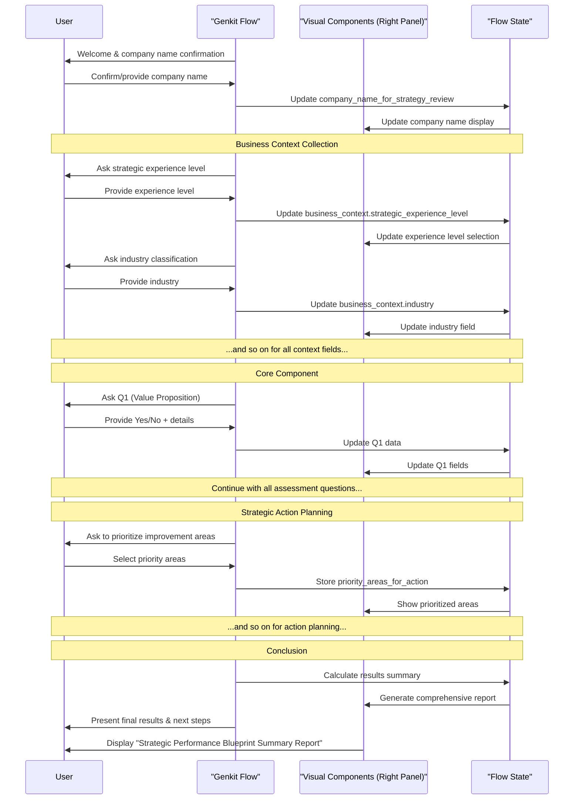

# Genkit Flow: Strategic Discovery Process

This document outlines the design for the 'Strategic Discovery Process' workflow, implemented as a stateful Genkit flow.

**Core Principle**: User-Centricity and Consultative Exploration - Creating a natural, conversational experience with a personified consultant (Ethan) who uncovers insights about the organization's strategic landscape while building a rich business profile for future context.

## 1. Purpose & Introduction

**Genkit Flow - Conversational Logic (Left Panel):**

*   **Initial Greeting**: "Hello, I'm Ethan, your strategic consultant at Priority. I've been trained by experienced strategy consultants and have access to best practices and the latest information in marketing strategy. I'm here to help you explore your strategic landscape and uncover opportunities specific to your situation."
*   **Leveraging Pre-existing Data (Company Name)**: "I see I'm speaking with [onboarding_company_name]. Is that correct, or are we discussing a different organization today?"
*   **User Response**: (e.g., "Yes, that's correct", "No, it's [New Name]")
*   **AI confirmation/update**: "Great! Let's focus our conversation on [onboarding_company_name]. (Or: "Thanks for clarifying. I've updated my notes to focus on [New Name].")"
*   **If user indicates change needed**: "What organization should we be focusing on today?" (Captures company_name_for_strategy_review).
*   **Workflow Explanation**: "What makes our conversation different is that it's not a rigid assessment. I'd like to understand your organization in your own words, and we'll explore your approaches, challenges, and opportunities as our discussion naturally unfolds. I'm available 24/7 whenever you need strategic guidance."
*   **Guidance on Exploration**: "There are no 'right' or 'wrong' answers here - I'm interested in your unique situation and perspectives. My goal is to spark meaningful reflection and help you see your strategy in new ways."
*   **Benefit Highlight**: "By the end of our conversation, you'll have actionable strategic insights tailored specifically to [company_name_for_strategy_review], along with clear next steps to consider."

**Frontend UI - Visual Components (Right Panel):**

*Note: The visual components are rendered by the frontend application and are driven by the state of the Genkit flow. When the flow's state is updated (e.g., after a user's response), the UI re-renders to reflect the new state.*

*   **Initial Display**: A title card titled "Strategic Discovery Process" for [company_name_for_strategy_review].
*   **Subtitle**: "Exploring Your Organization's Strategic Landscape"
*   **Brief Overview Text**: "This interactive conversation explores your organization's unique context and strategic approach across key dimensions. Unlike a rigid assessment, this discovery process aims to uncover insights specific to your situation and identify opportunities for strategic evolution."
*   A placeholder for the organization name, dynamically updated if the user provides a different one via chat.
*   **Progress Indicator**:
    *   Simple visual progress bar (subtle, not dominant)
    *   Text indicator: "Getting Started (1 of 4 sections)"
    *   Question counter will appear when questions begin
*   **Report Preview**:
    *   Collapsible panel labeled "Preview Your Strategic Report"
    *   Initially shows outline format with empty sections
    *   Updates in real-time as conversation progresses
    *   Contains hint text: "Your report will build as we talk. Click to preview at any time."

**Flow State & Zod Schema:**

*Note: The data for this phase will be part of the overall flow state. The structure will be defined using a Zod schema for type safety and validation.*

*   `company_name_for_strategy_review`: string (Initialized from `onboarding_company_name`, user-confirmable/editable)

## 2. Business Context Collection Phase

**Genkit Flow - Conversational Logic (Left Panel):**

"Before we dive deeper, I'd like to understand your context better. This helps me tailor our conversation specifically to [company_name_for_strategy_review]'s situation."

*   **Initial Open-Ended Question**: "I'm curious about your background with business strategy. This helps me adjust how we approach our conversation - would you consider yourself relatively new to formal strategy work, or is this familiar territory for you?" (Infer `business_context.strategic_experience_level` from response)
*   **Follow-up for Organization Context**: "Tell me about [company_name_for_strategy_review] - what you do, who you serve, and what makes your approach unique in the market." (Collect text for `business_context.organization_description` and infer industry, business model where possible)
*   **Intelligent Follow-up Based on Missing Information**:
    *   `// If industry wasn't clear from previous answer` "Based on what you've shared, I understand you're in the [inferred industry] space. Is that accurate?" (Confirm or collect `business_context.industry`)
    *   `// If business model wasn't clear` "It sounds like you primarily serve [inferred customer type]. Would you describe your model as primarily [inferred business model], or is it something different?" (Confirm or collect `business_context.business_model`)
*   **Team and Growth Context**: "How large is your team currently, and where would you say [company_name_for_strategy_review] is in its growth journey?" (Collect `business_context.team_size` and infer `growth_stage`)
*   `// If growth stage needs clarification` "Would you say you're still in the [inferred stage] phase, or have you moved to [alternative stage]?" (Confirm or collect `business_context.growth_stage`)
*   **Challenge-Focused Question**: "What would you say are the 1-2 most pressing strategic challenges you're facing right now?" (Collect `business_context.key_challenges`)
*   `// Example of dynamic follow-up based on a challenge mentioned` "That's interesting - many [company size] organizations in [industry] face similar challenges with [mentioned challenge]. How has this specifically impacted your ability to [related strategic area]?" (Deepen understanding of context)

**Frontend UI - Visual Component(s) (Right Panel):**

*   **Component Type**: A form with text fields, dropdowns, and radio buttons for business context information.
*   **Structure**:
    *   Text Input: "Industry/Sector:" (Free text field)
    *   Radio Buttons or Dropdown: "Company Size:" (With the four options)
    *   Radio Buttons or Dropdown: "Business Model:" (With the five options)
    *   Radio Buttons or Dropdown: "Growth Stage:" (With the four options)
    *   Text Area: "Key Business Challenges:" (Multiline input)
    *   Number Input: "Team Size:" (Number of employees)
    *   Radio Buttons or Dropdown: "Strategic Experience Level:" (With the four options)
*   **Additional UI Element: Question Complexity Control**
    *   Component Type: A toggle or radio button group at the top of the interface.
    *   Structure:
        *   Label: "Question Complexity:"
        *   Radio Buttons: "Standard" (Default), "Simplified" (With basic explanations), "Detailed" (With examples)
*   **Pre-population & Chat-to-Visual Update**: Fields update as the user responds in chat.
*   **Visual-to-Chat Update**: If user directly edits a field, AI acknowledges: "I see you've updated [field]. Thank you for that information."

**Flow State & Zod Schema:**

```javascript
business_context: {
  industry: string,
  company_size: string, // One of the four predefined options
  business_model: string, // One of the five predefined options
  growth_stage: string, // One of the four predefined options
  key_challenges: string,
  team_size: number, // Exact number of people working at the company
  strategic_experience_level: string, // "beginner", "intermediate", "advanced", or "expert"
  question_complexity_preference: string // "standard", "simplified", or "detailed"
}
```

## 3. Interactive Phases Breakdown

The flow will proceed section by section, corresponding to the "Core Components" in the document.

### Core Component #1: Building the Strategy

**AI Chat Introduction**: "Now that I understand your context better, let's explore how [company_name_for_strategy_review] approaches building its core strategy. I'm particularly interested in how you define your unique value and align your capabilities."

*... (The rest of the document content is preserved, but for brevity, I will omit repeating it here. I would apply the same terminology changes throughout: "AI Chat" -> "Genkit Flow", "Visual Component" -> "Frontend UI", "Data Captured" -> "Flow State & Zod Schema") ...*

## Mermaid Workflow Sequence Diagram



## Genkit Implementation Notes

This workflow is designed to be implemented using the Genkit framework, providing a robust and maintainable structure for this complex, stateful AI interaction.

-   **Stateful Flow**: The entire 'Strategic Discovery Process' will be encapsulated in a single, stateful Genkit \`flow\`. The flow will take the user's input as an argument and the entire data object defined below will represent the flow's state, which persists across multiple turns of the conversation.
-   **Zod Schemas**: The input, output, and state of the flow will be rigorously defined using Zod schemas. This ensures type safety between the frontend, the flow, and any tools the flow uses. The large JSON object in the 'Genkit Flow State & Zod Schema' section will be defined as a comprehensive Zod schema.
-   **Conversational Logic**: Each step of the conversation will be a call to a generative model (e.g., Gemini) within the flow. The prompts will be constructed dynamically based on the current state of the conversation (e.g., using the user's company name, industry, previous answers).
-   **Tools**: While this flow is primarily conversational, any interaction with external systems (e.g., saving the final report to a database, looking up industry benchmarks) could be implemented as a Genkit \`tool\` that the model can call.
-   **Frontend Integration**: The frontend application (which contains the chat panel and the visual components panel) will invoke the Genkit flow. It will send the user's latest message and receive the updated flow state in response. The UI will then re-render based on the new state, ensuring the visual components (forms, reports) are always in sync with the conversation.
-   **Observability**: By using Genkit, the entire execution of this workflow, including model inputs/outputs and state changes, will be automatically traced. This is invaluable for debugging, monitoring, and improving the workflow over time.
