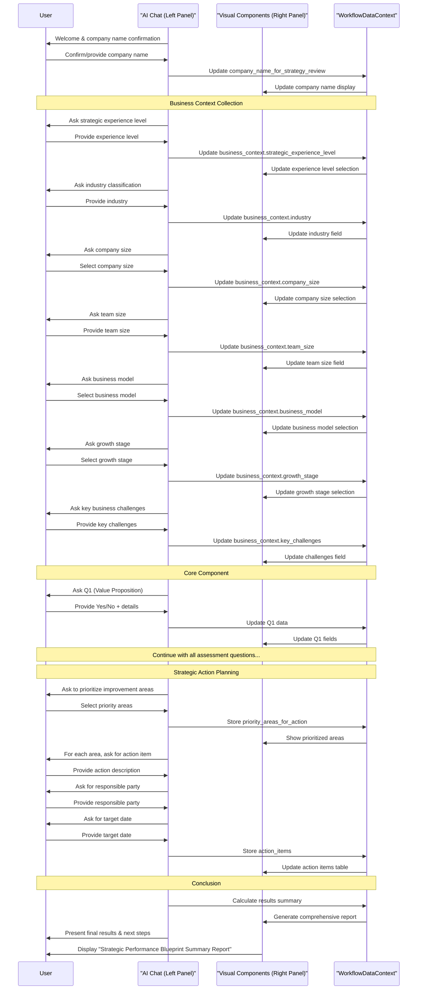

New Workflow Name: Strategic Discovery Process

Core Principle: User-Centricity and Consultative Exploration - Creating a natural, conversational experience with a personified consultant (Ethan) who uncovers insights about the organization's strategic landscape while building a rich business profile for future context.

1. Purpose & Introduction
AI Chat Guidance & Data Collection (Left Panel):

Initial Greeting: "Hello, I'm Ethan, your strategic consultant at Priority. I've been trained by experienced strategy consultants and have access to best practices and the latest information in marketing strategy. I'm here to help you explore your strategic landscape and uncover opportunities specific to your situation."

Leveraging Pre-existing Data (Company Name): "I see I'm speaking with [onboarding_company_name]. Is that correct, or are we discussing a different organization today?"

User Response (e.g., "Yes, that's correct", "No, it's [New Name]")

AI confirmation/update: "Great! Let's focus our conversation on [onboarding_company_name]. (Or: "Thanks for clarifying. I've updated my notes to focus on [New Name].")"

If user indicates change needed: "What organization should we be focusing on today?" (Captures company_name_for_strategy_review).

Workflow Explanation: "What makes our conversation different is that it's not a rigid assessment. I'd like to understand your organization in your own words, and we'll explore your approaches, challenges, and opportunities as our discussion naturally unfolds. I'm available 24/7 whenever you need strategic guidance."

Guidance on Exploration: "There are no 'right' or 'wrong' answers here - I'm interested in your unique situation and perspectives. My goal is to spark meaningful reflection and help you see your strategy in new ways."

Benefit Highlight: "By the end of our conversation, you'll have actionable strategic insights tailored specifically to [company_name_for_strategy_review], along with clear next steps to consider."
Visual Components (Right Panel):

Initial Display: A title card titled "Strategic Discovery Process" for [company_name_for_strategy_review].
Subtitle: "Exploring Your Organization's Strategic Landscape"
Brief Overview Text: "This interactive conversation explores your organization's unique context and strategic approach across key dimensions. Unlike a rigid assessment, this discovery process aims to uncover insights specific to your situation and identify opportunities for strategic evolution."
A placeholder for the organization name, dynamically updated if the user provides a different one via chat.

Progress Indicator:
- Simple visual progress bar (subtle, not dominant)
- Text indicator: "Getting Started (1 of 4 sections)"
- Question counter will appear when questions begin

Report Preview:
- Collapsible panel labeled "Preview Your Strategic Report" 
- Initially shows outline format with empty sections
- Updates in real-time as conversation progresses
- Contains hint text: "Your report will build as we talk. Click to preview at any time."
Data Captured in this Phase:

company_name_for_strategy_review: string (Initialized from onboarding_company_name, user-confirmable/editable)

2. Business Context Collection Phase

AI Chat Guidance & Data Collection (Left Panel):

"Before we dive deeper, I'd like to understand your context better. This helps me tailor our conversation specifically to [company_name_for_strategy_review]'s situation."

**Initial Open-Ended Question**:
"I'm curious about your background with business strategy. This helps me adjust how we approach our conversation - would you consider yourself relatively new to formal strategy work, or is this familiar territory for you?"
(Infer business_context.strategic_experience_level from response)

**Follow-up for Organization Context**:
"Tell me about [company_name_for_strategy_review] - what you do, who you serve, and what makes your approach unique in the market."
(Collect text for business_context.organization_description and infer industry, business model where possible)

**Intelligent Follow-up Based on Missing Information**:
// If industry wasn't clear from previous answer
"Based on what you've shared, I understand you're in the [inferred industry] space. Is that accurate?" 
(Confirm or collect business_context.industry)

// If business model wasn't clear
"It sounds like you primarily serve [inferred customer type]. Would you describe your model as primarily [inferred business model], or is it something different?"
(Confirm or collect business_context.business_model)

**Team and Growth Context**:
"How large is your team currently, and where would you say [company_name_for_strategy_review] is in its growth journey?"
(Collect business_context.team_size and infer growth_stage)

// If growth stage needs clarification
"Would you say you're still in the [inferred stage] phase, or have you moved to [alternative stage]?"
(Confirm or collect business_context.growth_stage)

**Challenge-Focused Question**:
"What would you say are the 1-2 most pressing strategic challenges you're facing right now?"
(Collect business_context.key_challenges)

// Example of dynamic follow-up based on a challenge mentioned
"That's interesting - many [company size] organizations in [industry] face similar challenges with [mentioned challenge]. How has this specifically impacted your ability to [related strategic area]?"
(Deepen understanding of context)

Corresponding Visual Component(s) (Right Panel):

Component Type: A form with text fields, dropdowns, and radio buttons for business context information.

Structure:
- Text Input: "Industry/Sector:" (Free text field)
- Radio Buttons or Dropdown: "Company Size:" (With the four options)
- Radio Buttons or Dropdown: "Business Model:" (With the five options)
- Radio Buttons or Dropdown: "Growth Stage:" (With the four options)
- Text Area: "Key Business Challenges:" (Multiline input)
- Number Input: "Team Size:" (Number of employees)
- Radio Buttons or Dropdown: "Strategic Experience Level:" (With the four options)

Additional UI Element: Question Complexity Control

Component Type: A toggle or radio button group at the top of the interface.

Structure:
- Label: "Question Complexity:"
- Radio Buttons:
  - "Standard" (Default)
  - "Simplified" (With basic explanations)
  - "Detailed" (With examples)

Pre-population & Chat-to-Visual Update: Fields update as the user responds in chat.
Visual-to-Chat Update: If user directly edits a field, AI acknowledges: "I see you've updated [field]. Thank you for that information."

Data Captured in this Phase:
```javascript
business_context: {
  industry: string,
  company_size: string, // One of the four predefined options
  business_model: string, // One of the five predefined options
  growth_stage: string, // One of the four predefined options
  key_challenges: string,
  team_size: number, // Exact number of people working at the company
  strategic_experience_level: string, // "beginner", "intermediate", "advanced", or "expert"
  question_complexity_preference: string // "standard", "simplified", or "detailed"
}
```

3. Interactive Phases Breakdown
The workflow will proceed section by section, corresponding to the "Core Components" in the document.

Core Component #1: Building the Strategy
AI Chat Introduction: "Now that I understand your context better, let's explore how [company_name_for_strategy_review] approaches building its core strategy. I'm particularly interested in how you define your unique value and align your capabilities."

Phase 1.1: Question 1 - Unique Value Proposition & Capabilities

AI Chat Guidance & Data Collection (Left Panel):
"Question 1 of 10: Unique Value Proposition & Capabilities (25% complete)

I'm interested in understanding what makes [company_name_for_strategy_review] truly unique in the market. How would you describe your value proposition - what you offer that others don't, or what you do differently? And do you feel you have the specific capabilities needed to deliver on this unique value?"

// Based on response, determine if they have clarity on their value proposition
// If they articulate a clear value proposition with supporting capabilities
"That's really compelling! I can see you've given this careful thought. Could you elaborate a bit more on how those specific capabilities (like [mentioned capability]) enable you to deliver this unique value where others might struggle?" -> (Collect text for Q1_unique_value_proposition and Q1_specific_capabilities, set Q1_clarity_on_value_prop to true)

// If they struggle to articulate a clear value proposition
"Thanks for sharing that. It sounds like you're still refining how to articulate your unique value, which is completely normal - especially for [growth_stage] companies in [industry]. Let's explore this a bit: What do you believe makes your offering different from alternatives, even if it's still evolving?" -> (Collect text for Q1_unique_value_proposition, set Q1_clarity_on_value_prop to false)

"Building on that, what specific capabilities - whether expertise, technology, processes, or resources - do you think [company_name_for_strategy_review] needs to develop or strengthen to fully deliver on this value proposition?" -> (Collect text for Q1_specific_capabilities)
Corresponding Visual Component(s) (Right Panel):
Component Type: Form with a radio button/toggle and two text areas.
Structure:
Check/Toggle: "Q1. Clear about value proposition and capabilities?" (Yes/No)
Text Area: "Your Unique Value Proposition:" (Multiline input)
Text Area: "Specific Enabling Capabilities:" (Multiline input)
Pre-population & Chat-to-Visual Update: The Yes/No toggle updates based on AI interaction. Text areas populate dynamically as the user types in the chat.
Visual-to-Chat Update: If the user directly edits the text fields, the AI notes: "I see you've updated the [field name] to: '[new text]'. Thank you."
Data Captured in this Phase:
Q1_clarity_on_value_prop: boolean
Q1_unique_value_proposition: string
Q1_specific_capabilities: string
Phase 1.2: Question 2 - Strategy vs. Execution & Capabilities

AI Chat Guidance & Data Collection (Left Panel):
"Question 2 of 10: Strategy Development Approach (30% complete)

I'm curious about your approach to strategy development. Some organizations start with their capabilities and build strategies they know they can execute, while others envision their ideal strategy first and then figure out how to develop the capabilities needed.

Which approach does [company_name_for_strategy_review] typically take:
- Capabilities-first: We consider what we can execute when developing strategy
- Strategy-first: We envision the ideal strategy, then develop capabilities to match
- Hybrid approach: We balance both considerations simultaneously"

// Based on their response, determine which approach they take
// If they indicate they consider capabilities during strategy development
"That's a thoughtful approach - considering what you can actually execute while developing strategy helps avoid the 'strategy-execution gap' many organizations face. Can you share a specific example of how you've aligned your strategic goals with your existing or buildable capabilities?" -> (Set Q2_strategy_approach to 'capabilities_first', collect text for Q2_evidence_or_improvement_needs)

// If they indicate they focus on strategy first, then capabilities
"Many innovative companies take that approach - envisioning the ideal strategy first gives you freedom to think big. When you develop strategy this way, what methods do you use to ensure you can build the capabilities needed to execute it? Have you encountered any challenges in bridging that gap?" -> (Set Q2_strategy_approach to 'strategy_then_execution', collect text for Q2_evidence_or_improvement_needs)
Corresponding Visual Component(s) (Right Panel):
Component Type: Form with radio buttons and a text area.
Structure:
Radio Buttons:
"A) Yes, we consider capabilities needed for execution during strategy building."
"B) No, we build strategy and then think about execution."
Text Area: "Evidence / Explanation / Challenges:"
Pre-population & Chat-to-Visual Update: Radio buttons update from chat. Text area populates dynamically.
Data Captured in this Phase:
Q2_strategy_approach: enum ('capabilities_first' | 'strategy_then_execution')
Q2_evidence_or_improvement_needs: string
Phase 1.3: Question 3 - Disruption & Core Strengths

AI Chat Guidance & Data Collection (Left Panel):
"Question 3 of 10: Market Changes & Disruption (35% complete)

Let's talk about how [company_name_for_strategy_review] approaches market changes and disruption. Organizations typically fall somewhere on a spectrum - some proactively drive disruption around their core strengths, while others are more responsive, watching market changes and then adapting.

Which best describes your organization's approach:
- Market Leader: We proactively drive change in our industry
- Fast Follower: We quickly adapt to changes but rarely initiate them
- Responsive: We carefully monitor and respond to proven industry shifts
- Combination: We lead in some areas and respond in others"

// Based on their response, determine if they are driving change or reacting
// If they indicate they are proactively driving change
"That's an exciting position to be in - actively shaping your market rather than just responding to it. Can you share a specific example of how [company_name_for_strategy_review] has driven change or disruption in your industry? What core strengths allow you to take this approach?" -> (Set Q3_disruption_approach to 'driving_change', collect text for Q3_evidence_or_improvement_needs)

// If they indicate they are more reactive to market changes
"Taking a responsive approach can be very strategic, especially in certain markets. How do you currently monitor changes in your industry, and what's your process for adapting when you see shifts happening? Are there areas where you might want to become more proactive?" -> (Set Q3_disruption_approach to 'reacting_to_change', collect text for Q3_evidence_or_improvement_needs)
Corresponding Visual Component(s) (Right Panel):
Component Type: Form with radio buttons and a text area.
Structure:
Radio Buttons:
"A) Yes, we are driving change and shaping the world around our core strengths."
"B) No, we are watching for change and then reacting to it."
Text Area: "Evidence / Explanation / Opportunities:"
Pre-population & Chat-to-Visual Update: Bidirectional update.
Data Captured in this Phase:
Q3_disruption_approach: enum ('driving_change' | 'reacting_to_change')
Q3_evidence_or_improvement_needs: string
Core Component #2: Translating Strategy into Everyday Operations
AI Chat Introduction: "Excellent progress! Let's move to Core Component #2: Translating Strategy into Everyday Operations. This is about ensuring your strategy is understood and actionable across your entire organization."

Phase 2.1: Question 4 - Following Through & Communication

AI Chat Guidance & Data Collection (Left Panel):
"Question 4 of 10: Strategy Execution & Communication (40% complete)

Now I'd like to explore how strategy translates into action at [company_name_for_strategy_review]. In my experience, many organizations struggle with the 'strategy-execution gap' - where great plans fail to become reality.

How would you rate your organization's approach to following through on strategic decisions and communicating them effectively:
- Strong: We have clear processes for execution and communication
- Developing: We're implementing systems but have some gaps
- Challenging: This is a significant area of difficulty for us
- Mixed: Strong in some areas, weaker in others"

// Based on their response, determine their level of follow-through
// If they describe strong follow-through mechanisms
"That sounds like a structured approach to execution. I'm particularly interested in your mention of [specific method they mentioned]. Could you elaborate on how that helps ensure your strategy is actually implemented? And are there any areas where follow-through remains challenging despite these efforts?" -> (Set Q4_diligence_clarity_communication to true, collect Q4_following_through_methods and Q4_failing_to_follow_through_challenges)

// If they describe weak or non-existent follow-through
"Thank you for that candid assessment. The strategy-execution gap is actually one of the most common challenges I see, even in well-established organizations. What do you see as the primary barriers to consistently implementing your strategy? And what communication methods have you tried or considered to help address this?" -> (Set Q4_diligence_clarity_communication to false, collect Q4_failing_to_follow_through_challenges and Q4_following_through_methods)
Corresponding Visual Component(s) (Right Panel):
Component Type: Form with a toggle and two text areas.
Structure:
Check/Toggle: "Q4. Diligently following through and communicating strategy?" (Yes/No)
Text Area: "Methods for Following Through & Communication:"
Text Area: "Challenges / Areas for Improvement in Follow-Through:"
Pre-population & Chat-to-Visual Update: Bidirectional update.
Data Captured in this Phase:
Q4_diligence_clarity_communication: boolean
Q4_following_through_methods: string
Q4_failing_to_follow_through_challenges: string
Phase 2.2: Question 5 - Visible Programs & Capabilities

AI Chat Guidance & Data Collection (Left Panel):
"Question 5 of 10: Capability Development Programs (45% complete)

Let's talk about capability development. In my experience, the strongest companies have specific, visible programs - like technology investments, training initiatives, or process improvements - designed to build the key capabilities needed for their strategy.

Which best describes [company_name_for_strategy_review]'s approach to capability building:
- Formal Programs: We have structured initiatives to build strategic capabilities
- Informal Efforts: We develop capabilities, but without formal programs
- Planning Stage: We're developing capability-building plans but haven't implemented them
- Limited Focus: We haven't prioritized formal capability development yet"

// Based on their response, determine if they have visible capability programs
// If they describe formal capability building programs
"Those initiatives sound promising. Could you tell me more about the specific programs you've implemented to build your strategic capabilities? And are there any other capability-building initiatives you've planned but haven't yet launched?" -> (Set Q5_visible_programs_for_capabilities to true, collect Q5_existing_programs_list and Q5_missing_or_unimplemented_programs_list)

// If they indicate limited or no formal capability building programs
"Thanks for sharing that perspective. Many organizations at your stage are still developing their capability-building approach. What kinds of programs or initiatives do you think would be most valuable to implement to strengthen the capabilities needed for your strategy? And are there any informal efforts already happening that could be formalized?" -> (Set Q5_visible_programs_for_capabilities to false, collect Q5_missing_or_unimplemented_programs_list and Q5_existing_programs_list)
Corresponding Visual Component(s) (Right Panel):
Component Type: Form with a toggle and two lists/text areas (ideally with tag-like input for easy listing).
Structure:
Check/Toggle: "Q5. Visible programs for building key capabilities?" (Yes/No)
List Input/Text Area: "Existing Capability Building Programs:"
List Input/Text Area: "Missing / Unimplemented Programs:"
Pre-population & Chat-to-Visual Update: Bidirectional update.
Data Captured in this Phase:
Q5_visible_programs_for_capabilities: boolean
Q5_existing_programs_list: string (or Array
Q5_missing_or_unimplemented_programs_list: string (or Array
Phase 2.3: Question 6 - Building Connections & Resource Allocation

AI Chat Guidance & Data Collection (Left Panel):
"Question 6 of 10: Strategy & Resource Alignment (50% complete)

I'd like to explore how [company_name_for_strategy_review] connects strategy to resources and incentives. The most effective organizations ensure their money and rewards flow to what matters strategically.

How would you describe your approach to aligning resources with strategy:
- Strong Alignment: Our budgeting and goal-setting directly reflect strategic priorities
- Partial Alignment: We connect some resources to strategy, but improvements needed
- Limited Connection: Strategy and resources operate largely independently
- Development Phase: We're working to build these connections"

// Based on their response, determine if they connect strategy to resources and incentives
// If they describe strong connections between strategy and resources/incentives
"That's impressive - resource alignment is a critical success factor many organizations struggle with. Could you elaborate on how specifically you're connecting your strategic priorities to your investment decisions? And I'm particularly interested in how individual goals and rewards are linked to your strategic objectives." -> (Set Q6_strategy_budgeting_connections to true, collect Q6_budget_investment_connection_methods, Q6_fund_reallocation_methods, and Q6_strategy_to_personal_goals_rewards)

// If they describe weak or non-existent connections
"Thank you for that honest assessment. The disconnect between strategy and resources is actually one of the most common issues I see. What do you see as your biggest challenges in linking your strategy to your budget and investment decisions? And what about connecting strategy to personal goals and incentives - what are the obstacles there?" -> (Set Q6_strategy_budgeting_connections to false, collect Q6_budget_investment_connection_methods, Q6_fund_reallocation_methods, and Q6_strategy_to_personal_goals_rewards as challenges)

// Optional AI suggestion follow-up (either case)
"Would you be interested in some practical approaches other organizations have used to strengthen these connections? I can share some methods for tying strategy to budgets, investments, and incentives that might be relevant for your situation." (If user says 'Yes', AI provides a structured suggestion, e.g., "Consider: zero-based budgeting for strategic initiatives, performance-based bonuses tied to strategic KPIs, or formal strategic planning cycles integrated with budget allocation.")
Corresponding Visual Component(s) (Right Panel):
Component Type: Form with a toggle and three text areas. Optional "Suggestions" section.
Structure:
Check/Toggle: "Q6. Strategy linked to budgeting & employee goals/rewards?" (Yes/No)
Text Area: "Strategy & Budget/Investment Connections:"
Text Area: "Fund Reallocation Methods:"
Text Area: "Strategy to Personal Goals/Rewards Mechanisms:"
(Optional) Rich Text Editor / Display Area: "AI Suggestions for Improvement:" (if AI assistance was triggered)
Pre-population & Chat-to-Visual Update: Bidirectional update.
Data Captured in this Phase:
Q6_strategy_budgeting_connections: boolean
Q6_budget_investment_connection_methods: string
Q6_fund_reallocation_methods: string
Q6_strategy_to_personal_goals_rewards: string
Q6_ai_suggested_improvements_offered: boolean (true if AI offered, false if not)
Phase 2.4: Question 8 - Cross-Functional Collaboration

AI Chat Guidance & Data Collection (Left Panel):
// Adapt the question based on team size
"I'd like to understand how collaboration works at [company_name_for_strategy_review]..."

// Dynamic question selection based on team size
if (business_context.team_size <= 3) {
  // Small team adaptation
  "With your small team, I'm curious about how you're thinking about cross-functional collaboration. Even in small teams, having different perspectives and skills work together effectively can be powerful. How are you approaching collaboration now, and how are you planning for it as your team grows?"
} else {
  // Standard question for larger teams
  "Let's talk about cross-functional collaboration at [company_name_for_strategy_review]. In my experience, breaking down silos between departments or functions can significantly impact an organization's ability to execute strategy. How would you describe the state of cross-functional collaboration in your organization?"
}

// Based on their response, determine collaboration strength
// If they describe strong collaboration approaches
"That's a thoughtful approach to collaboration. I'm particularly interested in your mention of [specific method they mentioned]. Could you share more about how that specifically helps different functions or skill sets work together effectively? And are there any collaboration challenges you're still working to address?" -> (Set Q8_cross_silo_collaboration to true, collect Q8_collaboration_methods and Q8_collaboration_failures_improvements)

// If they describe weak or non-existent collaboration
"Thank you for that candid assessment. Creating effective collaboration is challenging for many organizations. What do you see as the main barriers to more effective cross-functional work at [company_name_for_strategy_review]? And what initial steps do you think would help improve this situation?" -> (Set Q8_cross_silo_collaboration to false, collect Q8_collaboration_failures_improvements and Q8_collaboration_methods)
Corresponding Visual Component(s) (Right Panel):
Component Type: Form with a toggle and two text areas.
Structure:
Check/Toggle: "Q8. Enabling cross-silo collaboration?" (Yes/No)
Text Area: "Methods for Cross-Silo Collaboration:"
Text Area: "Challenges / Improvements in Cross-Silo Collaboration:"
Pre-population & Chat-to-Visual Update: Bidirectional update.
Data Captured in this Phase:
Q8_cross_silo_collaboration: boolean
Q8_collaboration_methods: string
Q8_collaboration_failures_improvements: string
Phase 2.5: Question 9 - Tracking Performance & Capabilities

AI Chat Guidance & Data Collection (Left Panel):
"Question 9 of 10: Performance & Capability Tracking (75% complete)

Let's talk about measurement and tracking. The most successful organizations have clear ways to monitor both their overall performance and how they're building those few critical capabilities that create unique value.

Which best describes how [company_name_for_strategy_review] tracks progress on strategic goals:
- Comprehensive: We have formal systems tracking both performance and capabilities
- Basic: We track primary metrics but could expand our tracking approach
- Informal: We monitor progress but without structured systems
- Developing: We're creating a tracking approach but haven't implemented it yet"

// Based on their response, determine their tracking approach
// If they describe robust tracking methods
"That's a sophisticated approach to measurement. I'm particularly interested in how you track the development of your core capabilities, not just overall business metrics. Could you elaborate on how you monitor progress on those specific capabilities that drive your unique value? And are there any areas where you feel your tracking could be enhanced?" -> (Set Q9_performance_tracking_capabilities to true, collect Q9_tracking_progress_methods and Q9_tracking_improvements_needed)

// If they describe limited or no tracking
"Thanks for that candid assessment. Many organizations struggle with measuring what truly matters strategically. What do you see as the key gaps in your current approach to tracking performance and capability development? And are there any informal methods you're using that could be formalized or expanded?" -> (Set Q9_performance_tracking_capabilities to false, collect Q9_tracking_improvements_needed and Q9_tracking_progress_methods)
Corresponding Visual Component(s) (Right Panel):
Component Type: Form with a toggle and two text areas.
Structure:
Check/Toggle: "Q9. Tracking performance and capability scaling?" (Yes/No)
Text Area: "Methods for Tracking Progress:"
Text Area: "Improvements Needed for Tracking Goals:"
Pre-population & Chat-to-Visual Update: Bidirectional update.
Data Captured in this Phase:
Q9_performance_tracking_capabilities: boolean
Q9_tracking_progress_methods: string
Q9_tracking_improvements_needed: string
Phase 2.6: Question 10 - Management Team Engagement

AI Chat Guidance & Data Collection (Left Panel):
// Check team size first
"Now I'd like to explore leadership and execution..." 

// Dynamic question adaptation based on team size
if (business_context.team_size <= 3) {
  // Small team/founder adaptation
  "As the founder/owner of a small business like [company_name_for_strategy_review], your personal engagement with the strategy is critical. How would you describe your approach to setting goals and timelines for yourself, and how actively engaged are you in executing the strategy - not just measuring results, but challenging yourself and developing needed capabilities?"
} else {
  // Standard question for larger teams with management structure
  Leveraging Pre-existing Data (Team Members): "For this next topic, I see you have several key team members in leadership roles: [List names from onboarding_team_members with roles if available]."
  
  "Let's talk about how your management team engages with strategy execution. The strongest organizations have leadership that doesn't just measure results, but actively challenges the organization and supports capability development. How would you describe your management team's level of engagement with executing your strategy? And how do you approach goal-setting and timelines for strategic initiatives?"
}

// Based on their response, determine engagement level
// If they describe strong leadership engagement
"That's impressive leadership commitment. Could you share more about how you/your team specifically engage with strategy execution on a day-to-day basis? And I'm curious about your approach to goal-setting - how do you ensure the goals are ambitious enough while still being achievable?" -> (Set Q10_management_team_engagement to true, collect Q10_team_engagement_methods and Q10_team_goal_setting)

"Even with strong engagement, there's always room for improvement. Is there anything you think could further enhance your/your team's strategic focus and execution?" -> (Collect Q10_engagement_improvements)

// If they describe weak or inconsistent leadership engagement
"Thank you for that candid assessment. Leadership engagement is a common challenge in many organizations. What do you see as the main barriers to stronger engagement with strategy execution? And how do you think goal-setting and timeline management could be improved?" -> (Set Q10_management_team_engagement to false, collect Q10_engagement_improvements, Q10_team_goal_setting, and Q10_team_engagement_methods)
Corresponding Visual Component(s) (Right Panel):
Component Type: Form with a toggle and three text areas.
Structure:
Check/Toggle: "Q10. Management team engaged in strategy execution & goal setting?" (Yes/No)
Text Area: "Management Team Strategic Engagement Methods/Gaps:"
Text Area: "Management Team Goal Setting & Ambition:"
Text Area: "Improvements for Management Team Engagement:"
Pre-population & Chat-to-Visual Update: Bidirectional update.
Data Captured in this Phase:
Q10_management_team_engagement: boolean
Q10_team_engagement_methods: string
Q10_team_goal_setting: string
Q10_engagement_improvements: string
Core Component #3: Executing for Impact
AI Chat Introduction: "Finally, let's explore Core Component #3: Executing for Impact. This section connects daily employee actions to strategic outcomes."

Phase 3.1: Question 7 - Employee Motivation for Strategy

AI Chat Guidance & Data Collection (Left Panel):
// Check team size and adapt question
"Let me check the information you shared earlier about your team..."

// Dynamic question adaptation based on team size
if (business_context.team_size == 1) {
  // Solo founder adaptation
  "Question 7: As a solo founder, how do you maintain your own motivation and connection to your strategic goals on a daily basis?"
} else if (business_context.team_size <= 3) {
  // Very small team adaptation
  "Question 7: With your small team at [company_name_for_strategy_review], are you and your team members consistently connecting your daily work to the important strategic goals you've defined?"
} else {
  // Standard question for larger teams
  "Question 7: At [company_name_for_strategy_review], are you motivating employees every day to connect what they're doing to the important strategic levers you've defined?"
}

"Please tell me 'Yes' or 'No'." // For team size > 1
// For solo founders, skip Yes/No and proceed directly to open-ended question

// Adapt follow-up based on team size
if (business_context.team_size == 1) {
  // Solo founder - skip Yes/No and collect methods directly
  "As a solo entrepreneur, what techniques do you use to stay focused on your strategic priorities day-to-day?" -> (Collect Q7_motivation_methods).
  "Are there days when it's challenging to maintain this focus? What could help you improve this connection?" -> (Collect Q7_motivation_failures_improvements).
} else if (business_context.team_size <= 3) {
  if 'Yes': "That's excellent! In a small team, this alignment is critical. How do you ensure everyone, including yourself, connects daily work to your strategic goals?" -> (Collect Q7_motivation_methods).
  "What challenges do you face in maintaining this connection, even in a small team?" -> (Collect Q7_motivation_failures_improvements).
  if 'No': "With a small team, this can be challenging but impactful. What are the main barriers to connecting daily work with strategy?" -> (Collect Q7_motivation_failures_improvements).
  "What simple approaches could you implement to strengthen this connection in your small team?" -> (Collect Q7_motivation_methods).
} else {
  if 'Yes': "That's fantastic! Daily motivation linked to strategy is incredibly powerful. What are you currently doing to motivate employees and ensure they connect their work to the strategy?" -> (Collect Q7_motivation_methods).
  "How could you improve this even further?" -> (Collect Q7_motivation_failures_improvements).
  if 'No': "Understanding this gap is key. How are you currently failing to motivate employees to connect their work to the strategy, or what are the main barriers?" -> (Collect Q7_motivation_failures_improvements).
  "What steps should [company_name_for_strategy_review] take to better motivate employees and link their daily work to strategic goals?" -> (Collect Q7_motivation_methods).
}
Corresponding Visual Component(s) (Right Panel):
Component Type: Form with a toggle and two text areas.
Structure:
Check/Toggle: "Q7. Motivating employees to connect daily work to strategy?" (Yes/No)
Text Area: "Methods for Employee Motivation & Connection to Strategy:"
Text Area: "Failures / Improvements in Employee Motivation:"
Pre-population & Chat-to-Visual Update: Bidirectional update.
Data Captured in this Phase:
Q7_employee_motivation_to_strategy: boolean
Q7_motivation_methods: string
Q7_motivation_failures_improvements: string
4. New Step: Strategic Action Planning
AI Chat Introduction: "You've provided valuable insights! Now, let's move to a crucial step: Strategic Action Planning. Based on the areas you've identified for improvement, we'll outline concrete actions to move forward."

Phase 4.1: Prioritize Key Areas

AI Chat Guidance & Data Collection (Left Panel):
"Looking at your responses, particularly where you answered 'No' or indicated areas for improvement, which top 1 to 3 areas would you like to prioritize for immediate action by [company_name_for_strategy_review]?"
(AI can dynamically list the most relevant phrases from the _failures_improvements and _missing_programs fields of 'No' responses).
"Please list the top 1-3 areas you'd like to focus on for action planning today."
User Input: (e.g., "Cross-functional collaboration and resource allocation.") -> captures priority_areas_for_action
Corresponding Visual Component(s) (Right Panel):
Component Type: A list of clickable cards or a multi-select dropdown, populated with the summarized areas for improvement.
Structure:
Filterable list of areas where 'No' was answered or improvements were indicated.
User selects top 1-3.
Pre-population & Chat-to-Visual Update: Visual updates dynamically as AI identifies areas. User selections in visual component inform chat.
Data Captured in this Phase:
priority_areas_for_action: Array
Phase 4.2: Define Action Items

AI Chat Guidance & Data Collection (Left Panel):
"Great! Let's take '[Priority Area 1]'. What is one specific, actionable step [company_name_for_strategy_review] can take to address this area?" (Repeat for each priority area) -> Collect action_description
"Who within your team [onboarding_team_members] would be the primary owner for this action?" -> Collect responsible_party (can suggest names from onboarding_team_members)
"What is a realistic target date for completing this action?" -> Collect target_date
"Would you like to add another action for '[Priority Area 1]' or move to the next prioritized area?" (Loop until user is done defining actions for all selected priority areas)
Corresponding Visual Component(s) (Right Panel):
Component Type: An interactive table or form-based list for action items.
Structure:
Table/List Heading for each priority_area_for_action
For each action item:
Text Input: "Action:"
Dropdown/Text Input (with suggestions): "Responsible Party:" (populated from onboarding_team_members or free text)
Date Picker: "Target Date:"
Pre-population & Chat-to-Visual Update: Actions are added to the table row by row as defined in chat. User can edit directly in the table.
Visual-to-Chat Update: If user edits in table, AI acknowledges: "I've noted the update for the action on '[Priority Area]'. Thank you."
Data Captured in this Phase:
action_items: Array<{ related_priority_area: string, description: string, responsible_party: string, target_date: string (ISO 8601 format) }>
5. Concluding the Workflow Step
AI Chat (Left Panel):

Auto-Generated Strategic Report: "Based on our conversation, I've prepared a comprehensive Strategic Discovery Report for [company_name_for_strategy_review]. Let me walk you through the key findings and recommendations."

Executive Summary: "You've shared valuable insights about [company_name_for_strategy_review]'s strategic landscape, highlighting both strengths and opportunities for improvement. I've identified [Number of No Answers] key areas that would benefit from strategic attention."

Strengths Highlight: "First, let's acknowledge your strategic strengths. [company_name_for_strategy_review] demonstrates particular capability in:"
(AI dynamically generates list based on 'Yes' responses and positive aspects from the conversation, such as:
- Clear value proposition and differentiation in the market
- Strong team alignment and communication
- Proactive approach to market disruption, etc.)

Strategic Gaps & Fix Strategies: "I've identified several opportunities for enhancing your strategic execution. For each area, I've outlined specific strategies that have proven effective for organizations in similar situations:"

(For each gap, dynamically generate):
"[Gap Area Name]:
- Gap: [Concise description of the specific gap identified]
- Impact: [How this gap affects business performance]
- Quick Win: [Immediately actionable solution]
- Structural Fix: [Longer-term, more foundational solution]
- Best Practice Example: [Relevant example from similar organizations]"

Recommended Next Workflows: "Based on your strategic profile, I recommend focusing on the following workflows in the Priority platform:"

(Dynamically generate 2-3 most relevant workflows based on identified gaps, with specific components):
"[Workflow Name]: This will help you address [specific gaps]. I particularly recommend focusing on the [Component X] and [Component Y] modules, which directly address your challenges with [specific issue]."

For example:
"Marketing Strategy Workflow: This will help you address your pricing strategy uncertainties and positioning challenges. I particularly recommend focusing on the Pricing Strategy and Positioning Statement components, which will provide frameworks for determining optimal pricing models for AI services and clarifying your market position."

Implementation Roadmap: "Here's a strategic roadmap for implementing these recommendations over the next 90 days:"
Phase 1 (Weeks 1-2): [First set of high-impact, low-effort actions]
Phase 2 (Weeks 3-6): [Second set of actions building on Phase 1]
Phase 3 (Weeks 7-12): [More complex or resource-intensive actions]

Call to Action: "Your complete Strategic Discovery Insights Report is now available in the right panel. You can review the details, download it, or immediately begin with the recommended workflows."

Wrap-up: "This comprehensive analysis will remain in your [company_name_for_strategy_review] profile, providing ongoing context for all your strategic activities on the platform."

Visual Components (Right Panel):

Final State: A comprehensive "Strategic Discovery Insights Report".
Structure:
Header: "Strategic Discovery Insights for [company_name_for_strategy_review]"

Executive Dashboard:
- Strategic Strength Score: [Visual meter showing overall strategic readiness]
- Key Strength Areas: [Top 3 areas of strategic strength]
- Priority Improvement Areas: [Top 3 areas needing attention]
- Recommended Next Steps: [Clear action buttons for recommended workflows]

Detailed Findings (Expandable Sections):
For each Component (Building Strategy, Translating Strategy, Executing for Impact):
- Strength/Gap Analysis with visual indicators
- Specific findings from the conversation
- Direct quotes from responses highlighting key insights

Strategic Recommendations:
- Prioritized list of recommendations with rationale
- Timeline visualization showing implementation sequence
- Resource requirements (time, expertise, tools needed)

Action Plan:
- Auto-generated action items for top priority areas
- Integration buttons to add these to task management systems
- Responsible parties and target dates

Next Workflows Section:
- Visual cards for recommended workflows with direct "Begin" buttons
- Brief explanation of why each workflow is recommended
- Estimated time commitment and value gained

Action Buttons: "Download Report (PDF)", "Share Report", "Begin Recommended Workflow", "Schedule Follow-up Strategy Session"
6. Overall Data Structure & Integration
The complete data object for this workflow step will be saved within the platform's WorkflowDataContext under a key like strategic_performance_blueprint_data.

{
  "company_name_for_strategy_review": "string",
  "business_context": {
    "industry": "string",
    "company_size": "string", // One of the four predefined options
    "business_model": "string", // One of the five predefined options
    "growth_stage": "string", // One of the four predefined options
    "key_challenges": "string"
  },
  "core_component_1": {
    "Q1": {
      "clarity_on_value_prop": "boolean",
      "unique_value_proposition": "string",
      "specific_capabilities": "string"
    },
    "Q2": {
      "strategy_approach": "capabilities_first" | "strategy_then_execution",
      "evidence_or_improvement_needs": "string"
    },
    "Q3": {
      "disruption_approach": "driving_change" | "reacting_to_change",
      "evidence_or_improvement_needs": "string"
    }
  },
  "core_component_2": {
    "Q4": {
      "diligence_clarity_communication": "boolean",
      "following_through_methods": "string",
      "failing_to_follow_through_challenges": "string"
    },
    "Q5": {
      "visible_programs_for_capabilities": "boolean",
      "existing_programs_list": "string", // or Array<string>
      "missing_or_unimplemented_programs_list": "string" // or Array<string>
    },
    "Q6": {
      "strategy_budgeting_connections": "boolean",
      "budget_investment_connection_methods": "string",
      "fund_reallocation_methods": "string",
      "strategy_to_personal_goals_rewards": "string",
      "ai_suggested_improvements_offered": "boolean"
    },
    "Q8": {
      "cross_silo_collaboration": "boolean",
      "collaboration_methods": "string",
      "collaboration_failures_improvements": "string"
    },
    "Q9": {
      "performance_tracking_capabilities": "boolean",
      "tracking_progress_methods": "string",
      "tracking_improvements_needed": "string"
    },
    "Q10": {
      "management_team_engagement": "boolean",
      "team_engagement_methods": "string",
      "team_goal_setting": "string",
      "engagement_improvements": "string"
    }
  },
  "core_component_3": {
    "Q7": {
      "employee_motivation_to_strategy": "boolean",
      "motivation_methods": "string",
      "motivation_failures_improvements": "string"
    }
  },
  "strategic_action_planning": {
    "priority_areas_for_action": ["string"], // e.g., ["Q8_cross_functional_collaboration_improvements"]
    "action_items": [
      {
        "related_priority_area": "string",
        "description": "string",
        "responsible_party": "string",
        "target_date": "string" // ISO 8601 format
      }
    ]
  },
  "summary": {
    "num_yes_answers": "number",
    "num_no_answers": "number"
  },
  "last_updated": "timestamp"
}

## Mermaid Workflow Sequence Diagram



## Cross-Cutting Concerns

### Accessibility (a11y) Considerations
- All form fields have proper labels and descriptions
- Radio buttons and toggles are keyboard accessible
- Color contrasts meet WCAG 2.1 AA standards
- All interactive elements are keyboard accessible and have appropriate ARIA attributes
- Error states and validations are clearly communicated

### Performance Considerations
- The business context collection form uses efficient update patterns
- Questions are loaded progressively to minimize initial load time
- Action planning table updates are optimized to prevent re-renders
- The final report generation is optimized for performance with virtual rendering for large data sets

### Security Considerations
- All user input is properly sanitized before storage
- No sensitive business information is transmitted externally
- Data is stored securely within the WorkflowDataContext
- Downloaded reports are generated client-side to avoid sensitive data transmission
