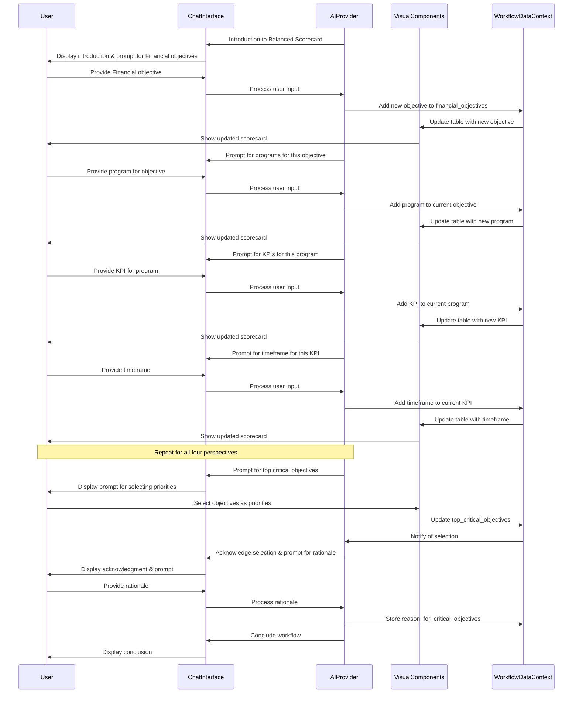

# Balanced Scorecard Workflow

## 1. Overview & Purpose

This AI-powered conversational tool guides users through creating a comprehensive Balanced Scorecard. It helps leadership teams define objectives across the four key perspectives (Financial, Customer, Internal Business Processes, and Learning & Growth), along with associated programs/initiatives, key performance indicators, and target timeframes. The process captures structured strategic data that can be visualized, tracked, and used as a foundation for organizational alignment and execution.

## 2. Target User & Context

**User:** Leadership teams, strategic planners, executives, or department heads looking to translate high-level strategy into actionable objectives.

**Context:** This workflow typically follows foundational strategy steps like core values definition and vision statements. It helps articulate specific goals across all areas of the organization that align with the company's identity and direction, serving as a critical input for detailed strategic planning and performance management.

## 3. Core Conversational Flow

### General Principle
As the AI guides the user through defining objectives and their associated elements across the four perspectives, the right visual panel will dynamically display this information in an organized tabular format. This follows the **Visual Augmentation** and **Bidirectional Updates** principles from the Chat-Driven Workflow Pattern.

### Phase 1: Introduction to Balanced Scorecard

**AI Initiative (Left Panel - Chat):**
"Welcome to the Balanced Scorecard workflow! This tool will help you define strategic objectives across the four key perspectives of your organization, along with the programs to achieve them, metrics to measure success, and timeframes for completion.

The Balanced Scorecard is a powerful framework for translating [onboarding_company_name]'s vision and strategy into actionable objectives across:
1. Financial Perspective - How do we look to shareholders?
2. Customer Perspective - How do customers see us?
3. Internal Business Processes Perspective - What must we excel at?
4. Learning & Growth Perspective - How can we continue to improve and create value?

By thinking holistically across these areas, you can ensure a comprehensive and aligned approach to achieving your goals. Ready to begin?"

**Visual Component (Right Panel):**
Initial State: A title card "Balanced Scorecard for [onboarding_company_name]" with a brief explanation of the scorecard's purpose and structure.

An empty table structure with column headers:
- Strategic Objectives (by Perspective)
- Programs, Initiatives, & Actions
- Key Performance Indicators & Metrics
- Target Timeframe to Achieve Goals

### Phase 2: Defining Objectives for Each Perspective

**AI Guidance (Chat):**
"Let's start with the Financial Perspective. This perspective addresses how your organization looks to shareholders and focuses on financial performance and economic value creation. Examples of financial objectives might include 'Increase Revenue Growth', 'Improve Operating Margin', or 'Optimize Asset Utilization'.

What financial objectives would you like to include in your Balanced Scorecard? You can share one at a time or list multiple objectives."

**User Input (Chat):** 
User provides financial objectives. The AI should recognize whether the user is providing a single objective or multiple objectives separated by commas, line breaks, etc.

**AI Processing:**
For each objective provided, the AI:
1. Generates a unique ID
2. Creates an entry in the financial_objectives array
3. Updates the visual display to show the new objective(s)

**Chat-to-Visuals (Right Panel):**
As objectives are identified, they appear as rows in the Financial section of the table on the right panel. Initially, only the "Strategic Objectives" column is populated.

**Data Captured:** 
```typescript
balanced_scorecard: {
  financial_objectives: Array<{
    id: string,
    title: string,
    programs: [] // Empty initially
  }>
}
```

**AI Confirmation (Chat):**
"I've added these financial objectives to your Balanced Scorecard. Now let's move to the Customer Perspective."

(This process repeats for all four perspectives: Customer, Internal Business Processes, and Learning & Growth)

### Phase 3: Defining Programs for Each Objective (Iterative)

**AI Guidance (Chat):**
"Now let's focus on your financial objective: '[objective title]'. What programs, initiatives, or actions will you implement to achieve this objective? These are the specific activities your team will undertake."

**User Input (Chat):**
User provides programs/initiatives for the current objective.

**AI Processing:**
For each program provided:
1. Generates a unique ID
2. Adds it to the programs array for the current objective
3. Updates the visual display

**Chat-to-Visuals (Right Panel):**
The table now shows programs associated with each objective in the "Programs, Initiatives, & Actions" column.

**Data Captured:**
```typescript
// For the current objective:
programs: Array<{
  id: string,
  description: string,
  kpis: [] // Empty initially
}>
```

**AI Confirmation (Chat):**
"I've added these programs for your financial objective '[objective title]'. Now, let's define the key performance indicators for each program."

(This iterative process continues for each objective across all four perspectives)

### Phase 4: Defining KPIs for Each Program (Iterative)

**AI Guidance (Chat):**
"For the program '[program description]' under your financial objective '[objective title]', what key performance indicators or metrics will you use to measure success? These should be specific and measurable."

**User Input (Chat):**
User provides KPIs for the current program.

**AI Processing:**
For each KPI provided:
1. Generates a unique ID
2. Adds it to the kpis array for the current program
3. Updates the visual display

**Chat-to-Visuals (Right Panel):**
The table now includes KPIs in the "Key Performance Indicators & Metrics" column.

**Data Captured:**
```typescript
// For the current program:
kpis: Array<{
  id: string,
  metric: string,
  target_timeframe: "" // Empty initially
}>
```

**AI Confirmation (Chat):**
"I've added these KPIs for the program '[program description]'. Next, let's define target timeframes for each KPI."

### Phase 5: Defining Target Timeframes (Iterative)

**AI Guidance (Chat):**
"For the KPI '[KPI metric]' under program '[program description]', what is your target timeframe for achieving this goal? For example, 'By end of Q2', '50% by year-end', etc."

**User Input (Chat):**
User provides timeframes for each KPI.

**AI Processing:**
For each timeframe provided:
1. Updates the target_timeframe field for the corresponding KPI
2. Updates the visual display

**Chat-to-Visuals (Right Panel):**
The table now includes timeframes in the "Target Timeframe to Achieve Goals" column.

**Data Captured:**
```typescript
// For the current KPI:
target_timeframe: string
```

**AI Confirmation (Chat):**
"I've added the target timeframe for this KPI. Let's continue with the next KPI/program/objective or move to the next perspective."

### Phase 6: Identifying Top Priorities (Selection)

**AI Guidance (Chat):**
"We've now completed defining objectives, programs, KPIs, and timeframes across all four perspectives of your Balanced Scorecard. Looking at all the objectives you've defined, which are the top 2-3 most critical objectives for [onboarding_company_name] in the immediate future (next 6-12 months)?

You can tell me their names, or select them directly in the panel on the right."

**Visual Component (Right Panel):**
All objectives become selectable (e.g., with checkboxes) and a new "Top Critical Objectives" section appears.

**Data Captured:**
```typescript
top_critical_objectives: string[] // Array of objective IDs
```

**AI Prompt (Chat):**
"Thank you. You've identified [list selected top_critical_objectives texts] as your top priorities. Why did you select these particular objectives? What makes them so critical at this time?"

**User Input (Chat):** 
User provides rationale.

**Data Captured:**
```typescript
reason_for_critical_objectives: string
```

### Phase 7: Review & Finalization

**AI Guidance (Chat):**
"We've now completed your Balanced Scorecard! It includes objectives across all four perspectives, with associated programs, KPIs, and target timeframes. You can review the complete scorecard in the panel on the right.

Would you like to make any changes or adjustments? You can edit directly in the panel or tell me what you'd like to modify."

**Visual Component (Right Panel):**
The complete scorecard is displayed with all objectives, programs, KPIs, and timeframes in a structured table format. Each element is editable, with options to add, modify, or delete entries.

**AI Closing (Chat):**
"Your Balanced Scorecard is now ready for implementation. This scorecard will help align your organization around key strategic priorities and ensure you're measuring what matters. You can export this scorecard or integrate it with your other strategic planning documents."

## 4. Visual Components

### shadcn/ui Component Mapping

| UI Element | shadcn/ui Component | Usage |
|------------|---------------------|-------|
| Main Container | `<ResizablePanelGroup>` | Split-panel layout for chat and visual components |
| Scorecard Table | `<Table>` with related components | Main display for the scorecard data |
| Perspective Headers | `<TableHead>` | Headers for each of the four perspectives |
| Objective Rows | `<TableRow>` | Rows for each objective within a perspective |
| Editable Cells | `<Input>` or custom editable cells | For modifying entries directly in the visual panel |
| Add Buttons | `<Button variant="ghost">` | For adding new objectives, programs, KPIs |
| Delete Buttons | `<Button variant="destructive">` | For removing entries |
| Selection Checkboxes | `<Checkbox>` | For selecting top priority objectives |
| Rationale Input | `<Textarea>` | For capturing why top objectives are critical |
| Action Menu | `<DropdownMenu>` | For actions like export, save, etc. |

### Example Table Component (Conceptual)

```tsx
import { Table, TableHeader, TableBody, TableRow, TableHead, TableCell } from "@/components/ui/table";
import { Button } from "@/components/ui/button";
import { Input } from "@/components/ui/input";
import { Plus, Trash } from "lucide-react";

interface BalancedScorecard {
  financial_objectives: Array<{
    id: string;
    title: string;
    programs: Array<{
      id: string;
      description: string;
      kpis: Array<{
        id: string;
        metric: string;
        target_timeframe: string;
      }>;
    }>;
  }>;
  customer_objectives: Array</* Same structure as financial_objectives */>;
  business_process_objectives: Array</* Same structure */>;
  learning_growth_objectives: Array</* Same structure */>;
}

interface ScorecardTableProps {
  data: BalancedScorecard;
  onUpdate: (updatedData: BalancedScorecard) => void;
}

export function ScorecardTable({ data, onUpdate }: ScorecardTableProps) {
  // Handlers for adding/editing/deleting items
  const handleAddFinancialObjective = () => { /* Implementation */ };
  const handleEditObjective = (perspective: string, id: string, newTitle: string) => { /* Implementation */ };
  const handleDeleteObjective = (perspective: string, id: string) => { /* Implementation */ };
  // Similar handlers for programs, KPIs, timeframes

  return (
    <div className="space-y-4">
      <div className="flex justify-between items-center">
        <h2 className="text-2xl font-bold">Balanced Scorecard</h2>
      </div>
      
      {/* Financial Perspective */}
      <div>
        <div className="flex justify-between items-center mb-2">
          <h3 className="text-xl font-semibold">Financial Perspective</h3>
          <Button onClick={handleAddFinancialObjective}>
            <Plus className="h-4 w-4 mr-2" /> Add Objective
          </Button>
        </div>
        
        <Table>
          <TableHeader>
            <TableRow>
              <TableHead className="w-[250px]">Strategic Objectives</TableHead>
              <TableHead className="w-[250px]">Programs, Initiatives, & Actions</TableHead>
              <TableHead className="w-[250px]">Key Performance Indicators & Metrics</TableHead>
              <TableHead className="w-[250px]">Target Timeframe to Achieve Goals</TableHead>
              <TableHead className="w-[80px]">Actions</TableHead>
            </TableRow>
          </TableHeader>
          <TableBody>
            {data.financial_objectives.map(objective => (
              // For each objective, render rows for all programs and KPIs
              // This would require row spanning or nested tables in a real implementation
              <TableRow key={objective.id}>
                <TableCell>
                  <Input 
                    value={objective.title} 
                    onChange={e => handleEditObjective('financial', objective.id, e.target.value)} 
                  />
                </TableCell>
                <TableCell>{/* Program cells with editing capability */}</TableCell>
                <TableCell>{/* KPI cells with editing capability */}</TableCell>
                <TableCell>{/* Timeframe cells with editing capability */}</TableCell>
                <TableCell>
                  <Button variant="ghost" size="icon" onClick={() => handleDeleteObjective('financial', objective.id)}>
                    <Trash className="h-4 w-4" />
                  </Button>
                </TableCell>
              </TableRow>
            ))}
          </TableBody>
        </Table>
      </div>
      
      {/* Repeat similar sections for Customer, Internal Business Process, and Learning & Growth perspectives */}
    </div>
  );
}
```

## 5. Data Structure & Integration

### Complete Data Structure

```typescript
// Within the broader WorkflowDataContext
balanced_scorecard: {
  company_name?: string; // from onboarding if available
  financial_objectives: Array<{
    id: string,
    title: string,
    programs: Array<{
      id: string,
      description: string,
      kpis: Array<{
        id: string,
        metric: string,
        target_timeframe: string
      }>
    }>
  }>,
  customer_objectives: Array<{
    // Same structure as financial_objectives
  }>,
  business_process_objectives: Array<{
    // Same structure
  }>,
  learning_growth_objectives: Array<{
    // Same structure
  }>,
  top_critical_objectives: string[], // Array of objective IDs
  reason_for_critical_objectives: string,
  // Metadata
  last_updated_at: string,
  status: 'in_progress' | 'completed',
  created_by?: string
}
```

### Integration with Other Workflows

The Balanced Scorecard can be integrated with:

1. **Core Values**: Objectives should align with and support the organization's core values.

2. **Vision Statement**: The balanced scorecard objectives provide the concrete steps to achieve the vision.

3. **Marketing Strategy Scorecard**: Marketing objectives from the marketing strategy scorecard can feed into the Customer and Internal Business Process perspectives of the balanced scorecard.

4. **Marketing Skills Assessment**: Skills identified for development can be linked to Learning & Growth objectives in the balanced scorecard.

## 6. Workflow Sequence Diagram



## 7. Cross-Cutting Concerns

### Accessibility Considerations
- Ensure table structure is screen-reader friendly with proper ARIA attributes
- Provide keyboard navigation for all interactive elements
- Maintain sufficient color contrast for all visual elements, especially in the perspective headers
- Include descriptive labels for all input fields and buttons

### Performance Considerations
- Implement efficient rendering for potentially large tables with many objectives
- Consider pagination or virtualization for organizations with many objectives
- Optimize state updates to prevent unnecessary re-renders
- Cache scorecard data appropriately to improve responsiveness

### Security Considerations
- Implement proper access controls for viewing and editing the balanced scorecard
- Consider role-based permissions (e.g., some users can view but not edit)
- Ensure secure storage and transmission of strategic data
- Maintain audit logs of changes to the scorecard

### Internationalization & Localization
- Support for multiple languages in UI elements and AI prompts
- Localized date formats for timeframes
- Culturally appropriate examples for objectives in different perspectives
- Direction support for RTL languages
