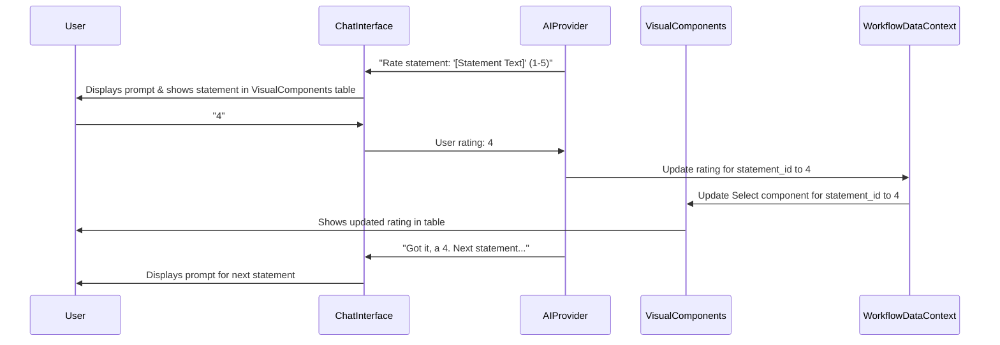

# Workflow Step Name: Brand Strength Assessment

## 1. Purpose & Introduction (Phase 0)

This initial phase sets the stage for the user, explaining the assessment's objective, its benefits, and guiding them on how to interact. It aligns with the **Conversation-First** principle of the `chat-driven-workflow-pattern.md`.

**A. AI Chat (Left Panel):**

*   **Greeting & Purpose:** "Hello! Today, we're going to conduct a 'Brand Strength Assessment' for [onboarding_company_name, if available, otherwise 'your company']. This comprehensive exercise will help us evaluate the current state of your brand across key dimensions, identifying strengths, areas for improvement, and opportunities for differentiation."
*   **Benefits:** "By systematically reviewing various aspects of your brand, we'll gain a clear understanding of what makes your brand powerful and influential in the market. This assessment is crucial for building a resilient and impactful brand strategy that leads to customer loyalty, increased sales, and long-term success."
*   **Instructions:** "We'll go through several statements, and I'll ask you to rate how well you believe [onboarding_company_name, if available, otherwise 'your company'] aligns with each statement, typically on a scale of 1 to 5. **A rating of 5 means 'Strongly Agree', while a rating of 1 means 'Strongly Disagree'. If a statement is truly 'Not Applicable' to your company, you can also select 1.** We can note this distinction if needed during our analysis later. For now, both 'Strongly Disagree' and 'Not Applicable' will be recorded as a 1. You can provide your ratings by typing the number directly in the chat or by selecting the option in the right-hand panel. Your responses will help us gauge your brand's recognition, influence, and reputation."
*   **Readiness Check:** "Are you ready to begin our Brand Strength Assessment for [onboarding_company_name, if available, otherwise 'your company']?"
    *   Expected User Input: 'Yes', 'Start', 'No', 'Later'.
    *   Error Handling: If input is ambiguous, AI: "Sorry, I didn't quite catch that. Are you ready to start the assessment?"

**B. Visual Components (Right Panel):**

*   `<Card>`:
    *   `<CardHeader>`: `<CardTitle>Brand Strength Assessment for [onboarding_company_name, if available, otherwise 'Your Company']</CardTitle>`
    *   `<CardContent>`:
        *   Brief overview text matching the AI's explanation of purpose and benefits.
        *   `<Button id="startAssessmentBtn" disabled={!userReady}>Start Assessment</Button>` (Becomes active once user confirms readiness in chat. Clicking it can also signal readiness to the AI).

**C. Pre-existing Onboarding Information Context:**
*   `onboarding_company_name: string` (Used for personalization)

## 2. shadcn/ui Component Mapping

| UI Element                        | shadcn/ui Component              | Usage                                                                                          |
|---------------------------------|------------------------------------|------------------------------------------------------------------------------------------------|
| Main Page Container             | `<ResizablePanelGroup>`            | Overall split-panel layout.                                                                    |
| Section Cards/Containers        | `<Card>`, `<CardHeader>`, `<CardTitle>`, `<CardContent>` | For introduction, each assessment phase, and summary dashboard.                              |
| Buttons                         | `<Button>` (various variants)      | "Start Assessment", "Next Section", "View Summary", "Generate Report".                       |
| Statement Rating Table          | `<Table>`, `<TableHeader>`, `<TableBody>`, `<TableRow>`, `<TableHead>`, `<TableCell>` | Displaying statements for each assessment phase.                                               |
| Rating Input (Visual)           | `<Select>` or `<RadioGroup>` with `<Label>` | For selecting a rating (1-5) for each statement directly in the table.                       |
| Progress Indicator (Optional)   | `<Progress>`                       | To show overall assessment progress through the five phases.                                 |
| Summary Charts (Optional)       | Chart components (e.g., `BarChart` from `shadcn/ui/chart`) | For visualizing average scores per section in the summary dashboard.                         |
| Tooltip (for statement details) | `<Tooltip>`, `<TooltipProvider>`, `<TooltipTrigger>`, `<TooltipContent>` | To provide more context or definition for a specific assessment statement if needed.         |

## 3. Deconstruct into Interactive Phases (Phases 1-5: Assessment Sections)

The assessment is divided into five logical sections. The interaction logic below is repeated for each section, embodying the **Progressive Disclosure** and **Visual Augmentation** patterns.

**General Interaction Logic for each Assessment Phase (e.g., Phase 1: Brand Strategy & Differentiation):**

**A. AI Chat Guidance & Data Collection (Left Panel):**

1.  **Introduction to Section:**
    *   AI: "Great! Let's start with 'Brand Strategy & Differentiation'. This section examines how well your product or service possesses distinct and compelling differentiators that clearly set your brand apart from competitors, and how clearly your brand's unique identity is communicated and protected."
    *   AI (Rating Scale Reminder for first section): "As a reminder, you'll rate each statement on a scale of 1 to 5. A '5' is 'Strongly Agree', and a '1' is 'Strongly Disagree' or can be used if the statement is 'Not Applicable'."
2.  **Looping/Iteration (for each statement in the current section):**
    *   AI: "On a scale of 1 to 5, how well does [onboarding_company_name] align with the statement: '[Full text of the current statement]'?"
    *   Input Handling: Accepts numerical input (1, 2, 3, 4, 5).
    *   Clarification/Error Handling: If input is invalid (e.g., "6" or "abc"), AI: "Please provide a rating between 1 and 5. For example, '5' for 'Strongly Agree' or '1' for 'Strongly Disagree/Not Applicable'."
    *   AI Confirmation: "Got it, a [rating] for that statement."
3.  **Upon Completion of Phase:**
    *   AI: "Excellent, we've completed the '[Current Section Name]' section. Would you like a quick summary of your responses for this section, or shall we move on to '[Next Section Name]'?"
    *   Expected User Input: 'Summary', 'Next', 'Move on'.
    *   If 'Summary': AI calculates and states the average score for the current section and optionally highlights the highest/lowest rated statements within that section.

**B. Corresponding Visual Component(s) (Right Panel):**

*   `<Card>` for the current assessment section (e.g., "Brand Strategy & Differentiation Assessment").
    *   `<CardHeader>`: `<CardTitle>[Current Section Name]</CardTitle>`
    *   `<CardContent>`:
        *   `<Table>`:
            *   `<TableHeader>`: Statement, Your Rating (1-5)
            *   `<TableBody>`: Rows for each statement in the current section.
                *   `<TableRow>`:
                    *   `<TableCell>`: Full text of the statement.
                    *   `<TableCell>`: `<Select value={ratingForThisStatement} onValueChange={handleRatingChange}> ... </Select>` (options 1-5).
*   **Active Statement Highlighting:** The statement currently being discussed by the AI could be visually highlighted in the table.
*   **Chat-to-Visual Update:** As the user provides ratings in chat, the corresponding `<Select>` in the table updates.
*   **Visual-to-Chat Update (Bidirectional Flow):** If the user directly changes a rating using the `<Select>` in the table:
    *   `handleRatingChange(statementId, newRating)` updates the `WorkflowDataContext`.
    *   AI acknowledges: "I see you've updated the rating for '[Statement Text snippet]' to [New Rating] in the panel. Thanks!"

**C. Data Captured (for each section, e.g., `brand_strategy_differentiation_scores`):**
*   An array of objects, where each object represents a statement:
    `{ statement_id: string, statement_text: string, rating: number | null }`
    (The `statement_text` will be fully listed in Appendix A).

**D. Example `tsx` for a Single Statement Rating Row (Conceptual):**
```tsx
import { TableCell, TableRow } from '@/components/ui/table';
import { Select, SelectContent, SelectItem, SelectTrigger, SelectValue } from '@/components/ui/select';
import { Label } from '@/components/ui/label';

interface StatementRatingRowProps {
  statementId: string;
  statementText: string;
  currentRating: number | null;
  onRatingChange: (statementId: string, newRating: number) => void;
  isCurrentStatement?: boolean;
}

export function StatementRatingRow({ statementId, statementText, currentRating, onRatingChange, isCurrentStatement }: StatementRatingRowProps) {
  const ratings = [
    { value: 1, label: "1 - Strongly Disagree / Not Applicable" }, // Clarified label
    { value: 2, label: "2 - Disagree" },
    { value: 3, label: "3 - Neutral" },
    { value: 4, label: "4 - Agree" },
    { value: 5, label: "5 - Strongly Agree" },
  ];

  return (
    <TableRow className={isCurrentStatement ? "bg-muted/50" : ""}>
      <TableCell>
        <Label htmlFor={`rating-${statementId}`}>{statementText}</Label>
      </TableCell>
      <TableCell className="w-56"> {/* Adjusted width for longer label */}
        <Select
          value={currentRating?.toString()}
          onValueChange={(value) => onRatingChange(statementId, parseInt(value))}
        >
          <SelectTrigger id={`rating-${statementId}`}>
            <SelectValue placeholder="Rate 1-5" />
          </SelectTrigger>
          <SelectContent>
            {ratings.map(r => <SelectItem key={r.value} value={r.value.toString()}>{r.label}</SelectItem>)}
          </SelectContent>
        </Select>
      </TableCell>
    </TableRow>
  );
}
```
*(This pattern is repeated for Phase 2: Brand Alignment & Culture, Phase 3: Brand Communication & Marketing, Phase 4: Brand Execution & Customer Experience, and Phase 5: Brand Measurement & Risk Management, each with their respective statements listed in Appendix A.)*

## 4. AI-Assisted Actions (Phase 6: Summary & Insights)

Once all five assessment sections are completed.

**A. AI Chat (Left Panel):**

1.  **Summary Offer:**
    *   AI: "Congratulations! You've rated all the statements for your Brand Strength Assessment. I can now provide you with a comprehensive summary. Would you like to review the overall results?"
2.  **Summary Delivery (if "Yes"):**
    *   AI: "Great! Here's a summary for [onboarding_company_name]:"
    *   AI presents overall average score (clarifying if '1' for N/A was excluded from averaging, or how it was handled).
    *   AI presents average scores for each of the five sections.
    *   AI identifies top 3 highest-rated statements (strengths) and top 3 lowest-rated statements (areas for focus) across the entire assessment.
3.  **Proactive Suggestions:**
    *   AI: "Based on this, we have a clearer picture. How can I help you leverage these insights? I can offer to:
        1.  Generate a detailed report.
        2.  Suggest a focused workshop on areas for improvement.
        3.  Help draft a preliminary brand essence statement.
        4.  Save this assessment and exit."

**B. Corresponding Visual Component(s) (Right Panel):**

*   `<Card>`: "Brand Strength Assessment Summary"
    *   `<CardHeader>`: `<CardTitle>Summary for [onboarding_company_name]</CardTitle>`
    *   `<CardContent>`:
        *   Overall average score displayed prominently.
        *   Bar chart (e.g., `<BarChart>`) showing average scores for each of the five sections.
        *   Lists for "Top Strengths" and "Areas for Focus" (displaying statement text and rating).
        *   Section for AI-generated insights/recommendations.
        *   Buttons for actions offered by AI (e.g., "Generate Report", "Save & Exit").

**C. Data Captured in this Phase:**
*   `overall_summary_details`:
    *   `overall_average_score: number`
    *   `section_averages: Array<{ section_name: string, average_score: number }>`
    *   `top_strengths: Array<{ statement_id: string, statement_text: string, rating: number }>`
    *   `areas_for_focus: Array<{ statement_id: string, statement_text: string, rating: number }>`

## 5. Concluding the Workflow Step (Phase 7)

**A. AI Chat (Left Panel):**

*   **Completion Message:** "Perfect! Your Brand Strength Assessment for [onboarding_company_name] has been successfully completed and saved. You can review it any time from your dashboard."
*   **Encouragement & Next Steps:** "Remember, strengthening your brand is an ongoing process. We've highlighted key areas, and our platform is here to support you."
*   **Final Offer:** "Is there anything else I can assist you with regarding your brand strategy today, or would you like to explore other marketing modules?"

**B. Visual Components (Right Panel):**

*   The "Summary Dashboard" remains, possibly with additional links like "Go to Dashboard", "View Other Assessments".

## 6. Overall Data Structure & Integration

The complete data object saved for this workflow will reside within the platform's `WorkflowDataContext`.

```json
{
  "workflow_step_name": "Brand Strength Assessment",
  "company_name": "string",
  "assessment_initiated_by": "string", 
  "assessment_date": "string", 
  "brand_strategy_differentiation_scores": [
    {"statement_id": "bsd_01", "statement_text": "Our product or service possesses distinct and compelling differentiators that clearly set us apart from competitors.", "rating": null | number} 
  ],
  "brand_alignment_culture_scores": [
    {"statement_id": "bac_01", "statement_text": "Our brand is deeply integrated with and consistently reflects our company's vision statement, culture, values, and overall strategic direction.", "rating": null | number}
  ],
  "brand_communication_marketing_scores": [
    {"statement_id": "bcm_01", "statement_text": "Our marketing and communication materials effectively convey our unique brand identity and compellingly highlight our competitive differentiators.", "rating": null | number}
  ],
  "brand_execution_customer_experience_scores": [
    {"statement_id": "bec_01", "statement_text": "Every initial customer contact point (e.g., phone, chat, email) is handled by knowledgeable, empathetic representatives who efficiently resolve inquiries.", "rating": null | number}
  ],
  "brand_measurement_risk_management_scores": [
    {"statement_id": "bmr_01", "statement_text": "We regularly track key brand health metrics (e.g., brand awareness, perception, preference, loyalty) and use them for strategic decision-making.", "rating": null | number}
  ],
  "overall_summary_details": {
    "overall_average_score": null | number,
    "section_averages": [
      { "section_name": "Brand Strategy & Differentiation", "average_score": null | number },
      { "section_name": "Brand Alignment & Culture", "average_score": null | number },
      { "section_name": "Brand Communication & Marketing", "average_score": null | number },
      { "section_name": "Brand Execution & Customer Experience", "average_score": null | number },
      { "section_name": "Brand Measurement & Risk Management", "average_score": null | number }
    ],
    "top_strengths": [ {"statement_id": "string", "statement_text": "string", "rating": number} ],
    "areas_for_focus": [ {"statement_id": "string", "statement_text": "string", "rating": number} ]
  },
  "status": "in_progress" | "completed",
  "last_updated_at": "string" 
}
```
(Full statement texts for each `statement_id` are listed in Appendix A).

## 7. Integration Patterns (Alignment with `chat-driven-workflow-pattern.md`)

**A. Resizable Split Panel Layout:**
```tsx
import { ResizablePanelGroup, ResizablePanel, ResizableHandle } from "@/components/ui/resizable";

export function BrandAssessmentWorkflowPage() {
  return (
    <ResizablePanelGroup direction="horizontal" className="h-full max-h-[calc(100vh-theme(spacing.16))]">
      <ResizablePanel defaultSize={40} minSize={30} maxSize={50}>
        <div className="h-full p-4">
          <p className="text-muted-foreground">AI Chat Interface Area</p>
        </div>
      </ResizablePanel>
      <ResizableHandle withHandle />
      <ResizablePanel defaultSize={60}>
        <div className="h-full overflow-auto p-6">
           <p className="text-muted-foreground">Visual Components Area (Intro, Assessment Sections, Summary)</p>
        </div>
      </ResizablePanel>
    </ResizablePanelGroup>
  );
}
```

**B. Chat-to-Visual and Visual-to-Chat Coordination:**
The `WorkflowDataContext` serves as the single source of truth. AI-driven chat updates modify this context, leading to UI re-renders. Direct UI interactions also update the context and can notify the AI to maintain conversational synchrony, ensuring **Bidirectional Updates**.

## 8. Workflow Sequence Diagram (Mermaid - Simplified for one statement rating)


## Appendix A: Assessment Statements

This appendix lists the full text for each `statement_id` used in the Brand Strength Assessment.

### Phase 1: Brand Strategy & Differentiation Statements (`brand_strategy_differentiation_scores`)
*   `bsd_01`: "Our product or service possesses distinct and compelling differentiators that clearly set us apart from competitors."
*   `bsd_02`: "Our brand essence can be clearly articulated in a single word and a concise statement, which resonates consistently both internally and externally."
*   `bsd_03`: "Our company's purpose and guiding values are clearly defined and consistently inform all brand activities and strategic decisions."
*   `bsd_04`: "We proactively monitor market trends and emerging technologies to ensure our product/service remains relevant and resilient against technological obsolescence."
*   `bsd_05`: "We have a robust process for regularly assessing and strengthening our points of differentiation to maintain competitive advantage and deter imitation."
*   `bsd_06`: "We possess a comprehensive and actionable understanding of our competitors' brand strengths, weaknesses, and strategic approaches."
*   `bsd_07`: "We have a well-defined strategic plan in place to sustain and grow our brand even if our core differentiators are imitated."
*   `bsd_08`: "We possess proprietary methods, technologies, intellectual property, or unique assets that are exclusive to our company."
*   `bsd_09`: "Our core differentiators are inherently difficult for competitors to replicate or supersede, providing a sustainable competitive advantage."
*   `bsd_10`: "We are effectively leveraging our company’s unique strengths and capabilities across all levels of the organization to reinforce our brand promise."
*   `bsd_11`: "Our entire organization, including operations, finance, marketing, administration, and pricing strategies, is intentionally built and aligned around our brand identity and promise."
*   `bsd_12`: "Our pricing strategy reflects the perceived value of our unique offering, and we do not compete primarily on being the lowest-cost option in our category."

### Phase 2: Brand Alignment & Culture Statements (`brand_alignment_culture_scores`)
*   `bac_01`: "Our brand is deeply integrated with and consistently reflects our company's vision statement, culture, values, and overall strategic direction."
*   `bac_02`: "Our HR processes, including performance reviews and recognition programs, actively reinforce and reward employees for embodying, communicating, and championing our brand."
*   `bac_03`: "Every client-facing employee can clearly articulate and demonstrate our unique value proposition and how our offering differs from competitors."
*   `bac_04`: "Our sales team (or client-facing roles) consistently communicates our differentiation and competitive advantages in a compelling and unified manner to clients."
*   `bac_05`: "Our customers consistently choose us not solely for the product/service, but for the distinct and valuable experience associated with our brand."
*   `bac_06`: "Our management team is fully committed to the brand promise and actively integrates it into all aspects of daily operations and decision-making."
*   `bac_07`: "Strategic and operational decisions across the organization are consistently evaluated based on their potential impact on supporting and strengthening our brand."
*   `bac_08`: "Our employees are enthusiastic brand advocates, naturally sharing positive experiences about our company and offerings."
*   `bac_09`: "Internal communications actively foster a culture where every employee understands their role in delivering the brand promise."

### Phase 3: Brand Communication & Marketing Statements (`brand_communication_marketing_scores`)
*   `bcm_01`: "Our marketing and communication materials effectively convey our unique brand identity and compellingly highlight our competitive differentiators."
*   `bcm_02`: "All our marketing assets (print, digital, web, etc.) exhibit consistent visual identity (colors, imagery, typography) and messaging across all channels."
*   `bcm_03`: "We proactively engage with public relations and media contacts to amplify our brand message and strengthen our market presence."
*   `bcm_04`: "We maintain and rigorously enforce comprehensive brand guidelines (e.g., graphic standards manual, voice guides) to ensure consistency across all brand touchpoints."
*   `bcm_05`: "The quality and professionalism of our marketing materials consistently reflect or exceed the high quality of our products/services."
*   `bcm_06`: "Our sales team (or client-facing personnel) strictly adheres to brand guidelines, ensuring their customized materials reinforce, rather than alter, the core brand message."
*   `bcm_07`: "Our leadership team consistently role-models and reinforces key brand messages and values in all internal communications and interactions."
*   `bcm_08`: "Our brand messaging, visual assets, and overall communication strategy demonstrate consistent evolution, with any changes being deliberate and strategically aligned."
*   `bcm_09`: "Our sales team (or client-facing personnel) effectively incorporates emotional storytelling and connection points to deepen brand engagement and loyalty."
*   `bcm_10`: "We have a compelling brand story that resonates emotionally with our target audience."
*   `bcm_11`: "Our content strategy (e.g., blog, social media, videos) consistently reinforces our brand message and provides value to our audience."
*   `bcm_12`: "We effectively leverage user-generated content and testimonials to build brand credibility and authenticity."

### Phase 4: Brand Execution & Customer Experience Statements (`brand_execution_customer_experience_scores`)
*   `bec_01`: "Every initial customer contact point (e.g., phone, chat, email) is handled by knowledgeable, empathetic representatives who efficiently resolve inquiries."
*   `bec_02`: "We recognize that our brand's strength and perception are ultimately defined by the experiences and beliefs of our customers and prospects."
*   `bec_03`: "We have well-defined processes for promptly and effectively resolving customer service issues, consistently leading to high customer satisfaction."
*   `bec_04`: "We consistently achieve high customer satisfaction scores (e.g., NPS, CSAT) and positive feedback through various survey mechanisms."
*   `bec_05`: "We are committed to continuous innovation, adapting our offerings to stay ahead of technological advancements, market shifts, and evolving customer demands."
*   `bec_06`: "Our product/service delivery ensures a consistently high-quality experience across all channels, whether digital or in-person."
*   `bec_07`: "Every client interaction with our product/service and employees is intentionally designed to be positive, unique, and memorable, reinforcing our brand promise."
*   `bec_08`: "Our product/service is highly intuitive, user-friendly, and easily accessible across all relevant platforms."
*   `bec_09`: "A significant portion of our new business comes from strong word-of-mouth and consistent referrals from satisfied clients."
*   `bec_10`: "Our brand fosters strong customer loyalty, resulting in high retention rates and minimal competitive switching."
*   `bec_11`: "We regularly solicit and analyze customer feedback to ensure our product/service remains valuable, relevant, and meets evolving needs."
*   `bec_12`: "We have a structured process for gathering and incorporating insights from prospects, customers, vendors, and the media to continuously improve our offering and brand experience."

### Phase 5: Brand Measurement & Risk Management Statements (`brand_measurement_risk_management_scores`)
*   `bmr_01`: "We regularly track key brand health metrics (e.g., brand awareness, perception, preference, loyalty) and use them for strategic decision-making."
*   `bmr_02`: "We can demonstrate a clear return on investment (ROI) for our brand building activities."
*   `bmr_03`: "We have a clear innovation roadmap aligned with our brand vision to ensure future market leadership."
*   `bmr_04`: "We have a proactive crisis management plan in place to protect our brand reputation during unforeseen challenges."
*   `bmr_05`: "We actively manage our public reputation and have a track record of ethical conduct and minimal negative publicity."
*   `bmr_06`: "Our digital presence (website, social media profiles, online reviews) consistently reflects our brand identity and provides an exceptional user experience."
*   `bmr_07`: "We actively monitor and engage with online conversations and reviews about our brand."

This refined specification provides a comprehensive guide for developing the Brand Strength Assessment workflow.