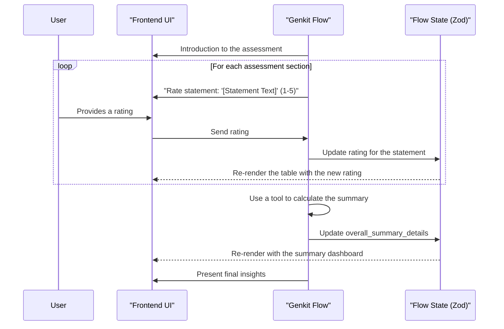

# Genkit Flow: Brand Strength Assessment

## 1. Purpose & Introduction

This Genkit flow guides users through a comprehensive assessment of their brand's strength across key dimensions, identifying strengths, areas for improvement, and opportunities for differentiation.

## 2. Zod Schema for Flow State

The state of the Genkit flow is managed by the following Zod schema:

```javascript
import { z } from 'zod';

const AssessmentScoreSchema = z.object({
  statement_id: z.string(),
  statement_text: z.string(),
  rating: z.number().nullable(),
});

const SectionAverageSchema = z.object({
  section_name: z.string(),
  average_score: z.number().nullable(),
});

const BrandStrengthStateSchema = z.object({
  company_name: z.string(),
  assessment_date: z.string().datetime(),
  brand_strategy_differentiation_scores: z.array(AssessmentScoreSchema),
  brand_alignment_culture_scores: z.array(AssessmentScoreSchema),
  brand_communication_marketing_scores: z.array(AssessmentScoreSchema),
  brand_execution_customer_experience_scores: z.array(AssessmentScoreSchema),
  brand_measurement_risk_management_scores: z.array(AssessmentScoreSchema),
  overall_summary_details: z.object({
    overall_average_score: z.number().nullable(),
    section_averages: z.array(SectionAverageSchema),
    top_strengths: z.array(AssessmentScoreSchema),
    areas_for_focus: z.array(AssessmentScoreSchema),
  }),
  status: z.enum(['in_progress', 'completed']).default('in_progress'),
  last_updated_at: z.string().datetime(),
});
```

## 3. Phased Breakdown

The assessment is divided into five logical sections. The interaction logic is repeated for each section.

### Phase 1: Brand Strategy & Differentiation

**A. Genkit Flow Logic (Left Panel):**
1.  **Introduction to Section:** The flow introduces the "Brand Strategy & Differentiation" section and explains its importance.
2.  **Iterative Rating:** The flow iterates through each statement in this section, asking the user for a rating from 1 to 5.
3.  **Completion:** Once all statements in the section are rated, the flow offers to provide a summary for the section or move on to the next one.

**B. Frontend UI (Right Panel):**
-   A card for the "Brand Strategy & Differentiation Assessment."
-   A table listing the statements for this section, with a dropdown or radio group for selecting the rating for each.
-   The UI updates in real-time as the user provides ratings, whether through the chat or by interacting with the table directly.

*(This pattern is repeated for Phase 2: Brand Alignment & Culture, Phase 3: Brand Communication & Marketing, Phase 4: Brand Execution & Customer Experience, and Phase 5: Brand Measurement & Risk Management.)*

## 4. Summary & Insights

**A. Genkit Flow Logic (Left Panel):**
1.  **Summary Offer:** Once all sections are complete, the flow offers to provide a comprehensive summary.
2.  **Summary Delivery:** If the user agrees, the flow uses a `tool` to calculate the overall and section-specific average scores, as well as identify the top strengths and areas for focus. It then presents this summary to the user.
3.  **Proactive Suggestions:** The flow can then offer to generate a detailed report, suggest a workshop, or help draft a brand essence statement.

**B. Frontend UI (Right Panel):**
-   A "Brand Strength Assessment Summary" card.
-   Displays the overall average score, a bar chart of the section averages, and lists of the top strengths and areas for focus.
-   Buttons for the actions offered by the AI (e.g., "Generate Report").

## 5. Genkit Implementation Notes

-   **Stateful Flow**: The entire assessment is a single, stateful Genkit `flow` that manages the state defined by the `BrandStrengthStateSchema`.
-   **Calculation Tool**: A Genkit `tool` should be created to perform the summary calculations (average scores, top strengths, etc.). This keeps the core flow logic clean and separates the business logic from the conversational orchestration.
-   **Frontend Integration**: The frontend will interact with the Genkit flow by sending user ratings and receiving the updated state to re-render the UI.
-   **Observability**: Genkit's tracing will be crucial for debugging the conversational flow and ensuring the calculation tool is working correctly.

## 6. Workflow Sequence Diagram



## Appendix A: Assessment Statements

*(This appendix remains the same as in the original document, listing all the statements for each section.)*
