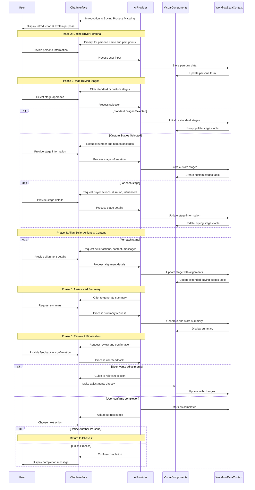

# Buyer Persona Buying Process Workflow

## 1. Overview & Purpose

This AI-powered conversational tool guides users through defining the distinct stages their buyer personas go through during their purchasing journey. By mapping these stages, users can align seller actions and content strategies to match the buyer's needs at each point in their decision process.

The workflow helps users understand buyer behavior, identify key touchpoints and influencers, and optimize marketing and sales efforts for maximum efficiency. This tailored approach ensures messaging and content are highly relevant and delivered at the right time, ultimately improving engagement and conversion rates.

## 2. Target User & Context

**User:** Marketing managers, sales strategists, content planners, and business owners who need to understand their customers' buying journey and align their marketing and sales efforts accordingly.

**Context:** This workflow complements other marketing strategy components like customer personas and customer journey mapping. While customer journey mapping provides a broad view of the customer experience, the buying process workflow specifically focuses on the purchase decision journey and aligning sales and marketing tactics with each stage.

## 3. Core Conversational Flow

### General Principle

As the AI guides the user through defining the buyer's journey stages, the right visual panel will dynamically display this information in an organized table format. This follows the **Visual Augmentation** and **Bidirectional Updates** principles from the Chat-Driven Workflow Pattern.

### Phase 1: Introduction to Buying Process Mapping

**AI Chat Guidance & Data Collection (Left Panel):**
"Hello! Welcome to the Buyer Persona Buying Process Mapping tool. This guided experience will help us deeply understand your buyer personas' journeys – from their initial problem awareness to their final purchase decision. By mapping these stages, we can align your sales and marketing efforts to deliver the right message at the right time, ultimately improving engagement and conversions."

"We'll cover key aspects such as what your buyers are doing at each stage, who influences them, and what content and seller actions are most effective. This tailored approach helps ensure your strategy is highly relevant and impactful."

**Visual Components (Right Panel):**
- A title card: "Buyer Persona Buying Process Mapping"
- A brief overview text: "Define your buyer personas' journey, key actions, and align your marketing and sales strategies for optimal impact."
- An illustrative infographic showing a general progression of stages (e.g., Awareness → Consideration → Decision)

**Data Captured in this Phase:**
None yet, just initial context setting.

### Phase 2: Define Buyer Persona

**AI Chat Guidance & Data Collection (Left Panel):**
"Let's begin by defining your first buyer persona. What is the name of this persona? For example, 'Small Business Owner,' 'Enterprise IT Manager,' or 'Marketing Director.'"

After persona name is provided: "Great! Now, for [Provided Persona Name], what are their primary pain points that your product or service helps to solve? Think about the specific challenges, problems, or frustrations they experience."

"These could be financial pain points (e.g., 'too expensive'), productivity pain points (e.g., 'wasting too much time'), process pain points (e.g., 'workflow is too complex'), or support pain points (e.g., 'lack of proper assistance')."

**Visual Components (Right Panel):**
- A form with the following fields:
  - Persona Name: Text input (e.g., "Small Business Owner")
  - Pain Points: Multi-line text area or tag input for distinct points

**Data Captured in this Phase:**
```typescript
current_persona.name: string
current_persona.pain_points: string
```

### Phase 3: Map Buying Stages

**AI Chat Guidance & Data Collection (Left Panel):**
"Now, let's map out the buying stages for [current_persona.name]. The buyer's journey typically involves distinct phases where the buyer's needs and actions evolve. Do you want to start with a standard set of stages, such as 'Awareness,' 'Consideration,' and 'Decision,' or would you prefer to customize them?"

If 'Standard': "Great. We'll pre-fill the stages with Awareness, Consideration, and Decision. For each stage, we'll define what the buyer is doing, the typical duration, and key influencers."

If 'Customize': "No problem. How many distinct buying stages do you identify for [current_persona.name]'s journey?" Then: "Okay, let's name each of these [X] stages."

For each stage (iterating through defined/chosen stages):
"Let's focus on the [Stage Name] stage for [current_persona.name]."

"First, what are the primary buyer actions or behaviors at this stage? What is [current_persona.name] doing, learning, or trying to achieve?"

"For example, in 'Awareness,' they might be researching problems; in 'Consideration,' they might be evaluating solutions."

"Next, what is the typical duration of this stage for [current_persona.name]? (e.g., '1-2 weeks,' '1 month,' '3-6 months')"

"Finally, who are the key influencers or decision-makers involved at this [Stage Name]? This could be internal stakeholders, external consultants, or specific research sources."

**Visual Components (Right Panel):**
- A dynamic table with the following columns:
  - Stage Name
  - Buyer Actions
  - Duration
  - Key Influencers
- Rows will be either pre-filled with standard stages or added based on user input

**Data Captured in this Phase:**
```typescript
current_persona.buying_stages: Array<{
  stage_name: string,
  buyer_actions: string,
  duration: string,
  key_influencers: string
}>
```

### Phase 4: Align Seller Actions & Content

**AI Chat Guidance & Data Collection (Left Panel):**
"Excellent. Now that we have the stages defined, let's align your Seller Actions and Content Strategy for each stage of [current_persona.name]'s journey."

For each stage (iterating sequentially):
"For the [Stage Name] stage (where [current_persona.name] is [buyer_actions]), what are the primary seller actions your team should take? (e.g., 'Conduct discovery calls,' 'Provide product demos,' 'Send case studies')"

"What type of content (e.g., blog post, whitepaper, webinar, demo video, pricing sheet) should be conveyed to [current_persona.name] at this [Stage Name] stage?"

"What is the key message or desired outcome you want to convey with this content at the [Stage Name] stage?"

**Visual Components (Right Panel):**
- The existing buying stages table will expand to include three additional columns:
  - Seller Actions
  - Content Type
  - Key Message

**Data Captured in this Phase:**
```typescript
current_persona.buying_stages: Array<{
  // Previous fields +
  seller_actions: string,
  content_type: string,
  key_message: string
}>
```

### Phase 5: AI-Assisted Summary (Optional)

**AI Chat Guidance & Data Collection (Left Panel):**
"We've gathered all the details for [current_persona.name]'s buying process mapping! Would you like me to generate a summary of this persona's journey, highlighting the alignment between their actions, your seller's efforts, and your content at each stage?"

If yes: The AI generates a structured summary with all stages, actions, and alignments.
"Here's a summary for [current_persona.name]:
Persona: [current_persona.name] ([current_persona.pain_points])
(Stage 1 Name): Buyer Actions: [buyer_actions], Duration: [duration], Influencers: [key_influencers], Seller Actions: [seller_actions], Content: [content_type], Key Message: [key_message]
(Stage 2 Name): ..."

"This summary can be used as a foundation for your marketing and sales playbooks."

**Visual Components (Right Panel):**
- A rich text view displaying the AI-generated summary
- Optional visual representation of the buying process as a flowchart or journey map

**Data Captured in this Phase:**
```typescript
current_persona.ai_generated_summary: string
```

### Phase 6: Review & Finalization

**AI Chat Guidance & Data Collection (Left Panel):**
"We have now completed the comprehensive buying process mapping for [current_persona.name]. Please review all the details in the right panel to ensure accuracy and completeness."

"Are you satisfied with this persona's buying process, or would you like to make any adjustments?"

If 'Adjust': Guide back to relevant phase or allow free-form editing.

"Once you're satisfied, we can save this mapping. Would you like to define another buyer persona's buying process now, or are we done for today?"

If 'New Persona': Loop back to Phase 2.
If 'Done': "Fantastic! All your defined buyer persona buying processes have been saved and are accessible in your strategy dashboard. They are now ready to be used for aligning your marketing campaigns and sales efforts."

**Visual Components (Right Panel):**
- The complete buying process table with all data
- Action buttons: "Edit Persona", "Add New Persona", "Finish/Go to Dashboard"

**Data Captured in this Phase:**
```typescript
current_persona.status: 'in_progress' | 'completed'
current_persona.last_updated_at: string // timestamp
```

## 4. Visual Components

### shadcn/ui Component Mapping

| UI Element | shadcn/ui Component | Usage |
|------------|---------------------|-------|
| Main Container | `<ResizablePanelGroup>` | Split-panel layout for chat and visual components |
| Title Card | `<Card>` with `<CardContent>` | Introduction and overview display |
| Persona Form | `<Form>` with `<FormField>` components | Capturing persona details |
| Stages Table | `<Table>` with related components | Main display for buying stages |
| Pain Points Input | `<TagInput>` or `<Textarea>` | Capturing multiple pain points |
| Standard/Custom Toggle | `<RadioGroup>` | Selection between standard or custom stages |
| Text Fields | `<Input>` | Single-line text input fields |
| Multi-line Text | `<Textarea>` | For longer text responses |
| Summary View | `<Card>` with rich text content | For AI-generated summary |
| Action Buttons | `<Button>` with variants | Edit, Add New, Finish, etc. |

### Example Buying Process Component (Conceptual)

```tsx
import { useState, useEffect } from 'react';
import { 
  Table, TableHeader, TableBody, TableRow, TableHead, TableCell,
  Card, CardHeader, CardTitle, CardContent, 
  Form, FormField, FormItem, FormLabel, FormControl,
  Input, Textarea, Button, RadioGroup, RadioGroupItem, Label
} from "@/components/ui/";

interface BuyingStage {
  stage_name: string;
  buyer_actions: string;
  duration: string;
  key_influencers: string;
  seller_actions: string;
  content_type: string;
  key_message: string;
}

interface BuyingProcessProps {
  personaName: string;
  personaPainPoints: string;
  initialStages?: BuyingStage[];
  onUpdate: (stages: BuyingStage[]) => void;
}

export function BuyingProcessMapping({
  personaName,
  personaPainPoints,
  initialStages,
  onUpdate
}: BuyingProcessProps) {
  // Initialize with standard stages or provided stages
  const [stages, setStages] = useState<BuyingStage[]>(initialStages || [
    { 
      stage_name: 'Awareness',
      buyer_actions: '',
      duration: '',
      key_influencers: '',
      seller_actions: '',
      content_type: '',
      key_message: ''
    },
    { 
      stage_name: 'Consideration',
      buyer_actions: '',
      duration: '',
      key_influencers: '',
      seller_actions: '',
      content_type: '',
      key_message: ''
    },
    { 
      stage_name: 'Decision',
      buyer_actions: '',
      duration: '',
      key_influencers: '',
      seller_actions: '',
      content_type: '',
      key_message: ''
    }
  ]);
  
  // Update parent component when stages change
  useEffect(() => {
    onUpdate(stages);
  }, [stages, onUpdate]);
  
  // Handle field updates
  const handleStageUpdate = (index: number, field: keyof BuyingStage, value: string) => {
    const updatedStages = [...stages];
    updatedStages[index] = {
      ...updatedStages[index],
      [field]: value
    };
    setStages(updatedStages);
  };
  
  // Add a new custom stage
  const addStage = () => {
    setStages([...stages, {
      stage_name: `Stage ${stages.length + 1}`,
      buyer_actions: '',
      duration: '',
      key_influencers: '',
      seller_actions: '',
      content_type: '',
      key_message: ''
    }]);
  };
  
  return (
    <div className="space-y-6">
      {/* Persona Header */}
      <Card>
        <CardHeader>
          <CardTitle>Buying Process for {personaName}</CardTitle>
        </CardHeader>
        <CardContent>
          <div className="space-y-2">
            <h3 className="font-medium">Persona Pain Points:</h3>
            <p className="text-sm">{personaPainPoints}</p>
          </div>
        </CardContent>
      </Card>
      
      {/* Buying Stages Table */}
      <div className="overflow-x-auto">
        <Table>
          <TableHeader>
            <TableRow>
              <TableHead className="w-[150px]">Stage</TableHead>
              <TableHead>Buyer Actions</TableHead>
              <TableHead>Duration</TableHead>
              <TableHead>Key Influencers</TableHead>
              <TableHead>Seller Actions</TableHead>
              <TableHead>Content Type</TableHead>
              <TableHead>Key Message</TableHead>
            </TableRow>
          </TableHeader>
          <TableBody>
            {stages.map((stage, index) => (
              <TableRow key={index}>
                <TableCell>
                  <Input 
                    value={stage.stage_name}
                    onChange={(e) => handleStageUpdate(index, 'stage_name', e.target.value)}
                  />
                </TableCell>
                <TableCell>
                  <Textarea 
                    value={stage.buyer_actions}
                    onChange={(e) => handleStageUpdate(index, 'buyer_actions', e.target.value)}
                    className="min-h-[80px]"
                  />
                </TableCell>
                <TableCell>
                  <Input 
                    value={stage.duration}
                    onChange={(e) => handleStageUpdate(index, 'duration', e.target.value)}
                  />
                </TableCell>
                <TableCell>
                  <Textarea 
                    value={stage.key_influencers}
                    onChange={(e) => handleStageUpdate(index, 'key_influencers', e.target.value)}
                    className="min-h-[80px]"
                  />
                </TableCell>
                <TableCell>
                  <Textarea 
                    value={stage.seller_actions}
                    onChange={(e) => handleStageUpdate(index, 'seller_actions', e.target.value)}
                    className="min-h-[80px]"
                  />
                </TableCell>
                <TableCell>
                  <Textarea 
                    value={stage.content_type}
                    onChange={(e) => handleStageUpdate(index, 'content_type', e.target.value)}
                    className="min-h-[80px]"
                  />
                </TableCell>
                <TableCell>
                  <Textarea 
                    value={stage.key_message}
                    onChange={(e) => handleStageUpdate(index, 'key_message', e.target.value)}
                    className="min-h-[80px]"
                  />
                </TableCell>
              </TableRow>
            ))}
          </TableBody>
        </Table>
      </div>
      
      {/* Action Buttons */}
      <div className="flex justify-between space-x-4">
        <Button 
          variant="outline" 
          onClick={addStage}
        >
          Add Custom Stage
        </Button>
        <div className="space-x-2">
          <Button variant="outline">Save Draft</Button>
          <Button>Complete Mapping</Button>
        </div>
      </div>
    </div>
  );
}
```

## 5. Data Structure & Integration

### Complete Data Structure

```typescript
// Within the broader WorkflowDataContext
buying_process_mappings: Array<{
  // Persona Information
  persona_id: string, // auto-generated unique ID
  persona_name: string, // e.g., "Small Business Owner"
  persona_pain_points: string, // e.g., "Budget constraints; Lacks IT support"
  
  // Buying Stages
  buying_stages: Array<{
    stage_name: string, // e.g., "Awareness", "Consideration", "Decision"
    buyer_actions: string, // What the buyer is doing at this stage
    duration: string, // Typical timeframe for this stage
    key_influencers: string, // Who influences decisions at this stage
    seller_actions: string, // What the seller should do at this stage
    content_type: string, // What content to provide at this stage
    key_message: string // Key message to convey in content
  }>,
  
  // Optional AI-generated content
  ai_generated_summary?: string, // Summary of the buying process
  
  // Metadata
  status: 'in_progress' | 'completed',
  last_updated_at: string, // timestamp
  created_by?: string
}>
```

### Integration with Other Workflows

The Buying Process workflow integrates with several other marketing strategy components:

1. **Customer Persona**: The buying process is directly tied to specific buyer personas, providing deeper context about how each persona type makes purchase decisions.

2. **Content Strategy**: The content types and key messages identified in each buying stage provide direct input for content planning and creation.

3. **Sales Playbook**: Seller actions defined at each stage form the foundation for sales team guidance and training.

4. **Marketing Campaign Planning**: Understanding what buyers need at each stage helps prioritize campaign themes and messaging.

5. **Customer Journey Mapping**: While the customer journey covers the full experience, the buying process focuses specifically on the purchase decision path, providing complementary insights.

## 6. Workflow Sequence Diagram



## 7. Cross-Cutting Concerns

### Accessibility Considerations
- Ensure the buying stages table is accessible with proper ARIA attributes
- Provide keyboard navigation for the complex table structure
- Maintain adequate color contrast for all text and UI elements
- Include descriptive error messages for form validation issues
- Support screen reader announcements for dynamic updates

### Performance Considerations
- Implement efficient table rendering to handle multiple stages and columns
- Consider pagination or virtualization if the number of stages grows large
- Optimize state management to prevent unnecessary re-renders when updating table cells
- Consider lazy loading for AI-generated summary content
- Implement efficient data validation to provide immediate feedback without performance penalties

### Security Considerations
- Apply appropriate access controls as buying process maps may contain sensitive business information
- Implement proper validation for all user inputs
- Consider privacy implications when storing strategic business information
- Ensure secure sharing mechanisms for exporting and distributing buying process maps
- Consider role-based access controls for different team members

### Internationalization & Localization
- Support multiple languages in UI elements and AI prompts
- Ensure table layouts can accommodate longer text in translated interfaces
- Consider cultural differences in how buying processes are conceptualized in different markets
- Support different formatting conventions for durations and other time-based values
- Allow for flexibility in describing business processes that may vary by region
