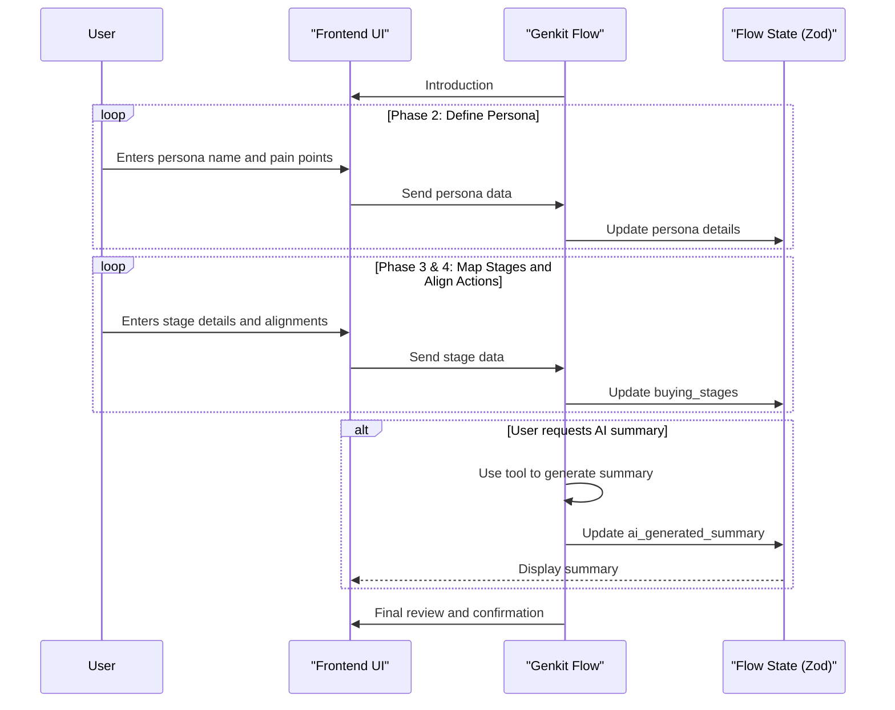

# Genkit Flow: Buyer Persona Buying Process

## 1. Overview & Purpose

This Genkit flow guides users through defining the distinct stages their buyer personas go through during their purchasing journey. By mapping these stages, users can align seller actions and content strategies to match the buyer's needs at each point in their decision process.

## 2. Target User & Context

**User:** Marketing managers, sales strategists, content planners, and business owners.

**Context:** This flow complements other marketing strategy components like customer personas and customer journey mapping.

## 3. Zod Schema for Flow State

The state of the Genkit flow is managed by the following Zod schema:

```javascript
import { z } from 'zod';

const BuyingStageSchema = z.object({
  stage_name: z.string(),
  buyer_actions: z.string(),
  duration: z.string(),
  key_influencers: z.string(),
  seller_actions: z.string(),
  content_type: z.string(),
  key_message: z.string(),
});

const BuyingProcessStateSchema = z.object({
  persona_id: z.string(),
  persona_name: z.string(),
  persona_pain_points: z.string(),
  buying_stages: z.array(BuyingStageSchema),
  ai_generated_summary: z.string().optional(),
  status: z.enum(['in_progress', 'completed']).default('in_progress'),
  last_updated_at: z.string().datetime(),
});
```

## 4. Phased Breakdown

### Phase 1: Introduction

The flow starts with an introduction to the Buyer Persona Buying Process Mapping tool, explaining its purpose and benefits.

### Phase 2: Define Buyer Persona

**A. Genkit Flow Logic (Left Panel):**
- Prompts the user to define their buyer persona by providing a name and their primary pain points.

**B. Frontend UI (Right Panel):**
- A form with fields for "Persona Name" and "Pain Points."

### Phase 3: Map Buying Stages

**A. Genkit Flow Logic (Left Panel):**
- The flow asks the user if they want to start with a standard set of stages (e.g., Awareness, Consideration, Decision) or define custom stages.
- It then iterates through each stage, prompting for details like buyer actions, duration, and key influencers.

**B. Frontend UI (Right Panel):**
- A dynamic table with columns for "Stage Name," "Buyer Actions," "Duration," and "Key Influencers."

### Phase 4: Align Seller Actions & Content

**A. Genkit Flow Logic (Left Panel):**
- For each buying stage, the flow asks the user to define the corresponding seller actions, content type, and key message.

**B. Frontend UI (Right Panel):**
- The buying stages table expands to include columns for "Seller Actions," "Content Type," and "Key Message."

### Phase 5: AI-Assisted Summary

**A. Genkit Flow Logic (Left Panel):**
- The flow offers to generate a summary of the persona's buying journey, which can be done using a Genkit `tool`.

**B. Frontend UI (Right Panel):**
- A rich text view to display the AI-generated summary.

### Phase 6: Review & Finalization

**A. Genkit Flow Logic (Left Panel):**
- The flow asks the user to review the complete buying process map and confirm if they are satisfied or want to make adjustments.
- It also asks if they want to define another persona's buying process or conclude the session.

**B. Frontend UI (Right Panel):**
- The complete buying process table.
- Buttons to "Edit Persona," "Add New Persona," or "Finish."

## 5. Genkit Implementation Notes

-   **Stateful Flow**: The entire buying process mapping is a single, stateful Genkit `flow` that manages the state defined by the `BuyingProcessStateSchema`.
-   **AI Summary Tool**: A Genkit `tool` should be created to generate the summary of the buying process. This tool would take the `buying_stages` data as input and use a generative model to create a coherent summary.
-   **Frontend Integration**: The frontend will interact with the Genkit flow by sending user inputs and receiving the updated state to re-render the UI.
-   **Multi-Persona Management**: The overall application will manage an array of `BuyingProcessStateSchema` objects, one for each persona defined by the user.

## 6. Workflow Sequence Diagram


