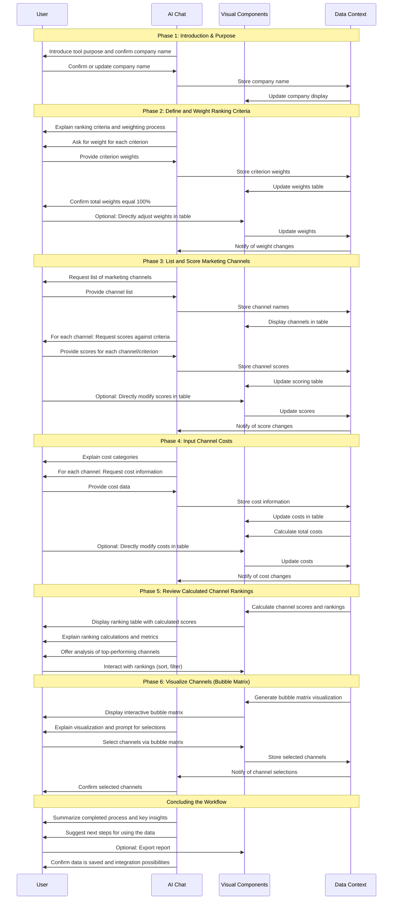

# Marketing Channel Ranking Workflow

## 1. Overview & Purpose

The Marketing Channel Ranking Workflow transforms the complex task of marketing channel evaluation into an interactive, data-driven experience. This AI-powered workflow guides users through systematically evaluating and prioritizing marketing channels based on weighted criteria, performance metrics, and cost factors.

By leveraging the split-panel layout with AI chat guidance on the left and dynamic visual components on the right, the tool enables marketers to make informed decisions about resource allocation across different marketing channels. The workflow helps optimize marketing strategy by identifying the highest performing and most cost-effective channels for the user's specific business context and objectives.

The workflow produces a comprehensive channel ranking that combines qualitative assessments with quantitative metrics, visualized through both tabular rankings and an interactive bubble matrix. This data-driven approach helps marketing teams prioritize their efforts on channels with the highest potential impact while considering cost efficiency.

## 2. Target User & Context

**User:** Marketing managers, marketing strategists, and CMOs responsible for planning and optimizing marketing channel allocation and budget decisions.

**Context:** This workflow typically fits in the tactical planning phase of marketing strategy development, after broader strategic elements like personas, messaging, and campaign objectives have been established. It leverages data from other components like brand assessment and buying process mapping to inform channel evaluation.

The primary user need is decision support for marketing channel selection and prioritization. Marketers often struggle with objectively comparing diverse marketing channels, especially when each channel has different strengths, weaknesses, and cost structures. This tool addresses this challenge by providing a structured framework that:

1. Establishes weighted evaluation criteria aligned with business goals
2. Systematically assesses each channel against these criteria
3. Incorporates cost considerations for comprehensive evaluation
4. Visualizes results to support intuitive understanding and decision-making

The resulting channel prioritization directly informs marketing budget allocation, campaign planning, and resource deployment across channels.

## 3. Core Conversational Flow

### General Principle

As the AI guides the user through the channel evaluation process, the right visual panel dynamically updates to display data in structured tables, input forms, and visualizations. Following the **Bidirectional Updates** principle from the Chat-Driven Workflow Pattern, changes made in either the chat or visual panels are immediately reflected in the other.

### Phase 1: Introduction & Purpose

**AI Chat Guidance & Data Collection (Left Panel):**
"Hello there! I'm here to help you evaluate and prioritize your marketing channels using the Marketing Channel Ranking Tool. This tool will assist you in making informed decisions about where to allocate your marketing resources for the best impact."

The AI leverages existing data: "To start, I see we have your company name as '[onboarding_company_name]'. Is this correct for our work on marketing channel ranking today?"
- If user confirms: "Great! Let's get started for [onboarding_company_name]."
- If user indicates a change: "No problem. What is the correct company name you'd like to use for this marketing channel ranking?" (Update current_company_name variable).

The AI explains the value: "By the end of this process, you'll have a clear ranking of your marketing channels based on criteria important to your business, helping you prioritize where to invest your efforts and budget."

**Visual Components (Right Panel):**
- A title card prominently displaying "Marketing Channel Ranking Tool"
- A brief overview of the workflow's purpose
- A company name display showing "Currently working on: [onboarding_company_name]"

**Data Captured in this Phase:**
```typescript
company_name: string  // Initialized from onboarding_company_name, can be updated
```

### Phase 2: Define and Weight Ranking Criteria

**AI Chat Guidance & Data Collection (Left Panel):**
"First, let's establish the key criteria for evaluating your marketing channels and decide how important each one is. The tool uses metrics like Brand Promotion Quality, Lead Quality, and Cost/Event."

The AI explains the weighting process: "You'll be able to adjust the weighting for each criterion. The total weight for all criteria should add up to 100%. Don't worry, I'll help you keep track. This customization ensures the ranking reflects your current business priorities."

The AI collects weights for each criterion:
- "Let's start with Brand Promotion Quality. This includes 'Alignment with Image' and 'Market Visibility'. How much weight (as a percentage) would you like to assign to 'Alignment with Image'?"
- (Repeat for all criteria: Alignment with Image, Market Visibility, Accountability, Internal Champion, Purchase Responsibility, Conversion Potential)

After each input, the AI calculates the current total: "The current total weight is X%. We're aiming for 100%."

If needed, the AI offers clarification: "If you need a reminder of what any criterion means, just ask. For example, 'Conversion Potential' means there is a high likelihood and/or predictable conversion rate using the specified channel."

Once complete, the AI confirms: "Okay, we've set the following weights: [List all criteria and their assigned weights]. Does this look correct?"

**Visual Components (Right Panel):**
- A dynamic table with columns:
  - "Ranking Criteria" (lists all defined criteria)
  - "Weighting (%)" (input fields for percentages)
- A "Total" row at the bottom with dynamically updated sum
- Optional tooltip icons explaining each criterion

**Data Captured in this Phase:**
```typescript
ranking_criteria_weights: {
  alignment_with_image_weight: number,  // e.g., 20
  market_visibility_weight: number,     // e.g., 20
  accountability_weight: number,        // e.g., 15
  internal_champion_weight: number,     // e.g., 15
  purchase_responsibility_weight: number, // e.g., 15
  conversion_potential_weight: number   // e.g., 15
}
```

### Phase 3: List and Score Marketing Channels

**AI Chat Guidance & Data Collection (Left Panel):**
"Great, now that our criteria are set, let's identify the marketing channels you want to evaluate. Then, we'll score each channel against the criteria we just weighted."

The AI collects channel list: "Please list all the marketing channels you'd like to assess. You can provide them as a comma-separated list, or one by one. (e.g., 'Website, e-Newsletter, Blog, PPC Ads')"

The AI confirms the list: "Understood. We'll be evaluating: [List channels]. Is there anything else you'd like to add or remove?"

The AI guides scoring: "Now, let's score each channel. For each channel, you'll rate it on a scale of 1 to 10 (1 being lowest, 10 being highest) for how well it performs against each of our criteria."

For each channel and criterion:
- "How would you score [Channel Name] for '[Criterion Name]' (1-10)? For example, for 'Alignment with Image'?"

After all scores are collected, the AI confirms: "We've collected scores for all your channels. Would you like to review or modify any of them?"

**Visual Components (Right Panel):**
- A dynamic table with:
  - First column: "Channel" (editable channel names)
  - Subsequent columns: One for each criterion with input fields (1-10 scale)
- Add/Remove buttons for channels
- As scores are provided in chat, they populate the respective cells

**Data Captured in this Phase:**
```typescript
marketing_channels: Array<{
  channel_name: string,  // e.g., "Website"
  criterion_scores: {
    alignment_with_image_score: number,  // 1-10
    market_visibility_score: number,     // 1-10
    accountability_score: number,        // 1-10
    internal_champion_score: number,     // 1-10
    purchase_responsibility_score: number, // 1-10
    conversion_potential_score: number   // 1-10
  }
}>
```

### Phase 4: Input Channel Costs

**AI Chat Guidance & Data Collection (Left Panel):**
"Now let's add the cost dimension to our analysis. For each marketing channel, we'll need to input the costs associated with it. This includes Production Time, Delivery, and Other Costs."

The AI explains cost categories: "Remember, 'Production Time Cost' is the cost of time required to put this in play. 'Delivery Cost' covers associated costs with putting media piece through this channel. And 'Other Costs' are any non-internal costs required."

For each channel:
- "Let's add costs for [Channel Name]."
- "What is the estimated Production Time Cost for [Channel Name]?" (e.g., "$7,000")
- "What is the Delivery Cost for [Channel Name]?" (e.g., "$1,000")
- "Are there any Other Costs for [Channel Name]?" (e.g., "$500")

After collecting all cost data, the AI confirms: "We've now collected all cost data. Would you like to review or adjust the costs for any channel?"

**Visual Components (Right Panel):**
- The same table from Phase 3, extended with new columns:
  - "Production Time Cost" (currency input field)
  - "Delivery Cost" (currency input field)
  - "Other Costs" (currency input field)
  - "Total Costs" (read-only, calculated sum)
- As costs are provided in chat, they update in the table
- The "Total Costs" column calculates automatically

**Data Captured in this Phase:**
```typescript
// Updates the marketing_channels array, adding to each channel object:
production_time_cost: number,  // currency
delivery_cost: number,         // currency
other_costs: number,           // currency
total_costs: number            // Derived: sum of the above three
```

### Phase 5: Review Calculated Channel Rankings

**AI Chat Guidance & Data Collection (Left Panel):**
"Excellent! We've collected all the necessary data. I've now calculated the overall scores and rankings for each of your marketing channels based on the weights and scores you provided."

The AI explains the calculations: "The 'Overall Channel Score' is a weighted average of your criterion scores. You'll also see separate calculated scores for 'Brand Promotion Quality' and 'Lead Quality', and the total 'Cost/Event'."

The AI prompts for review: "Please review the rankings in the right panel. Does anything stand out to you, or would you like to go back and adjust any of your previous inputs if you see a channel ranking unexpectedly?"

The AI offers additional insights: "Would you like me to highlight the top 3 recommended channels based on their overall score? Or perhaps highlight the most cost-effective ones?"

**Visual Components (Right Panel):**
- A read-only rankings table with columns:
  - "Channel" 
  - "Overall Channel Score" (calculated)
  - "Brand Promotion Quality" (calculated)
  - "Lead Quality" (calculated)
  - "Cost/Event" (calculated total)
- Sortable columns (clicking on column header sorts ascending/descending)
- Conditional formatting highlighting top-performing channels

**Data Captured in this Phase:**
```typescript
// Updates the marketing_channels array, adding to each channel object:
overall_channel_score: number,              // Weighted average of all criteria
calculated_brand_promotion_quality: number, // Combined score for brand criteria
calculated_lead_quality: number             // Combined score for lead criteria
```

### Phase 6: Visualize Channels (Bubble Matrix)

**AI Chat Guidance & Data Collection (Left Panel):**
"Finally, let's visualize your channels using a 'Bubble Matrix' to help you make final selections. This matrix plots channels based on their performance against their total cost, allowing you to quickly identify channels that offer the best value."

The AI explains the visualization: "Each bubble represents a marketing channel. The size of each bubble represents its overall score, while its position shows the relationship between cost-effectiveness and lead quality. This visual helps you identify channels that are high-performing yet cost-efficient."

The AI prompts for selection: "Based on the insights from the bubble matrix and the rankings, which marketing channels do you feel are most appropriate for your current strategy?"

After the user selects channels, the AI confirms: "You've selected [List selected channels]. Are these your final choices, or would you like to adjust?"

**Visual Components (Right Panel):**
- An interactive Bubble Matrix chart:
  - X-axis: "Cost/Event" (lower to higher)
  - Y-axis: "Overall Channel Score" (lower to higher)
  - Bubble Size: Represents "Overall Channel Score"
- Interactive elements:
  - Hover for channel details
  - Click to select/deselect channels
- Legend explaining the visualization

**Data Captured in this Phase:**
```typescript
selected_channels: Array<string>  // e.g., ["Website", "e-Newsletter"]
```

### Concluding the Workflow

**AI Chat Guidance & Data Collection (Left Panel):**
"Congratulations! You've successfully completed the Marketing Channel Ranking process for [company_name]. You've defined your criteria, evaluated your channels, and identified the most suitable ones for your goals."

The AI summarizes the benefits: "This analysis provides a strong foundation for your marketing strategy. You can now use these insights to allocate your marketing budget more effectively, refine your campaign strategies, and justify your marketing decisions to your team."

The AI offers next steps: "Would you like to export a summary report of these rankings, or perhaps revisit any section before finalizing?"

The AI explains data integration: "This data is now saved and can be integrated into other strategy modules within the platform, such as your budget planning or campaign execution tools."

**Visual Components (Right Panel):**
- A concise summary dashboard showing:
  - Final rankings table
  - Bubble matrix visualization
  - List of selected channels
- Action buttons: "Download Report" or "Export Data"

## 4. Visual Components

### shadcn/ui Component Mapping

| UI Element | shadcn/ui Component | Usage |
|------------|---------------------|-------|
| Main Container | `<ResizablePanelGroup>` | Split-panel layout for chat and visual components |
| Title Card | `<Card>` with `<CardHeader>` and `<CardContent>` | Introductory information display |
| Company Name Display | `<Input>` with `readOnly` | Display confirmed company name |
| Criteria Weights Table | `<Table>` with `<TableHeader>`, `<TableBody>`, `<TableRow>`, `<TableHead>`, `<TableCell>` | Display and collect weighting percentages |
| Criteria Weight Input | `<Input type="number">` | Input field for percentage weights |
| Criteria Information | `<Tooltip>` with `<TooltipTrigger>` and `<TooltipContent>` | Provide explanations of criteria |
| Add Channel Button | `<Button>` with `<Plus>` icon | Add new channel to evaluation |
| Remove Channel Button | `<Button>` with `<Trash2>` icon | Remove channel from evaluation |
| Channel Name Input | `<Input>` | Text input for channel names |
| Score Input | `<Select>` or `<Slider>` | Input for 1-10 scores |
| Cost Input | `<Input type="number">` with currency formatting | Input for cost values |
| Rankings Table | `<Table>` with sortable columns | Display calculated rankings |
| Sort Controls | `<Button>` with sort icons | Sort table columns |
| Bubble Matrix | Custom visualization component wrapped in `<Card>` | Interactive bubble chart visualization |
| Bubble Matrix Legend | `<Badge>` and styled `<div>` elements | Explain bubble size and positioning |
| Channel Selection | `<Checkbox>` | Select final channels |
| Export Button | `<Button>` with `<Download>` icon | Export results |
| Summary Dashboard | `<Tabs>` with `<TabsContent>` | Final view with multiple visualizations |
| Progress Indicator | `<Stepper>` or custom component | Show workflow phase progress |
| Notification | `<Toast>` | Confirmation messages |

### Example Channel Ranking Component (Conceptual)

```tsx
import { useState, useEffect } from "react";
import { 
  ResizablePanelGroup, ResizablePanel,
  Form, FormField, FormItem, FormLabel, FormControl, FormDescription,
  Input, Slider, Select, SelectContent, SelectItem, SelectTrigger, SelectValue,
  Table, TableHeader, TableBody, TableRow, TableHead, TableCell,
  Card, CardHeader, CardTitle, CardContent, CardFooter,
  Button, Checkbox,
  Tooltip, TooltipContent, TooltipProvider, TooltipTrigger,
  Badge,
  Tabs, TabsContent, TabsList, TabsTrigger
} from "@/components/ui";
import { Plus, Trash2, Info, Download, ArrowUpDown, Check } from "lucide-react";
import { cn } from "@/lib/utils";

// Type definitions for the channel ranking data
interface CriterionWeight {
  name: string;
  key: string;
  weight: number;
  description: string;
  category: "brand" | "lead";
}

interface MarketingChannel {
  id: string;
  channel_name: string;
  criterion_scores: {
    [key: string]: number; // 1-10 scores for each criterion
  };
  production_time_cost: number;
  delivery_cost: number;
  other_costs: number;
  total_costs: number;
  overall_channel_score: number;
  calculated_brand_promotion_quality: number;
  calculated_lead_quality: number;
  selected: boolean;
}

interface ChannelRankingData {
  company_name: string;
  ranking_criteria_weights: {
    [key: string]: number; // Percentage weights for each criterion
  };
  marketing_channels: MarketingChannel[];
  selected_channels: string[];
  last_updated_at: string;
}

// Example criteria definitions
const CRITERIA_DEFINITIONS: CriterionWeight[] = [
  { 
    name: "Alignment with Image", 
    key: "alignment_with_image",
    weight: 20, 
    description: "How well the channel aligns with and reinforces your brand image",
    category: "brand"
  },
  { 
    name: "Market Visibility", 
    key: "market_visibility",
    weight: 20, 
    description: "How visible and prominent your messaging will be through this channel",
    category: "brand"
  },
  { 
    name: "Accountability", 
    key: "accountability",
    weight: 15, 
    description: "The level of tracking and measurement available for this channel",
    category: "lead"
  },
  { 
    name: "Internal Champion", 
    key: "internal_champion",
    weight: 15, 
    description: "Whether there is an internal team member who can effectively manage this channel",
    category: "lead"
  },
  { 
    name: "Purchase Responsibility", 
    key: "purchase_responsibility",
    weight: 15, 
    description: "Whether this channel reaches individuals with purchasing authority",
    category: "lead"
  },
  { 
    name: "Conversion Potential", 
    key: "conversion_potential",
    weight: 15, 
    description: "The likelihood of converting leads from this channel into customers",
    category: "lead"
  }
];

interface ChannelRankingProps {
  initialData?: Partial<ChannelRankingData>;
  onboardingCompanyName?: string;
  onUpdate: (data: ChannelRankingData) => void;
  onRequestAIAssistance: (task: string, context: any) => Promise<string>;
  onExport: (format: string) => void;
}

export function ChannelRanking({
  initialData = {},
  onboardingCompanyName,
  onUpdate,
  onRequestAIAssistance,
  onExport
}: ChannelRankingProps) {
  // Current phase of the workflow
  const [phase, setPhase] = useState<number>(1);
  
  // Initialize channel ranking data
  const [rankingData, setRankingData] = useState<ChannelRankingData>({
    company_name: initialData.company_name || onboardingCompanyName || "",
    ranking_criteria_weights: initialData.ranking_criteria_weights || {
      alignment_with_image_weight: 20,
      market_visibility_weight: 20,
      accountability_weight: 15,
      internal_champion_weight: 15,
      purchase_responsibility_weight: 15,
      conversion_potential_weight: 15
    },
    marketing_channels: initialData.marketing_channels || [],
    selected_channels: initialData.selected_channels || [],
    last_updated_at: initialData.last_updated_at || new Date().toISOString()
  });
  
  // Create a derived array of criteria with current weights
  const [criteriaWithWeights, setCriteriaWithWeights] = useState<CriterionWeight[]>(
    CRITERIA_DEFINITIONS.map(criterion => ({
      ...criterion,
      weight: rankingData.ranking_criteria_weights[`${criterion.key}_weight`] || criterion.weight
    }))
  );
  
  // Update parent component with changes
  useEffect(() => {
    const updatedData = {
      ...rankingData,
      last_updated_at: new Date().toISOString()
    };
    onUpdate(updatedData);
  }, [rankingData, onUpdate]);
  
  // Update criteria weights when they change
  useEffect(() => {
    setCriteriaWithWeights(
      CRITERIA_DEFINITIONS.map(criterion => ({
        ...criterion,
        weight: rankingData.ranking_criteria_weights[`${criterion.key}_weight`] || criterion.weight
      }))
    );
  }, [rankingData.ranking_criteria_weights]);
  
  // Calculate total weight of all criteria
  const totalWeight = criteriaWithWeights.reduce((sum, criterion) => sum + criterion.weight, 0);
  
  // Handle updating criterion weight
  const updateCriterionWeight = (key: string, weight: number) => {
    setRankingData(prev => ({
      ...prev,
      ranking_criteria_weights: {
        ...prev.ranking_criteria_weights,
        [`${key}_weight`]: weight
      }
    }));
  };
  
  // Add a new marketing channel
  const addChannel = () => {
    const newChannel: MarketingChannel = {
      id: `channel-${Date.now()}`,
      channel_name: "",
      criterion_scores: criteriaWithWeights.reduce((scores, criterion) => {
        scores[`${criterion.key}_score`] = 5; // Default score of 5
        return scores;
      }, {} as {[key: string]: number}),
      production_time_cost: 0,
      delivery_cost: 0,
      other_costs: 0,
      total_costs: 0,
      overall_channel_score: 0,
      calculated_brand_promotion_quality: 0,
      calculated_lead_quality: 0,
      selected: false
    };
    
    setRankingData(prev => ({
      ...prev,
      marketing_channels: [...prev.marketing_channels, newChannel]
    }));
  };
  
  // Remove a marketing channel
  const removeChannel = (id: string) => {
    setRankingData(prev => ({
      ...prev,
      marketing_channels: prev.marketing_channels.filter(channel => channel.id !== id),
      selected_channels: prev.selected_channels.filter(channelName => {
        const channel = prev.marketing_channels.find(c => c.id === id);
        return channel ? channel.channel_name !== channelName : true;
      })
    }));
  };
  
  // Update channel name
  const updateChannelName = (id: string, name: string) => {
    setRankingData(prev => {
      const updatedChannels = prev.marketing_channels.map(channel => 
        channel.id === id ? { ...channel, channel_name: name } : channel
      );
      
      // If the channel was selected, update the selected_channels array
      const oldChannel = prev.marketing_channels.find(c => c.id === id);
      let updatedSelectedChannels = [...prev.selected_channels];
      if (oldChannel && prev.selected_channels.includes(oldChannel.channel_name)) {
        updatedSelectedChannels = updatedSelectedChannels.filter(c => c !== oldChannel.channel_name);
        updatedSelectedChannels.push(name);
      }
      
      return {
        ...prev,
        marketing_channels: updatedChannels,
        selected_channels: updatedSelectedChannels
      };
    });
  };
  
  // Update channel score for a criterion
  const updateChannelScore = (id: string, criterionKey: string, score: number) => {
    setRankingData(prev => {
      const updatedChannels = prev.marketing_channels.map(channel => {
        if (channel.id === id) {
          const updatedScores = {
            ...channel.criterion_scores,
            [`${criterionKey}_score`]: score
          };
          
          // Recalculate overall scores
          const brandCriteria = criteriaWithWeights.filter(c => c.category === "brand");
          const leadCriteria = criteriaWithWeights.filter(c => c.category === "lead");
          
          const brandScore = brandCriteria.reduce((sum, criterion) => {
            const weight = prev.ranking_criteria_weights[`${criterion.key}_weight`] / 100;
            const score = updatedScores[`${criterion.key}_score`] || 0;
            return sum + (weight * score);
          }, 0);
          
          const leadScore = leadCriteria.reduce((sum, criterion) => {
            const weight = prev.ranking_criteria_weights[`${criterion.key}_weight`] / 100;
            const score = updatedScores[`${criterion.key}_score`] || 0;
            return sum + (weight * score);
          }, 0);
          
          const overallScore = criteriaWithWeights.reduce((sum, criterion) => {
            const weight = prev.ranking_criteria_weights[`${criterion.key}_weight`] / 100;
            const score = updatedScores[`${criterion.key}_score`] || 0;
            return sum + (weight * score);
          }, 0);
          
          return {
            ...channel,
            criterion_scores: updatedScores,
            calculated_brand_promotion_quality: brandScore,
            calculated_lead_quality: leadScore,
            overall_channel_score: overallScore
          };
        }
        return channel;
      });
      
      return {
        ...prev,
        marketing_channels: updatedChannels
      };
    });
  };
  
  // Update channel costs
  const updateChannelCost = (id: string, costType: 'production_time_cost' | 'delivery_cost' | 'other_costs', value: number) => {
    setRankingData(prev => {
      const updatedChannels = prev.marketing_channels.map(channel => {
        if (channel.id === id) {
          const updatedCosts = {
            ...channel,
            [costType]: value,
            total_costs: 
              (costType === 'production_time_cost' ? value : channel.production_time_cost) +
              (costType === 'delivery_cost' ? value : channel.delivery_cost) +
              (costType === 'other_costs' ? value : channel.other_costs)
          };
          
          return updatedCosts;
        }
        return channel;
      });
      
      return {
        ...prev,
        marketing_channels: updatedChannels
      };
    });
  };
  
  // Toggle channel selection
  const toggleChannelSelection = (id: string) => {
    setRankingData(prev => {
      const channel = prev.marketing_channels.find(c => c.id === id);
      if (!channel) return prev;
      
      let updatedSelectedChannels = [...prev.selected_channels];
      if (updatedSelectedChannels.includes(channel.channel_name)) {
        updatedSelectedChannels = updatedSelectedChannels.filter(c => c !== channel.channel_name);
      } else {
        updatedSelectedChannels.push(channel.channel_name);
      }
      
      const updatedChannels = prev.marketing_channels.map(c => 
        c.id === id ? { ...c, selected: !c.selected } : c
      );
      
      return {
        ...prev,
        marketing_channels: updatedChannels,
        selected_channels: updatedSelectedChannels
      };
    });
  };
  
  // Sort channels by a specific property
  const sortChannels = (property: keyof MarketingChannel) => {
    setRankingData(prev => {
      const sortedChannels = [...prev.marketing_channels].sort((a, b) => {
        if (typeof a[property] === 'number' && typeof b[property] === 'number') {
          return (b[property] as number) - (a[property] as number);
        }
        return 0;
      });
      
      return {
        ...prev,
        marketing_channels: sortedChannels
      };
    });
  };
  
  // Export the rankings
  const handleExport = (format: string) => {
    onExport(format);
  };
  
  // Request AI assistance for analysis
  const requestChannelAnalysis = async () => {
    try {
      const analysis = await onRequestAIAssistance("analyze_channel_rankings", {
        company_name: rankingData.company_name,
        ranking_criteria_weights: rankingData.ranking_criteria_weights,
        marketing_channels: rankingData.marketing_channels,
        selected_channels: rankingData.selected_channels
      });
      
      // Display the analysis (implementation would depend on UI)
      console.log(analysis);
    } catch (error) {
      console.error("Failed to generate analysis:", error);
    }
  };
  
  // Render the appropriate phase content
  const renderPhaseContent = () => {
    switch(phase) {
      case 1: // Introduction
        return (
          <Card className="w-full">
            <CardHeader>
              <CardTitle>Marketing Channel Ranking Tool</CardTitle>
            </CardHeader>
            <CardContent>
              <p className="mb-4">This tool will help you evaluate and prioritize your marketing channels based on criteria important to your business.</p>
              <FormItem>
                <FormLabel>Company Name</FormLabel>
                <FormControl>
                  <Input 
                    value={rankingData.company_name} 
                    onChange={(e) => setRankingData(prev => ({...prev, company_name: e.target.value}))}
                    placeholder="Your company name"
                  />
                </FormControl>
              </FormItem>
            </CardContent>
            <CardFooter>
              <Button onClick={() => setPhase(2)}>Begin Evaluation</Button>
            </CardFooter>
          </Card>
        );
        
      case 2: // Define and Weight Criteria
        return (
          <Card className="w-full">
            <CardHeader>
              <CardTitle>Define Evaluation Criteria Weights</CardTitle>
            </CardHeader>
            <CardContent>
              <p className="mb-4">Adjust the importance of each criterion. The total should add up to 100%.</p>
              
              <div className="space-y-4">
                <Table>
                  <TableHeader>
                    <TableRow>
                      <TableHead>Ranking Criteria</TableHead>
                      <TableHead>Category</TableHead>
                      <TableHead>Weighting (%)</TableHead>
                      <TableHead></TableHead>
                    </TableRow>
                  </TableHeader>
                  <TableBody>
                    {criteriaWithWeights.map((criterion) => (
                      <TableRow key={criterion.key}>
                        <TableCell>{criterion.name}</TableCell>
                        <TableCell>{criterion.category === "brand" ? "Brand Promotion" : "Lead Quality"}</TableCell>
                        <TableCell>
                          <Input 
                            type="number" 
                            min={0}
                            max={100}
                            value={criterion.weight}
                            onChange={(e) => updateCriterionWeight(criterion.key, parseInt(e.target.value) || 0)}
                            className="w-20"
                          />
                        </TableCell>
                        <TableCell>
                          <TooltipProvider>
                            <Tooltip>
                              <TooltipTrigger asChild>
                                <Button variant="ghost" size="icon">
                                  <Info className="h-4 w-4" />
                                </Button>
                              </TooltipTrigger>
                              <TooltipContent>
                                <p>{criterion.description}</p>
                              </TooltipContent>
                            </Tooltip>
                          </TooltipProvider>
                        </TableCell>
                      </TableRow>
                    ))}
                    <TableRow>
                      <TableCell colSpan={2}><strong>Total</strong></TableCell>
                      <TableCell>
                        <span className={totalWeight === 100 ? "text-green-600" : "text-red-600"}>
                          {totalWeight}%
                        </span>
                      </TableCell>
                      <TableCell></TableCell>
                    </TableRow>
                  </TableBody>
                </Table>
              </div>
            </CardContent>
            <CardFooter className="justify-between">
              <Button variant="outline" onClick={() => setPhase(1)}>Back</Button>
              <Button 
                onClick={() => setPhase(3)} 
                disabled={totalWeight !== 100}
              >
                Next: Channel Listing
              </Button>
            </CardFooter>
          </Card>
        );
      
      // Additional phases would be implemented similarly
      
      default:
        return null;
    }
  };
  
  return (
    <div className="w-full space-y-4">
      {/* Phase indicator */}
      <div className="flex justify-between mb-4">
        {[1, 2, 3, 4, 5, 6].map((step) => (
          <Button 
            key={step}
            variant={phase === step ? "default" : "outline"}
            size="sm"
            onClick={() => setPhase(step)}
            disabled={step > phase}
            className="w-24"
          >
            Phase {step}
          </Button>
        ))}
      </div>
      
      {/* Current phase content */}
      {renderPhaseContent()}
    </div>
  );
}
```

## 5. Data Structure & Integration

### Data Structure

The complete data object for this Marketing Channel Ranking workflow is stored within the platform's WorkflowDataContext as follows:

```typescript
{
  "marketing_channel_ranking": {
    "company_name": string,  // Company name, initialized from onboarding_company_name
    "ranking_criteria_weights": {
      "alignment_with_image_weight": number,  // 0-100
      "market_visibility_weight": number,     // 0-100
      "accountability_weight": number,        // 0-100
      "internal_champion_weight": number,     // 0-100
      "purchase_responsibility_weight": number, // 0-100
      "conversion_potential_weight": number   // 0-100
    },
    "marketing_channels": [
      {
        "channel_name": string,  // e.g., "Website"
        "criterion_scores": {
          "alignment_with_image_score": number,  // 1-10
          "market_visibility_score": number,     // 1-10
          "accountability_score": number,        // 1-10
          "internal_champion_score": number,     // 1-10
          "purchase_responsibility_score": number, // 1-10
          "conversion_potential_score": number   // 1-10
        },
        "production_time_cost": number,  // currency
        "delivery_cost": number,         // currency
        "other_costs": number,           // currency
        "total_costs": number,           // Derived: sum of the above three
        "overall_channel_score": number, // Derived: weighted average of criterion_scores
        "calculated_brand_promotion_quality": number, // Derived value for brand criteria
        "calculated_lead_quality": number      // Derived value for lead criteria
      },
      // ... more channels
    ],
    "selected_channels": string[],  // Array of selected channel names
    "last_updated_at": string,      // Timestamp
    "status": string                // "in_progress" or "completed"
  }
}
```

### Integration with Other Workflows

The Marketing Channel Ranking workflow integrates with other components of the marketing strategy framework in the following ways:

**Data Inputs:**
- **Company Information**: Uses `onboarding_company_name` for personalization.
- **Brand Assessment**: Can leverage insights from the Brand Assessment workflow to inform scoring for brand-related criteria.
- **Marketing Campaign Planning**: Channel selections can be informed by planned campaign objectives and themes.
- **Customer Persona & Buying Process**: Helps evaluate channels based on how well they reach target personas at appropriate buying stages.

**Data Outputs:**
- **Marketing Budget Allocation**: The channel rankings and selections directly inform budget allocation decisions.
- **Marketing Campaign Planning**: Prioritized channels feed into campaign channel selection and touchpoint planning.
- **Content Strategy**: High-ranking channels guide content creation priorities and formats.
- **Marketing Strategy Scorecard**: Channel performance metrics can contribute to marketing KPIs.

## 6. Workflow Sequence Diagram



## 7. Cross-Cutting Concerns

### Accessibility Considerations
- All input fields for criteria weights, scores, and costs need appropriate labels and ARIA attributes.
- The bubble matrix visualization should include alternative text descriptions and keyboard navigation options.
- Color contrast for the ranking table should be sufficient, especially for conditional formatting highlighting top channels.
- Non-visual feedback should be provided for important state changes like completing a phase or reaching 100% in weight allocation.

### Performance Optimization
- The calculation of weighted scores should be optimized to avoid unnecessary recalculation when unrelated data changes.
- Bubble matrix visualization may require performance optimizations for larger datasets (10+ channels).
- Consider lazy loading of visualization components until they're needed in later phases.

### Error Handling
- Input validation should ensure all percentage weights are non-negative and sum to 100%.
- Score inputs should be validated to ensure they're within the 1-10 range.
- Cost inputs should validate for positive numeric values and appropriate currency formatting.
- Graceful fallbacks should be provided if channel visualization fails to render.

### Data Persistence
- Auto-save functionality should preserve progress after completing each phase.
- The system should confirm data is saved before transitioning between major workflow sections.
- Consider offering draft/revision history for channel rankings to support iterative refinement.

### Collaborative Features
- The workflow should support asynchronous collaboration, allowing multiple team members to provide input on channel scoring.
- Change tracking should identify who last modified criteria weights, scores, or costs.
- Consider allowing the export and sharing of bubble matrix visualizations with stakeholders who aren't system users.

### Mobile Responsiveness
- The split-panel layout should adapt gracefully to smaller screens, possibly stacking panels vertically.
- Touch-friendly input controls should be used for mobile users, especially for the scoring inputs.
- The bubble matrix visualization should support touch interactions for mobile users.

### Internationalization & Localization (i18n/l10n)
- All user-facing text in the chat interface should be sourced from language-specific resource files to support multiple languages.
- Currency inputs for channel costs should respect locale-specific formatting (e.g., "$1,000.00" vs "1.000,00 €").
- The bubble matrix visualization axes and legend should be translated based on the user's language setting.
- Consider cultural differences in marketing channel preferences and naming conventions across regions.
- Provide localized examples and explanations of marketing concepts that may vary by country or region.
- Date formats for timestamps should follow locale-specific conventions.

## 8. Key AI Capabilities

The Marketing Channel Ranking workflow leverages several advanced AI capabilities to enhance the user experience and provide valuable insights:

### Natural Language Understanding
- Interprets free-text input when users describe marketing channels and their characteristics
- Recognizes channel names even when not spelled consistently or when using industry jargon
- Understands numeric values expressed in different formats (e.g., percentages, costs)

### Contextual Memory
- Maintains awareness of previously entered criteria weights to calculate appropriate totals
- Remembers user preferences for channel evaluation across the entire workflow
- Tracks which channels have already been scored to avoid redundant questions

### Intelligent Data Processing
- Automatically calculates weighted scores based on user-provided criteria weights
- Derives brand promotion and lead quality metrics from individual criterion scores
- Computes cost-effectiveness metrics by relating scores to costs

### Personalized Recommendations
- Identifies top-performing channels based on overall scores
- Highlights channels with the best cost-to-performance ratio
- Suggests channel combinations that provide complementary strengths

### Conversational Guidance
- Adapts explanation complexity based on user familiarity with marketing concepts
- Provides examples and clarifications when explaining scoring criteria
- Offers justifications for ranking results to help users understand the underlying calculations

### Visual Data Interpretation
- Explains the significance of patterns in the bubble matrix visualization
- Highlights key insights from the rankings that might not be immediately obvious
- Interprets cost-benefit relationships across different channels
