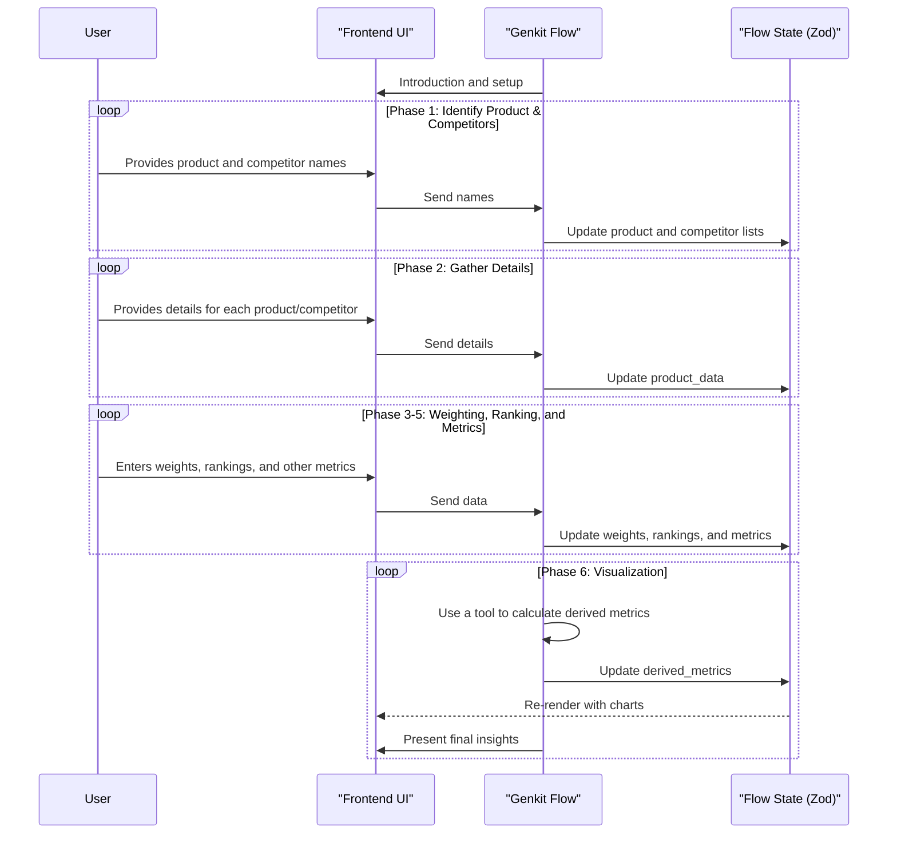

# Genkit Flow: Interactive Competitive Analysis

**Goal:** To guide users through identifying key competitors, understanding their strengths and weaknesses, and uncovering market opportunities and threats, using a stateful Genkit flow.

## I. Zod Schema for Flow State

The entire state of the competitive analysis workflow is managed within a single object, defined by the following Zod schema:

```javascript
import { z } from 'zod';

const ProductDetailsSchema = z.object({
  id: z.string(),
  name: z.string(),
  is_our_product: z.boolean(),
  website_url: z.string().url().optional(),
  company_overview: z.string().optional(),
  target_market: z.string().optional(),
  products_services_summary: z.string().optional(),
  estimated_market_share_initial: z.number().nullable(),
  estimated_pricing_category: z.enum(["high", "medium", "low", "custom"]),
  key_differentiators: z.string().optional(),
  perceived_threats_to_us: z.string().optional(),
  perceived_opportunities_for_us: z.string().optional(),
});

const EvaluationCriterionSchema = z.object({
  id: z.string(),
  name: z.string(),
  category: z.string(),
  definition: z.string(),
});

const CompetitiveAnalysisStateSchema = z.object({
  our_product_details: z.object({ name: z.string() }),
  competitors: z.array(z.object({ id: z.string(), name: z.string() })),
  products_data: z.array(ProductDetailsSchema),
  evaluation_criteria: z.array(EvaluationCriterionSchema),
  criteria_weights: z.record(z.number()),
  product_rankings_by_criterion: z.array(z.object({
    product_id: z.string(),
    criterion_rankings: z.record(z.number().nullable()),
  })),
  final_product_metrics: z.array(z.object({
    product_id: z.string(),
    value_proposition_score: z.number().nullable(),
    relative_pricing_score: z.number().nullable(),
    market_share_final_percentage: z.number().nullable(),
  })),
  derived_metrics: z.object({
    weighted_scores_per_product: z.array(z.object({
      product_id: z.string(),
      overall_weighted_score: z.number(),
    })),
    price_value_coordinates: z.array(z.object({
      product_id: z.string(),
      price_score: z.number(),
      value_score: z.number(),
    })),
  }),
  ai_summary_insights: z.string().optional(),
  status: z.enum(['in_progress', 'completed']).default('in_progress'),
  last_updated_at: z.string().datetime(),
});
```

## II. Phased Breakdown

### Phase 1: Identifying "Our Product" and Key Competitors

**A. Genkit Flow Logic (Left Panel):**
1.  **Introduction:** The flow starts with a greeting and confirms the user's product name, defaulting to the `onboarding_company_name`.
2.  **Competitor Identification:** The flow asks the user to list their main competitors. It can also suggest competitors based on the user's industry, which would be implemented as a Genkit `tool` that calls an external search API.

**B. Frontend UI (Right Panel):**
-   A card titled "Setup: Your Product & Competitors."
-   An input field for "Our Product/Service Name," pre-filled and editable.
-   A table to display the list of identified competitors, with an "Add" and "Remove" functionality.

### Phase 2: Detailed Information Gathering

**A. Genkit Flow Logic (Left Panel):**
1.  The flow iterates through the user's product and each competitor.
2.  For each, it prompts for details like website URL, target market, etc.
3.  If a URL is provided for a competitor, the flow can use a `tool` to scrape the website for publicly available information and pre-fill the fields, asking the user to review and confirm.

**B. Frontend UI (Right Panel):**
-   A card that dynamically updates to show the details form for the current product or competitor being discussed.
-   The form contains input fields for all the properties defined in the `ProductDetailsSchema`.

### Phase 3: Defining Weighting Criteria

**A. Genkit Flow Logic (Left Panel):**
1.  The flow explains that the user needs to assign percentage weights to the evaluation criteria (e.g., Service, Quality, Price), ensuring the total sums to 100%.
2.  It iterates through the standard criteria, asking the user for a weight for each and keeping a running total.

**B. Frontend UI (Right Panel):**
-   A card titled "Weight Evaluation Criteria."
-   A table listing the criteria, their definitions, and input fields for the weights.
-   A display for the total weight, which updates in real-time.

### Phase 4 & 5: Ranking and Metrics

This follows the logic from the original specification, with the Genkit flow guiding the user through the ranking tables and the frontend UI providing the interactive tables for data entry.

### Phase 6 & 7: Visualization and Conclusion

The Genkit flow will use a `tool` to perform the final calculations on the collected data (e.g., weighted scores, price/value coordinates). It will then present a summary of these insights to the user. The frontend will display the final radar and scatter plot charts.

## III. Genkit Implementation Notes

-   **Stateful Flow**: This entire workflow is a single, stateful Genkit `flow`, with the state managed by the `CompetitiveAnalysisStateSchema`.
-   **Tools for Data & Calculation**:
    -   A `tool` should be created to suggest competitors (e.g., by calling a search API).
    -   Another `tool` should be used for web scraping competitor websites.
    -   A third `tool` should perform the final calculations for the "derived_metrics."
-   **Frontend Integration**: The frontend will interact with the Genkit flow by sending user inputs and receiving the updated state to re-render the UI.
-   **Observability**: Genkit's tracing will be essential for debugging the complex, multi-step logic and the interactions with the various tools.

## IV. Workflow Sequence Diagram


## V. Cross-Cutting Concerns

This section remains critical. Key considerations include:
-   **Accessibility**: All UI components, especially the interactive tables and charts, must be fully accessible.
-   **Performance**: Asynchronous tool calls (for scraping and search) should not block the UI.
-   **Security**: All external API calls must be handled securely on the backend within the Genkit tools.
-   **Error Handling**: The Genkit flow should gracefully handle errors from tools (e.g., if a website can't be scraped).
