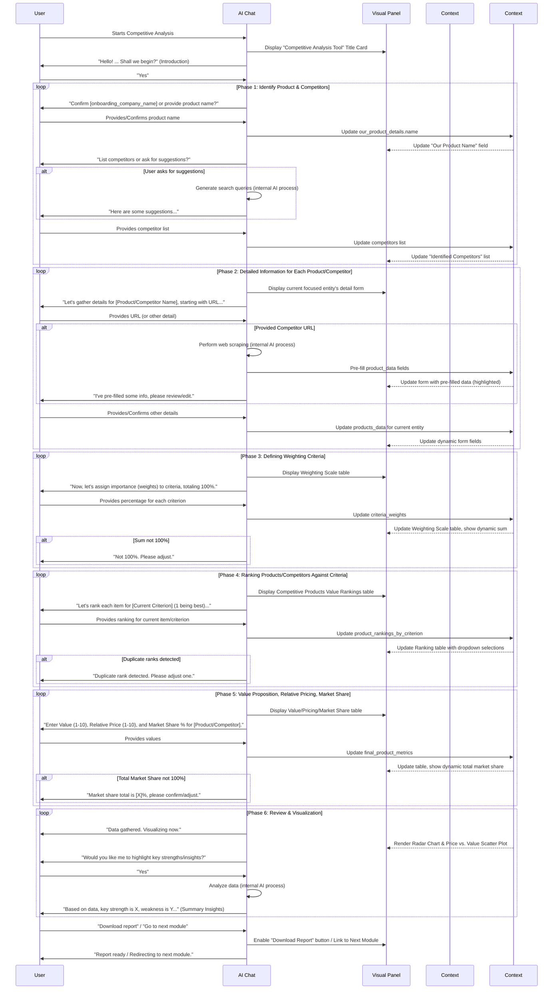

# Specification for Interactive Competitive Analysis Workflow

**Goal:** To guide users through identifying key competitors, understanding their strengths and weaknesses relative to the user's own product/service, and uncovering market opportunities and threats. This is achieved via an interactive, chat-driven experience within a split-panel UI, leveraging AI assistance, and aligning with the `chat-driven-workflow-pattern.md`.

## I. Core Principles & Context

*   **User-Centricity & Efficiency:** Minimize redundant input by pre-filling known information (e.g., `onboarding_company_name`) and offering AI assistance for competitor identification and data gathering. Provide clear feedback and easy correction mechanisms.
*   **Split-Panel UI:** Left panel for AI chat, Right panel for dynamic visual components (forms, tables, charts), as per the `chat-driven-workflow-pattern.md`.
*   **Phased Progression:** Structure the complex analysis into logical, manageable phases, embodying the Progressive Disclosure pattern.
*   **Bidirectional Data Flow:** Ensure real-time synchronization between chat inputs and visual component displays.
*   **AI as Guide & Facilitator:** AI provides contextual explanations, intelligent prompts, error handling, data validation, calculations for derived metrics, and generates summary insights.
*   **Enhanced UX:** Include visual progress indicators, immediate validation feedback, and clear navigation.

**Pre-existing Onboarding Information Context:**
*   `onboarding_company_name: string` (Used for personalization and as the default for "Our Product")
*   `onboarding_industry_type: string` (Optional, used by AI to suggest potential competitors or relevant analysis criteria)

## II. Overall Data Structure & `WorkflowDataContext`

The workflow's state is managed within a central `WorkflowDataContext.competitive_analysis` object.

```json
{
  "competitive_analysis": {
    "workflow_step_name": "Competitive Analysis Tool",
    "our_product_details": {
      "name": "string", 
      "source": "onboarding" | "user_chat" | "user_ui"
    },
    "competitors": [ 
      { "id": "string", "name": "string" } 
    ],
    "products_data": [ 
      {
        "id": "string", 
        "name": "string", 
        "is_our_product": "boolean",
        "website_url": "string",
        "company_overview": "string", 
        "target_market": "string",
        "products_services_summary": "string", 
        "estimated_market_share_initial": "number | null", 
        "estimated_pricing_category": "high" | "medium" | "low" | "custom" | "string", 
        "key_differentiators": "string", 
        "perceived_threats_to_us": "string", 
        "perceived_opportunities_for_us": "string" 
      }
    ],
    "evaluation_criteria": [ 
      { "id": "service", "name": "Service", "category": "Customer Facing", "definition": "The quality, responsiveness, and effectiveness of customer service and support provided." },
      { "id": "warranty", "name": "Warranty", "category": "Product", "definition": "The terms and duration of the guarantee offered." },
      { "id": "delivery", "name": "Delivery", "category": "Operations", "definition": "The speed, reliability, and efficiency of product/service delivery." },
      { "id": "payment_options", "name": "Payment Options", "category": "Commercial", "definition": "The flexibility and variety of payment methods and terms." },
      { "id": "functionality", "name": "Functionality", "category": "Product", "definition": "The range, depth, and effectiveness of core features." },
      { "id": "support", "name": "Support", "category": "Customer Facing", "definition": "The availability and quality of technical assistance and resources." },
      { "id": "quality", "name": "Quality", "category": "Product", "definition": "The overall standard of materials, performance, and reliability." },
      { "id": "reliability", "name": "Reliability", "category": "Product", "definition": "The consistency and dependability of the product/service." },
      { "id": "ease_of_use", "name": "Ease of Use", "category": "Product", "definition": "The intuitiveness and simplicity of interacting with the product/service." }
    ],
    "criteria_weights": { 
      "service": 0, 
      "warranty": 0,
      "delivery": 0,
      "payment_options": 0,
      "functionality": 0,
      "support": 0,
      "quality": 0,
      "reliability": 0,
      "ease_of_use": 0
    },
    "product_rankings_by_criterion": [ 
      {
        "product_id": "string", 
        "criterion_rankings": { 
          "service": null, 
          "quality": null
        }
      }
    ],
    "final_product_metrics": [ 
      {
        "product_id": "string", 
        "value_proposition_score": null, 
        "relative_pricing_score": null, 
        "market_share_final_percentage": null 
      }
    ],
    "derived_metrics": { 
      "weighted_scores_per_product": [
        { "product_id": "string", "overall_weighted_score": 0 }
      ],
      "price_value_coordinates": [
        { "product_id": "string", "price_score": 0, "value_score": 0 }
      ]
    },
    "ai_summary_insights": "string", 
    "status": "in_progress" | "completed",
    "last_updated_at": "string" 
  }
}
```

## III. `shadcn/ui` Component Mapping

| Descriptive Element                      | `shadcn/ui` Component (Tentative) | Notes                                                                 |
|------------------------------------------|-----------------------------------|-----------------------------------------------------------------------|
| Main Layout (Left Chat, Right Visual)    | `ResizablePanelGroup`, `ResizablePanel`, `ResizableHandle` | Standard split-panel.                                                 |
| Initial Title Card                       | `Card`, `CardHeader`, `CardTitle`, `CardDescription` | Overview display.                                                   |
| "Our Product Name" input                 | `Input` with `Label`              | Pre-filled, editable.                                                 |
| "Identified Competitors" list/table      | `Table` or custom list with `Button` for remove | Display, add, remove functionality.                                   |
| Dynamic Form for Product/Competitor Details | `Card` (for grouping), `Input`, `Textarea`, `Select` | Dynamically updates based on active entity.                           |
| Weighting Scale table                    | `Table`, `Input type="number"`    | Dynamic "Total" calculation.                                          |
| Ranking Matrix                           | `Table` with `Select` in cells    | For rank selection 1-N.                                               |
| Value Prop, Pricing, Market Share table  | `Table`, `Input type="number"`    | Numerical/percentage inputs.                                          |
| Radar Chart                              | Custom component using Recharts/`shadcn/ui/chart` | Interactive, product selection.                                       |
| Price vs. Value Scatter Plot             | Custom component using Recharts/`shadcn/ui/chart` |                                                                       |
| Buttons (Navigation, Actions)            | `Button`                          | "Start", "Next", "Add", "Remove", "Download Report".                  |
| AI Chat Area                             | `Textarea`, `Button`              | For user input and sending messages.                                  |
| Loader/Spinner                           | `Loader2` (lucide-react)          | Visual feedback for AI processing.                                    |

## IV. Phased Breakdown

### Phase 1: Identifying "Our Product" and Key Competitors

**A. AI Chat (Left Panel):**
1.  **Introduction & Purpose:** AI: "Hello! Let's start your Competitive Analysis for [onboarding_company_name]..."
2.  **Confirm "Our Product":**
    *   AI: "First, is '[onboarding_company_name]' the product/service we're analyzing, or is there a specific product name?"
    *   User confirms or provides name. Stored in `our_product_details`.
    *   Error Handling: If empty, AI: "Please specify your product/service name."
3.  **Identify Competitors:**
    *   AI: "Now, list your main competitors. If unsure, I can suggest some based on your industry: [onboarding_industry_type]."
    *   User lists competitors.
    *   AI Suggestion (if requested): AI performs mock search and presents suggestions. User confirms/adds.
    *   Error Handling: If ambiguous competitor name, AI: "Could you clarify '[ambiguous name]'?"
    *   Stored in `competitors` list (each with a generated `id`).

**B. Visual Components (Right Panel):**
*   `<Card>`: "Setup: Your Product & Competitors"
    *   `<Input id="ourProductName" label="Our Product/Service Name"` value linked to `our_product_details.name`.
    *   `<Table>` for "Identified Competitors": Columns for Name, Actions (`<Button variant="ghost" size="icon">Remove</Button>`).
    *   `<Input id="newCompetitorName" placeholder="Add competitor..." />` <Button onClick={handleAddCompetitor}>Add</Button>

**C. `tsx` Example: `IdentifiedCompetitorsPanel` (Conceptual Refined)**
```tsx
import { useState } from 'react';
import { Input } from '@/components/ui/input';
import { Button } from '@/components/ui/button';
import { Label } from '@/components/ui/label';
import { Table, TableBody, TableCell, TableHead, TableHeader, TableRow } from '@/components/ui/table';
import { Trash2 } from 'lucide-react';

interface Competitor { id: string; name: string; }
interface IdentifiedCompetitorsPanelProps {
  ourProductName: string;
  onOurProductNameChange: (newName: string) => void;
  competitors: Competitor[];
  onAddCompetitor: (competitorName: string) => void;
  onRemoveCompetitor: (competitorId: string) => void;
}

export function IdentifiedCompetitorsPanel({
  ourProductName, onOurProductNameChange, competitors, onAddCompetitor, onRemoveCompetitor,
}: IdentifiedCompetitorsPanelProps) {
  const [newCompetitorNameInput, setNewCompetitorNameInput] = useState('');

  const handleAddClick = () => {
    if (newCompetitorNameInput.trim()) {
      onAddCompetitor(newCompetitorNameInput.trim());
      setNewCompetitorNameInput('');
    }
  };

  return (
    <div className="space-y-4">
      <div>
        <Label htmlFor="our-product-name-input">Our Product/Service Name</Label>
        <Input id="our-product-name-input" value={ourProductName} onChange={(e) => onOurProductNameChange(e.target.value)} />
      </div>
      <div>
        <h3 className="text-lg font-medium mb-2">Identified Competitors</h3>
        <Table>
          <TableHeader><TableRow><TableHead>Name</TableHead><TableHead className="text-right">Actions</TableHead></TableRow></TableHeader>
          <TableBody>
            {competitors.map((comp) => (
              <TableRow key={comp.id}>
                <TableCell>{comp.name}</TableCell>
                <TableCell className="text-right">
                  <Button variant="ghost" size="icon" onClick={() => onRemoveCompetitor(comp.id)}>
                    <Trash2 className="h-4 w-4" />
                  </Button>
                </TableCell>
              </TableRow>
            ))}
            {competitors.length === 0 && <TableRow><TableCell colSpan={2} className="text-center text-muted-foreground">No competitors added yet.</TableCell></TableRow>}
          </TableBody>
        </Table>
        <div className="flex mt-2 space-x-2">
          <Input placeholder="New competitor name..." value={newCompetitorNameInput} onChange={(e) => setNewCompetitorNameInput(e.target.value)} 
                 onKeyPress={(e) => { if (e.key === 'Enter') handleAddClick(); }}/>
          <Button onClick={handleAddClick}>Add Competitor</Button>
        </div>
      </div>
    </div>
  );
}
```

### Phase 2: Detailed Information for "Our Product" and Each Competitor

**A. AI Chat (Left Panel):**
1.  **Iterate through "Our Product" then each Competitor:**
    *   AI: "Let's gather details for '[Product/Competitor Name]'. What's their website URL?"
    *   If Competitor URL provided, AI: "Thanks. I can try to fetch some public info. While I do that, can you tell me about their Target Market?" (AI performs mock scrape).
    *   AI (if scrape successful): "I've pre-filled some details like Company Overview and Products/Services based on their website. Please review and adjust on the right."
    *   AI (if scrape fails/no URL): "Okay, please provide a brief Company Overview for [Name]."
    *   AI prompts for each field in `products_data`.
    *   Error Handling: For `estimated_market_share_initial`, if non-numeric, AI: "Please provide a number for market share."

**B. Visual Components (Right Panel):**
*   `<Card>`: "Details for: [Current Product/Competitor Name]"
    *   Form with labeled `<Input>`/`<Textarea>`/`<Select>` for each field in `products_data`.
    *   Fields pre-filled by AI scrape are highlighted.

**C. `tsx` Example: `DetailInputRow` (Conceptual)**
```tsx
import { Input } from '@/components/ui/input';
import { Textarea } from '@/components/ui/textarea';
import { Label } from '@/components/ui/label';
import { Select, SelectContent, SelectItem, SelectTrigger, SelectValue } from '@/components/ui/select';


interface DetailInputRowProps {
  fieldId: string;
  label: string;
  value: string | number;
  fieldType?: 'text' | 'textarea' | 'number' | 'select';
  options?: Array<{value: string, label: string}>;
  onChange: (fieldId: string, newValue: string | number) => void;
  placeholder?: string;
  isHighlighted?: boolean; 
}
export function DetailInputRow({ fieldId, label, value, fieldType = 'text', options, onChange, placeholder, isHighlighted }: DetailInputRowProps) {
  const commonClass = isHighlighted ? "border-blue-500" : "";
  return (
    <div className="space-y-1 mb-3">
      <Label htmlFor={fieldId}>{label}</Label>
      {fieldType === 'textarea' ? (
        <Textarea id={fieldId} value={value as string} onChange={(e) => onChange(fieldId, e.target.value)} placeholder={placeholder} rows={3} className={commonClass}/>
      ) : fieldType === 'number' ? (
         <Input id={fieldId} type="number" value={value as number} onChange={(e) => onChange(fieldId, parseFloat(e.target.value))} placeholder={placeholder} className={commonClass} />
      ) : fieldType === 'select' && options ? (
        <Select value={value as string} onValueChange={(val) => onChange(fieldId, val)}>
          <SelectTrigger id={fieldId} className={commonClass}><SelectValue placeholder={placeholder} /></SelectTrigger>
          <SelectContent>
            {options.map(opt => <SelectItem key={opt.value} value={opt.value}>{opt.label}</SelectItem>)}
          </SelectContent>
        </Select>
      ) : (
        <Input id={fieldId} type="text" value={value as string} onChange={(e) => onChange(fieldId, e.target.value)} placeholder={placeholder} className={commonClass} />
      )}
    </div>
  );
}
```

### Phase 3: Defining Weighting Criteria

**A. AI Chat (Left Panel):**
1.  **Introduction & Explanation:** AI: "Now, let's define what matters in your market by assigning weights to evaluation criteria (e.g., Service, Quality, Price). Total must be 100%." (Refers to Appendix A for definitions).
2.  **Iterate through Standard Criteria (from Appendix A):**
    *   AI: "For '[Criterion Name]' ([Criterion Definition from Appendix]), what percentage importance (0-100) would you give it?"
    *   User provides weight. Stored in `criteria_weights`.
    *   AI keeps running total: "Okay, [Weight]% for [Criterion]. Current total is [Sum]%."
3.  **Validation:** If sum != 100%, AI: "Total is [Sum]%. Please adjust weights to sum to 100%."

**B. Visual Components (Right Panel):**
*   `<Card>`: "Weight Evaluation Criteria"
    *   `<Table>`: Columns: Criterion, Definition (Tooltip?), Weight (%). Rows for each criterion from Appendix A.
    *   `<Input type="number">` for weight. Dynamic "Total Weight: [Sum]%" display (red if not 100).

**C. `tsx` Example: `WeightingCriterionRow` (Conceptual)**
```tsx
import { TableCell, TableRow } from '@/components/ui/table';
import { Input } from '@/components/ui/input';
import { Label } from '@/components/ui/label';
import { Tooltip, TooltipProvider, TooltipTrigger, TooltipContent } from '@/components/ui/tooltip';
import { Button } from '@/components/ui/button';


interface Criterion { id: string; name: string; definition: string; category: string; }
interface WeightingCriterionRowProps {
  criterion: Criterion;
  currentWeight: number;
  onWeightChange: (criterionId: string, newWeight: number) => void;
}
export function WeightingCriterionRow({ criterion, currentWeight, onWeightChange }: WeightingCriterionRowProps) {
  return (
    <TableRow>
      <TableCell>
        <TooltipProvider>
          <Tooltip>
            <TooltipTrigger asChild><Button variant="link" className="p-0 h-auto text-left"><Label htmlFor={`weight-${criterion.id}`}>{criterion.name}</Label></Button></TooltipTrigger>
            <TooltipContent><p className="max-w-xs">{criterion.definition}</p></TooltipContent>
          </Tooltip>
        </TooltipProvider>
      </TableCell>
      <TableCell>{criterion.category}</TableCell>
      <TableCell>
        <Input 
          id={`weight-${criterion.id}`} 
          type="number" 
          value={currentWeight} 
          onChange={(e) => onWeightChange(criterion.id, parseInt(e.target.value) || 0)} 
          min="0" max="100" 
          className="w-20"
        /> %
      </TableCell>
    </TableRow>
  );
}
```

### Phase 4: Ranking Products/Competitors Against Criteria
(Logic as previously described, using criteria from `evaluation_criteria` and product list from `products_data`)

### Phase 5: Value Proposition, Relative Pricing, and Market Share
(Logic as previously described)

### Phase 6: Review and Visualization
(Logic as previously described)

### Phase 7: Concluding the Workflow
(Logic as previously described)


## V. Integration Patterns
(Standard section with `ResizablePanelGroup` `tsx` example and notes on `WorkflowDataContext` for bidirectional updates, similar to other refined documents.)
```tsx
import { ResizablePanelGroup, ResizablePanel, ResizableHandle } from "@/components/ui/resizable";

export function CompetitiveAnalysisWorkflowPage() {
  // Main state (WorkflowDataContext.competitive_analysis) and handlers
  return (
    <ResizablePanelGroup direction="horizontal" className="h-full max-h-[calc(100vh-theme(spacing.16))]">
      <ResizablePanel defaultSize={40} minSize={30} maxSize={50}>
        <div className="h-full p-4"> {/* Chat Interface */} </div>
      </ResizablePanel>
      <ResizableHandle withHandle />
      <ResizablePanel defaultSize={60}>
        <div className="h-full overflow-auto p-6"> {/* Visual Components */} </div>
      </ResizablePanel>
    </ResizablePanelGroup>
  );
}
```

## VI. Workflow Sequence Diagram (Mermaid)
(The existing diagram from the previous version of this document is a good base and can be retained, ensuring it reflects any nuanced flow changes from these refinements.)


## VII. Cross-Cutting Concerns
(The existing section from the previous version covering Accessibility, Performance, Security, i18n, Error Handling is excellent and should be retained.)
*   **Accessibility (a11y):** Standard keyboard navigation, ARIA attributes for custom components (especially for interactive tables and charts), and sufficient color contrast will be ensured. All input fields will have proper labels.
*   **Performance:** Data pre-fill via web scraping and API calls will be asynchronous and non-blocking to the UI. Real-time chart updates will be optimized for smooth rendering.
*   **Security:** External API calls handled server-side. User data handled securely. Inputs sanitized.
*   **Internationalization & Localization (i18n/l10n):** UI text and prompts managed for future localization.
*   **Error Handling:** Clear, actionable error messages. Graceful backend error handling. Persistent storage to prevent data loss.

## Appendix A: Standard Evaluation Criteria Definitions

These are the standard criteria used for weighting (Phase 3) and ranking (Phase 4). The AI will refer to these definitions when guiding the user.

*   **`service` (Service):** Category: Customer Facing. Definition: The quality, responsiveness, and effectiveness of customer service and support provided before, during, and after purchase.
*   **`warranty` (Warranty):** Category: Product. Definition: The terms and duration of the guarantee offered with the product or service, covering defects or performance issues.
*   **`delivery` (Delivery):** Category: Operations. Definition: The speed, reliability, and efficiency of product/service delivery or fulfillment.
*   **`payment_options` (Payment Options):** Category: Commercial. Definition: The flexibility and variety of payment methods and terms offered to customers.
*   **`functionality` (Functionality):** Category: Product. Definition: The range, depth, and effectiveness of the core features and capabilities of the product/service.
*   **`support` (Support):** Category: Customer Facing. Definition: The availability and quality of technical assistance, documentation, and resources for users.
*   **`quality` (Quality):** Category: Product. Definition: The overall standard of materials, craftsmanship, performance, and reliability of the product/service.
*   **`reliability` (Reliability):** Category: Product. Definition: The consistency and dependability of the product/service to perform as expected without failure.
*   **`ease_of_use` (Ease of Use):** Category: Product. Definition: The intuitiveness and simplicity of interacting with and utilizing the product/service.
*   **`brand_reputation` (Brand Reputation):** Category: Market Perception. Definition: The overall perception, recognition, and trust associated with the brand in the market.
*   **`price_competitiveness` (Price Competitiveness):** Category: Commercial. Definition: How the product/service's pricing compares to direct competitors for similar value.
*   **`innovation_leadership` (Innovation Leadership):** Category: Product. Definition: The extent to which the product/service is seen as a leader in introducing new technologies, features, or solutions.

This refined specification provides a comprehensive guide for developing the Interactive Competitive Analysis Tool.