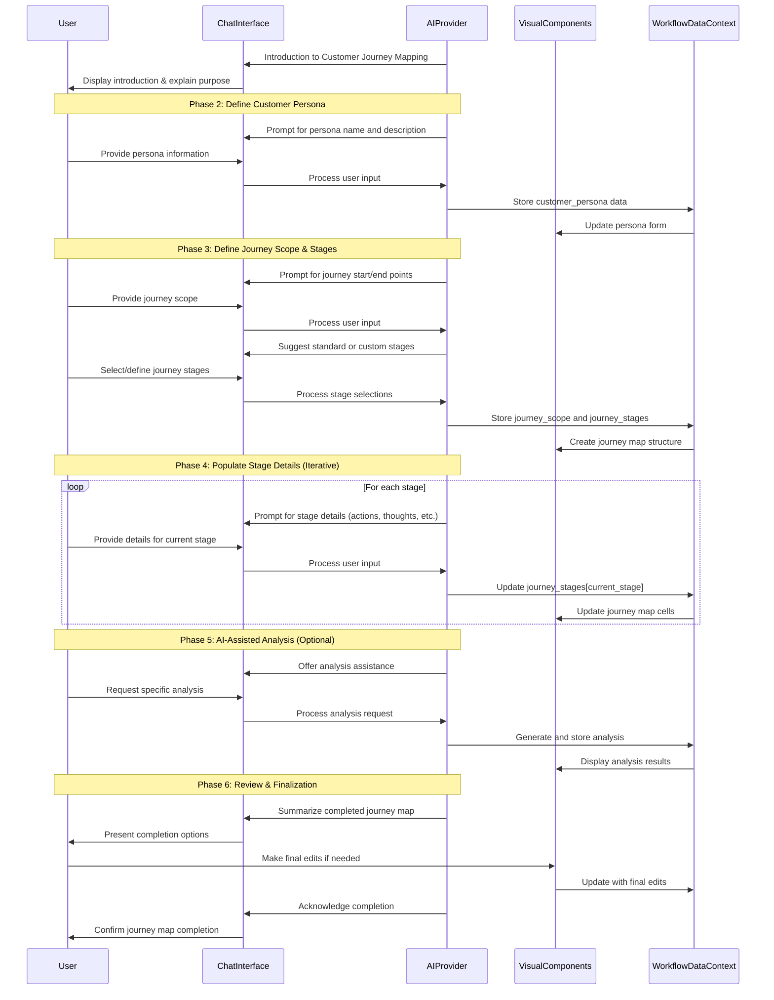

# Customer Journey Mapping Workflow

## 1. Overview & Purpose

This AI-powered conversational tool guides users through creating a comprehensive Customer Journey Map. It helps marketing teams and customer experience professionals visualize and analyze the complete customer experience across all touchpoints, from initial awareness to becoming an advocate. The process identifies key interactions, customer thoughts and feelings, pain points, and opportunities for improvement across each stage of the journey.

## 2. Target User & Context

**User:** Marketing managers, customer experience professionals, product managers, and UX designers responsible for improving customer interactions with products or services.

**Context:** This workflow complements other marketing strategy components like brand assessment and competitor analysis. It forms a critical foundation for identifying opportunities to enhance customer satisfaction, streamline processes, and drive business growth through improved customer experiences.

## 3. Core Conversational Flow

### General Principle
As the AI guides the user through defining the customer journey stages and details, the right visual panel will dynamically display this information in an organized, visual journey map format. This follows the **Visual Augmentation** and **Bidirectional Updates** principles from the Chat-Driven Workflow Pattern.

### Phase 1: Introduction to Customer Journey Mapping

**AI Initiative (Left Panel - Chat):**
"Hello! I'm here to help you create a comprehensive Customer Journey Map. This vital tool will allow us to visualize and analyze your customers' experiences with your products or services, from their very first interaction to becoming an advocate. We'll identify key touchpoints, understand their thoughts and feelings, pinpoint pain points, and uncover opportunities for improvement."

"By mapping out your customer's journey, we can enhance customer satisfaction, streamline internal processes, and ultimately drive growth for your business."

"Ready to begin mapping your customer's journey for [onboarding_company_name]?" (If onboarding_company_name is available, confirm its use; otherwise, prompt for it).

**Visual Component (Right Panel):**
Initial State: A title card "Customer Journey Mapping" with a brief, visually appealing overview of what a Customer Journey Map is and its benefits. It could also display the onboarding_company_name if available, indicating the scope.

### Phase 2: Defining the Customer Persona

**AI Chat Guidance & Data Collection (Left Panel):**
"To create a relevant journey map, we first need to understand who our customer is. This involves defining a primary customer persona for this specific journey."

"What is the name of the primary customer persona we'll be focusing on for this journey map? For example, 'New SaaS Customer' or 'Existing Enterprise Client'."

"Great. Can you provide a brief description of this persona? Consider their demographics, needs, goals, and any relevant pain points they might have before interacting with your company."

**Visual Components (Right Panel):**
- A simple form with two text input fields:
  - Persona Name: Text input
  - Persona Description: Multi-line text area

**Data Captured in this Phase:**
```typescript
customer_persona: {
  name: string,  // e.g., "New SaaS Customer"
  description: string  // e.g., "Small business owner looking for affordable software solutions..."
}
```

### Phase 3: Defining the Journey Scope and Stages

**AI Chat Guidance & Data Collection (Left Panel):**
"Now, let's define the scope of the journey we're mapping. What is the starting point and the desired end point of this specific customer journey?"

"What's the initial trigger or start point of this journey for our [customer_persona_name] persona (e.g., 'First Awareness of Problem', 'Website Visit')?" 

"And what's the desired end point (e.g., 'Repeat Purchase', 'Loyal Advocate', 'Successful Onboarding')?"

"Many customer journeys follow common stages like Discovery, Initial Engagement, Purchase/Onboarding, Usage/Retention, and Advocacy/Growth. Would you like to use these standard stages as a starting point, or do you have a different sequence in mind?"

If 'Yes': "Excellent! We'll pre-populate your map with these stages. You can customize them later if needed."

If 'No' or 'Customize': "No problem. Let's define your custom stages. Please list them, separated by commas (e.g., 'Research, Comparison, Decision, Post-Purchase')."

**Visual Components (Right Panel):**
- Journey Start Point: Text input
- Journey End Point: Text input
- Journey Stages Header: A row of editable text fields labeled "Stage 1", "Stage 2", etc., mirroring the columns of the future map. Initially empty, or pre-populated with standard stages.

**Data Captured in this Phase:**
```typescript
journey_scope: {
  start_point: string,  // e.g., "First Awareness of Problem"
  end_point: string  // e.g., "Loyal Advocate"
},
journey_stages: string[]  // e.g., ["Discovery", "Initial Engagement", "Purchase", "Usage", "Advocacy"]
```

### Phase 4: Populating Each Journey Stage Detail

**AI Chat Guidance & Data Collection (Left Panel):**
"Alright, let's dive into the details for each stage. We'll start with the [Current Stage Name] stage."

For each Current Stage Name (e.g., "Discovery"):

1. Customer Actions:
   "For the [Current Stage Name] stage, what are the primary actions the [customer_persona_name] persona takes?"
   "Think about what they physically do – e.g., 'Searches online for solutions', 'Visits product page', 'Downloads a whitepaper'."

2. Customer Thoughts:
   "While in the [Current Stage Name] stage, what might the [customer_persona_name] be thinking?"
   "What questions are in their mind? What assumptions might they be making? E.g., 'Is this product right for me?', 'Can I trust this company?'"

3. Customer Feelings:
   "How does the [customer_persona_name] typically feel during the [Current Stage Name] stage? Please describe their emotions or use simple terms like 'Excited', 'Frustrated', 'Optimistic', 'Confused'."

4. Pain Points / Opportunities:
   "Based on their actions, thoughts, and feelings in the [Current Stage Name] stage, what are the main pain points the [customer_persona_name] encounters? And what opportunities exist to improve their experience?"
   "Look for friction points, unmet needs, or areas where you can delight them. E.g., 'Website navigation is confusing', 'Lack of clear pricing information', 'Opportunity to offer live chat support'."

5. Internal Teams Responsible:
   "Which internal teams or individuals are primarily responsible for the [Current Stage Name] stage of the customer journey? From your onboarding, I have these team members: [List up to 3 names from onboarding_team_members or categories like 'Marketing', 'Sales']. Are any of these relevant, or would you like to add others, perhaps by team name or specific roles?"

6. Metrics:
   "What key metrics or KPIs are used to measure success or monitor performance in the [Current Stage Name] stage?"
   "For example, 'Website traffic', 'Bounce rate', 'Lead conversion rate', 'Demo requests'."

7. Technology/Tools:
   "What technologies or tools are currently involved in the customer's experience within the [Current Stage Name] stage?"
   "e.g., 'CRM', 'Marketing Automation Platform', 'Website Analytics', 'Help Desk Software'."

8. Future State / Improvements:
   "Finally, looking ahead, what improvements or a desired future state do you envision for the [Current Stage Name] stage? What changes would make this stage ideal for the [customer_persona_name]?"

After completing one stage, the AI will confirm and then ask: "Great! We've completed the details for [Previous Stage Name]. Shall we move on to the next stage, [Next Stage Name]?"

**Visual Components (Right Panel):**
- A dynamic grid/table representing the Customer Journey Map:
  - Columns: Each journey_stage will be a column header
  - Rows: Each data category (Customer Actions, Thoughts, Feelings, Pain Points/Opportunities, Internal Teams Responsible, Metrics, Technology/Tools, Future State/Improvements) will be a row header
  - Cells: Within each cell ([stage name] x [category name]), there will be an editable text area or multi-select dropdown as appropriate

**Data Captured in this Phase:**
```typescript
journey_stages: Array<{
  name: string,  // e.g., "Discovery"
  customer_actions: string[],
  customer_thoughts: string[],
  customer_feelings: string[],
  pain_points_opportunities: string[],
  internal_teams_responsible: string[],  // potentially pre-populated from onboarding_team_members
  metrics: string[],
  technology_tools: string[],
  future_state_improvements: string
}>
```

### Phase 5: AI-Assisted Analysis (Optional)

**AI Chat Guidance & Data Collection (Left Panel):**
"We've gathered a lot of great information for your Customer Journey Map. Would you like me to help you summarize the key pain points identified across all stages, or perhaps brainstorm some initial solutions for a specific stage?"

Specific Prompts:
- If summarize pain points: "Okay, generating a summary of pain points..."
- If brainstorm solutions: "Which stage's pain points would you like to brainstorm solutions for?" (AI lists stages). "What specific pain point are you focusing on?"

**Visual Components (Right Panel):**
- A rich text editor displaying the AI-generated summary or brainstormed ideas. Users can then edit or refine this content.

**Data Captured in this Phase:**
```typescript
ai_generated_summaries: {
  pain_point_summary?: string,
  solution_ideas_per_stage?: {
    [stage_name: string]: string[]
  },
  executive_summary?: string
}
```

### Phase 6: Review & Finalization

**AI Chat Guidance & Data Collection (Left Panel):**
"Congratulations! You've successfully completed your Customer Journey Map for [onboarding_company_name] focusing on the [customer_persona_name] persona from [journey_start_point] to [journey_end_point]."

"Your map provides a detailed view of the customer experience, highlighting key moments, emotions, and critical areas for improvement. I recommend reviewing the entire map to ensure accuracy and readiness for implementation. What would you like to do next? You can:
- Review and make final edits
- Export the map
- Share it with your team
- Move on to the next strategic module (e.g., 'Solution Ideation' or 'Implementation Planning')"

"Please let me know your next step, or if you have any questions."

**Visual Components (Right Panel):**
- The entire Customer Journey Map grid is now fully populated, serving as a live, interactive summary
- All fields are editable, allowing for easy review and refinement
- Action Buttons: "Export Map", "Share Map", and "Next Module"

## 4. Visual Components

### shadcn/ui Component Mapping

| UI Element | shadcn/ui Component | Usage |
|------------|---------------------|-------|
| Main Container | `<ResizablePanelGroup>` | Split-panel layout for chat and visual components |
| Journey Map Table | `<Table>` with related components | Main display for the journey map data |
| Journey Stage Headers | `<TableHead>` | Column headers for each journey stage |
| Category Row Headers | `<TableRow>` | Row headers for each data category |
| Cell Content | `<Textarea>` or custom editable cells | For modifying journey map details |
| Persona Form | `<Card>`, `<Input>`, `<Textarea>` | Capturing customer persona details |
| Stage Selector | `<Select>` or `<RadioGroup>` | Selecting or navigating between stages |
| Action Buttons | `<Button>` with variants | Export, share, and navigation options |
| Pain Point Summary | `<Card>` with `<CardContent>` | Display AI-generated summaries |
| Solution Ideas | `<Accordion>` with `<AccordionItem>` | Organize ideas by journey stage |

### Example Journey Map Component (Conceptual)

```tsx
import { useState } from 'react';
import { Table, TableHeader, TableBody, TableRow, TableHead, TableCell } from "@/components/ui/table";
import { Textarea } from "@/components/ui/textarea";
import { Card, CardHeader, CardTitle, CardContent } from "@/components/ui/card";
import { Button } from "@/components/ui/button";

interface JourneyStage {
  name: string;
  customer_actions: string[];
  customer_thoughts: string[];
  customer_feelings: string[];
  pain_points_opportunities: string[];
  internal_teams_responsible: string[];
  metrics: string[];
  technology_tools: string[];
  future_state_improvements: string;
}

interface JourneyMapProps {
  companyName: string;
  persona: {
    name: string;
    description: string;
  };
  journeyScope: {
    start_point: string;
    end_point: string;
  };
  stages: JourneyStage[];
  onUpdate: (stages: JourneyStage[]) => void;
}

export function CustomerJourneyMap({ 
  companyName,
  persona,
  journeyScope,
  stages,
  onUpdate
}: JourneyMapProps) {
  
  // Function to update a specific cell in the journey map
  const handleCellUpdate = (stageIndex: number, category: keyof JourneyStage, value: string | string[]) => {
    const updatedStages = [...stages];
    
    // Handle array fields differently from string fields
    if (Array.isArray(updatedStages[stageIndex][category])) {
      // If it's an array field, we need to handle differently based on input
      if (Array.isArray(value)) {
        updatedStages[stageIndex][category] = value;
      } else {
        // If string input for array field, split by commas
        updatedStages[stageIndex][category] = value.split(',').map(item => item.trim());
      }
    } else {
      // For string fields, direct assignment
      updatedStages[stageIndex][category] = value as string;
    }
    
    onUpdate(updatedStages);
  };
  
  // Row categories for the journey map
  const categories = [
    { key: 'customer_actions', label: 'Customer Actions' },
    { key: 'customer_thoughts', label: 'Customer Thoughts' },
    { key: 'customer_feelings', label: 'Customer Feelings' },
    { key: 'pain_points_opportunities', label: 'Pain Points & Opportunities' },
    { key: 'internal_teams_responsible', label: 'Internal Teams Responsible' },
    { key: 'metrics', label: 'Metrics & KPIs' },
    { key: 'technology_tools', label: 'Technology & Tools' },
    { key: 'future_state_improvements', label: 'Future State / Improvements' }
  ];

  return (
    <div className="space-y-6">
      {/* Header with Persona & Journey Scope Info */}
      <Card>
        <CardHeader>
          <CardTitle>Customer Journey Map for {companyName}</CardTitle>
        </CardHeader>
        <CardContent>
          <div className="grid grid-cols-2 gap-4">
            <div>
              <h3 className="font-medium">Customer Persona</h3>
              <p className="text-sm font-semibold">{persona.name}</p>
              <p className="text-sm">{persona.description}</p>
            </div>
            <div>
              <h3 className="font-medium">Journey Scope</h3>
              <p className="text-sm">From: {journeyScope.start_point}</p>
              <p className="text-sm">To: {journeyScope.end_point}</p>
            </div>
          </div>
        </CardContent>
      </Card>
      
      {/* Journey Map Table */}
      <div className="overflow-x-auto">
        <Table>
          <TableHeader>
            <TableRow>
              <TableHead className="w-[150px]">Categories</TableHead>
              {stages.map((stage, index) => (
                <TableHead key={index} className="min-w-[200px]">{stage.name}</TableHead>
              ))}
            </TableRow>
          </TableHeader>
          <TableBody>
            {categories.map((category) => (
              <TableRow key={category.key}>
                <TableCell className="font-medium">{category.label}</TableCell>
                {stages.map((stage, stageIndex) => (
                  <TableCell key={stageIndex}>
                    <Textarea
                      value={Array.isArray(stage[category.key as keyof JourneyStage]) 
                        ? (stage[category.key as keyof JourneyStage] as string[]).join(', ')
                        : stage[category.key as keyof JourneyStage] as string
                      }
                      onChange={(e) => handleCellUpdate(
                        stageIndex, 
                        category.key as keyof JourneyStage, 
                        e.target.value
                      )}
                      className="min-h-[80px]"
                    />
                  </TableCell>
                ))}
              </TableRow>
            ))}
          </TableBody>
        </Table>
      </div>
      
      {/* Action Buttons */}
      <div className="flex justify-end space-x-4">
        <Button variant="outline">Export Map</Button>
        <Button variant="outline">Share Map</Button>
        <Button>Next Module</Button>
      </div>
    </div>
  );
}
```

## 5. Data Structure & Integration

### Complete Data Structure

```typescript
// Within the broader WorkflowDataContext
customer_journey_map: {
  company_name: string, // Derived from onboarding_company_name, or user-provided
  customer_persona: {
    name: string,
    description: string
  },
  journey_scope: {
    start_point: string,
    end_point: string
  },
  journey_stages: Array<{
    name: string, // e.g., "Discovery"
    customer_actions: string[],
    customer_thoughts: string[],
    customer_feelings: string[],
    pain_points_opportunities: string[],
    internal_teams_responsible: string[], // Names or roles, can be pre-filled from onboarding_team_members
    metrics: string[],
    technology_tools: string[],
    future_state_improvements: string
  }>,
  ai_generated_summaries: { // Optional, if AI-assisted actions are used
    pain_point_summary?: string,
    solution_ideas_per_stage?: {
      [stage_name: string]: string[]
    },
    executive_summary?: string
  },
  // Metadata
  last_updated_at: string,
  status: 'in_progress' | 'completed',
  created_by?: string
}
```

### Integration with Other Workflows

The Customer Journey Map can be integrated with:

1. **Marketing Strategy Scorecard**: Pain points identified in the journey map can be transformed into objectives and KPIs in the marketing strategy scorecard.

2. **Balanced Scorecard**: Customer touchpoint metrics from the journey map can inform the Customer Perspective objectives in the balanced scorecard.

3. **Marketing Skills Assessment**: Skills gaps identified in the journey map (particularly in the Internal Teams Responsible section) can feed into the marketing skills assessment.

4. **Competitor Analysis**: Insights from the journey map can help identify competitive advantages and differentiation opportunities.

## 6. Workflow Sequence Diagram



## 7. Cross-Cutting Concerns

### Accessibility Considerations
- Ensure table structure is accessible with proper ARIA attributes
- Maintain adequate color contrast between journey stages
- Provide keyboard navigation for the journey map table
- Include alternative text descriptions for any visualizations
- Ensure error messages are clear and assistive technology-friendly

### Performance Considerations
- Implement efficient rendering for complex journey maps with many stages
- Consider pagination or virtualization for journey maps with extensive details
- Optimize state updates to prevent unnecessary re-renders
- Consider lazy loading for AI-generated analysis content

### Security Considerations
- Apply appropriate access controls as journey maps may contain sensitive business information
- Implement proper validation for all user inputs
- Consider privacy implications when storing customer persona details
- Ensure secure sharing mechanisms for exporting and distributing journey maps

### Internationalization & Localization
- Support multiple languages in UI elements and AI prompts
- Ensure sufficient space in UI components for translated text that may be longer
- Consider cultural differences in how customer journeys are conceptualized
- Support different date formats for timeframes and metrics
