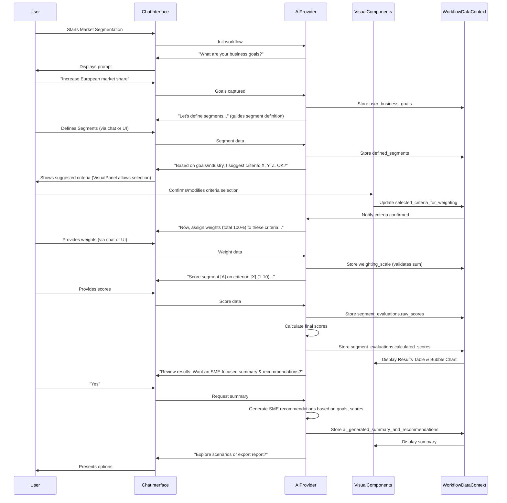

# Specification for Interactive Market Segmentation & Analysis Workflow

**Goal:** To guide users through defining, evaluating, and prioritizing market segments using an interactive, chat-driven experience within a split-panel UI, leveraging AI assistance for data collection, calculation, and insights. This document outlines the specification, aligning with the `chat-driven-workflow-pattern.md`.

## I. Core Principles & Context

*   **User-Centricity & Efficiency:** Streamline the process by guiding users step-by-step, pre-filling where possible, and providing clear feedback.
*   **Split-Panel UI:** Left panel for AI chat, Right panel for dynamic visual components (tables, forms, charts).
*   **Phased Progression:** Break down the complex task into manageable interactive phases.
*   **Bidirectional Data Flow:** Ensure real-time synchronization between chat inputs and visual component displays.
*   **AI as Guide & Facilitator:** Leverage AI for contextual explanations, intelligent prompting, suggesting criteria, proactive guidance, data validation, calculations, and generating summaries/recommendations tailored for SMEs.
*   **Enhanced UX:** Include visual progress indicators, immediate validation feedback, and robust navigation.

**Pre-existing Onboarding Information Context:**
*   `onboarding_company_name: string` (Used for personalization)
*   `onboarding_industry_type: string` (Used by AI for suggesting relevant criteria)

## II. Overall Data Structure & WorkflowDataContext
The entire workflow's state will be managed within a central `WorkflowDataContext` object.

```json
// workflow_data_context.json (for Market Segmentation & Analysis)
{
  "market_segmentation_analysis": {
    "workflow_step_name": "Market Segmentation & Analysis",
    "company_name": {
      "value": "string", // Initialized from onboarding_company_name; confirmed/updated
      "source": "onboarding" | "user_chat" | "user_ui"
    },
    "user_business_goals": ["string"], // Captured in Phase 0
    "defined_segments": [
      {
        "segment_id": "string", // Unique ID (e.g., UUID)
        "segment_name": "string",
        "international_market": "string", // e.g., "Canada", "United States", "Australia", "Other"
        "company_size_revenue": "string", // e.g., "100M+", "5-100M", "0-5M"
        "market_segment_size_description": "string", // e.g., "1,420,996 mid-sized and large corporations in USA & Canada"
        "key_competitors": ["string"] // Competitors mentioned for this segment
      }
    ],
    "selected_criteria_for_weighting": [
        // Array of strings (criteria IDs from Appendix A) that the user confirms for weighting
        // e.g., ["ability_to_differentiate", "competitive_intensity", "market_size"]
    ],
    "weighting_scale": {
      // All weights are numbers (0-100), summing to 100 across SELECTED criteria.
      // Keys match criteria_definitions in Appendix A. Only selected criteria will have non-zero weights.
      "ability_to_differentiate_weight": 0,
      "competitive_intensity_weight": 0,
      "barriers_to_entry_weight": 0,
      "market_size_weight": 0,
      "growth_rate_weight": 0,
      "profitability_weight": 0,
      "strategic_technical_fit_weight": 0,
      "capabilities_weight": 0,
      "maturity_timing_weight": 0
      // Potentially other criteria if user adds custom ones, though current plan is AI suggests from master list.
    },
    "segment_evaluations": [
      {
        "segment_id": "string", // References defined_segments.segment_id
        "raw_scores": {
          // User input scores (1-10) for each criterion IN selected_criteria_for_weighting
          "ability_to_differentiate": null, // Example, only present if selected
          "competitive_intensity": null,   // Example, only present if selected
          "market_size": null              // Example, only present if selected
        },
        "calculated_scores": {
          "overall_segment_score": null, // Weighted score based on selected criteria
          "competitiveness_total_score": null, // Sum of weighted scores for competitiveness criteria
          "market_opportunity_total_score": null, // Sum of weighted scores for market opp. criteria
          "attractiveness_total_score": null, // Sum of weighted scores for attractiveness criteria
          "feasibility_for_plot": null // A derived score for the Y-axis of the bubble plot
        }
      }
    ],
    "scenario_versions": [
      {
        "version_id": "string",
        "version_name": "string",
        "selected_criteria_override": ["string"], // Copy of selected_criteria_for_weighting for this scenario
        "weighting_scale_override": "object", // Copy of weighting_scale for this scenario
        "timestamp": "string", // ISO 8601
        "is_active": "boolean" // If this is the currently viewed scenario
      }
    ],
    "last_reviewed_at": "string", // ISO 8601 Timestamp
    "ai_generated_summary_and_recommendations": { // Renamed for clarity
      "value": "string", // Stores the AI-drafted SME-focused summary & recommendations
      "is_visible": false
    },
    "status": "in_progress" | "completed",
    "last_updated_at": "string" // ISO 8601 Timestamp
  }
}
```

## III. shadcn/ui Component Mapping
| UI Element                        | shadcn/ui Component (Example)    | Usage                                                                                                |
|---------------------------------|------------------------------------|------------------------------------------------------------------------------------------------------|
| Main Page Container             | `<ResizablePanelGroup>`            | Overall split-panel layout.                                                                          |
| Section Cards/Containers        | `<Card>`, `<CardHeader>`, `<CardTitle>`, `<CardContent>` | For introduction, each phase's visual components, and summary.                                     |
| Progress Bar                    | `<Progress>`                       | Visual indicator of current phase completion.                                                        |
| Segment Definition Table        | `<Table>`                          | Displaying defined segments and their criteria.                                                      |
| Dropdown for Criteria           | `<Select>`                         | For 'International Market' and 'Company Size (Revenue)' in segment definition.                     |
| Text Input                      | `<Input type="text">`              | For segment name, size description, competitors.                                                     |
| Criteria Selection (Phase 2)    | List of `<Checkbox>` with `<Label>` | For user to confirm/select AI-suggested criteria for weighting.                                    |
| Weighting Scale Table           | `<Table>` with `<Input type="number">` | For displaying selected criteria and inputting/adjusting 'Weighting Percentage'.                       |
| Ranking Input Table             | `<Table>` with `<Select>` or `<Input type="number">` | For scoring each segment against each selected criterion (1-10 scale).                             |
| Results Table                   | `<Table>`                          | Displaying final segment scores and sub-scores.                                                      |
| Bubble Chart                    | Chart Component (e.g., `BarChart` or custom using Recharts/Nivo) | Visualizing Attractiveness vs. Feasibility.                                                          |
| Buttons                         | `<Button>` (various variants)      | "Next", "Save", "Generate Summary", "Adjust Weights/Criteria", "Export", "New Scenario".             |
| Labels                          | `<Label>`                          | For form elements and table headers.                                                                 |
| Rich Text Editor (AI Summary)   | `<Textarea>`                       | For displaying and potentially editing the AI-generated summary and recommendations.                 |
| Dialog (for scenario naming)    | `<Dialog>`                         | To prompt user for a name when saving a new scenario.                                                |

## IV. Phased Breakdown with Implementation Details

### Phase 0: Purpose & Introduction
**A. AI Chat (Left Panel):**
1.  **Greeting & Purpose (Personalized & Goal-Oriented):**
    *   AI: "Hello there! For [onboarding_company_name], understanding your target market is crucial. This tool will guide you through defining, evaluating, and prioritizing your key market segments."
2.  **Capture Business Goals:**
    *   AI: "Before we dive in, what are some of the high-level business goals this market segmentation exercise aims to support for [onboarding_company_name]? For instance, are you looking to 'increase market share', 'launch a new product', or 'improve customer retention'?"
    *   User Input: Free text, e.g., "Increase market share, Enter new European markets". AI parses into `user_business_goals` array.
    *   AI Confirmation: "Understood. We'll keep these goals in mind: [list of goals]."
3.  **Core Benefits & Objective:**
    *   AI: "By the end, you'll have a data-backed view of segments offering most potential for [mention a user_business_goal], helping resource allocation."
    *   AI: "Our objective is to identify distinct customer groups to tailor your offerings and messaging effectively."

**B. Visual Components (Right Panel):**
*   `<Card>`: "Market Segmentation & Analysis"
    *   `<CardContent>`: Overview text. Input field/list for `user_business_goals` (editable). `<Button>Let's Get Started</Button>`.

### Phase 1: Defining Market Segments
**A. AI Chat (Left Panel):**
1.  **Introduction & Default Suggestions:**
    *   AI: "Let's define your market segments. Common approaches use geography and company size. Given [onboarding_company_name] is in the [onboarding_industry_type] sector, initial segments might be 'SMBs in North America' or 'Enterprise Clients - Europe'. Would you like to start with these or define your own?"
2.  **Segment Naming & Detail Collection Loop:**
    *   AI: "Please list your segment names (e.g., 'US Mid-Market Tech')."
    *   For each segment name provided:
        *   AI: "For '[Segment Name]', which 'International Market' (e.g., Canada, USA, UK, Other) and 'Company Size (Revenue)' (e.g., 100M+, 5-100M, 0-5M) apply?"
        *   AI: "Describe this segment's size (e.g., 'Approx. 5000 companies')."
        *   AI: "Who are the key competitors specifically for '[Segment Name]'?"
3.  **Confirmation Checkpoint:** AI: "Please review the defined segments on the right. Are all details correct?"

**B. Visual Components (Right Panel):**
*   `<Card>`: "Define Your Market Segments"
    *   `<Table id="segment-definitions-table">` (Columns: Segment Name, Intl. Market, Co. Size, Size Desc., Key Competitors). Rows are dynamically added/editable. `<Select>` for market/size. `<Input>` for others.
    *   `<Button>Add Segment</Button>`, `<Button>Export Segments (CSV)</Button>`.

**C. Example `tsx` for Segment Definition Row (Conceptual - from previous version, still relevant):**
```tsx
// interface SegmentDefinitionRowProps {
//   segment: { id: string; name: string; market: string; sizeRevenue: string; description: string; competitors: string[] };
//   onUpdateSegment: (id: string, field: string, value: string | string[]) => void;
// }
// export function SegmentDefinitionRow({ segment, onUpdateSegment }: SegmentDefinitionRowProps) { /* ... as before ... */ }
```

### Phase 2: Selecting & Weighting Evaluation Criteria
**A. AI Chat (Left Panel):**
1.  **Introduction to Criteria & AI Suggestion:**
    *   AI: "Now, let's choose and weight criteria to evaluate these segments. These fall into categories like Competitiveness, Market Opportunity, and Attractiveness."
    *   AI: "Based on your goals ([user_business_goals]) and industry ([onboarding_industry_type]), I suggest evaluating based on: [AI suggests 3-5 criteria from Appendix A, e.g., 'Market Growth Rate', 'Competitive Intensity', 'Strategic Fit']. Do these criteria make sense, or would you like to select/add others from our full list?" (AI can show full list from Appendix A if requested).
2.  **User Confirmation/Modification of Criteria:**
    *   User confirms or modifies the list of criteria. Selected criteria are stored in `selected_criteria_for_weighting`.
3.  **Weighting the Selected Criteria:**
    *   AI: "Great. Now, for these selected criteria, please assign a percentage weight to each, ensuring the total sums to 100%. Higher percentages mean more importance. The definitions are in Appendix A if you need a refresher."
    *   AI iterates through `selected_criteria_for_weighting`: "What weight (0-100) would you give to '[Criterion Name]'?"
    *   AI validates total sum, prompts for adjustments if not 100%. "The current total is [sum]%. Please adjust to reach 100%."

**B. Visual Components (Right Panel):**
*   `<Card>`: "Select & Weight Evaluation Criteria"
    *   **Criteria Selection:** A list of all available criteria (from Appendix A) with `<Checkbox>` for user to select/deselect. AI's suggestions are pre-checked.
    *   **Weighting Table:** `<Table id="weighting-scale-table">` (Columns: Category, Criterion, Weighting %). Only shows rows for `selected_criteria_for_weighting`. `<Input type="number">` for weights. Dynamic total display with validation color.

**C. Example `tsx` for Weighting Criterion Row (Conceptual):**
```tsx
import { TableCell, TableRow } from '@/components/ui/table';
import { Input } from '@/components/ui/input';
import { Label } from '@/components/ui/label';

interface WeightingCriterionRowProps {
  criterionId: string; // e.g., "market_size"
  criterionName: string; // e.g., "Market Size"
  criterionCategory: string; // e.g., "Market Opportunity"
  currentWeight: number;
  onWeightChange: (criterionId: string, newWeight: number) => void;
}
export function WeightingCriterionRow({ criterionId, criterionName, criterionCategory, currentWeight, onWeightChange }: WeightingCriterionRowProps) {
  return (
    <TableRow>
      <TableCell>{criterionCategory}</TableCell>
      <TableCell><Label htmlFor={`weight-${criterionId}`}>{criterionName}</Label></TableCell>
      <TableCell>
        <Input
          id={`weight-${criterionId}`}
          type="number"
          value={currentWeight}
          onChange={(e) => onWeightChange(criterionId, parseInt(e.target.value) || 0)}
          min="0" max="100"
          className="w-24"
        /> %
      </TableCell>
    </TableRow>
  );
}
```

### Phase 3: Ranking Market Segments
**A. AI Chat (Left Panel):**
1.  **Explanation:** AI: "Now, for each segment, score it from 1 (lowest) to 10 (highest) against each criterion you've weighted."
2.  **Looping/Iteration:** AI guides through each segment and then each selected criterion for that segment. "For '[Segment Name]', how do you score its '[Criterion Name]' (1-10)?"
3.  **AI-Driven Feedback:** AI: "A score of [X] for '[Criterion Name]' on '[Segment Name]'. Any particular reasons for this score?" (Optional, encourages reflection).

**B. Visual Components (Right Panel):**
*   `<Card>`: "Rank Market Segments"
    *   `<Table id="segment-ranking-table">` (Columns: Segment Name | [Criterion 1 Name] (1-10) | [Criterion 2 Name] (1-10) | ...). Only selected/weighted criteria appear as columns.
    *   Rows for each segment. Cells have `<Select>` or `<Input type="number">`.
    *   Option for "Batch Edit Mode".

**C. Example `tsx` for Segment Ranking Row Cell (Conceptual):**
```tsx
// interface SegmentRankingCellProps {
//   segmentId: string;
//   criterionId: string;
//   currentScore: number | null;
//   onScoreChange: (segmentId: string, criterionId: string, newScore: number) => void;
// }
// export function SegmentRankingCell({ segmentId, criterionId, currentScore, onScoreChange }: SegmentRankingCellProps) { /* Similar to StatementRatingRow's Select */ }
```

### Phase 4: Review and Analysis Results
**A. AI Chat (Left Panel):**
1.  **Explanation:** AI explains that scores are calculated and results (table, bubble chart) are on the right.
2.  **Review Prompt & "White Space" Identification:** AI: "Review the prioritized list. Any surprises? Looking at this, do any unmet needs or 'white space' opportunities come to mind?"

**B. Visual Components (Right Panel):**
*   `<Card>`: "Market Segmentation Analysis Results"
    *   Results Table (sorted by Overall Segment Score).
    *   Bubble Chart (Attractiveness vs. Feasibility, Bubble Size = Market Size).

### Phase 5: AI-Assisted Actions & Conclusion
**A. AI Chat (Left Panel):**
1.  **SME-Focused Summary & Recommendations Offer:**
    *   AI: "Would you like a summary for [company_name.value] highlighting top segments and actionable recommendations based on your goals: [user_business_goals]?"
2.  **If accepted, AI generates tailored summary:**
    *   "For your goal of '[Goal 1]', segment '[Top Segment A]' (Score: X) is promising due to its high '[Relevant Criterion Score]' and your strong 'Ability to Differentiate' (Score: Y). A key action could be to [SME-specific action, e.g., 'develop a pilot program targeting decision-makers in this segment with messaging focused on X advantage']. KPIs to track: [Specific KPI 1], [Specific KPI 2]."
    *   "Segment '[Segment B]' also supports '[Goal 2]'... however, its lower score in '[Weak Criterion]' suggests a need to [SME-specific mitigation strategy]."
3.  **Scenario Planning Offer:** AI: "Want to see how changing weights (e.g., prioritizing 'Growth Rate' more) impacts rankings? We can create a 'What-if' scenario."
4.  **Connecting to Next Steps:** AI offers options like defining personas, exporting reports, or adjusting analysis.

**B. Visual Components (Right Panel):**
*   Final summary view (table, chart). AI-generated SME recommendations displayed in a `<Textarea readOnly>` or formatted div.
*   Buttons: "Export Executive Report (PDF)", "Download Raw Data (CSV)", "Save Scenario", "New Analysis".

## V. Integration Patterns
(As in previous refined documents, including `ResizablePanelGroup` example and notes on `WorkflowDataContext` for bidirectional updates.)

## VI. Workflow Sequence Diagram (Mermaid)


## VII. Key AI Capabilities to Leverage
(As in previous version, with emphasis on suggesting criteria based on context and generating SME-tailored recommendations.)

## Appendix A: Weighting Criteria Definitions
(This section needs to be fully populated with definitions for all criteria the AI might suggest or the user might encounter. Example structure below.)

**Master List of Potential Evaluation Criteria:**

**Category: Competitiveness**
*   **`ability_to_differentiate` (Ability to Differentiate):** Our capability to make our product/service stand out with unique, compelling features or benefits that are hard for competitors to copy.
*   **`competitive_intensity` (Competitive Intensity):** The number and strength of existing competitors in the segment. High intensity means many strong competitors.
*   **`barriers_to_entry` (Barriers to Entry):** Obstacles (e.g., high capital costs, strong brand loyalty, patents, complex regulations) that make it difficult for new companies to enter the segment.

**Category: Market Opportunity**
*   **`market_size` (Market Size):** The total potential sales or number of customers within the segment.
*   **`growth_rate` (Growth Rate):** The anticipated speed at which the market segment is expected to expand in the future.
*   **`profitability` (Profitability):** The potential for profit within the segment, considering pricing power, cost structures, and customer lifetime value.

**Category: Attractiveness (Strategic & Technical Fit and Capabilities)**
*   **`strategic_technical_fit` (Strategic & Technical Fit):** How well targeting this segment aligns with our company's overall strategic direction, mission, and existing technical infrastructure.
*   **`capabilities` (Capabilities & Resources):** Our company's existing strengths, resources (financial, human, technological), and expertise to effectively serve and succeed in this segment.
*   **`maturity_timing` (Maturity & Timing):** The current stage of the segment's lifecycle (emerging, growing, mature, declining) and whether the timing is right for our entry or expansion.

This refined specification provides a comprehensive guide for developing the Market Segmentation & Analysis workflow.
Goal: To guide users through defining, evaluating, and prioritizing market segments using an interactive, chat-driven experience within a split-panel UI, leveraging AI assistance for data collection, calculation, and insights. This document outlines the specification, aligning with the chat-driven-workflow-pattern.md.

I. Core Principles & Context
User-Centricity & Efficiency: Streamline the process of market segmentation by guiding users step-by-step, pre-filling where possible, and providing clear feedback.
Split-Panel UI: Left panel for AI chat, Right panel for dynamic visual components (tables, forms, charts).
Phased Progression: Break down the complex task into manageable interactive phases: Defining Segments, Setting Weights, Ranking Segments, and Reviewing Results.
Bidirectional Data Flow: Ensure real-time synchronization between chat inputs and visual component displays.
AI as Guide & Facilitator: Leverage AI for contextual explanations, intelligent prompting, proactive guidance, data validation, calculations, and generating summaries/recommendations.
Enhanced UX: Include visual progress indicators, immediate validation feedback, and robust navigation for user control.
Pre-existing Onboarding Information Context:

onboarding_company_name: string (Used for personalization)
onboarding_industry_type: string (Assumed for more intelligent defaults)
II. Overall Data Structure & WorkflowDataContext
The entire workflow's state will be managed within a central WorkflowDataContext object.

// workflow_data_context.json (for Market Segmentation & Analysis)
{
  "market_segmentation_analysis": {
    "workflow_step_name": "Market Segmentation & Analysis",
    "company_name": {
      "value": "string", // Initialized from onboarding_company_name; confirmed/updated
      "source": "onboarding" | "user_chat" | "user_ui"
    },
    "user_business_goals": "string[]", // New: High-level goals from user
    "defined_segments": [
      {
        "segment_id": "string", // Unique ID (e.g., UUID)
        "segment_name": "string",
        "international_market": "string", // e.g., "Canada", "United States", "Australia", "Other"
        "company_size_revenue": "string", // e.g., "100M+", "5-100M", "0-5M"
        "market_segment_size_description": "string", // e.g., "1,420,996 mid-sized and large corporations in USA & Canada"
        "key_competitors": "string[]" // New: Competitors mentioned for this segment
      }
    ],
    "weighting_scale": {
      // All weights are numbers (0-100), summing to 100 across all criteria
      "competitiveness": {
        "ability_to_differentiate_weight": 0,
        "competitive_intensity_weight": 20,
        "barriers_to_entry_weight": 5
      },
      "market_opportunity": {
        "market_size_weight": 10,
        "growth_rate_weight": 25,
        "profitability_weight": 10
      },
      "attractiveness": { // Renamed from 'Strategic & Technical Fit and Capabilities' for clarity in structure
        "strategic_technical_fit_weight": 10,
        "capabilities_weight": 0,
        "maturity_timing_weight": 20
      }
    },
    "segment_evaluations": [
      {
        "segment_id": "string", // References defined_segments.segment_id
        "raw_scores": { // User input scores (1-10) for each criterion
          "ability_to_differentiate": null,
          "competitive_intensity": null,
          "barriers_to_entry": null,
          "market_size": null,
          "growth_rate": null,
          "profitability": null,
          "strategic_technical_fit": null,
          "capabilities": null,
          "maturity_timing": null
        },
        "calculated_scores": { // System calculated scores based on raw_scores and weighting_scale
          "overall_segment_score": null,
          "competitiveness_total_score": null,
          "market_opportunity_total_score": null,
          "attractiveness_total_score": null,
          "feasibility_for_plot": null // A derived score for the Y-axis of the bubble plot
        }
      }
    ],
    "scenario_versions": [ // New: For saving 'what-if' scenarios
      {
        "version_id": "string",
        "version_name": "string",
        "weighting_scale_override": "object", // copy of weighting_scale for scenario
        "timestamp": "string",
        "is_active": "boolean"
      }
    ],
    "last_reviewed_at": "string", // New: Timestamp for
    "ai_generated_summary": {
      "value": "string", // Optional: Stores the AI-drafted summary if generated
      "is_visible": false
    },
    "status": "in_progress" | "completed",
    "last_updated_at": "string"
  }
}
III. shadcn/ui Component Mapping
UI Element	shadcn/ui Component (Example)	Usage
Main Page Container	<ResizablePanelGroup>	Overall split-panel layout.
Section Cards/Containers	<Card>, <CardHeader>, <CardTitle>, <CardContent>	For introduction, each phase's visual components, and summary.
Progress Bar	<Progress>	Visual indicator of current phase completion.
Segment Definition Table	<Table>, <TableHeader>, <TableBody>, <TableRow>, <TableHead>, <TableCell>	Displaying defined segments and their criteria.
Dropdown for Criteria (Market, Size)	<Select>, <SelectTrigger>, <SelectContent>, <SelectItem>	For choosing 'International Market' and 'Company Size (Revenue)' in the segment definition table.
Text Input for Segment Size Desc.	<Input type="text">	For 'Market Segment Sizes' description in the segment definition table.
Text Input for Competitors	<Input type="text"> or MultiSelect	For competitive landscape integration.
Weighting Scale Form/Table	<Table> with <Input type="number"> within <TableCell>	For displaying criteria and inputting/adjusting their 'Weighting Percentage'. Validation highlighting for total percentage.
Ranking Input Table	<Table> with <Select> or <Input type="number"> in <TableCell>	For scoring each segment (rows) against each criterion (columns) on a 1-10 scale. Option for batch editing via table.
Results Table	<Table>	Displaying final segment scores, competitiveness, market opportunity, and attractiveness scores.
Bubble Chart	Chart Component (e.g., from Recharts/Nivo adapted to shadcn/ui style)	Visualizing Attractiveness vs. Feasibility, with bubble size representing market segment size.
Buttons	<Button> (various variants)	"Next", "Save", "Generate Summary", "Adjust Weights", "Export", "Undo", etc.
Labels	<Label>	For form elements and table headers.
Rich Text Editor (for AI Summary)	<Textarea> or dedicated Rich Text Editor	For displaying and potentially editing the AI-generated summary.
IV. Phased Breakdown with Implementation Details
Phase 0: Purpose & Introduction
A. AI Chat (Left Panel):

Greeting & Purpose (Personalized & Goal-Oriented):
AI: "Hello there! I'm here to help you refine your market strategy. For your company, [onboarding_company_name], understanding your target market is a crucial step towards effective marketing and product development. This tool will guide you through defining, evaluating, and prioritizing your key market segments."
New: AI: "Before we dive in, what are some of the high-level business goals this market segmentation exercise aims to support for [onboarding_company_name]? For instance, are you looking to increase market share, launch a new product, or improve customer retention?"
User Input: (e.g., "Increase market share," "Enter new markets," "Optimize marketing spend") - Captured in user_business_goals array.
Core Benefits:
AI: "By the end of this process, you'll have a clear, data-backed understanding of which market segments offer the most potential for growth, engagement, and alignment with your business goals (referencing user_business_goals here dynamically). This will help you allocate resources efficiently and make informed decisions."
Objective:
AI: "Our goal is to identify distinct groups of customers with similar needs or characteristics, enabling you to tailor your offerings and messaging for maximum impact."
B. Visual Components (Right Panel):

<Card>:
<CardHeader>: <CardTitle>Market Segmentation & Analysis</CardTitle>
<CardContent>:
Brief overview text: "Define, evaluate, and prioritize your market segments to optimize your strategic efforts. This interactive tool will guide you through each step, culminating in a clear visualization of your most attractive opportunities."
New: A small section or input field for user_business_goals after the AI prompt, allowing users to type or edit.
<Button onClick={proceedToPhase1}>Let's Get Started</Button>
Phase 1: Defining Market Segments
A. AI Chat Guidance & Data Collection (Left Panel):

Information Check & Prompts (Intelligent Defaults & Ambiguity Resolution):
AI: "Let's start by defining your market segments. This involves identifying specific groups of potential buyers with shared characteristics or needs."
AI: "Based on common segmentation approaches like geographic location and company size, our tool uses criteria such as 'International Markets' (e.g., North America, Australia) and 'Company Size (Revenue)' (e.g., 100M+, 5-100M, 0-5M Revenue) to help you define these groups."
New (Intelligent Defaults): "Given [onboarding_company_name] operates in the [onboarding_industry_type inferred] space, common segments might include 'Small and Medium Businesses (SMB)', 'Enterprise Clients', or 'Specific Industry Verticals'. Would you like to start with these as suggestions for your segments?"
AI: "To begin, please list the initial segment names you'd like to work with. For instance, 'North America Corporate' or 'Small Business - Australia'. You can provide them as a comma-separated list or one by one."
New (Ambiguity Resolution): If user inputs "small" - AI: "When you say 'small', are you referring to 'Small Business - Australia' or simply 'Small Business' globally? Can you provide a more specific name?"
Segment Detail Collection Loop:
Once segments are listed, AI: "Great. Let's take [first segment name]. Which 'International Market' category does it fall under (e.g., Canada, United States, Australia, or other)? And what 'Company Size (Revenue)' best describes it (e.g., 100M+, 5-100M, 0-5M Revenue)?"
AI: "Do you have an estimated size or description for this segment, like '1,420,996 mid-sized and large corporations in USA & Canada'?"
New (Competitive Landscape Integration): "Who are the primary competitors you face within the [Segment Name] market specifically?" (Captured in key_competitors for the segment).
(Repeats for each segment)
New (Confirmation Checkpoint): Before proceeding to Phase 2: "Please review the segments you've defined and their attributes in the table on the right. Is this all correct, or do you need to make any changes?"
B. Corresponding Visual Component(s) (Right Panel):

<Card>: "Define Your Market Segments"
<CardContent>:
<Table id="segment-definitions-table">
<TableHeader>: Segment Name, International Market, Company Size (Revenue), Market Segment Size/Description, Key Competitors (New Column)
<TableBody>: Rows dynamically added.
Each row: <TableCell> for segment name (editable <Input>).
<TableCell> with <Select> for International Market (Options: Canada, United States, Australia, Other).
<TableCell> with <Select> for Company Size (Revenue) (Options: 100M+, 5-100M, 0-5M).
<TableCell> with <Input type="text"> for Market Segment Size/Description.
New: <TableCell> with <Input type="text"> or a MultiSelect for Key Competitors (comma-separated if Input).
<Button onClick={addNewSegmentRow}>Add Segment Manually</Button>
New (Export Option for Phase Data): <Button onClick={exportSegmentsToCSV}>Export Segments</Button>
C. Bidirectional Flow: (No changes here, already well defined)

D. Example tsx for Segment Definition Row (Conceptual):

// ... (existing imports)
interface SegmentDefinitionRowProps {
  segment: { id: string; name: string; market: string; sizeRevenue: string; description: string; competitors: string[] }; // Added competitors
  onUpdateSegment: (id: string, field: string, value: string | string[]) => void; // Value type updated
}

export function SegmentDefinitionRow({ segment, onUpdateSegment }: SegmentDefinitionRowProps) {
  // ... (existing markets, revenueSizes)
  return (
    <TableRow>
      {/* ... (existing TableCells for name, market, sizeRevenue, description) */}
      <TableCell>
        <Input
          value={segment.competitors.join(', ')} // Display as comma-separated
          onChange={(e) => onUpdateSegment(segment.id, 'competitors', e.target.value.split(',').map(s => s.trim()))}
          placeholder="e.g., Competitor A, Competitor B"
        />
      </TableCell>
    </TableRow>
  );
}
E. Data Captured: defined_segments array in WorkflowDataContext.

Phase 2: Setting Weighting Scale
A. AI Chat Guidance & Data Collection (Left Panel):

Explanations & Proactive Contextual Help:
AI: "Now, let's determine the importance of different factors in evaluating these segments. We'll assign weights to criteria across three main categories: Competitiveness, Market Opportunity, and Attractiveness."
AI: "Each category has sub-factors. For example, under Competitiveness, we have 'Ability to Differentiate,' 'Competitive Intensity,' and 'Barriers to Entry'." (See Appendix A for all definitions).
New (Proactive Contextual Help): "When considering 'Barriers to Entry,' think about factors like proprietary technology, strong brand loyalty, or significant capital requirements. A higher weight here implies that segments protected by high barriers are more valuable to you. Does that make sense?"
AI: "We have default weightings based on general best practices, but you can adjust them. The total weighting across all sub-factors must sum to 100%."
AI: "Would you like to review the definitions of each criterion before setting the weights?" (If "yes," AI provides definitions from Appendix A).
Information Check & Prompts:
AI: "The current default weighting percentages are: Ability to Differentiate: 0%, Competitive Intensity: 20%, Barriers to Entry: 5%, Market Size: 10%, Growth Rate: 25%, Profitability: 10%, Strategic & Technical Fit: 10%, Capabilities: 0%, Maturity & Timing: 20%. The total is 100%."
AI: "Would you like to keep these default weights, or would you like to adjust any of them? Please tell me which criteria you'd like to change and its new percentage."
Input Handling: User input can be "keep defaults" or specifications like "Change Growth Rate to 30%, Capabilities to 5%." AI validates total sum and prompts for adjustments if not 100%.
B. Corresponding Visual Component(s) (Right Panel):

<Card>: "Set Weighting Scale"
<CardContent>:
<Table id="weighting-scale-table">
<TableHeader>: Category, Criterion, Weighting Percentage (%)
<TableBody>: Rows for each criterion.
Example Row: Competitiveness | Ability to Differentiate | <Input type="number" value={weight} onChange={...} />
<TableRow> (Footer): Total | | <span id="totalWeight" className={totalWeight !== 100 ? 'text-red-500' : 'text-green-500'}>{totalWeight}%</span>
New (Interactive Data Validation): The totalWeight span should dynamically change color (e.g., red if not 100%, green if 100%), providing immediate visual feedback.
C. Bidirectional Flow: (No changes here, already well defined)

D. Example tsx for Weighting Criterion Row (Conceptual): (No substantial changes needed for visual element, validation handled by parent component and the totalWeight logic)

E. Data Captured: weighting_scale object in WorkflowDataContext.

Phase 3: Ranking Market Segments
A. AI Chat Guidance & Data Collection (Left Panel):

Explanations:
AI: "Excellent! Now comes the evaluation. For each segment you defined, we'll score its performance against each of the criteria we just weighted. You'll score each segment on a scale of 1 to 10, where 1 is the lowest and 10 is the highest."
Looping/Iteration:
AI: "Let's start with your first segment, [Segment Name from Phase 1]."
AI: "On a scale of 1 to 10, how would you score [Segment Name] on 'Ability to Differentiate'?" (Repeats for all criteria for the current segment, then moves to the next segment).
New (AI-Driven Feedback during Scoring): After a score is input, AI might offer: "You've given 'Profitability' for [Segment Name] a score of 3. Is there a specific reason it's low, such as high customer acquisition costs, or tough pricing competition?" This encourages deeper thought, without forcing a change.
Input Handling: User provides a single number (1-10). AI validates.
B. Corresponding Visual Component(s) (Right Panel):

<Card>: "Rank Market Segments"
<CardContent>:
<Table id="segment-ranking-table">
<TableHeader>: Segment Name | Ability to Differentiate (1-10) | Competitive Intensity (1-10) | ... (all criteria)
<TableBody>: Rows for each defined segment.
Each cell (for a criterion): <Select value={score} ...> or <Input type="number" min="1" max="10" ... />
New (Batch Editing/Quick Entry): An option (e.g., a toggle or button) that, when activated, converts all score selection fields to direct number inputs or allows horizontal tab navigation for rapid entry. AI can offer: "Would you prefer to fill out scores for one segment at a time (my current guided approach), or would you like to use the table to fill them all at once?"
C. Bidirectional Flow: (No changes here, already well defined)

D. Example tsx for Segment Ranking Row (Conceptual): (No substantial changes, the batch editing is a UI choice)

E. Data Captured: segment_evaluations[].raw_scores in WorkflowDataContext.

Phase 4: Review and Analysis Results
A. AI Chat Guidance & Data Collection (Left Panel):

Explanations:
AI: "Excellent! We've gathered all the necessary data. Now, let's look at the results. Based on your segment definitions, the weightings you set, and the scores you provided, we've calculated a 'Segment Score' for each market segment."
AI: "This score helps identify which segments are most attractive and feasible for your business. We've also calculated weighted scores for Competitiveness, Market Opportunity, and Attractiveness separately."
AI: "The results are displayed in the table on the right, sorted by the overall Segment Score (highest to lowest). You'll also see a visual representation of Attractiveness vs. Feasibility in the bubble chart."
Review Prompt:
AI: "Please review the prioritized list of your market segments. Do any of these results surprise you, or does this align with your initial thoughts?"
New ("White Space" Identification): "Looking at your current definitions and our analysis, are there any unmet needs or market gaps that you've identified, perhaps areas you hadn't considered as distinct segments but which represent significant potential (white space)?" (This prompts user for new segment ideas or observations).
Input Handling: User provides free-form feedback.
B. Corresponding Visual Component(s) (Right Panel):

<Card>: "Market Segmentation Analysis Results"
<CardContent>:
Results Table:
Columns: Market Segment, Overall Segment Score, Competitiveness Score, Market Opportunity Score, Attractiveness Score.
Rows display each segment, sorted by overall_segment_score (descending).
Scores are dynamically calculated.
Bubble Chart: (e.g., using Recharts or Nivo.js)
X-axis: "Attractiveness" score (calculated_attractiveness_total_score).
Y-axis: "Feasibility" score (calculated_feasibility_for_plot).
Bubble Size: Represents market_segment_size_description (requires parsing or a numerical proxy).
Labels: Segment Name.
(Optional) Rich Text Editor area for AI-generated summary.
C. Data Captured/Calculated: segment_evaluations[].calculated_scores in WorkflowDataContext.

Phase 5: AI-Assisted Actions & Conclusion
A. AI Chat (Left Panel):

Summary & Recommendations Offer:
AI: "Would you like me to generate a brief summary highlighting your top 3 market segments and the key reasons for their high ranking based on our analysis?" (This will populate ai_generated_summary)
If accepted, AI generates summary based on scores and descriptions.
Scenario Planning Offer (Enhanced):
AI: "Would you like to explore how changes in your weighting scale might affect segment rankings? For example, we could simulate a scenario where 'Profitability' has a higher weight. This will create a new 'scenario version' so you can compare it to your current analysis." (Option to save this as a new entry in scenario_versions).
New (Version Control): AI can prompt: "What would you like to name this scenario (e.g., 'Aggressive Growth Scenario')?"
Strategic Recommendations (New - Business Value):
AI: "Based on your top segments and the goals you initially mentioned [e.g., 'increase market share'], here are some general recommendations for [company_name.value]:"
Resource Allocation: "Consider allocating X% of your marketing budget to [top segment A] and Y% to [top segment B]. We've identified [reason A] and [reason B] as key drivers for these segments."
High-Level Action Plan: "For [top segment A], a high-level action could be to 'Develop targeted messaging that emphasizes our unique differentiation (Ability to Differentiate score)'." (AI generated action plans).
Measurement & KPIs: "To track success for [top segment A], key KPIs you might monitor include: Average Customer Lifetime Value, Customer Acquisition Cost, and Conversion Rate from leads specific to this segment."
Connecting to Next Steps (New - Business Value):
AI: "This analysis provides a strong foundation for your strategic planning. What would you like to do next?"
"Define detailed personas for your top segments (e.g., using a 'Buyer Persona Builder' module)?" (Transitions to next workflow step)
"Export a comprehensive report of your findings suitable for executive presentations?" (References Reporting & Shareability).
"Review your analysis again or make adjustments to segments/scores."
"Go to Dashboard."
B. Visual Components (Right Panel):

Final state displays the summary from Phase 4 (Results Table, Bubble Chart).
If AI summary generated, it appears in a designated area (e.g., <Textarea readOnly> or a styled div).
New (Reporting & Shareability): A clear button "Export Executive Report (PDF)" next to a "Download Raw Data (CSV)". The Executive Report should be a polished PDF that includes all tables, charts, the AI-generated summary, and potentially the user's initial business goals.
Buttons for "Start New Analysis", "Go to Dashboard", "Adjust Weights (Go to Phase 2)". (Last_updated_at and last_reviewed_at timestamps can be displayed with "Review & Recalibration Prompts" in a dashboard view).
C. Data Captured: ai_generated_summary in WorkflowDataContext and scenario_versions.

V. Integration Patterns (Alignment with Chat-Driven Workflow Pattern)
This workflow adheres to the chat-driven-workflow-pattern.md.

Resizable Split Panel Layout: (No change needed)
Chat-to-Visual and Visual-to-Chat Coordination: (No change needed)
VI. Workflow Sequence Diagram (Mermaid - Simplified: Defining One Segment)
(No changes needed for this illustrative diagram)

VII. Key AI Capabilities to Leverage
Natural Language Understanding (NLU): To interpret diverse user responses for segment names, criteria details, weights, and scores, including ambiguity resolution.
Context Retention: To remember prior inputs (company name, defined segments, weights, scores, business goals) across phases and persist for scenario planning.
Error Handling & Clarification: To guide users on incorrect (e.g., weight total not 100%, score out of range) or unclear input, offering proactive feedback.
Personalization: To use confirmed company and segment names, and initial business goals in prompts and summaries.
Flexibility: To allow users to confirm/update data via chat or direct visual interaction, and to offer different input styles (e.g., batch editing).
Real-time Updates: To ensure seamless synchronization between chat and visual components with interactive validation.
Intelligent Calculation: To perform weighted averages for segment scores, derive other calculated metrics (like Feasibility), and run "what-if" scenarios.
Summarization & Recommendation: To generate concise summaries of top segments, suggest resource allocations, high-level action plans, relevant KPIs, and identify "white space" opportunities.
Proactive Guidance: To offer intelligent defaults, contextual help, and gentle nudges based on user input or progress.
Updated Appendix A: Weighting Criteria Definitions

(No changes, but these definitions are crucial for the AI's contextual explanations.)

