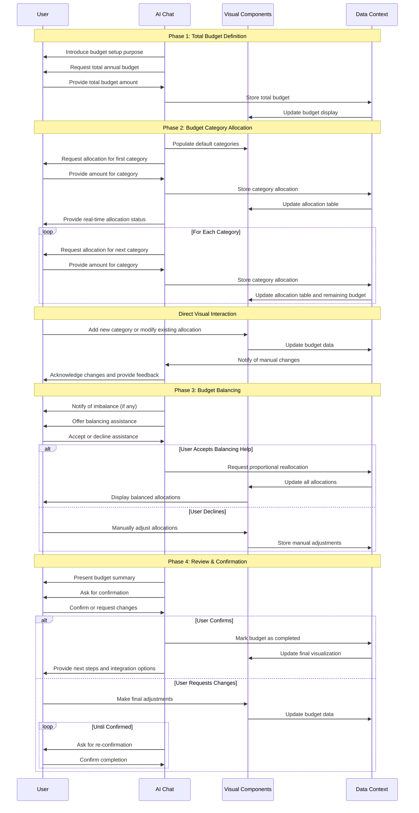

# Marketing Budget Workflow

## 1. Overview & Purpose

The Marketing Budget workflow guides users through the process of defining, allocating, and managing their marketing financial resources through an interactive, data-driven experience. Using a split-panel layout with AI chat guidance on the left and dynamic visual components on the right, the tool enables marketers to establish a comprehensive budget framework that aligns with strategic goals.

This workflow helps marketing teams establish their total annual marketing budget, break it down into appropriate categories, and ensure financial resources are allocated optimally. It creates a financial roadmap that serves as a foundation for marketing activities, enabling accurate tracking of expenditures, ROI analysis, and budget optimization over time.

By providing structured guidance through the budgeting process, the workflow ensures that marketing teams have a clear financial framework that supports strategic decision-making and resource allocation across various marketing initiatives.

## 2. Target User & Context

**User:** Marketing managers, CMOs, financial controllers, and marketing directors responsible for establishing and managing marketing budgets.

**Context:** This workflow typically occurs during the planning phase of marketing strategy development, often following the establishment of marketing objectives and campaign plans, but preceding detailed tactical implementation. It forms a critical bridge between strategic goals and tactical execution by defining the financial resources available for marketing activities.

The primary user need is to create a structured, defensible marketing budget that aligns with business objectives and optimizes resource allocation. Marketing leaders often struggle with effectively distributing limited resources across multiple potential channels and initiatives. This tool addresses this challenge by providing a framework to:

1. Establish an appropriate overall marketing budget
2. Allocate funds across key marketing categories based on strategic priorities
3. Visualize budget distribution to ensure balanced investment
4. Track allocation against the total budget to prevent overspending

The resulting budget directly informs campaign execution, resource planning, and performance measurement, providing a financial foundation for all marketing activities.

## 3. Core Conversational Flow

### General Principle

As the AI guides the user through the budgeting process, the right visual panel dynamically updates to display budget allocations in structured tables and charts. Following the **Bidirectional Updates** principle from the Chat-Driven Workflow Pattern, changes made in either the chat or visual panels are immediately reflected in the other.

### Phase 1: Introduction & Total Annual Marketing Budget Definition

**AI Chat Guidance & Data Collection (Left Panel):**
"Hello! Let's get started with setting up your marketing budget for [onboarding_company_name, if available, otherwise 'your company']."

The AI explains the purpose: "This process will help us define your annual marketing spend, break it down into key categories, and ensure you have a clear financial roadmap for your marketing efforts. A well-defined budget is crucial for tracking Return on Investment (ROI), optimizing spend, and achieving your marketing objectives."

The AI requests the total budget: "First, let's establish your overall annual marketing budget. What is the total amount you plan to allocate for marketing this year?"

The AI provides industry context: "For context, typical marketing budgets range from 2-10% of revenue, with averages around 7.7-9.5% for most companies. This should be the umbrella figure that we will then break down into specific categories."

The AI clarifies currency: "All amounts will be considered in GBP (£) unless you specify otherwise."

If the user provides a non-numerical value, the AI will prompt: "That doesn't look like a valid amount. Please enter a numerical value for your annual marketing budget, for example, '£100,000' or '250000'."

**Visual Components (Right Panel):**
- A title card prominently displaying "Marketing Budget Setup"
- A brief overview text explaining the purpose of the budget setup
- A simple input section for the total budget with:
  - Label: "Total Annual Marketing Budget"
  - Input field formatted for currency (e.g., "£ [ ]")

**Data Captured in this Phase:**
```typescript
marketing_budget_total_annual: number  // e.g., 250000.00
marketing_budget_currency: string      // e.g., "GBP"
```

### Phase 2: Budget Category Allocation

**AI Chat Guidance & Data Collection (Left Panel):**
"Great! Now that we have your total annual budget of [marketing_budget_total_annual], let's break it down into specific marketing categories. We can use common categories as a starting point."

The AI explains the approach: "To help you allocate funds effectively, I've pre-populated some common marketing budget categories based on industry standards. You can adjust these, add new ones, or remove any that aren't relevant to your business."

The AI provides context: "Typical categories include digital marketing efforts like SEO, content creation, and paid advertising, as well as traditional marketing, events, and essential software/tools."

The AI iterates through categories: "Let's start with 'Software & Subscriptions'. How much would you like to allocate here?"

After each allocation, the AI provides real-time feedback: "You have [remaining_budget] left to allocate." or "You are over budget by [over_budget_amount]."

The AI facilitates modifications: "To add a new category, please tell me the category name and the amount you want to allocate, e.g., 'Influencer Marketing £5,000'. To remove a category, simply say 'remove [category name]'. To update an amount, say 'set [category name] to [amount]'."

**Visual Components (Right Panel):**
- A dynamic table with columns:
  - Category Name
  - Allocated Amount
  - Actions (edit and delete icons)
- Pre-populated rows with common marketing categories:
  - Software & Subscriptions
  - Public Relations
  - Advertising (print)
  - Advertising (online)
  - Content Production
  - Events & Sponsorships
  - Creative Agency Fees
  - Contact Lists
  - General Admin
  - Memberships & Associations
- "Add Category" button below the table
- Summary section showing:
  - "Total Annual Budget: [marketing_budget_total_annual]"
  - "Total Allocated: [sum_of_all_allocated_categories]"
  - "Remaining Budget: [marketing_budget_total_annual - sum_of_all_allocated_categories]"

**Data Captured in this Phase:**
```typescript
marketing_budget_categories: Array<{
  category_name: string,
  allocated_amount: number
}>
```

### Phase 3: Budget Balancing & Adjustment

**AI Chat Guidance & Data Collection (Left Panel):**
If the allocated amount deviates from the total budget, the AI offers assistance: "It looks like you've allocated [Total Allocated], which is [X] over/under your total budget of [marketing_budget_total_annual]. Would you like me to help you adjust the allocations to balance it out, or would you prefer to make adjustments manually?"

If the user accepts AI help: "I can suggest re-distributing the remaining [or excess] amount proportionally across all categories, or focusing on your largest categories. What's your preference?"

If the user chooses proportional adjustment: "I've redistributed the [remaining/excess] amount proportionally across all categories based on their current allocations. Please review the updated amounts in the right panel."

If the user prefers manual adjustment: "No problem. You can make adjustments directly in the table on the right, or tell me which specific categories you'd like to modify."

**Visual Components (Right Panel):**
- The table from Phase 2 remains visible, with potentially adjusted values
- Values that have been automatically adjusted are highlighted temporarily
- Summary section updates to reflect the new allocations

**Data Captured in this Phase:**
```typescript
// Updates to marketing_budget_categories with balanced allocations
```

### Phase 4: Review & Confirmation

**AI Chat Guidance & Data Collection (Left Panel):**
"We've now allocated funds across your marketing categories. Here's a summary of your budget."

The AI presents a summary: "Your total annual marketing budget is [marketing_budget_total_annual]. You've allocated [Total Allocated] across [number_of_categories] categories, with [Remaining Budget] [left to allocate / over allocated]."

The AI asks for confirmation: "Please review the final budget details in the right panel. Does everything look correct, or would you like to make any adjustments?"

If confirmed: "Excellent! Your marketing budget has been set up successfully. This comprehensive budget will be your guide for all marketing expenditures and will help us track your financial performance."

The AI explains next steps: "You can always come back to this section to review or modify your budget. This budget will now integrate with other parts of the platform, enabling features like spend tracking and ROI analysis."

**Visual Components (Right Panel):**
- The table from previous phases showing the final allocations
- A "Budget Overview" pie chart visualizing the percentage allocation for each category
- Summary section with final figures
- Action buttons: "Save Budget", "Export to PDF", "Export to Excel"

**Data Captured in this Phase:**
```typescript
marketing_budget_final_allocated_sum: number  // Sum of all allocated amounts
marketing_budget_status: string              // e.g., "completed"
last_updated_at: string                      // Timestamp
```

### AI-Assisted Actions

**Budget Balancing Suggestion:**
If allocations don't match the total budget, the AI can offer:
- Proportional adjustment across all categories
- Focus adjustment on largest categories
- Targeted suggestions for specific categories based on industry benchmarks

**Budget Best Practices:**
The AI may offer insights like:
- "Based on your focus on content marketing, the industry benchmark suggests allocating 25-30% of your budget to content production and distribution."
- "Your allocation to digital advertising appears lower than typical for your industry. Would you like me to provide some benchmark figures?"

### Concluding the Workflow

**AI Chat Guidance & Data Collection (Left Panel):**
"Congratulations! Your Marketing Budget for [onboarding_company_name] is now officially set up."

The AI suggests integration opportunities: "This budget will now integrate with other parts of the platform. Would you like me to show you how your budget connects with campaign planning or performance tracking tools?"

**Visual Components (Right Panel):**
- A final "Budget Overview Dashboard" showing:
  - The pie chart for "Allocated Budget"
  - A summary table of categories and allocations
  - Visual indicators showing how this connects to other modules

## 4. Visual Components

### shadcn/ui Component Mapping

| UI Element | shadcn/ui Component | Usage |
|------------|---------------------|-------|
| Main Container | `<ResizablePanelGroup>` | Split-panel layout for chat and visual components |
| Title Card | `<Card>` with `<CardHeader>` and `<CardContent>` | Displays workflow title and brief introduction |
| Currency Input | `<Input>` with currency formatter | Total budget input field with currency symbol |
| Budget Categories Table | `<Table>` with `<TableHeader>`, `<TableBody>`, `<TableRow>`, `<TableHead>`, `<TableCell>` | Displays budget categories and allocations |
| Add Category Button | `<Button>` with `<Plus>` icon | Adds new budget category |
| Edit Category Button | `<Button>` with `<Pencil>` icon | Edit category name or amount |
| Delete Category Button | `<Button>` with `<Trash>` icon | Remove category from budget |
| Category Name Input | `<Input>` | Text input for category names |
| Amount Input | `<Input type="number">` with currency formatting | Input for monetary values |
| Budget Summary | `<Card>` with `<CardContent>` | Displays budget summary statistics |
| Budget Pie Chart | Custom chart component wrapped in `<Card>` | Visualization of budget allocation |
| Alert | `<Alert>` with `<AlertTitle>` and `<AlertDescription>` | Shows warnings for over/under allocation |
| Tooltip | `<Tooltip>` with `<TooltipTrigger>` and `<TooltipContent>` | Provides context for budget categories |
| Export Button | `<DropdownMenu>` with `<DropdownMenuTrigger>` and `<DropdownMenuContent>` | Export options for budget data |
| Save Button | `<Button variant="default">` | Save the final budget |
| Cancel Button | `<Button variant="outline">` | Cancel current edits |
| Progress Indicator | `<Progress>` | Shows percentage of total budget allocated |

### Example Budget Category Component

```tsx
import { useState, useEffect } from "react";
import { 
  Table, TableHeader, TableBody, TableRow, TableHead, TableCell,
  Input, Button, Card, CardHeader, CardTitle, CardContent,
  Progress, Alert, AlertTitle, AlertDescription,
  DropdownMenu, DropdownMenuTrigger, DropdownMenuContent, DropdownMenuItem,
  Tooltip, TooltipProvider, TooltipTrigger, TooltipContent
} from "@/components/ui";
import { Plus, Pencil, Trash2, AlertCircle, Download, Save } from "lucide-react";
import { PieChart, Pie, Cell, ResponsiveContainer, Legend, Tooltip as RechartsTooltip } from "recharts";
import { cn } from "@/lib/utils";

// Type definitions
interface BudgetCategory {
  id: string;
  name: string;
  amount: number;
  percentage?: number;
}

interface MarketingBudgetData {
  totalAnnual: number;
  currency: string;
  categories: BudgetCategory[];
  finalAllocatedSum?: number;
  status: 'in_progress' | 'completed';
  lastUpdatedAt: string;
}

const CATEGORY_COLORS = [
  "#0088FE", "#00C49F", "#FFBB28", "#FF8042", "#8884D8", 
  "#82CA9D", "#FFC658", "#8DD1E1", "#A4DE6C", "#D0ED57"
];

interface MarketingBudgetProps {
  initialData?: Partial<MarketingBudgetData>;
  onboardingCompanyName?: string;
  onUpdate: (data: MarketingBudgetData) => void;
  onSave: (data: MarketingBudgetData) => void;
  onExport: (format: 'pdf' | 'excel' | 'csv') => void;
}

export function MarketingBudget({
  initialData = {},
  onboardingCompanyName,
  onUpdate,
  onSave,
  onExport
}: MarketingBudgetProps) {
  // Initialize budget data with defaults or initial data
  const [budgetData, setBudgetData] = useState<MarketingBudgetData>({
    totalAnnual: initialData.totalAnnual || 0,
    currency: initialData.currency || 'GBP',
    categories: initialData.categories || [
      { id: '1', name: 'Software & Subscriptions', amount: 0 },
      { id: '2', name: 'Public Relations', amount: 0 },
      { id: '3', name: 'Advertising (print)', amount: 0 },
      { id: '4', name: 'Advertising (online)', amount: 0 },
      { id: '5', name: 'Content Production', amount: 0 },
      { id: '6', name: 'Events & Sponsorships', amount: 0 },
      { id: '7', name: 'Creative Agency Fees', amount: 0 },
      { id: '8', name: 'Contact Lists', amount: 0 },
      { id: '9', name: 'General Admin', amount: 0 },
      { id: '10', name: 'Memberships & Associations', amount: 0 }
    ],
    status: initialData.status || 'in_progress',
    lastUpdatedAt: initialData.lastUpdatedAt || new Date().toISOString()
  });
  
  // Calculate derived values
  const totalAllocated = budgetData.categories.reduce((sum, cat) => sum + cat.amount, 0);
  const remainingBudget = budgetData.totalAnnual - totalAllocated;
  const allocationPercentage = budgetData.totalAnnual > 0 
    ? Math.min(100, (totalAllocated / budgetData.totalAnnual) * 100) 
    : 0;
  
  // Update category percentages and parent component
  useEffect(() => {
    // Calculate percentages for pie chart
    const categoriesWithPercentages = budgetData.categories.map(cat => ({
      ...cat,
      percentage: totalAllocated > 0 ? (cat.amount / totalAllocated) * 100 : 0
    }));
    
    const updatedData = {
      ...budgetData,
      categories: categoriesWithPercentages,
      finalAllocatedSum: totalAllocated,
      lastUpdatedAt: new Date().toISOString()
    };
    
    setBudgetData(updatedData);
    onUpdate(updatedData);
  }, [budgetData.totalAnnual, budgetData.categories, onUpdate]);
  
  // Handle total budget update
  const updateTotalBudget = (value: number) => {
    setBudgetData(prev => ({
      ...prev,
      totalAnnual: value
    }));
  };
  
  // Handle category operations
  const updateCategoryAmount = (id: string, amount: number) => {
    setBudgetData(prev => ({
      ...prev,
      categories: prev.categories.map(cat => 
        cat.id === id ? { ...cat, amount } : cat
      )
    }));
  };
  
  const updateCategoryName = (id: string, name: string) => {
    setBudgetData(prev => ({
      ...prev,
      categories: prev.categories.map(cat => 
        cat.id === id ? { ...cat, name } : cat
      )
    }));
  };
  
  const addCategory = () => {
    const newId = `category-${Date.now()}`;
    setBudgetData(prev => ({
      ...prev,
      categories: [
        ...prev.categories,
        { id: newId, name: 'New Category', amount: 0 }
      ]
    }));
  };
  
  const removeCategory = (id: string) => {
    setBudgetData(prev => ({
      ...prev,
      categories: prev.categories.filter(cat => cat.id !== id)
    }));
  };
  
  // Perform balanced allocation
  const balanceAllocations = () => {
    if (remainingBudget === 0 || totalAllocated === 0) return;
    
    const factor = budgetData.totalAnnual / totalAllocated;
    
    setBudgetData(prev => ({
      ...prev,
      categories: prev.categories.map(cat => ({
        ...cat,
        amount: Math.round(cat.amount * factor)
      }))
    }));
  };
  
  // Finalize the budget
  const finalizeBudget = () => {
    const finalData = {
      ...budgetData,
      status: 'completed' as const,
      lastUpdatedAt: new Date().toISOString()
    };
    setBudgetData(finalData);
    onSave(finalData);
  };
  
  // Prepare data for pie chart
  const pieData = budgetData.categories
    .filter(cat => cat.amount > 0)
    .map(cat => ({
      name: cat.name,
      value: cat.amount
    }));
  
  return (
    <div className="space-y-6">
      {/* Phase 1: Total Budget */}
      <Card>
        <CardHeader>
          <CardTitle>Marketing Budget Setup</CardTitle>
        </CardHeader>
        <CardContent>
          <div className="grid gap-4">
            <div>
              <label className="text-sm font-medium">Total Annual Marketing Budget</label>
              <div className="flex items-center mt-2">
                <span className="mr-2">{budgetData.currency}</span>
                <Input 
                  type="number" 
                  value={budgetData.totalAnnual || ''} 
                  onChange={(e) => updateTotalBudget(Number(e.target.value))}
                  placeholder="e.g., 250000"
                  className="w-full"
                />
              </div>
            </div>
          </div>
        </CardContent>
      </Card>
      
      {/* Phase 2: Budget Categories */}
      {budgetData.totalAnnual > 0 && (
        <Card>
          <CardHeader>
            <CardTitle>Budget Category Allocation</CardTitle>
          </CardHeader>
          <CardContent>
            <div className="space-y-4">
              <Table>
                <TableHeader>
                  <TableRow>
                    <TableHead>Category</TableHead>
                    <TableHead className="text-right">Amount</TableHead>
                    <TableHead className="text-right">%</TableHead>
                    <TableHead className="w-[100px]">Actions</TableHead>
                  </TableRow>
                </TableHeader>
                <TableBody>
                  {budgetData.categories.map((category) => (
                    <TableRow key={category.id}>
                      <TableCell>
                        <Input 
                          value={category.name} 
                          onChange={(e) => updateCategoryName(category.id, e.target.value)}
                        />
                      </TableCell>
                      <TableCell className="text-right">
                        <div className="flex items-center justify-end">
                          <span className="mr-2">{budgetData.currency}</span>
                          <Input 
                            type="number" 
                            value={category.amount || ''} 
                            onChange={(e) => updateCategoryAmount(category.id, Number(e.target.value))}
                            className="w-24 text-right"
                          />
                        </div>
                      </TableCell>
                      <TableCell className="text-right">
                        {totalAllocated > 0 ? ((category.amount / totalAllocated) * 100).toFixed(1) : '0.0'}%
                      </TableCell>
                      <TableCell>
                        <Button 
                          variant="ghost" 
                          size="icon"
                          onClick={() => removeCategory(category.id)}
                        >
                          <Trash2 className="h-4 w-4" />
                        </Button>
                      </TableCell>
                    </TableRow>
                  ))}
                </TableBody>
              </Table>
              
              <Button onClick={addCategory} className="flex items-center">
                <Plus className="h-4 w-4 mr-2" />
                Add Category
              </Button>
              
              <div className="bg-muted p-4 rounded-md">
                <div className="flex justify-between text-sm mb-2">
                  <span>Total Annual Budget:</span>
                  <span>{budgetData.currency} {budgetData.totalAnnual.toLocaleString()}</span>
                </div>
                <div className="flex justify-between text-sm mb-2">
                  <span>Total Allocated:</span>
                  <span className={cn(
                    totalAllocated > budgetData.totalAnnual ? "text-red-500" : "",
                    totalAllocated < budgetData.totalAnnual ? "text-amber-500" : "",
                    totalAllocated === budgetData.totalAnnual ? "text-green-500" : ""
                  )}>
                    {budgetData.currency} {totalAllocated.toLocaleString()}
                  </span>
                </div>
                <div className="flex justify-between text-sm mb-2">
                  <span>Remaining Budget:</span>
                  <span className={cn(
                    remainingBudget < 0 ? "text-red-500" : "",
                    remainingBudget > 0 ? "text-amber-500" : "",
                    remainingBudget === 0 ? "text-green-500" : ""
                  )}>
                    {budgetData.currency} {remainingBudget.toLocaleString()}
                  </span>
                </div>
                <Progress value={allocationPercentage} className="h-2 mt-2" />
              </div>
              
              {remainingBudget !== 0 && (
                <Alert className={remainingBudget < 0 ? "bg-red-50" : "bg-amber-50"}>
                  <AlertCircle className={cn(
                    "h-4 w-4 mr-2",
                    remainingBudget < 0 ? "text-red-500" : "text-amber-500"
                  )} />
                  <AlertTitle>
                    {remainingBudget < 0 
                      ? `Over budget by ${budgetData.currency} ${Math.abs(remainingBudget).toLocaleString()}`
                      : `${budgetData.currency} ${remainingBudget.toLocaleString()} still unallocated`
                    }
                  </AlertTitle>
                  <AlertDescription>
                    {remainingBudget < 0 
                      ? "Consider reducing some allocations to balance your budget."
                      : "Consider allocating the remaining budget across your categories."
                    }
                  </AlertDescription>
                  <Button 
                    variant="outline" 
                    size="sm" 
                    className="mt-2"
                    onClick={balanceAllocations}
                  >
                    Balance Allocations
                  </Button>
                </Alert>
              )}
            </div>
          </CardContent>
        </Card>
      )}
      
      {/* Phase 3: Budget Visualization */}
      {totalAllocated > 0 && (
        <Card>
          <CardHeader>
            <CardTitle>Budget Overview</CardTitle>
          </CardHeader>
          <CardContent>
            <div className="h-80">
              <ResponsiveContainer width="100%" height="100%">
                <PieChart>
                  <Pie
                    data={pieData}
                    cx="50%"
                    cy="50%"
                    labelLine={false}
                    outerRadius={80}
                    fill="#8884d8"
                    dataKey="value"
                    label={({ name, percent }) => `${name}: ${(percent * 100).toFixed(0)}%`}
                  >
                    {pieData.map((entry, index) => (
                      <Cell key={`cell-${index}`} fill={CATEGORY_COLORS[index % CATEGORY_COLORS.length]} />
                    ))}
                  </Pie>
                  <Legend />
                  <RechartsTooltip formatter={(value) => `${budgetData.currency} ${Number(value).toLocaleString()}`} />
                </PieChart>
              </ResponsiveContainer>
            </div>
          </CardContent>
        </Card>
      )}
      
      {/* Action Buttons */}
      <div className="flex justify-between">
        <div>
          <DropdownMenu>
            <DropdownMenuTrigger asChild>
              <Button variant="outline" className="flex items-center">
                <Download className="h-4 w-4 mr-2" />
                Export
              </Button>
            </DropdownMenuTrigger>
            <DropdownMenuContent>
              <DropdownMenuItem onClick={() => onExport('pdf')}>Export as PDF</DropdownMenuItem>
              <DropdownMenuItem onClick={() => onExport('excel')}>Export as Excel</DropdownMenuItem>
              <DropdownMenuItem onClick={() => onExport('csv')}>Export as CSV</DropdownMenuItem>
            </DropdownMenuContent>
          </DropdownMenu>
        </div>
        <div className="space-x-2">
          <Button variant="outline">Cancel</Button>
          <Button 
            onClick={finalizeBudget} 
            disabled={remainingBudget !== 0 || budgetData.totalAnnual === 0}
            className="flex items-center"
          >
            <Save className="h-4 w-4 mr-2" />
            Save Budget
          </Button>
        </div>
      </div>
    </div>
  );
}
```

## 5. Data Structure & Integration

### Data Structure

The complete data object for this Marketing Budget workflow is stored within the platform's WorkflowDataContext as follows:

```typescript
{
  "marketing_budget": {
    "total_annual": number,              // Total annual budget (e.g., 250000.00)
    "currency": string,                  // Currency code (e.g., "GBP")
    "categories": [
      {
        "id": string,                    // Unique identifier
        "name": string,                  // Category name (e.g., "Software & Subscriptions")
        "amount": number,                // Allocated amount (e.g., 61000.00)
        "percentage": number             // Derived value (e.g., 24.4)
      },
      // ... more categories
    ],
    "final_allocated_sum": number,       // Sum of all allocated amounts
    "status": string,                    // "in_progress" or "completed"
    "last_updated_at": string,           // Timestamp
    "created_by": string                 // User ID/name
  }
}
```

### Integration with Other Workflows

The Marketing Budget workflow integrates with other components of the marketing strategy framework in the following ways:

**Data Inputs:**
- **Company Information**: Uses `onboarding_company_name` for personalization.
- **Marketing Campaign Planning**: Budget categories can be informed by planned campaigns and initiatives.
- **Marketing Channel Ranking**: Channel priorities can influence budget allocations.
- **Marketing Strategy Scorecard**: Strategic objectives inform budget priorities.

**Data Outputs:**
- **Campaign Spend Tracker**: The defined budget categories and allocations serve as benchmarks for tracking actual spending.
- **Marketing ROI Analysis**: Budget allocations provide the investment side of ROI calculations.
- **Resource Allocation Planning**: Budget defines financial constraints for resource planning.
- **Performance Reporting**: Budget figures serve as the baseline for variance analysis.

## 6. Workflow Sequence Diagram



## 7. Cross-Cutting Concerns

### Accessibility Considerations
- All input fields must support screen readers with proper ARIA labels and roles
- Currency input fields must include currency symbols as part of the accessible name
- Color-coding for budget balance (red/amber/green) must maintain sufficient contrast ratios
- The budget allocation table must have proper row and column headers for screen reader navigation
- Pie chart visualizations must include alternative text descriptions and tabular data alternatives
- All interactive elements must be fully keyboard accessible with visible focus indicators

### Performance Considerations
- Budget calculations should be optimized for real-time updates without UI lag
- Calculations for proportional reallocation should handle large numbers of categories efficiently
- Charts should use virtualization techniques when displaying large datasets
- Progressive enhancement should ensure core functionality works even with limited resources
- Consider implementing memoization for expensive operations like recalculating budget percentages

### Security & Privacy Considerations
- Budget data represents sensitive business information and should be properly secured
- Permission controls should limit access to budget creation and modification
- Budget history should be maintained for audit purposes
- Changes should be logged with user attribution for accountability
- Export functionality should respect access permissions for the data being exported

### Internationalization Considerations
- Currency symbols, formats, and decimal separators should adapt to the user's locale
- Numerical formatting should respect regional conventions (e.g., thousands separators)
- Budget categories should be translatable, with sensible defaults for different markets
- Date formats in timestamps should adapt to the user's locale
- Direction (LTR/RTL) support should be implemented for Arabic, Hebrew, and other RTL languages

### AI Capabilities
- **Intelligent Category Suggestions**: The AI can analyze the company type and industry to suggest relevant budget categories
- **Dynamic Benchmark Guidance**: Provide industry-specific budget allocation benchmarks based on company size and sector
- **Anomaly Detection**: Highlight unusual allocations compared to industry standards or the company's historical data
- **Predictive Impact Analysis**: Estimate potential ROI based on proposed budget allocations
- **Natural Language Processing**: Allow users to describe budget changes in natural language and translate them to precise allocations
- **Adaptive Learning**: Refine budget recommendations based on performance data from previous budget cycles

### Integration with Other Tools
- **Spreadsheet Integration**: Allow import/export with Excel and CSV formats
- **Accounting Software Connection**: Enable synchronization with financial management systems
- **Campaign Management Tools**: Link budget categories to specific marketing campaigns and initiatives
- **Analytics Platforms**: Connect with performance data to track spend against results
- **Calendar Integration**: Associate budget timelines with marketing calendar events
