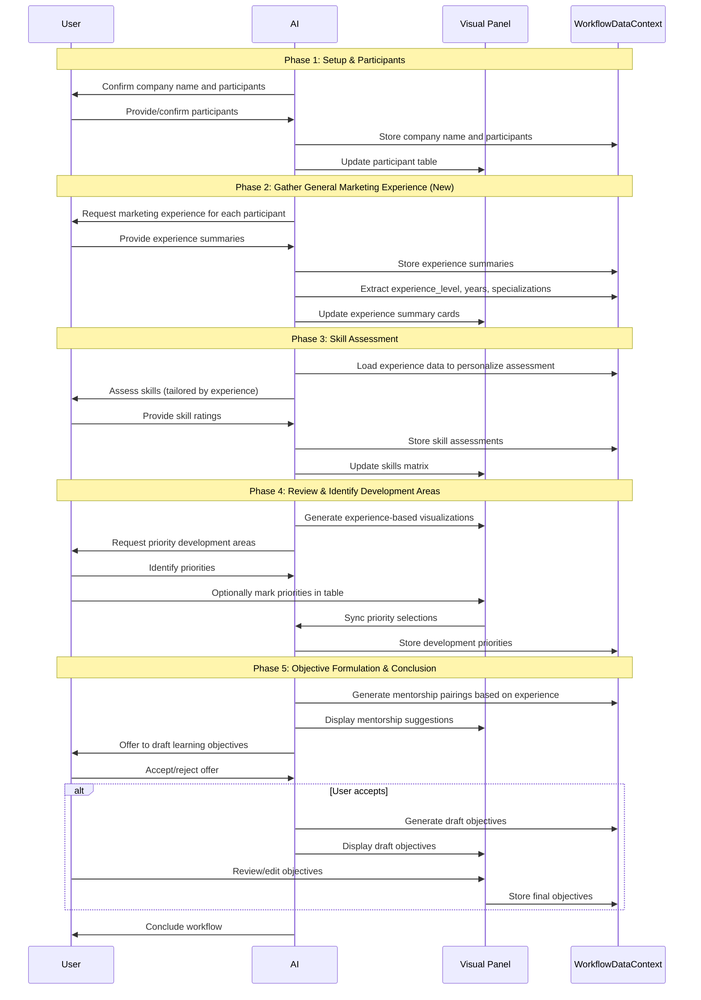

# Marketing Skills Assessment Workflow

## 1. Overview & Purpose

The Marketing Skills Assessment workflow guides users through assessing their team's marketing capabilities, identifying development areas, and creating actionable objectives for the Learning & Growth perspective of a Balanced Scorecard.

This workflow prioritizes user-centricity and efficiency by leveraging pre-existing data (onboarding_company_name, onboarding_team_members) to minimize redundant data entry and streamline the user experience.

## 2. Workflow Sequence Diagram

## 3. Key Data Flow Paths

1. **Experience → Skill Assessment**: Participant experience data gathered in Phase 2 informs the skill assessment approach in Phase 3
2. **Experience + Skills → Mentorship**: Combined data from Phases 2 and 3 enables mentorship pairing suggestions in Phase 5
3. **Skills + Priorities → Objectives**: Skill assessments and priority selections feed into objective formulation
4. **All Data → Balanced Scorecard**: Final data flows to the Balanced Scorecard workflow for Learning & Growth perspective

## 4. Core Conversational Flow

### Phase 1: Introduction & Purpose
The goal is to guide the user through understanding their team's general marketing experience, then conducting a structured assessment of specific marketing skills, identifying development areas, and facilitating the creation of actionable objectives, particularly for a 'Learning & Growth' perspective in a Balanced Scorecard.345

AI Chat (Left Panel):
Greeting: "Hello! Let's work on assessing your marketing team's skills today. This process will help you identify key strengths and areas for development, which can then be used to create targeted objectives for your marketing strategy and balance scorecard.36"
Benefit Highlight: "By understanding your team's current skill set relative to your strategic goals, we can pinpoint training needs, optimize resource allocation, and foster continuous growth within your marketing department. This aligns with the 'Learning and Growth' perspective of a Balanced Scorecard, which focuses on employee learning and training to improve knowledge resources.35"
Initial Confirmation: "First, to confirm, are we conducting this skills assessment for your company, [onboarding_company_name]?"
Visual Components (Right Panel):
Initial Display: A title card prominently displaying "Marketing Skills Assessment." Below the title, a brief introductory text: "Identify core marketing competencies, assess current proficiency, and pinpoint development opportunities for your team to align with strategic objectives."
Phase 1: Setup & Participants
This phase focuses on confirming the company and identifying the individuals whose marketing skills will be assessed.16

A. AI Chat Guidance & Data Collection (Left Panel):

Information Check & Prompts (Company Name):
If onboarding_company_name exists: "I have your company name as '[onboarding_company_name]'. Is this correct for our Marketing Skills Assessment today?"
User confirms ("Yes", "That's correct"): AI: "Great! Let's proceed."
User corrects ("No", "It's [New Name]"): AI: "Understood. What is the correct company name for this assessment?" The AI will then update the workflow_data.company_name variable and confirm: "Okay, I've updated the company name to [New Name]."
If onboarding_company_name does not exist: "First, what is the name of your company for this marketing skills assessment?" The AI captures the user's input for workflow_data.company_name.
Information Check & Prompts (Participants):
AI: "Next, who will be assessed? We can assess an individual, or multiple members of your marketing team.8"
If onboarding_team_members exists: "From your onboarding, I have the following team members listed: [List names from onboarding_team_members]. Would you like to assess some or all of these individuals, or do you need to add/remove anyone for this specific exercise?"
User confirms ("Yes, these", "All of them"): AI: "Excellent. We'll use these team members for the assessment." The AI populates the right panel with these names for user review.
User wants to select/modify ("Some of these", "Let me pick", "Need to add/remove"): AI: "No problem. Please clarify which team members should be part of this assessment. You can list their names, or indicate if you'd like to add/remove from the current list." The AI then facilitates the addition/removal of participants, prompting for name and optional role/email for new entries. It will ask "Anyone else?" after each addition until the user indicates completion.
User wants to assess self only: "I'll just assess myself." AI: "Understood. What is your name and role, if you'd like it noted?"
If onboarding_team_members does not exist or user explicitly wants a fresh start: "Please list the names of the individuals you'd like to include in this marketing skills assessment, one by one. You can also specify their role. Type 'done' when finished." The AI will repeatedly prompt for names and roles until the user types "done."
Explanations: The AI can briefly explain the value of skills matrices for identifying gaps and fostering growth.6
Input Handling: Free text for company name, participant names, and roles. The AI interprets yes/no responses, and commands like "add" or "remove."
Data Captured:
workflow_data.company_name: string (e.g., "Acme Corp")
workflow_data.participants: Array<{ name: string, role?: string, id: string }> (e.g., [{name: "Jane Doe", role: "Marketing Director", id: "uuid-123"}])
B. Corresponding Visual Component(s) (Right Panel):

Component Choice: A text input field for the company name and a dynamic table for participant management.
Component Structure:
Company Name: A "Company for Assessment:" text input field, pre-filled with onboarding_company_name if available.
Participants Table: A table with columns for "Name" and "Role." It includes "Add Participant" and "Remove" buttons.
Pre-population & Chat-to-Visual Update: The "Company Name" field is pre-filled. The "Participants Table" dynamically updates as names are confirmed or added/removed via the chat.
Visual-to-Chat Update: If the user directly edits the company name or modifies the participant list in the right panel, the AI acknowledges the change: "I see you've updated the company name to [New Name] in the right panel. Is that correct?" or "You've added/removed [Name] from the participant list."
Phase 2: Gather General Marketing Experience
This phase aims to capture a general overview of each participant's marketing background before diving into specific skill ratings.

A. AI Chat Guidance & Data Collection (Left Panel):

Introduction to Experience Gathering: "Great, we have our list of participants. Before we assess specific skills, let's get a brief overview of each person's general marketing experience. This will provide helpful context."
Looping through Participants:
For each participant in `workflow_data.participants`:
AI: "Let's start with [participant.name]. Could you briefly describe their overall marketing experience? For example, you might mention their years in marketing, main areas of expertise or specialization, key roles they've held, or significant achievements."
Captures user input for `marketing_experience_summary`.
AI: "Thanks, that's helpful. (If there are more participants) Now, for [next_participant.name]..."
Input Handling: Free text for the experience summary.
Data Captured: Updates `workflow_data.participants` with a `marketing_experience_summary` for each participant:
workflow_data.participants: Array<{
... (existing fields)
marketing_experience_summary?: string
experience_level?: 'Junior' | 'Mid-level' | 'Senior' | 'Expert' // Optional derived field
years_in_marketing?: number // Optional extracted field if provided in summary
specialization_areas?: string[] // Optional extracted key areas from summary
}>

B. Corresponding Visual Component(s) (Right Panel):

Component Choice: A section for each participant where their experience summary can be viewed and edited.
Component Structure:
For each participant: A collapsible section or card titled with their name.
Inside each section: A multi-line text input field (e.g., `Textarea`) labeled "Marketing Experience Summary for [participant.name]".
Pre-population & Chat-to-Visual Update: As the user provides the experience summary via chat for a participant, it appears in the corresponding text area in the right panel.
Visual-to-Chat Update: If the user directly types or edits the experience summary in a participant's text area, the AI acknowledges: "I see you've updated the experience summary for [participant.name]. That's noted."

Phase 3: Skill Assessment (Iterative)
This is the core of the assessment, where the system iterates through specific skills for each participant, potentially informed by the general experience gathered in Phase 2.

A. AI Chat Guidance & Data Collection (Left Panel):

Introduction to Assessment: "Now that we have an overview of everyone's background, let's move on to the detailed skill assessment. We'll go through various marketing skills, and for each skill, you'll be able to rate its importance and the participant's current proficiency.17"
Guidance on Rating: "For 'Importance,' consider how crucial the skill is for the participant's role and your overall marketing goals (e.g., Not Important, Important, Critical). For 'Proficiency,' think about the participant's current ability (e.g., Novice, Intermediate, Expert). This helps in understanding skill gaps and identifying opportunities for Learning & Development.36"

AI Knowledge Application: "Based on [participant.name]'s experience summary, I'll highlight skills that may align with their background, but please correct me if my assumptions aren't accurate."
Looping through Participants:
For each participant in `workflow_data.participants`:
AI: "Let's start with [participant.name] ([participant.role if available]). Given their background in [key area from experience summary], we'll go through the skills from the Marketing Skills Matrix.1"
Guiding through Skill Categories: "We'll cover 'Strategic Skills' and 'Tactical Skills', categorized by 'Low', 'Medium', and 'High' difficulty.17"
Looping through Skills (based on the Marketing Skills Matrix):
For each skill (e.g., 'SWOT Internal Analysis' under Strategic/Low difficulty):
AI: "Considering '[participant.name]', what level of importance would you assign to the skill: [skill.name]? (Options: Not Important, Important, Critical)"
Captures user input for importance.
AI: "And what is [participant.name]'s current proficiency level in [skill.name]? (Options: Novice, Intermediate, Expert)"
Captures user input for proficiency.
AI: "Based on their role and team goals, is [skill.name] a skill you'd like to target for [participant.name]'s development? (Yes/No)"
Captures user input for needs_development.
If needs_development is 'Yes': AI: "Great. What specific objective might be linked to developing [skill.name] for [participant.name]? This can be a brief idea for now."
Captures user input for development_objective_idea.
AI: "We've completed the skills assessment for [participant.name]. Moving to the next participant or to review if all are done.7"
Input Handling: AI expects categorical inputs (e.g., "Critical", "Expert", "Yes"). It will have fuzzy matching for common variations. Free text for development_objective_idea.
Data Captured: Updates `workflow_data.participants` with a `skills_assessment` array for each participant:
*   **Note on Skills Matrix:** The Marketing Skills Matrix is a predefined, comprehensive list of common strategic and tactical marketing skills maintained within the system.
workflow_data.participants: Array<{
... (existing fields)
skills_assessment: Array<{
skill_name: string (e.g., "SWOT Internal Analysis")
skill_type: 'Strategic' | 'Tactical'
difficulty: 'Low' | 'Medium' | 'High'
importance: 'Not Important' | 'Important' | 'Critical'
proficiency: 'Novice' | 'Intermediate' | 'Expert'
needs_development: boolean
development_objective_idea?: string
}>
}>
B. Corresponding Visual Component(s) (Right Panel):

Component Choice: An interactive table, segmented by participant, allowing for real-time updates and review.
Component Structure:
For each participant: A collapsible section or tab titled with their name and role.
Inside each section, a table with columns: "Skill Name", "Skill Type", "Difficulty", "Importance", "Proficiency", "Needs Development", "Development Objective Idea."
"Importance" and "Proficiency" columns should be dropdowns reflecting the AI's options for quick updates. "Needs Development" should be a checkbox, and "Development Objective Idea" a text area.
Pre-population & Chat-to-Visual Update: The table dynamically populates with skills as the AI asks about them. User inputs in the chat are reflected immediately in the corresponding table cells.
Visual-to-Chat Update: If the user directly changes a rating or development status in the table, the AI detects it: "I see you've updated [Skill Name]'s proficiency for [Participant Name] to [New Proficiency] in the panel." This allows for a bidirectional flow of information.

C. Dynamic Path Customization (Based on Experience):
Experience-Driven Suggestions: For participants with extensive experience in specific areas (as noted in Phase 2), the AI can prioritize higher-difficulty skills in those domains.
For example: "I notice from Jane's experience summary that she has extensive background in SEO. Let's focus on some of the more advanced SEO skills in the assessment."
Skill Prioritization: For junior team members, the AI can prioritize foundational skills first.

Phase 4: Review & Identify Development Areas
This phase allows the user to review the comprehensive assessment (skills and general experience) and pinpoint high-priority development needs.

A. AI Chat Guidance & Data Collection (Left Panel):

AI: "We've now completed the initial assessment for all participants. Let's review the results and identify the most critical skill development areas.6"
AI: "Looking at the summary in the right panel, do you see any skills that stand out as high-priority development needs for the [onboarding_company_name] marketing team as a whole, or specific individuals?6"
Prompt for User Input: "You can tell me, for example, 'Lead Scoring is very important for John to develop', or 'Our whole team needs to improve in Marketing Analytics'."
Looping: AI can prompt for multiple high-priority skills: "Any other key development areas you'd like to highlight?" It will continue to ask until the user indicates completion.
Confirmation: "So, to confirm, the top development priorities are: [List of skills identified by user]. Is that right?"
Input Handling: Free text for identifying skills and targets (individual or team). AI will parse the input recognizing skill names identified in Phase 3 (the detailed skill assessment phase).
Data Captured:
workflow_data.priority_development_skills: Array<{ skill_name: string, target_for: Array<string>, why_priority?: string }> // `target_for` contains participant IDs or the literal string 'team'
B. Corresponding Visual Component(s) (Right Panel):

Component Choice: A consolidated, interactive summary table that allows sorting and filtering.
Component Structure:
A single table displaying all assessed skills for all participants.
Collapsible Experience Summary: For each participant, a collapsible section showing their experience summary can be expanded above their skills.
Columns: "Participant Name", "Skill Name", "Skill Type", "Difficulty", "Importance", "Proficiency", "Needs Development."
Enhancements: Implement color-coding (e.g., Red for Critical Importance + Novice Proficiency), filtering options (by Participant, Skill Type, Needs Development = Yes), and a checkbox column to mark skills as "High Priority Development."
Pre-population: Populated with all data from workflow_data.participants.skills_assessment.
Visual-to-Chat Update: If the user marks skills as "High Priority Development" directly in the table, the AI will acknowledge: "I see you've marked [Skill Name] as a high priority for [Participant Name] in the panel. That's a great insight."
C. Experience-Based Visualizations:
Team Experience Map: A visual representation showing the distribution of expertise across the team.
Skill Gap Analysis: A chart highlighting the relationship between experience levels and skill proficiency across the team.

Phase 5: Objective Formulation Assistance & Conclusion
This final phase offers AI-assisted objective drafting (leveraging both experience and skill data) and concludes the assessment, providing clear next steps.

A. AI Chat Guidance & Data Collection (Left Panel):

Mentorship Suggestions: "Based on your team's experience and skill assessment, I can also suggest potential mentorship pairings. For example, [Expert Name] could mentor [Novice Name] on [Skill], leveraging their expertise in this area."

Assistance Offer: "Based on our assessment and the high-priority development areas you've identified, would you like me to help draft some preliminary objectives for your marketing team's Balanced Scorecard, focusing on the 'Learning & Growth' perspective?345"
(If User says 'Yes'): AI: "Excellent! I can generate objectives for skills like: [list top 3-5 confirmed priority_development_skills including target for] based on their importance and current proficiency.3"
AI: "For example, for 'Marketing Analytics' identified as a priority for the team, an objective could be: 'Improve the team's proficiency in Marketing Analytics to enhance data-driven decision making by Q4.'3"
AI: "Generating objectives now..."
AI presents drafted objectives. "Here are some draft objectives for your review: [List drafted objectives with placeholders for metrics/timeline]. You can refine these objectives in the right panel.2"
AI: "Do any of these resonate, or would you like me to suggest alternatives?"
(If User says 'No'): AI: "No problem. You can always revisit this later."
Concluding the Workflow Step: "We've now completed the Marketing Skills Assessment. You have a clear overview of your team's current capabilities and prioritized areas for growth.6"
Call to Action/Next Steps: "The summary in the right panel encapsulates all the data we've gathered. You can export this report or proceed to the 'Balanced Scorecard' module to formally integrate these learning & growth objectives into your strategic planning.34"
Input Handling: Yes/No, and free text for refinement suggestions.

Data Captured:

workflow_data.suggested_objectives: Array<{ objective_text: string, linked_skill: string, linked_participants: Array<string>, balanced_scorecard_perspective: string, status: 'draft' | 'final' }> // `linked_participants` contains participant IDs or the literal string 'team'
B. Corresponding Visual Component(s) (Right Panel):

Component Choice: A read-only summary table and a dedicated section for editable objectives.
Component Structure:
Experience Summaries: A collapsible section showing all participants' experience summaries.
Skills Summary Table: The final, comprehensive table from Phase 4 (previously Phase 3), now displayed as read-only, reflecting all captured data (workflow_data.participants.skills_assessment and workflow_data.priority_development_skills).
Objectives Editor: A section titled "Draft Learning & Growth Objectives." It displays the AI-generated workflow_data.suggested_objectives in editable text blocks or a rich text editor.
Action Buttons: "Export Report" and "Proceed to Balanced Scorecard."
Pre-population: If AI generates objectives, they appear here.
Visual-to-Chat Update: If the user directly edits an objective in the editor, the AI can detect this and acknowledge: "I see you're refining the objective for [Skill]. That's an excellent adjustment."
C. Mentorship Recommendations Component:
Suggested Pairings: A section titled "Suggested Mentorship Pairings" that displays AI-generated mentorship recommendations based on experience levels and skill proficiencies.
Format: "[Expert Name] → [Novice Name]: [Skill Area]" with a brief rationale.
Interactive Elements: Options to "Accept", "Modify", or "Reject" each pairing suggestion.

Overall Data Structure & Integration:
The complete data object, workflow_data, will be stored within the platform's WorkflowDataContext, making it accessible for other strategic modules, such as a Balanced Scorecard builder.

{
  "workflow_step_name": "Marketing Skills Assessment",
  "company_name": "Acme Corp", // Derived from onboarding_company_name or user input
  "assessment_date": "YYYY-MM-DD", // Date of completion
  "participants": [
    {
      "id": "uuid-participant-1", // Unique ID for each participant
      "name": "Jane Doe",
      "role": "Marketing Director",
      "marketing_experience_summary": "10+ years in digital marketing, specialized in SEO and SEM. Previously Head of Digital at StartupX.",
      "experience_level": "Senior", // Derived from experience summary
      "years_in_marketing": 10, // Extracted from experience summary
      "specialization_areas": ["SEO", "SEM", "Digital Marketing"], // Extracted from experience summary
      "skills_assessment": [
        {
          "skill_name": "Marketing Analytics",
          "skill_type": "Strategic",
          "difficulty": "High",
          "importance": "Critical",
          "proficiency": "Intermediate",
          "needs_development": true,
          "development_objective_idea": "Improve data interpretation for campaigns."
        },
        {
          "skill_name": "Content Creation",
          "skill_type": "Tactical",
          "difficulty": "Medium",
          "importance": "Important",
          "proficiency": "Expert",
          "needs_development": false,
          "development_objective_idea": null
        }
        // ... more skills for Jane Doe
      ]
    },
    {
      "id": "uuid-participant-2",
      "name": "John Smith",
      "role": "Content Specialist",
      "marketing_experience_summary": "3 years in content creation and social media management. Strong portfolio in B2B tech writing.",
      "experience_level": "Mid-level", // Derived from experience summary
      "years_in_marketing": 3, // Extracted from experience summary 
      "specialization_areas": ["Content Creation", "Social Media", "B2B Writing"], // Extracted from experience summary
      "skills_assessment": [
        // ... skills for John Smith
      ]
    }
  ],
  "priority_development_skills": [
    {
      "skill_name": "Marketing Analytics",
      "target_for": ["uuid-participant-1", "team"], // can be specific participant IDs or 'team'
      "why_priority": "Enhance data-driven decision making across the team."
    },
    {
      "skill_name": "Lead Scoring",
      "target_for": ["uuid-participant-1"],
      "why_priority": "Improve lead qualification process for better sales handoff."
    }
  ],
  "suggested_objectives": [
    {
      "objective_text": "Improve the marketing team's proficiency in Marketing Analytics to enhance data-driven decision making by Q4.",
      "linked_skill": "Marketing Analytics",
      "linked_participants": ["team"],
      "balanced_scorecard_perspective": "Learning & Growth",
      "status": "draft" // or 'final' if confirmed by user
    },
    {
      "objective_text": "Enhance Jane Doe's ability in Lead Scoring to optimize sales funnel conversion rates within next 6 months.",
      "linked_skill": "Lead Scoring",
      "linked_participants": ["uuid-participant-1"],
      "balanced_scorecard_perspective": "Learning & Growth",
      "status": "draft"
    }
  ],
  "suggested_mentorships": [
    {
      "mentor_id": "uuid-participant-1",
      "mentee_id": "uuid-participant-2",
      "skill_focus": "SEO",
      "rationale": "Jane's extensive SEO experience makes her an ideal mentor for John who has expressed interest in developing this skill.",
      "status": "suggested" // or 'accepted', 'rejected'
    },
    {
      "mentor_id": "uuid-participant-2",
      "mentee_id": "uuid-participant-1",
      "skill_focus": "Content Creation",
      "rationale": "While John can learn SEO from Jane, he can mentor her on content creation best practices based on his B2B writing expertise.",
      "status": "suggested"
    }
  ]
}
