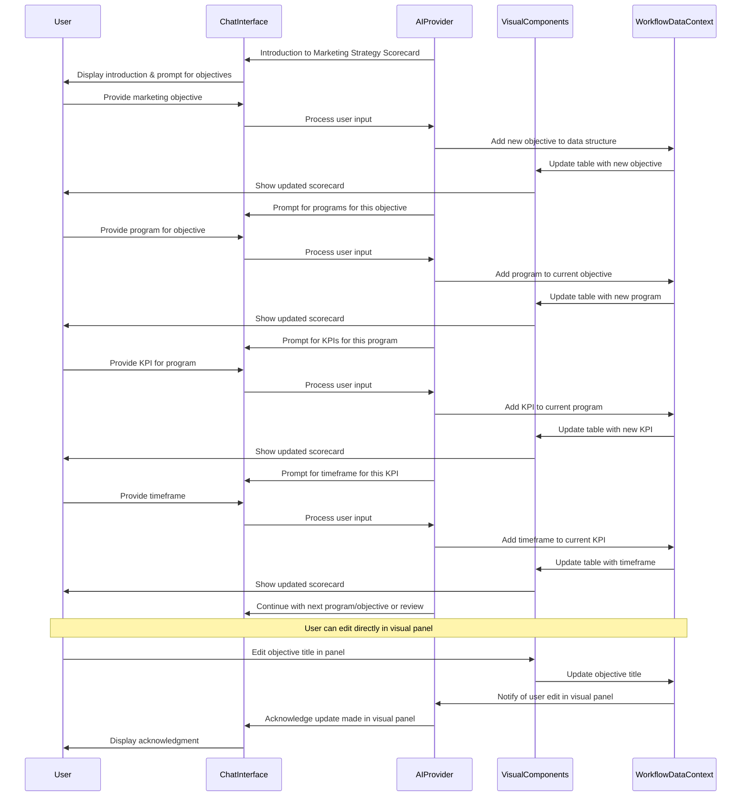

# Marketing Strategy Scorecard Workflow

## 1. Overview & Purpose

This AI-powered conversational tool guides users through creating a comprehensive Marketing Strategy Scorecard. It helps marketing teams define objectives, programs/initiatives, key performance indicators, and target timeframes to achieve their marketing goals. The process captures structured marketing strategy data that can be visualized, tracked, and integrated with the broader strategic planning framework.

## 2. Target User & Context

**User:** Marketing leaders, CMOs, marketing managers, and strategic planners responsible for marketing initiatives.

**Context:** This workflow complements other marketing strategy components like marketing skills assessment and competitive analysis. It helps translate high-level marketing goals into actionable programs with concrete metrics and timeframes, facilitating better execution, monitoring, and alignment with broader business objectives.

## 3. Core Conversational Flow

### General Principle
As the AI guides the user through defining marketing objectives and their associated elements, the right visual panel will dynamically display this information in an organized tabular format. This follows the **Visual Augmentation** and **Bidirectional Updates** principles from the Chat-Driven Workflow Pattern.

### Phase 1: Introduction to Marketing Strategy Scorecard

**AI Initiative (Left Panel - Chat):**
"Welcome to the Marketing Strategy Scorecard workflow! This tool will help you define your key marketing objectives along with the programs to achieve them, metrics to measure success, and timeframes for completion.

A well-structured marketing scorecard helps align your team, track progress, and demonstrate marketing's contribution to business goals. We'll work through creating your scorecard step by step. Ready to begin?"

**Visual Component (Right Panel):**
Initial State: A title card "Marketing Strategy Scorecard for [onboarding_company_name]" with a brief explanation of the scorecard's purpose and structure.

An empty table structure with column headers:
- Marketing Objectives
- Programs, Initiatives, & Actions
- Key Performance Indicators & Metrics
- Target Timeframe to Achieve Goals

### Phase 2: Defining Marketing Objectives

**AI Guidance (Chat):**
"Let's start by defining your key marketing objectives. These are the major goals your marketing efforts aim to achieve. Examples might include 'Increase Market Penetration of Current Products', 'Improve Customer Retention', or 'Enhance Brand Awareness'.

What marketing objectives would you like to include in your scorecard? You can share one at a time or list multiple objectives."

**User Input (Chat):** 
User provides marketing objectives. The AI should recognize whether the user is providing a single objective or multiple objectives separated by commas, line breaks, etc.

**AI Processing:**
For each objective provided, the AI:
1. Generates a unique ID
2. Creates an entry in the objectives array
3. Updates the visual display to show the new objective(s)

**Chat-to-Visuals (Right Panel):**
As objectives are identified, they appear as rows in the table on the right panel. Initially, only the "Marketing Objectives" column is populated.

**Data Captured:** 
```typescript
marketing_strategy_scorecard: {
  objectives: Array<{
    id: string,
    title: string,
    programs: [] // Empty initially
  }>
}
```

**AI Confirmation (Chat):**
"I've added [list of objectives] to your Marketing Strategy Scorecard. Now, let's define the programs, initiatives, and actions for each objective."

### Phase 3: Defining Programs for Each Objective (Iterative)

**AI Guidance (Chat):**
"Let's focus on your objective: '[objective title]'. What programs, initiatives, or actions will you implement to achieve this objective? These are the specific activities your team will undertake."

**User Input (Chat):**
User provides programs/initiatives for the current objective.

**AI Processing:**
For each program provided:
1. Generates a unique ID
2. Adds it to the programs array for the current objective
3. Updates the visual display

**Chat-to-Visuals (Right Panel):**
The table now shows programs associated with each objective in the "Programs, Initiatives, & Actions" column.

**Data Captured:**
```typescript
// For the current objective:
programs: Array<{
  id: string,
  description: string,
  kpis: [] // Empty initially
}>
```

**AI Confirmation (Chat):**
"I've added these programs for your objective '[objective title]'. Now, let's define the key performance indicators for each program."

### Phase 4: Defining KPIs for Each Program (Iterative)

**AI Guidance (Chat):**
"For the program '[program description]' under objective '[objective title]', what key performance indicators or metrics will you use to measure success? These should be specific and measurable."

**User Input (Chat):**
User provides KPIs for the current program.

**AI Processing:**
For each KPI provided:
1. Generates a unique ID
2. Adds it to the kpis array for the current program
3. Updates the visual display

**Chat-to-Visuals (Right Panel):**
The table now includes KPIs in the "Key Performance Indicators & Metrics" column.

**Data Captured:**
```typescript
// For the current program:
kpis: Array<{
  id: string,
  metric: string,
  target_timeframe: "" // Empty initially
}>
```

**AI Confirmation (Chat):**
"I've added these KPIs for the program '[program description]'. Next, let's define target timeframes for each KPI."

### Phase 5: Defining Target Timeframes (Iterative)

**AI Guidance (Chat):**
"For the KPI '[KPI metric]' under program '[program description]', what is your target timeframe for achieving this goal? For example, 'By end of Q2', '50% by year-end', etc."

**User Input (Chat):**
User provides timeframes for each KPI.

**AI Processing:**
For each timeframe provided:
1. Updates the target_timeframe field for the corresponding KPI
2. Updates the visual display

**Chat-to-Visuals (Right Panel):**
The table now includes timeframes in the "Target Timeframe to Achieve Goals" column.

**Data Captured:**
```typescript
// For the current KPI:
target_timeframe: string
```

**AI Confirmation (Chat):**
"I've added the target timeframe for this KPI. Let's continue with the next KPI/program/objective or review what we've created so far."

### Phase 6: Review & Finalization

**AI Guidance (Chat):**
"We've now completed your Marketing Strategy Scorecard! It includes [number] objectives, with associated programs, KPIs, and target timeframes. You can review the complete scorecard in the panel on the right.

Would you like to make any changes or adjustments? You can edit directly in the panel or tell me what you'd like to modify."

**Visual Component (Right Panel):**
The complete scorecard is displayed with all objectives, programs, KPIs, and timeframes in a structured table format. Each element is editable, with options to add, modify, or delete entries.

**AI Closing (Chat):**
"Your Marketing Strategy Scorecard is now ready for implementation. This scorecard will help you track progress, align your team, and demonstrate marketing's contribution to your business goals. You can export this scorecard or integrate it with your other strategic planning documents."

## 4. Visual Components

### shadcn/ui Component Mapping

| UI Element | shadcn/ui Component | Usage |
|------------|---------------------|-------|
| Main Container | `<ResizablePanelGroup>` | Split-panel layout for chat and visual components |
| Scorecard Table | `<Table>` with related components | Main display for the scorecard data |
| Objective Rows | `<TableRow>` | Rows for each marketing objective |
| Editable Cells | `<Input>` or custom editable cells | For modifying entries directly in the visual panel |
| Add Buttons | `<Button variant="ghost">` | For adding new objectives, programs, KPIs |
| Delete Buttons | `<Button variant="destructive">` | For removing entries |
| Section Headers | `<TableHeader>` | Column headers for the scorecard |
| Action Menu | `<DropdownMenu>` | For actions like export, save, etc. |

### Example Table Component (Conceptual)

```tsx
import { Table, TableHeader, TableBody, TableRow, TableHead, TableCell } from "@/components/ui/table";
import { Button } from "@/components/ui/button";
import { Input } from "@/components/ui/input";
import { Plus, Trash } from "lucide-react";

interface MarketingScorecard {
  objectives: Array<{
    id: string;
    title: string;
    programs: Array<{
      id: string;
      description: string;
      kpis: Array<{
        id: string;
        metric: string;
        target_timeframe: string;
      }>;
    }>;
  }>;
}

interface ScorecardTableProps {
  data: MarketingScorecard;
  onUpdate: (updatedData: MarketingScorecard) => void;
}

export function ScorecardTable({ data, onUpdate }: ScorecardTableProps) {
  // Handlers for adding/editing/deleting items
  const handleAddObjective = () => { /* Implementation */ };
  const handleEditObjective = (id: string, newTitle: string) => { /* Implementation */ };
  const handleDeleteObjective = (id: string) => { /* Implementation */ };
  // Similar handlers for programs, KPIs, timeframes

  return (
    <div className="space-y-4">
      <div className="flex justify-between items-center">
        <h2 className="text-2xl font-bold">Marketing Strategy Scorecard</h2>
        <Button onClick={handleAddObjective}>
          <Plus className="h-4 w-4 mr-2" /> Add Objective
        </Button>
      </div>
      
      <Table>
        <TableHeader>
          <TableRow>
            <TableHead className="w-[250px]">Marketing Objectives</TableHead>
            <TableHead className="w-[250px]">Programs, Initiatives, & Actions</TableHead>
            <TableHead className="w-[250px]">Key Performance Indicators & Metrics</TableHead>
            <TableHead className="w-[250px]">Target Timeframe to Achieve Goals</TableHead>
            <TableHead className="w-[80px]">Actions</TableHead>
          </TableRow>
        </TableHeader>
        <TableBody>
          {data.objectives.map(objective => (
            // For each objective, render rows for all programs and KPIs
            // This would require row spanning or nested tables in a real implementation
            <TableRow key={objective.id}>
              <TableCell>
                <Input value={objective.title} onChange={e => handleEditObjective(objective.id, e.target.value)} />
              </TableCell>
              <TableCell>{/* Program cells with editing capability */}</TableCell>
              <TableCell>{/* KPI cells with editing capability */}</TableCell>
              <TableCell>{/* Timeframe cells with editing capability */}</TableCell>
              <TableCell>
                <Button variant="ghost" size="icon" onClick={() => handleDeleteObjective(objective.id)}>
                  <Trash className="h-4 w-4" />
                </Button>
              </TableCell>
            </TableRow>
          ))}
        </TableBody>
      </Table>
    </div>
  );
}
```

## 5. Data Structure & Integration

### Complete Data Structure

```typescript
// Within the broader WorkflowDataContext
marketing_strategy_scorecard: {
  company_name?: string; // from onboarding if available
  objectives: Array<{
    id: string,
    title: string,
    programs: Array<{
      id: string,
      description: string,
      kpis: Array<{
        id: string,
        metric: string,
        target_timeframe: string
      }>
    }>
  }>,
  // Metadata
  last_updated_at: string,
  status: 'in_progress' | 'completed',
  created_by?: string
}
```

### Integration with Other Workflows

The Marketing Strategy Scorecard can be integrated with:

1. **Balanced Scorecard**: Marketing objectives can feed into or align with the four perspectives of the balanced scorecard, especially the Customer and Internal Business Process perspectives.

2. **Marketing Skills Assessment**: Skills identified for development can be linked to programs and initiatives in the Marketing Strategy Scorecard.

3. **Competitor Analysis**: Competitive insights can inform marketing objectives and programs.

4. **Brand Assessment**: Brand strengths and weaknesses can drive specific marketing objectives and programs.

## 6. Workflow Sequence Diagram



## 7. Cross-Cutting Concerns

### Accessibility Considerations
- Ensure table structure is screen-reader friendly with proper headers and row associations
- Use ARIA labels where appropriate for interactive elements
- Maintain sufficient color contrast for all visual elements
- Provide keyboard navigation for all interactive components

### Performance Considerations
- Implement lazy loading for large scorecards with many objectives
- Consider pagination or virtualization for tables with many rows
- Optimize state updates to prevent unnecessary re-renders
- Cache scorecard data appropriately to improve responsiveness

### Security Considerations
- Implement proper access controls for viewing and editing scorecards
- Sanitize user input to prevent injection attacks
- Ensure secure storage and transmission of scorecard data
- Consider role-based permissions for editing vs. viewing

### Internationalization & Localization
- Support for multiple languages in UI elements and AI prompts
- Localized date formats for timeframes
- Culturally appropriate examples in AI guidance
- RTL language support for applicable locales
