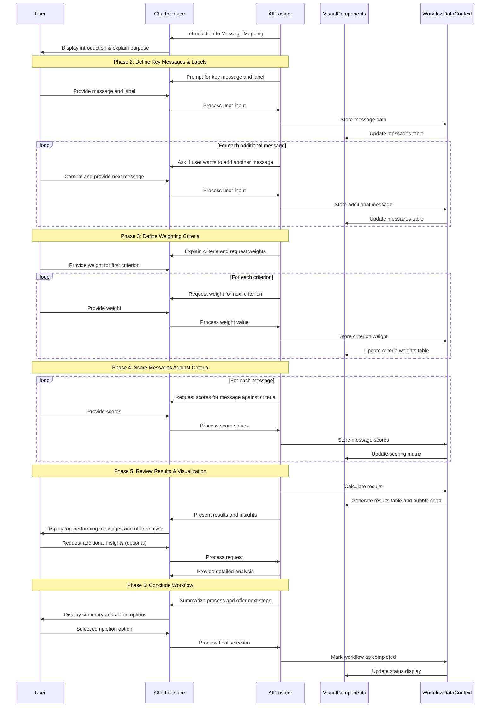

# Message Mapping Workflow

## 1. Overview & Purpose

This AI-powered conversational tool guides users through evaluating and prioritizing key marketing messages for their organization. By applying weighted criteria to each message, the tool helps users identify which messages are most effective, credible, and resonant with their target audience.

The workflow enables marketing teams to align their communication strategy, clarify their key messages, and ensure consistency across all marketing channels. The visual scoring matrix and effectiveness vs. resonance chart provide actionable insights into message performance, helping teams refine their communication for maximum impact.

## 2. Target User & Context

**User:** Marketing managers, communications directors, brand strategists, and business owners responsible for developing consistent messaging across marketing channels.

**Context:** This workflow complements other marketing strategy components like brand assessment, customer personas, and content strategy. It serves as a bridge between strategic positioning and tactical content creation, ensuring that all marketing communications deliver a clear, consistent message aligned with business goals.

## 3. Core Conversational Flow

### General Principle

As the AI guides the user through defining and evaluating key messages, the right visual panel will dynamically display this information in a structured form. This follows the **Visual Augmentation** and **Bidirectional Updates** principles from the Chat-Driven Workflow Pattern, where changes in either panel are reflected in the other in real-time.

### Phase 1: Introduction to Message Mapping

**AI Chat Guidance & Data Collection (Left Panel):**
"Hello there! I'm here to help you refine your messaging strategy for [onboarding_company_name] using our Message Mapping Tool."

"This tool will help [onboarding_company_name] align its communication, clarify key messages, and ultimately enhance its impact across all your marketing and communication channels."

"By the end of this process, we'll have identified your most effective messages and visualize their strengths, so you can speak with one clear and consistent voice."

**Visual Components (Right Panel):**
- A prominent title card: "Message Mapping Tool"
- Below the title, a brief introductory text: "Refine and prioritize your company's key messages for maximum impact and consistency."
- (Optional) A visual placeholder for the upcoming "Key Messages" table

**Data Captured in this Phase:**
```typescript
message_mapping_data.company_name: string // onboarding_company_name (confirmed or updated by user)
```

### Phase 2: Define Key Messages & Short Labels

**AI Chat Guidance & Data Collection (Left Panel):**
"Let's start by defining the key messages you want to evaluate for [onboarding_company_name]."

"Key messages are the core points you want your audience to hear, understand, and remember. They should articulate what you do, why it matters, and what value you bring."

"For each message, please provide the full message and a concise, short label. For example, 'Our product has a 99.9% uptime so you never have to worry about our system being offline.' then 'Reliability'."

"Please provide your first key message and its short label. You can type them as 'Message: [Your Message] | Label: [Your Label]' or I can prompt you for each part."

Input Handling:
- If user provides both: AI parses and confirms.
- If user asks to be prompted:
  - "Okay, what is the full key message?" (User inputs long message.)
  - "Great. What short label would you like to assign to this message?" (User inputs short label.)
- After each message is added: "Message '[Label]' has been added. Would you like to add another message? (Yes/No)"
- If 'No': "You've added X messages. You can review and edit them in the right panel if needed."
- Allows user to say "I need to edit 'Reliance'" or "Remove 'Assurance'". AI then guides the user to make the change in the visual panel.

**Visual Components (Right Panel):**
- A table with the following structure:
  - Table Title: "Your Key Messages"
  - Columns: "Key Message" (Rich Text / Multi-line input), "Short Label" (Single-line input)
  - Rows: Dynamically added as messages are provided by the user via chat or directly in the table
  - Each row will have an "Edit" (pencil icon) and "Delete" (trash can icon) button
  - An "Add New Message" button below the table

**Data Captured in this Phase:**
```typescript
message_mapping_data.key_messages: Array<{
  id: string, // Unique ID for each message
  message: string,
  label: string
}>
```

### Phase 3: Define Weighting Criteria

**AI Chat Guidance & Data Collection (Left Panel):**
"Now that we have your key messages, let's define how we'll evaluate them."

"We'll use a set of criteria to score each message. You can assign a percentage weight to each criterion based on its importance to [onboarding_company_name]'s communication goals. The total must equal 100%."

"Here are the criteria and their definitions. I'll read them out, and then you can tell me how important each is to you, as a percentage:"

- "Memorability: Is this message one that will be easily recalled and remembered?"
- "Aligned with Strategy: How aligned with corporate strategy is this message?"
- "Consistent with Positioning: Does this message stay consistent with the positioning statement?"
- "Objective: Is this message objective in nature? Does it avoid being too sensational and playing on emotions?"
- "Believable: Will this message be readily accepted and believed to be true?"
- "Not Fluffy: Is the message free of marketing hyperbole such as claims of 'world-class' or other lofty ideals?"
- "Trendy: Does this message hit on a topic of keen interest or trends of the moment?"
- "Impact: How impactful is this message? Is it something people care about or will really consider?"
- "Relevant: Is the message extremely relevant to the target audience for your product/service?"

"Let's start with Memorability. What percentage weight would you like to give it?"

Input Handling:
- User provides percentage for each. AI keeps a running total.
- If total doesn't reach 100% after all inputs: "Your current total is X%. We need to reach 100%. Would you like to re-distribute the weights, or would you like me to suggest an even distribution for the remaining criteria?"
- User can type "Set Memorability to 15%" or "Change Believable to 20%".
- User can also edit percentages directly in the right panel.

**Visual Components (Right Panel):**
- A form or table displaying criteria with input fields for percentages:
  - Table Title: "Message Evaluation Criteria Weighting"
  - Columns: "Criterion", "Definition", "Weight (%)"
  - Rows: Each of the nine criteria listed above
  - "Definition" content clearly visible (or on hover/tooltip)
  - "Weight (%)" column displays an input field (e.g., number input with up/down arrows or dropdown for common percentages)
  - A "Total Weight" display showing the sum of current percentages, dynamically updating as user types. This display should turn red if total is not 100%.
  - A "Reset to Default" button

**Data Captured in this Phase:**
```typescript
message_mapping_data.criteria_weights: {
  memorability: number,
  aligned_with_strategy: number,
  consistent_with_positioning: number,
  objective: number,
  believable: number,
  not_fluffy: number,
  trendy: number,
  impact: number,
  relevant: number
}
// Example: { "memorability": 0.15, "aligned_with_strategy": 0.10, ... }
```

### Phase 4: Score Messages Against Criteria

**AI Chat Guidance & Data Collection (Left Panel):**
"Excellent! Now we'll score each of your key messages against these criteria. We'll use a scale of 1 to 10, where 1 means it scores very low on the criterion, and 10 means it scores very high."

"Let's begin with your first message: '[First Message Label]'."

"On a scale of 1 to 10, how Memorable is '[First Message Label]'?"

"Now, how Aligned with Strategy is '[First Message Label]'?"

(Continues for all criteria for the first message, then moves to the next message.)

Input Handling:
- User provides a number (1-10)
- AI verifies input is within range. If not, asks for clarification.
- User can say "Skip this message for now" or "Go back to the previous message".
- User can also directly input scores in the right panel.

**Visual Components (Right Panel):**
- A scoring matrix (table):
  - Table Title: "Message Scoring Matrix"
  - Rows: Each key_message.label (from Phase 2)
  - Columns: Each criterion name (from Phase 3)
  - Column Headers: Display criterion name and its assigned weight (e.g., "Memorability (15%)")
  - Cells: Input fields (e.g., dropdowns 1-10, or number input with validation) for each message's score against each criterion

**Data Captured in this Phase:**
```typescript
message_mapping_data.message_scores: Array<{
  message_id: string,
  scores: {
    memorability: number,
    aligned_with_strategy: number,
    consistent_with_positioning: number,
    objective: number,
    believable: number,
    not_fluffy: number,
    trendy: number,
    impact: number,
    relevant: number
  }
}>
```

### Phase 5: Review Results & Visualization

**AI Chat Guidance & Data Collection (Left Panel):**
"All scores are in! I've calculated the weighted scores for each of your messages based on the criteria you prioritized."

"Your top-performing message is currently '[Highest Scored Message Label]' with a total score of [Score]."

"You can see the detailed scores and a visual representation of your messages' Effectiveness versus Resonance in the right panel."

"Would you like me to explain the insights from these results, or perhaps suggest ways to improve messages that scored lower?"

If Yes: "The 'Effectiveness' score combines Memorability, Alignment with Strategy, and Consistency with Positioning. The 'Resonance' score looks at how Trendy, Impactful, and Relevant your messages are. This visualization helps you see which messages are strong in engaging your audience and which might need more work."

"To improve a message with low Resonance, for example, you might consider adjusting its wording to be more current or directly address a pressing audience need."

**Visual Components (Right Panel):**
- Component 1: Scored Messages Table
  - Table Title: "Scored Messages Overview"
  - Columns: "Messages" (Labels), "Score" (Calculated, sortable), "Effectiveness" (Calculated), "Credibility" (Calculated), "Resonance" (Calculated)
  - Values populated based on message_scores and criteria_weights
  - Calculation Logic:
    - total_score = Sum of (message_score[criterion] * criteria_weights[criterion]) for all criteria
    - effectiveness_score = Weighted average of Memorability, Aligned with Strategy, Consistent with Positioning scores
    - credibility_score = Weighted average of Objective, Believable, Not Fluffy scores
    - resonance_score = Weighted average of Trendy, Impact, Relevant scores

- Component 2: Bubble Chart
  - Chart Title: "Message Effectiveness vs. Resonance"
  - Type: Scatter plot with sized bubbles
  - Axes: X-axis: Effectiveness, Y-axis: Resonance
  - Bubbles: Each bubble represents a key_message
    - Position: (effectiveness_score, resonance_score)
    - Size: Proportional to total_score
    - Label: key_message.label
  - Interactive: Hover over a bubble to see full details (Message, Label, Full Score, Effectiveness, Credibility, Resonance)

**Data Captured in this Phase:**
```typescript
message_mapping_data.calculated_results: Array<{
  message_id: string,
  label: string,
  total_score: number,
  effectiveness_score: number,
  credibility_score: number,
  resonance_score: number
}>
```

### Phase 6: Concluding the Workflow

**AI Chat Guidance & Data Collection (Left Panel):**
"You've successfully completed the Message Mapping Tool for [onboarding_company_name]!"

"You now have a clear understanding of your key messages, how they're weighted, and their performance across important criteria like Effectiveness, Credibility, and Resonance."

"This valuable insight can help you to refine your overall marketing strategy, optimize campaign materials, and ensure consistent communication across all touchpoints."

"Would you like to export these results, revisit any step, or discuss next steps for leveraging these insights?"

"If you have no further questions, just say 'Done' to finalize this session."

**Visual Components (Right Panel):**
- The final state of the Right Panel should be the "Scored Messages Overview" table and the "Message Effectiveness vs. Resonance" bubble chart, allowing the user to review all outputs
- An "Export Data (CSV/PDF)" button
- A "Print Report" button
- A "New Message Mapping Session" button

**Data Captured in this Phase:**
```typescript
message_mapping_data.status: 'in_progress' | 'completed'
message_mapping_data.last_updated_at: string // timestamp
```

## 4. Visual Components

### shadcn/ui Component Mapping

| UI Element | shadcn/ui Component | Usage |
|------------|---------------------|-------|
| Main Container | `<ResizablePanelGroup>` | Split-panel layout for chat and visual components |
| Title Card | `<Card>` with `<CardContent>` | Introduction and overview display |
| Messages Table | `<Table>` with related components | Display and editing of key messages |
| Criteria Table | `<Table>` with related components | Display and weighting of evaluation criteria |
| Scoring Matrix | `<Table>` with input elements | Matrix for scoring messages against criteria |
| Results Table | `<Table>` with sorting | Display calculated scores for messages |
| Bubble Chart | Custom visualization component | Display Effectiveness vs. Resonance |
| Text Fields | `<Input>` | Single-line text input fields |
| Multi-line Text | `<Textarea>` | For longer message text |
| Percentage Input | `<Input type="number">` with validation | For criteria weighting |
| Score Input | `<Select>` or `<Input type="number">` | For 1-10 scoring |
| Action Buttons | `<Button>` with variants | Edit, Delete, Export, etc. |

### Example Message Mapping Component (Conceptual)

```tsx
import { useState, useEffect } from 'react';
import { 
  Table, TableHeader, TableBody, TableRow, TableHead, TableCell,
  Card, CardHeader, CardTitle, CardContent, 
  Input, Textarea, Button, Alert, AlertDescription,
  Select, SelectContent, SelectItem, SelectTrigger, SelectValue,
} from "@/components/ui/";
import { BubbleChart } from "@/components/charts/BubbleChart";

interface KeyMessage {
  id: string;
  message: string;
  label: string;
}

interface MessageScores {
  message_id: string;
  scores: Record<string, number>;
}

interface CalculatedResult {
  message_id: string;
  label: string;
  total_score: number;
  effectiveness_score: number;
  credibility_score: number;
  resonance_score: number;
}

interface MessageMappingProps {
  companyName: string;
  initialMessages?: KeyMessage[];
  initialWeights?: Record<string, number>;
  onUpdate: (data: any) => void;
}

const DEFAULT_CRITERIA = [
  { name: "memorability", label: "Memorability", definition: "Is this message one that will be easily recalled and remembered?" },
  { name: "aligned_with_strategy", label: "Aligned with Strategy", definition: "How aligned with corporate strategy is this message?" },
  { name: "consistent_with_positioning", label: "Consistent with Positioning", definition: "Does this message stay consistent with the positioning statement?" },
  { name: "objective", label: "Objective", definition: "Is this message objective in nature?" },
  { name: "believable", label: "Believable", definition: "Will this message be readily accepted and believed to be true?" },
  { name: "not_fluffy", label: "Not Fluffy", definition: "Is the message free of marketing hyperbole?" },
  { name: "trendy", label: "Trendy", definition: "Does this message hit on a topic of keen interest or trends of the moment?" },
  { name: "impact", label: "Impact", definition: "How impactful is this message?" },
  { name: "relevant", label: "Relevant", definition: "Is the message extremely relevant to the target audience?" }
];

export function MessageMapping({
  companyName,
  initialMessages = [],
  initialWeights = {},
  onUpdate
}: MessageMappingProps) {
  const [activeTab, setActiveTab] = useState<'messages'|'weights'|'scoring'|'results'>('messages');
  const [messages, setMessages] = useState<KeyMessage[]>(initialMessages);
  const [weights, setWeights] = useState<Record<string, number>>(
    initialWeights || Object.fromEntries(DEFAULT_CRITERIA.map(c => [c.name, 0]))
  );
  const [messageScores, setMessageScores] = useState<MessageScores[]>([]);
  const [calculatedResults, setCalculatedResults] = useState<CalculatedResult[]>([]);
  
  // Calculate total weight
  const totalWeight = Object.values(weights).reduce((sum, weight) => sum + weight, 0);
  const isWeightValid = Math.abs(totalWeight - 100) < 0.01; // Allow small floating point errors
  
  // Add a new message
  const addMessage = () => {
    const newMessage: KeyMessage = {
      id: `msg-${Date.now()}`,
      message: "",
      label: ""
    };
    setMessages([...messages, newMessage]);
  };
  
  // Update message
  const updateMessage = (id: string, field: keyof KeyMessage, value: string) => {
    setMessages(messages.map(msg => 
      msg.id === id ? { ...msg, [field]: value } : msg
    ));
  };
  
  // Delete message
  const deleteMessage = (id: string) => {
    setMessages(messages.filter(msg => msg.id !== id));
    setMessageScores(messageScores.filter(score => score.message_id !== id));
    setCalculatedResults(calculatedResults.filter(result => result.message_id !== id));
  };
  
  // Update criterion weight
  const updateWeight = (criterion: string, value: number) => {
    setWeights({ ...weights, [criterion]: value });
  };
  
  // Reset weights to even distribution
  const resetWeights = () => {
    const evenWeight = 100 / DEFAULT_CRITERIA.length;
    setWeights(Object.fromEntries(DEFAULT_CRITERIA.map(c => [c.name, evenWeight])));
  };
  
  // Update score for a message against a criterion
  const updateScore = (messageId: string, criterion: string, score: number) => {
    const existingScoreIndex = messageScores.findIndex(ms => ms.message_id === messageId);
    
    if (existingScoreIndex >= 0) {
      const updatedScores = [...messageScores];
      updatedScores[existingScoreIndex] = {
        ...updatedScores[existingScoreIndex],
        scores: { ...updatedScores[existingScoreIndex].scores, [criterion]: score }
      };
      setMessageScores(updatedScores);
    } else {
      setMessageScores([
        ...messageScores,
        {
          message_id: messageId,
          scores: { [criterion]: score }
        }
      ]);
    }
  };
  
  // Calculate results when scores or weights change
  useEffect(() => {
    if (messageScores.length === 0 || !isWeightValid) return;
    
    const results = messageScores.map(scoreData => {
      const messageId = scoreData.message_id;
      const message = messages.find(m => m.id === messageId);
      if (!message) return null;
      
      // Calculate total weighted score
      let totalScore = 0;
      for (const [criterion, score] of Object.entries(scoreData.scores)) {
        totalScore += (score * weights[criterion]) / 100;
      }
      
      // Calculate effectiveness score (memorability, aligned_with_strategy, consistent_with_positioning)
      const effectivenessCriteria = ['memorability', 'aligned_with_strategy', 'consistent_with_positioning'];
      const effectivenessScore = effectivenessCriteria.reduce((sum, criterion) => {
        return sum + (scoreData.scores[criterion] || 0) * weights[criterion];
      }, 0) / effectivenessCriteria.reduce((sum, criterion) => sum + weights[criterion], 0);
      
      // Calculate credibility score (objective, believable, not_fluffy)
      const credibilityCriteria = ['objective', 'believable', 'not_fluffy'];
      const credibilityScore = credibilityCriteria.reduce((sum, criterion) => {
        return sum + (scoreData.scores[criterion] || 0) * weights[criterion];
      }, 0) / credibilityCriteria.reduce((sum, criterion) => sum + weights[criterion], 0);
      
      // Calculate resonance score (trendy, impact, relevant)
      const resonanceCriteria = ['trendy', 'impact', 'relevant'];
      const resonanceScore = resonanceCriteria.reduce((sum, criterion) => {
        return sum + (scoreData.scores[criterion] || 0) * weights[criterion];
      }, 0) / resonanceCriteria.reduce((sum, criterion) => sum + weights[criterion], 0);
      
      return {
        message_id: messageId,
        label: message.label,
        total_score: totalScore,
        effectiveness_score: effectivenessScore,
        credibility_score: credibilityScore,
        resonance_score: resonanceScore
      };
    }).filter(Boolean) as CalculatedResult[];
    
    setCalculatedResults(results);
  }, [messageScores, weights, messages, isWeightValid]);
  
  // Sync with parent component
  useEffect(() => {
    onUpdate({
      company_name: companyName,
      key_messages: messages,
      criteria_weights: weights,
      message_scores: messageScores,
      calculated_results: calculatedResults
    });
  }, [messages, weights, messageScores, calculatedResults, companyName, onUpdate]);
  
  return (
    <div className="space-y-6">
      <Card>
        <CardHeader>
          <CardTitle>Message Mapping Tool - {companyName}</CardTitle>
        </CardHeader>
        <CardContent>
          <div className="flex space-x-4 mb-6">
            <Button 
              onClick={() => setActiveTab('messages')}
              variant={activeTab === 'messages' ? 'default' : 'outline'}
            >
              1. Define Messages
            </Button>
            <Button 
              onClick={() => setActiveTab('weights')}
              variant={activeTab === 'weights' ? 'default' : 'outline'}
            >
              2. Set Criteria Weights
            </Button>
            <Button 
              onClick={() => setActiveTab('scoring')}
              variant={activeTab === 'scoring' ? 'default' : 'outline'}
              disabled={messages.length === 0 || !isWeightValid}
            >
              3. Score Messages
            </Button>
            <Button 
              onClick={() => setActiveTab('results')}
              variant={activeTab === 'results' ? 'default' : 'outline'}
              disabled={calculatedResults.length === 0}
            >
              4. View Results
            </Button>
          </div>
          
          {/* Messages Tab */}
          {activeTab === 'messages' && (
            <div className="space-y-4">
              <h3 className="text-lg font-medium">Your Key Messages</h3>
              <Table>
                <TableHeader>
                  <TableRow>
                    <TableHead className="w-[60%]">Key Message</TableHead>
                    <TableHead className="w-[30%]">Short Label</TableHead>
                    <TableHead className="w-[10%]">Actions</TableHead>
                  </TableRow>
                </TableHeader>
                <TableBody>
                  {messages.map(message => (
                    <TableRow key={message.id}>
                      <TableCell>
                        <Textarea 
                          value={message.message}
                          onChange={e => updateMessage(message.id, 'message', e.target.value)}
                          className="min-h-[80px]"
                          placeholder="Enter the full message text..."
                        />
                      </TableCell>
                      <TableCell>
                        <Input 
                          value={message.label}
                          onChange={e => updateMessage(message.id, 'label', e.target.value)}
                          placeholder="Short label (e.g., 'Reliability')"
                        />
                      </TableCell>
                      <TableCell>
                        <Button 
                          variant="ghost" 
                          size="sm"
                          onClick={() => deleteMessage(message.id)}
                        >
                          Delete
                        </Button>
                      </TableCell>
                    </TableRow>
                  ))}
                </TableBody>
              </Table>
              
              <Button onClick={addMessage}>Add New Message</Button>
              
              <div className="flex justify-end">
                <Button 
                  onClick={() => setActiveTab('weights')}
                  disabled={messages.length === 0}
                >
                  Next: Set Criteria Weights
                </Button>
              </div>
            </div>
          )}
          
          {/* Weights Tab */}
          {activeTab === 'weights' && (
            <div className="space-y-4">
              <div className="flex justify-between items-center">
                <h3 className="text-lg font-medium">Message Evaluation Criteria Weighting</h3>
                <div className={`text-sm font-medium ${isWeightValid ? 'text-green-600' : 'text-red-600'}`}>
                  Total: {totalWeight}% {isWeightValid ? '✓' : '(Must equal 100%)'}
                </div>
              </div>
              
              <Table>
                <TableHeader>
                  <TableRow>
                    <TableHead className="w-[25%]">Criterion</TableHead>
                    <TableHead className="w-[55%]">Definition</TableHead>
                    <TableHead className="w-[20%]">Weight (%)</TableHead>
                  </TableRow>
                </TableHeader>
                <TableBody>
                  {DEFAULT_CRITERIA.map(criterion => (
                    <TableRow key={criterion.name}>
                      <TableCell className="font-medium">{criterion.label}</TableCell>
                      <TableCell>{criterion.definition}</TableCell>
                      <TableCell>
                        <Input 
                          type="number" 
                          min="0" 
                          max="100" 
                          value={weights[criterion.name] || 0}
                          onChange={e => updateWeight(criterion.name, parseFloat(e.target.value) || 0)}
                          className="w-20"
                        />
                      </TableCell>
                    </TableRow>
                  ))}
                </TableBody>
              </Table>
              
              <div className="flex justify-between">
                <Button variant="outline" onClick={resetWeights}>Reset to Even Distribution</Button>
                <div className="space-x-2">
                  <Button variant="outline" onClick={() => setActiveTab('messages')}>Back</Button>
                  <Button 
                    onClick={() => setActiveTab('scoring')}
                    disabled={!isWeightValid}
                  >
                    Next: Score Messages
                  </Button>
                </div>
              </div>
            </div>
          )}
          
          {/* Scoring Tab */}
          {activeTab === 'scoring' && (
            <div className="space-y-4">
              <h3 className="text-lg font-medium">Message Scoring Matrix</h3>
              <p className="text-sm text-muted-foreground">
                Score each message against each criterion on a scale of 1-10, 
                where 1 is very low and 10 is very high.
              </p>
              
              <div className="overflow-x-auto">
                <Table>
                  <TableHeader>
                    <TableRow>
                      <TableHead className="sticky left-0 bg-background">Message</TableHead>
                      {DEFAULT_CRITERIA.map(criterion => (
                        <TableHead key={criterion.name}>
                          {criterion.label} ({weights[criterion.name]}%)
                        </TableHead>
                      ))}
                    </TableRow>
                  </TableHeader>
                  <TableBody>
                    {messages.map(message => {
                      const scoreData = messageScores.find(ms => ms.message_id === message.id);
                      
                      return (
                        <TableRow key={message.id}>
                          <TableCell className="sticky left-0 bg-background font-medium">
                            {message.label}
                          </TableCell>
                          {DEFAULT_CRITERIA.map(criterion => {
                            const currentScore = scoreData?.scores?.[criterion.name] || 0;
                            
                            return (
                              <TableCell key={`${message.id}-${criterion.name}`}>
                                <Select
                                  value={currentScore.toString()}
                                  onValueChange={(value) => updateScore(message.id, criterion.name, parseInt(value, 10))}
                                >
                                  <SelectTrigger className="w-16">
                                    <SelectValue placeholder="-" />
                                  </SelectTrigger>
                                  <SelectContent>
                                    {[1, 2, 3, 4, 5, 6, 7, 8, 9, 10].map(num => (
                                      <SelectItem key={num} value={num.toString()}>
                                        {num}
                                      </SelectItem>
                                    ))}
                                  </SelectContent>
                                </Select>
                              </TableCell>
                            );
                          })}
                        </TableRow>
                      );
                    })}
                  </TableBody>
                </Table>
              </div>
              
              <div className="flex justify-between">
                <Button variant="outline" onClick={() => setActiveTab('weights')}>Back</Button>
                <Button 
                  onClick={() => setActiveTab('results')}
                  disabled={calculatedResults.length === 0}
                >
                  View Results
                </Button>
              </div>
            </div>
          )}
          
          {/* Results Tab */}
          {activeTab === 'results' && (
            <div className="space-y-6">
              <div>
                <h3 className="text-lg font-medium mb-4">Scored Messages Overview</h3>
                <Table>
                  <TableHeader>
                    <TableRow>
                      <TableHead>Message</TableHead>
                      <TableHead>Total Score</TableHead>
                      <TableHead>Effectiveness</TableHead>
                      <TableHead>Credibility</TableHead>
                      <TableHead>Resonance</TableHead>
                    </TableRow>
                  </TableHeader>
                  <TableBody>
                    {calculatedResults.sort((a, b) => b.total_score - a.total_score).map(result => (
                      <TableRow key={result.message_id}>
                        <TableCell className="font-medium">{result.label}</TableCell>
                        <TableCell>{result.total_score.toFixed(1)}</TableCell>
                        <TableCell>{result.effectiveness_score.toFixed(1)}</TableCell>
                        <TableCell>{result.credibility_score.toFixed(1)}</TableCell>
                        <TableCell>{result.resonance_score.toFixed(1)}</TableCell>
                      </TableRow>
                    ))}
                  </TableBody>
                </Table>
              </div>
              
              {/* Bubble Chart would go here */}
              <div className="mt-6">
                <h3 className="text-lg font-medium mb-4">Message Effectiveness vs. Resonance</h3>
                <div className="h-[400px] border rounded-md p-4 flex items-center justify-center">
                  {/* This would be implemented with a chart library like Recharts */}
                  <p className="text-muted-foreground">Interactive bubble chart visualization</p>
                </div>
              </div>
              
              <div className="flex justify-between mt-6">
                <Button variant="outline" onClick={() => setActiveTab('scoring')}>Back</Button>
                <div className="space-x-2">
                  <Button variant="outline">Export Data</Button>
                  <Button variant="outline">Print Report</Button>
                </div>
              </div>
            </div>
          )}
        </CardContent>
      </Card>
    </div>
  );
}
```

## 5. Data Structure & Integration

### Complete Data Structure

```typescript
// Within the broader WorkflowDataContext
message_mapping_data: {
  // Basic Information
  workflow_step_name: "Message Mapping Tool",
  company_name: string, // From onboarding, confirmed/updated
  
  // Key Messages
  key_messages: Array<{
    id: string, // Unique identifier
    message: string, // Full message text
    label: string // Short label for the message
  }>,
  
  // Evaluation Criteria and Weights
  criteria_weights: {
    memorability: number, // Weight as decimal (e.g., 0.15 for 15%)
    aligned_with_strategy: number,
    consistent_with_positioning: number,
    objective: number,
    believable: number,
    not_fluffy: number,
    trendy: number,
    impact: number,
    relevant: number
  },
  
  // Scores for each message against each criterion
  message_scores: Array<{
    message_id: string, // References a key_message.id
    scores: {
      memorability: number, // Score 1-10
      aligned_with_strategy: number,
      consistent_with_positioning: number,
      objective: number,
      believable: number,
      not_fluffy: number,
      trendy: number,
      impact: number,
      relevant: number
    }
  }>,
  
  // Calculated results for visualization and analysis
  calculated_results: Array<{
    message_id: string, // References a key_message.id
    label: string, // Short label from the message
    total_score: number, // Weighted average of all scores
    effectiveness_score: number, // Weighted average of memorability, aligned_with_strategy, consistent_with_positioning
    credibility_score: number, // Weighted average of objective, believable, not_fluffy
    resonance_score: number // Weighted average of trendy, impact, relevant
  }>,
  
  // Metadata
  status: 'in_progress' | 'completed',
  last_updated_at: string, // timestamp
  created_by?: string // Optional user ID/name
}
```

### Integration with Other Workflows

The Message Mapping workflow integrates with several other marketing strategy components:

1. **Content Strategy**: The scored messages directly inform content creation and distribution by highlighting which messages are most effective and should be emphasized across marketing channels.

2. **Brand Assessment**: The messaging evaluation builds on insights from the brand assessment, particularly related to differentiation and positioning in the market.

3. **Customer Personas**: The most effective messages can be tailored to specific customer personas, ensuring that communications resonate with the target audience.

4. **Marketing Strategy Scorecard**: High-performing messages can be incorporated into marketing objectives and KPIs, particularly for brand awareness and positioning metrics.

5. **Sales Playbook**: The top-scoring messages provide sales teams with proven, effective talking points that align with overall marketing strategy.

## 6. Workflow Sequence Diagram



## 7. Cross-Cutting Concerns

### Accessibility Considerations
- Ensure all form fields have proper labels and are keyboard navigable
- Maintain adequate color contrast for the bubble chart visualization
- Provide alternative text descriptions for the bubble chart to ensure screen reader compatibility
- Include appropriate ARIA attributes for dynamic content like the scoring matrix
- Ensure that error states (like invalid weights) are clearly communicated both visually and to screen readers
- Support keyboard navigation through the multi-step process with clear focus management

### Performance Considerations
- Implement efficient rendering of the scoring matrix, which could become large with many messages
- Optimize calculations for the results visualization to prevent UI lag
- Consider lazy loading or pagination if the number of messages becomes very large
- Cache intermediate calculation results to prevent unnecessary recalculations
- Implement debouncing for weight and score inputs to prevent excessive re-renders during user input

### Security Considerations
- Apply appropriate access controls as message mapping may contain sensitive strategic information
- Implement proper validation for all user inputs, particularly for percentage weights
- Consider role-based permissions for who can view or edit message evaluations
- Secure export functionality to prevent unauthorized access to messaging strategy
- Implement appropriate data retention policies for outdated message mappings

### Internationalization & Localization
- Support multiple languages in UI elements and AI prompts
- Ensure that scoring mechanisms and visualizations work with right-to-left languages
- Consider cultural differences in how messaging effectiveness is evaluated
- Support different numerical formats for weights and scores
- Allow for flexibility in criteria definitions to accommodate cultural variations in marketing approaches
