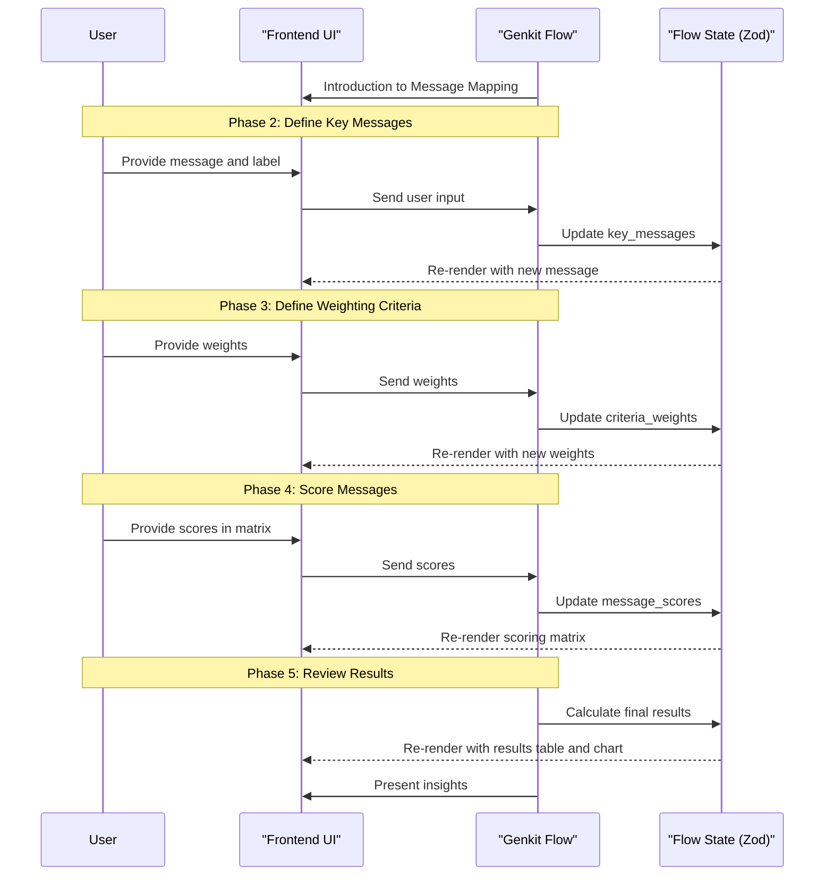

# Genkit Flow: Message Mapping

## 1. Overview & Purpose

This Genkit flow guides users through evaluating and prioritizing key marketing messages. By applying weighted criteria to each message, the flow helps users identify which messages are most effective, credible, and resonant with their target audience.

The flow enables marketing teams to align their communication strategy, clarify their key messages, and ensure consistency across all marketing channels.

## 2. Target User & Context

**User:** Marketing managers, communications directors, brand strategists, and business owners.

**Context:** This flow complements other marketing strategy components like brand assessment and customer personas. It serves as a bridge between strategic positioning and tactical content creation.

## 3. Core Flow & UI Interaction

### General Principle
As the Genkit flow guides the user through defining and evaluating key messages, the frontend UI will dynamically display this information in a structured form, with bidirectional updates between the chat and the visual components.

### Phase 1: Introduction to Message Mapping

**Genkit Flow Logic (Left Panel):**
- Greets the user and introduces the Message Mapping Tool.
- Explains the benefits: aligning communication, clarifying key messages, and enhancing impact.
- Confirms the company name to be used for the session.

**Frontend UI (Right Panel):**
- A prominent title card: "Message Mapping Tool".
- A brief introductory text.
- A visual placeholder for the upcoming "Key Messages" table.

### Phase 2: Define Key Messages & Short Labels

**Genkit Flow Logic (Left Panel):**
- Prompts the user to define their key messages and provide a short label for each.
- Handles user input, whether it's the full message and label at once or provided sequentially.
- Confirms each message addition and asks if the user wants to add more.

**Frontend UI (Right Panel):**
- A table titled "Your Key Messages" with columns for "Key Message" and "Short Label".
- Rows are dynamically added as the flow's state is updated.
- Each row has "Edit" and "Delete" buttons.
- An "Add New Message" button below the table.

### Phase 3: Define Weighting Criteria

**Genkit Flow Logic (Left Panel):**
- Explains the concept of weighting criteria for message evaluation.
- Lists the predefined criteria (Memorability, Alignment, etc.) and their definitions.
- Prompts the user for a percentage weight for each criterion, keeping a running total.
- Validates that the total weight equals 100% and provides guidance if it doesn't.

**Frontend UI (Right Panel):**
- A form or table titled "Message Evaluation Criteria Weighting" with columns for "Criterion," "Definition," and "Weight (%)".
- A "Total Weight" display that updates in real-time and highlights if the total is not 100%.

### Phase 4: Score Messages Against Criteria

**Genkit Flow Logic (Left Panel):**
- Explains the 1-10 scoring scale.
- Iterates through each key message, asking the user to score it against each criterion.
- Verifies that the user's input is within the 1-10 range.

**Frontend UI (Right Panel):**
- A scoring matrix (table) with messages as rows and criteria as columns.
- Column headers show the criterion name and its assigned weight.
- Cells contain input fields (e.g., a dropdown from 1-10) for scoring.

### Phase 5: Review Results & Visualization

**Genkit Flow Logic (Left Panel):**
- Once all scores are entered, the flow calculates the weighted scores for each message.
- It identifies the top-performing message and presents it to the user.
- It offers to provide insights based on the calculated "Effectiveness" and "Resonance" scores.

**Frontend UI (Right Panel):**
- **Scored Messages Table**: Displays each message with its calculated total, effectiveness, credibility, and resonance scores.
- **Bubble Chart**: A chart visualizing "Effectiveness vs. Resonance," where each bubble represents a message, positioned by its scores and sized by its total score.

### Phase 6: Concluding the Flow

**Genkit Flow Logic (Left Panel):**
- Confirms the completion of the message mapping process.
- Summarizes the value and potential next steps.
- Asks the user if they want to export the results or conclude the session.

**Frontend UI (Right Panel):**
- The final results view, including the scored table and the bubble chart.
- "Export Data" and "Print Report" buttons.

## 4. Zod Schema for Flow State

The state of the Genkit flow will be defined by the following Zod schema:

```javascript
import { z } from 'zod';

const KeyMessageSchema = z.object({
  id: z.string(),
  message: z.string(),
  label: z.string(),
});

const CriteriaWeightsSchema = z.object({
  memorability: z.number(),
  aligned_with_strategy: z.number(),
  consistent_with_positioning: z.number(),
  objective: z.number(),
  believable: z.number(),
  not_fluffy: z.number(),
  trendy: z.number(),
  impact: z.number(),
  relevant: z.number(),
});

const MessageScoresSchema = z.object({
  message_id: z.string(),
  scores: CriteriaWeightsSchema,
});

const CalculatedResultSchema = z.object({
  message_id: z.string(),
  label: z.string(),
  total_score: z.number(),
  effectiveness_score: z.number(),
  credibility_score: z.number(),
  resonance_score: z.number(),
});

const MessageMappingStateSchema = z.object({
  company_name: z.string(),
  key_messages: z.array(KeyMessageSchema),
  criteria_weights: CriteriaWeightsSchema.partial().default({}),
  message_scores: z.array(MessageScoresSchema),
  calculated_results: z.array(CalculatedResultSchema),
  status: z.enum(['in_progress', 'completed']).default('in_progress'),
  last_updated_at: z.string().datetime(),
});
```

## 5. Genkit Implementation Notes

-   **Stateful Flow**: The entire 'Message Mapping' workflow will be a single, stateful Genkit flow that manages the state defined by the `MessageMappingStateSchema`.
-   **Frontend Integration**: The frontend will invoke the flow, passing user input. The flow will process the input, update its state, and return the new state to the frontend, which will then re-render the UI components.
-   **Calculation Logic**: The calculation of the final scores (`total_score`, `effectiveness_score`, etc.) should be implemented as a helper function within the flow. This logic will be triggered when the user completes the scoring phase.
-   **Tools**: An "export" tool could be created in Genkit to handle the conversion of the final results into a CSV or PDF file. This keeps the core flow logic clean and separates concerns.
-   **Observability**: Genkit's tracing will be crucial for debugging the multi-step conversational logic and ensuring the scoring calculations are working as expected.

## 6. Workflow Sequence Diagram



## 7. Cross-Cutting Concerns

This section remains relevant. Key considerations for a Genkit implementation include:
-   **Accessibility**: Ensuring the frontend UI is fully accessible.
-   **Performance**: Optimizing the calculation and rendering of the results, especially with a large number of messages. Using Genkit's streaming capabilities can help maintain a responsive UI.
-   **Security**: Securing the Genkit flow endpoint and any tools that handle sensitive data.
-   **Internationalization**: Designing prompts and UI text to be easily localizable.
