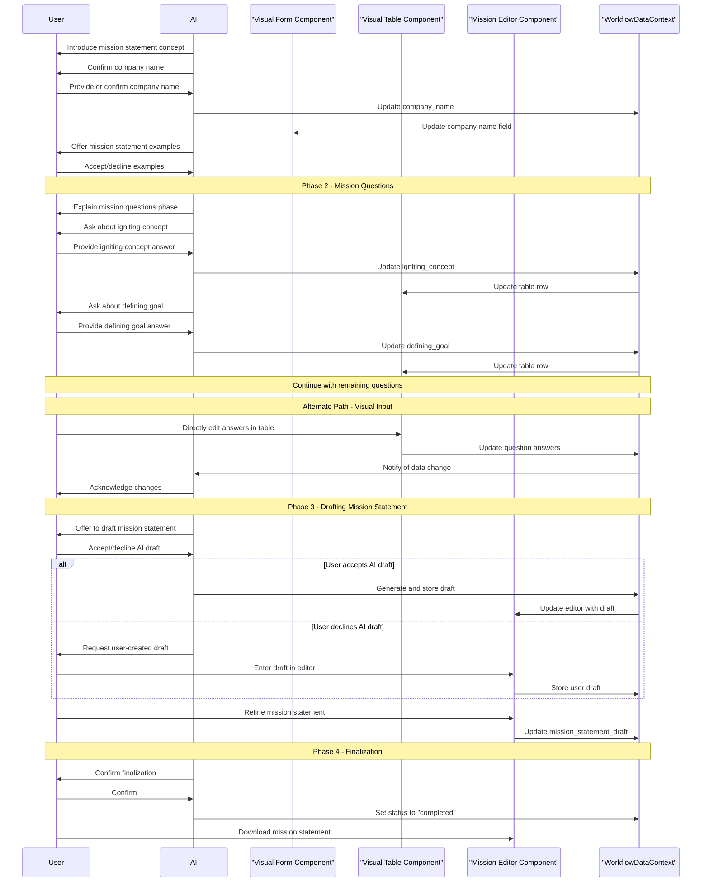

# Specification for Interactive Mission Statement Workflow

## Goal & Purpose

The Mission Statement workflow guides users through creating a clear, concise statement that defines their organization's current purpose, what it does, who it serves, and how it delivers value. Unlike a vision statement which focuses on future aspirations, a mission statement addresses the present state and operations of the business. This workflow helps users articulate their core purpose in a way that can guide daily decision-making and operations.

This workflow follows the chat-driven workflow pattern defined in [`docs/strategy-components/chat-driven-workflow-pattern.md`](../../../chat-driven-workflow-pattern.md).

## Core Principles & Context

This workflow adheres to the following principles:

1. **User-Centricity**: The workflow guides users through a structured process that's intuitive and educational.
2. **Split-Panel UI**: Conversation in the left panel, visual components in the right panel.
3. **Phased Progression**: Clear separation between the question-answering phase and the statement drafting phase.
4. **Bidirectional Data Flow**: Changes made in either the chat or visual components are reflected in both places.
5. **AI as Guide**: The AI serves as a knowledgeable guide, explaining concepts and offering suggestions throughout.

### Context Requirements

This workflow relies on the following pre-existing data:

- `onboarding_company_name`: Used to personalize the experience and pre-populate relevant fields.
- `onboarding_team_members` (optional): Used for potential collaboration on the mission statement.

## Overall Data Structure & WorkflowDataContext

The mission statement data is stored within `WorkflowDataContext.mission_statement`:

```typescript
WorkflowDataContext.mission_statement = {
  status: string,                    // "draft", "completed", "in_review"
  last_updated: string,              // timestamp
  company_name: string,              // From onboarding_company_name
  mission_questions: {
    igniting_concept: {              // What sparked the idea for your business?
      answer: string,
      last_edited_by: string         // "user_chat" | "user_ui" | "ai_suggestion"
    },
    defining_goal: {                 // What is the primary goal you wish to achieve through your business?
      answer: string,
      last_edited_by: string
    },
    target_audience: {               // Who will your business serve and how will their lives improve as a result?
      answer: string,
      last_edited_by: string
    },
    personal_values: {               // Which of your personal values are reflected in your business idea?
      answer: string,
      last_edited_by: string
    },
    community_impact: {              // In the long-term, how do you see your business impacting your community?
      answer: string,
      last_edited_by: string
    },
    personal_significance: {         // What makes your business personally meaningful to you?
      answer: string,
      last_edited_by: string
    }
  },
  mission_statement_draft: {
    value: string,                   // The drafted mission statement
    last_edited_by: string,          // "user_chat" | "user_ui" | "ai_suggestion"
    ai_generated_initial_draft: boolean // Whether AI generated the initial draft
  },
  collaborators: Array<{
    name: string,
    email: string
  }>,
  notes: string,                     // Optional user notes
  version_history: Array<{           // Optional, for tracking iterations
    date: string,
    draft: string,
    author: string
  }>
}
```

## shadcn/ui Component Mapping

| UI Element | shadcn/ui Component | Usage |
|------------|---------------------|-------|
| Main Container | `<ResizablePanelGroup>` | Overall split-panel layout |
| Title Card | `<Card>`, `<CardHeader>`, `<CardTitle>`, `<CardDescription>`, `<CardContent>` | Top-level introduction to the workflow |
| Questions Table | `<Table>`, `<TableHeader>`, `<TableBody>`, `<TableRow>`, `<TableCell>`, `<TableHead>` | Display mission questions with descriptions and text areas for answers |
| Form Fields | `<Form>`, `<FormField>`, `<FormItem>`, `<FormLabel>`, `<FormControl>`, `<FormDescription>`, `<FormMessage>` | Input fields for the mission statement editor |
| Text Inputs | `<Input>`, `<Textarea>` | Capture user input for each component of the statement |
| Rich Text Editor | `<Textarea>` or custom RTE | For drafting and refining the mission statement |
| Mission Examples | `<Accordion>` or `<Collapsible>` | To show/hide mission statement examples |
| Collaboration UI | `<Select>`, `<SelectTrigger>`, `<SelectValue>`, `<SelectContent>`, `<SelectItem>` | Team member selection for collaboration |
| Action Buttons | `<Button>`, with various variants | Primary and secondary actions throughout the workflow |
| Phase Navigation | `<Tabs>`, `<TabsList>`, `<TabsTrigger>`, `<TabsContent>` | Switch between workflow phases |

## Phased Breakdown

The workflow proceeds in four primary phases:

### Phase 1: Introduction & Company Confirmation

#### A. AI Chat Guidance & Data Collection (Left Panel)

1. **Initial Greeting & Purpose**:
   ```
   Welcome to the Mission Statement Worksheet! 👋 A mission statement defines what your business does today, who it serves, and how it delivers value. Unlike a vision statement that looks to the future, your mission statement focuses on your current purpose and operations.
   
   For [onboarding_company_name], crafting a clear mission statement will help guide your daily decisions and communicate your purpose to customers, employees, and stakeholders.
   
   We'll work through a structured process to explore key aspects of your business, then craft a concise mission statement that captures your essence.
   
   Are you ready to define your company's mission?
   ```

2. **Company Name Confirmation**:
   ```
   I have your company name listed as '[onboarding_company_name]'. Is this correct for our Mission Statement exercise?
   ```
   
   Input Handling: Yes/No or company name.
   NLU: Handle variations.
   Data Update: Update `WorkflowDataContext.mission_statement.company_name`. AI confirms: "Great! We'll define [company_name]'s mission."
   Error Handling: If user provides an empty name after being prompted, AI: "Please provide a company name to proceed."

3. **Examples Offer**:
   ```
   Before we begin, would you like to see some examples of effective mission statements from well-known companies for inspiration?
   ```
   
   Input Handling: Yes/No. If "Yes", AI displays examples and triggers visual update.
   Examples provided would include mission statements from companies like Tesla, Google, Patagonia, etc.

#### B. Corresponding Visual Component(s) (Right Panel)

Component: `TitleCard` and `CompanyNameInput`

```tsx
// Conceptual tsx representation
<Card>
  <CardHeader>
    <CardTitle>Mission Statement Worksheet</CardTitle>
    <CardDescription>
      Define your company's purpose, who you serve, and how you deliver value
    </CardDescription>
  </CardHeader>
  <CardContent>
    <div className="mb-4">
      <Label htmlFor="companyNameInput">Company Name:</Label>
      <Input 
        id="companyNameInput"
        value={workflowData.mission_statement.company_name}
        onChange={(e) => updateWorkflowData('mission_statement.company_name', e.target.value)}
        placeholder="Enter company name"
      />
    </div>
    
    <Collapsible>
      <CollapsibleTrigger asChild>
        <Button variant="outline">View Mission Statement Examples</Button>
      </CollapsibleTrigger>
      <CollapsibleContent>
        <div className="p-4 border rounded-md mt-2">
          <h3 className="font-semibold mb-2">Example Mission Statements:</h3>
          <ul className="space-y-2">
            <li><strong>Tesla:</strong> "To accelerate the world's transition to sustainable energy."</li>
            <li><strong>Google:</strong> "To organize the world's information and make it universally accessible and useful."</li>
            <li><strong>Patagonia:</strong> "Build the best product, cause no unnecessary harm, use business to inspire and implement solutions to the environmental crisis."</li>
            <li><strong>Nike:</strong> "To bring inspiration and innovation to every athlete in the world."</li>
            <li><strong>LinkedIn:</strong> "Connect the world's professionals to make them more productive and successful."</li>
          </ul>
        </div>
      </CollapsibleContent>
    </Collapsible>
  </CardContent>
</Card>
```

#### C. Data Captured in this Phase

```javascript
mission_statement = {
  company_name: string,     // Company name
  status: "in_progress"     // Workflow status
}
```

#### D. Transition Logic

When the user confirms their company name and has optionally viewed examples, the AI will guide them to Phase 2, where they'll answer key questions about their business purpose.

### Phase 2: Mission Questions Exploration

#### A. AI Chat Guidance & Data Collection (Left Panel)

1. **Introduction to Phase 2**:
   ```
   Now, let's explore the core aspects of [company_name]'s mission through several key questions. These questions will help us understand what your business does, who it serves, and why it exists.
   
   I'll guide you through each question, and your answers will help us craft a powerful mission statement.
   ```

2. **Iterative Prompting for Each Question**:
   
   The AI will guide the user through each of the six mission questions in the table, providing context and explanations:

   a. **Igniting the Concept**:
   ```
   First, what sparked the idea for your business? Was there a personal story, a gap in the market, or an evolution of a passion or hobby?
   ```
   Input Handling: Free text input.
   Data Captured: `mission_statement.mission_questions.igniting_concept.answer`
   Error Handling: If user provides very brief or generic answer, AI: "That's a start! Could you share a bit more about the specific moment or insight that inspired this business idea? The origin story often contains valuable elements for your mission."

   b. **Defining Your Goal**:
   ```
   What is the primary goal you wish to achieve through your business? Focus on the ultimate difference you want to make, be it in customer experience, innovation, or market transformation.
   ```
   Input Handling: Free text input.
   Data Captured: `mission_statement.mission_questions.defining_goal.answer`
   Error Handling: If user provides vague or very short answer, AI: "Thanks for sharing that. To help craft a more impactful mission statement, could you elaborate on how this goal translates into concrete outcomes for your customers or market? The more specific we can be about your primary aim, the stronger your mission statement will be."

   c. **Target Audience and Their Benefit**:
   ```
   Who will your business serve and how will their lives improve as a result? Consider describing specific improvements or positive changes your customers will experience.
   ```
   Input Handling: Free text input.
   Data Captured: `mission_statement.mission_questions.target_audience.answer`
   Error Handling: If user provides only audience without benefits or is too general, AI: "I see who you're targeting. Could you also elaborate on the specific benefits or improvements they'll experience? Understanding both who you serve and how you improve their lives will create a more compelling mission statement."

   d. **Personal Values**:
   ```
   Which of your personal values are reflected in your business idea? These could be qualities like integrity, creativity, sustainability, community involvement, etc.
   ```
   Input Handling: Free text input.
   Data Captured: `mission_statement.mission_questions.personal_values.answer`
   Error Handling: If user lists values without explaining them, AI: "Thank you for sharing those values. Could you briefly explain how one or two of these values specifically influence your approach to business? This connection helps create an authentic mission statement."

   e. **Community Impact**:
   ```
   In the long-term, how do you see your business impacting your community? This might include effects on the local or global community.
   ```
   Input Handling: Free text input.
   Data Captured: `mission_statement.mission_questions.community_impact.answer`
   Error Handling: If user provides a very general answer, AI: "Thank you for that perspective. To strengthen the community aspect of your mission, could you identify one or two specific ways your business might measurably impact your community? Even a small concrete example adds authenticity to your mission statement."

   f. **Personal Significance**:
   ```
   What makes your business personally meaningful to you? Think about the personal satisfaction, challenges you're eager to overcome, or the legacy you wish to create.
   ```
   Input Handling: Free text input.
   Data Captured: `mission_statement.mission_questions.personal_significance.answer`
   Error Handling: If user provides a very brief or generic answer, AI: "That's interesting. Could you perhaps elaborate on the personal connection or passion behind that? Understanding your deeper motivation often reveals aspects that make your mission statement more authentic and compelling."

3. **Confirmation & Review**:
   ```
   Thank you for sharing these insights about [company_name]. Would you like to review or make any changes to your answers before we proceed to drafting your mission statement?
   ```
   
   If "Yes": AI prompts user to specify which answer to edit and allows them to re-enter the information.
   If "No": Proceeds to Phase 3.

#### B. Corresponding Visual Component(s) (Right Panel)

Component: `MissionQuestionsTable`

```tsx
// Conceptual tsx representation
<Card>
  <CardHeader>
    <CardTitle>Mission Questions</CardTitle>
    <CardDescription>
      Answer these questions to help define your company's mission
    </CardDescription>
  </CardHeader>
  <CardContent>
    <Table>
      <TableHeader>
        <TableRow>
          <TableHead className="w-1/4">Question</TableHead>
          <TableHead className="w-1/4">Description</TableHead>
          <TableHead className="w-1/2">Your Answer</TableHead>
        </TableRow>
      </TableHeader>
      <TableBody>
        <TableRow>
          <TableCell className="font-medium">Igniting the Concept</TableCell>
          <TableCell>What sparked the idea for your business?</TableCell>
          <TableCell>
            <Textarea 
              value={workflowData.mission_statement.mission_questions.igniting_concept.answer}
              onChange={(e) => updateWorkflowData('mission_statement.mission_questions.igniting_concept.answer', e.target.value)}
              className="min-h-[80px]"
              placeholder="Describe what inspired your business idea..."
            />
          </TableCell>
        </TableRow>
        {/* Similar TableRows for each of the other 5 questions */}
        <TableRow>
          <TableCell className="font-medium">Defining Your Goal</TableCell>
          <TableCell>What is the primary goal you wish to achieve through your business?</TableCell>
          <TableCell>
            <Textarea 
              value={workflowData.mission_statement.mission_questions.defining_goal.answer}
              onChange={(e) => updateWorkflowData('mission_statement.mission_questions.defining_goal.answer', e.target.value)}
              className="min-h-[80px]"
              placeholder="Describe your primary business goal..."
            />
          </TableCell>
        </TableRow>
        {/* Continue with remaining questions... */}
      </TableBody>
    </Table>
  </CardContent>
</Card>
```

#### C. Data Captured in this Phase

All data from the user inputs is stored in the `mission_statement.mission_questions` object:

```javascript
mission_statement.mission_questions = {
  igniting_concept: {
    answer: string,
    last_edited_by: string
  },
  defining_goal: {
    answer: string,
    last_edited_by: string
  },
  target_audience: {
    answer: string,
    last_edited_by: string
  },
  personal_values: {
    answer: string,
    last_edited_by: string
  },
  community_impact: {
    answer: string,
    last_edited_by: string
  },
  personal_significance: {
    answer: string,
    last_edited_by: string
  }
}
```

#### D. Transition Logic

When the user confirms they're ready to move forward, the AI will guide them to Phase 3, where they'll craft the mission statement based on their answers.

#### E. Key Decisions & Rationale

- **Question Selection**: The six questions are specifically chosen to cover the key aspects of a mission statement: purpose, audience, values, impact, and meaning.
- **Table Format**: Using a table format provides a clear structure for users to see the question, explanation, and their answer in one view.
- **Immediate Reflection**: Users can see all their answers together, which helps them identify patterns and core themes in their responses.

### Phase 3: Crafting the Mission Statement

#### A. AI Chat Guidance & Data Collection (Left Panel)

1. **Introduction to Phase 3**:
   ```
   Now that we've explored the key aspects of [company_name]'s purpose, let's craft your mission statement. A strong mission statement is typically concise (1-3 sentences) and answers three key questions:
   
   1. What does your company do? (products/services)
   2. Who does your company serve? (target audience)
   3. How does your company deliver value? (unique approach)
   
   It should be clear, specific, and memorable.
   ```

2. **AI-Assisted Draft Offer**:
   ```
   Based on your answers, I can help create an initial draft of your mission statement. Would you like me to suggest a draft based on the information you've shared?
   ```
   
   Input Handling: Yes/No.
   
   If "Yes", AI generates a draft using the provided answers:
   ```
   Based on what you've shared, here's a draft mission statement for [company_name]:
   
   "[company_name] [action verb related to their goal] [target audience from their answer] by [method derived from their answers] to [benefit derived from their answers]."
   
   What do you think of this draft? We can refine it together to make it perfect for your business.
   ```
   
   Data Update: Updates `mission_statement.mission_statement_draft.value` and sets `mission_statement.mission_statement_draft.ai_generated_initial_draft = true`.

3. **User-Guided Drafting (if AI assist declined)**:
   ```
   No problem. Please draft your mission statement in the editor on the right, or share it here. Remember to focus on what your company does, who it serves, and how it delivers value.
   ```
   
   Input Handling: Free text input.
   Data Update: Updates `mission_statement.mission_statement_draft.value` and sets `mission_statement.mission_statement_draft.ai_generated_initial_draft = false`.

4. **Refinement Prompting**:
   ```
   How does this mission statement feel to you? Is there anything you'd like to adjust to better capture [company_name]'s purpose?
   ```
   
   Input Handling: Free text refinement suggestions.
   Data Update: Updates `mission_statement.mission_statement_draft.value` based on refinements.

5. **Offer Collaborative Review (Leveraging onboarding_team_members)**:
   ```
   A mission statement often benefits from team input. Would you like to invite team members to review or contribute to this mission statement?
   ```
   
   If user agrees: "Great! Which team members should I send it to? You can select from your existing team, or add new collaborators."
   Data Captured: `mission_statement.collaborators`

#### B. Corresponding Visual Component(s) (Right Panel)

Component: `MissionStatementEditor`

```tsx
// Conceptual tsx representation
<Card>
  <CardHeader>
    <CardTitle>Craft Your Mission Statement</CardTitle>
    <CardDescription>
      Create a concise statement that defines what your company does, who it serves, and how it delivers value
    </CardDescription>
  </CardHeader>
  <CardContent>
    <div className="space-y-4">
      <div>
        <Label htmlFor="missionStatementEditor">Your Mission Statement:</Label>
        <Textarea
          id="missionStatementEditor"
          value={workflowData.mission_statement.mission_statement_draft.value}
          onChange={(e) => updateWorkflowData('mission_statement.mission_statement_draft.value', e.target.value)}
          className="min-h-[150px]"
          placeholder="[Company Name] [verb] [target audience] by [method] to [benefit]..."
        />
      </div>
      
      <div className="flex justify-between">
        <Button 
          variant="outline" 
          onClick={requestAIDraft}
          disabled={workflowData.mission_statement.mission_statement_draft.ai_generated_initial_draft}
        >
          Help me draft (AI)
        </Button>
        
        <Button onClick={finalizeMissionStatement}>
          Finalize Mission Statement
        </Button>
      </div>
      
      {/* Optional: Character count and best practices reminder */}
      <div className="text-sm text-muted-foreground">
        <p>Character count: {workflowData.mission_statement.mission_statement_draft.value.length}</p>
        <p>Best practices: Keep it under 100 characters, focused on present purpose</p>
      </div>
    </div>
  </CardContent>
</Card>
```

#### C. Data Captured in this Phase

```javascript
mission_statement.mission_statement_draft = {
  value: string,                    // The drafted mission statement
  last_edited_by: string,           // "user_chat" | "user_ui" | "ai_suggestion"
  ai_generated_initial_draft: boolean // Whether AI generated the initial draft
}

// If collaboration is enabled:
mission_statement.collaborators = [
  { name: string, email: string }
]
```

#### D. Transition Logic

Upon completing the mission statement draft and optionally setting up collaboration, the user is prompted to finalize this step or make further refinements.

#### E. Key Decisions & Rationale

- **Structured Approach**: The system guides users through a focused process to create a mission statement that addresses the three key questions (what, who, how).
- **AI Assistance Option**: Provides an AI-generated draft based on user input, but maintains user control over the final statement.
- **Best Practices Guidance**: Offers inline suggestions and character count to help users adhere to mission statement best practices.
- **Collaboration Support**: Enables team input, recognizing that mission statements often benefit from diverse perspectives.

### Phase 4: Review & Finalize

#### A. AI Chat Guidance & Data Collection (Left Panel)

1. **Confirmation & Read-back**:
   ```
   Excellent! You've successfully crafted a mission statement for [company_name].
   
   Your mission statement is:
   
   "[mission_statement.mission_statement_draft.value]"
   
   This statement clearly communicates your company's purpose, who you serve, and how you deliver value.
   ```

2. **Value Reinforcement**:
   ```
   Your mission statement will serve as a compass for your business, guiding decisions and helping communicate your purpose to employees, customers, and stakeholders alike.
   ```

3. **Call to Action / Next Steps**:
   ```
   Would you like to make any final adjustments before we finalize your mission statement?
   ```
   
   Input Handling: Yes/No or specific refinements.
   Data Update: If refinements offered, update `mission_statement.mission_statement_draft.value`.
   
   When user confirms finalization:
   ```
   Great! Your mission statement has been finalized and saved. You can revisit and refine it anytime as your business evolves.
   
   This mission statement aligns with your business's current purpose and operations. For a forward-looking perspective that captures where you want to be in the future, you might also want to create a vision statement.
   ```

#### B. Corresponding Visual Component(s) (Right Panel)

Component: `MissionStatementSummary`

```tsx
// Conceptual tsx representation
<Card>
  <CardHeader>
    <CardTitle>Your Finalized Mission Statement</CardTitle>
    <CardDescription>
      A clear expression of your company's purpose, audience, and value
    </CardDescription>
  </CardHeader>
  <CardContent>
    <div className="space-y-6">
      <div>
        <Label>Company Name:</Label>
        <p className="text-lg font-medium">{workflowData.mission_statement.company_name}</p>
      </div>
      
      <div>
        <Label>Mission Statement:</Label>
        <div className="p-4 border rounded-md bg-muted">
          <p className="text-lg font-medium">{workflowData.mission_statement.mission_statement_draft.value}</p>
        </div>
      </div>
      
      <Accordion type="single" collapsible>
        <AccordionItem value="mission-questions">
          <AccordionTrigger>View Mission Questions & Answers</AccordionTrigger>
          <AccordionContent>
            <div className="space-y-4">
              {Object.entries(workflowData.mission_statement.mission_questions).map(([key, value]) => (
                <div key={key}>
                  <h4 className="font-semibold">{formatQuestionKey(key)}</h4>
                  <p className="text-muted-foreground">{getQuestionText(key)}</p>
                  <p>{value.answer}</p>
                </div>
              ))}
            </div>
          </AccordionContent>
        </AccordionItem>
      </Accordion>
      
      <div className="flex justify-between">
        <Button variant="outline" onClick={editMissionStatement}>
          Edit Mission Statement
        </Button>
        
        <Button onClick={downloadMissionStatement}>
          Download Mission Statement
        </Button>
      </div>
    </div>
  </CardContent>
</Card>
```

#### C. Data Captured in this Phase

Upon finalization, the workflow sets:

```javascript
mission_statement.status = "completed"
mission_statement.last_updated = "[current timestamp]"
```

#### D. Key Decisions & Rationale

- **Clear Display**: Presents the final mission statement prominently with supporting context accessible via accordion.
- **Editing Option**: Maintains flexibility by allowing users to make further edits if needed.
- **Downloadable Format**: Provides a way for users to export their mission statement for use in other contexts.
- **Completion State**: Clearly marks the workflow as completed while preserving all context and answers.

## Workflow Sequence Diagram



## Integration Patterns

This workflow integrates with other components in the system through several key patterns:

### Chat-to-Visual Coordination

When users provide information via chat, the corresponding visual components update in real-time:

```typescript
// Example: Update mission questions from chat response
function handleChatResponse(response) {
  if (response.data?.mission_statement?.mission_questions) {
    setMissionQuestions(prevData => ({
      ...prevData,
      ...response.data.mission_statement.mission_questions
    }));
  }
}
```

### Visual-to-Chat Coordination

When users directly edit visual components, the AI acknowledges these changes:

```typescript
// Example: Notify AI of visual component change
function handleQuestionAnswerChange(question, answer) {
  // Update local state
  setMissionQuestions(prev => ({
    ...prev,
    [question]: {
      answer: answer,
      last_edited_by: "user_ui"
    }
  }));
  
  // Update WorkflowDataContext
  updateWorkflowData(`mission_statement.mission_questions.${question}.answer`, answer);
  updateWorkflowData(`mission_statement.mission_questions.${question}.last_edited_by`, "user_ui");
  
  // Notify AI of the change
  chatContext.notifyDataChange({
    component: 'mission_questions',
    field: question,
    value: answer
  });
}
```

### Layout Integration

The workflow uses the standard split-panel layout with ResizablePanelGroup:

```tsx
<ResizablePanelGroup direction="horizontal">
  <ResizablePanel defaultSize={50} minSize={30}>
    <ChatInterface />
  </ResizablePanel>
  <ResizableHandle />
  <ResizablePanel defaultSize={50} minSize={30}>
    {currentPhase === 'introduction' && <CompanyNameInput />}
    {currentPhase === 'questions' && <MissionQuestionsTable />}
    {currentPhase === 'drafting' && <MissionStatementEditor />}
    {currentPhase === 'finalization' && <MissionStatementSummary />}
  </ResizablePanel>
</ResizablePanelGroup>
```

### Workflow Data Context Integration

All components access and update data through the shared WorkflowDataContext:

```tsx
const { workflowData, updateWorkflowData } = useWorkflowDataContext();

// Access data
const companyName = workflowData.mission_statement.company_name;
const missionQuestions = workflowData.mission_statement.mission_questions;

// Update data
function handleInputChange(field, value) {
  updateWorkflowData(`mission_statement.${field}`, value);
}
```

## Key AI Capabilities

This workflow leverages the following AI capabilities:

1. **Contextual Guidance**: The AI explains the purpose and structure of a mission statement, helping users understand its importance.

2. **Question-Based Exploration**: The AI guides users through targeted questions to extract key aspects of their business purpose.

3. **Natural Language Processing**: The AI interprets user responses to generate a coherent mission statement.

4. **Content Generation**: The AI can synthesize a complete mission statement draft from user-provided answers.

5. **Educational Support**: The AI provides examples and explanations of mission statement best practices.

6. **Progress Awareness**: The AI maintains awareness of completed sections and guides users through the process.

7. **Bidirectional Communication**: The AI acknowledges changes made in visual components and maintains conversation continuity.

## Cross-Cutting Concerns

### Accessibility (a11y) Considerations

- All form fields have proper labels and descriptions
- Table uses proper headers and row relationships
- Color contrast meets WCAG 2.1 AA standards
- All interactive elements are keyboard accessible
- Tab order follows a logical flow between phases
- Error states provide clear guidance

### Performance Considerations

- Form state updates are batched to minimize re-renders
- Large text areas use efficient update patterns
- Mission statement preview updates are debounced
- AI-generated content is cached when appropriate

### Security Considerations

- User data is stored securely in the WorkflowDataContext
- Collaboration features require proper authentication
- No sensitive data is exposed in the UI or chat

### Internationalization & Localization

- All UI text is stored in translatable string resources
- Date formats follow locale-specific patterns
- Text inputs support multilingual content
