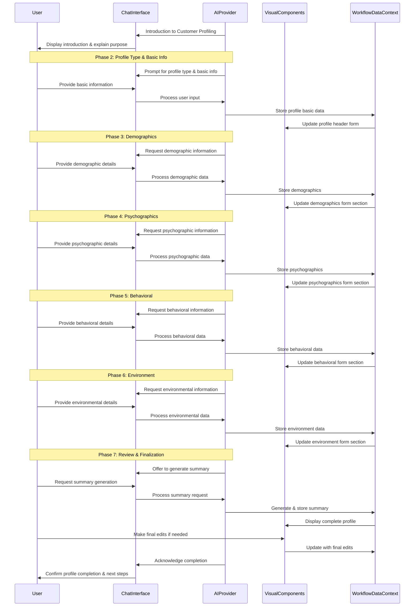

# Customer Profile Workflow

## 1. Overview & Purpose

This AI-powered conversational tool guides users through creating comprehensive customer profiles (also known as buyer personas). It helps marketing teams deeply understand who they're marketing to, including demographic details, psychographic characteristics, behavioral patterns, and environmental contexts. 

By creating detailed profiles, users can tailor their messaging, product development, and distribution channels to resonate directly with their audience, leading to increased engagement and conversion. These profiles serve as foundational elements for many other marketing strategy components, providing critical context about customer needs, preferences, and decision-making processes.

## 2. Target User & Context

**User:** Marketing managers, strategists, product managers, and business owners responsible for developing customer-centric marketing strategies and campaigns.

**Context:** This workflow complements other marketing strategy components like customer journey mapping, brand assessment, and go-to-market planning. It forms a critical foundation for targeting, messaging, and channel selection, helping ensure that all marketing activities are aligned with actual customer characteristics and needs.

## 3. Core Conversational Flow

### General Principle

As the AI guides the user through defining the customer profile, the right visual panel will dynamically display and organize this information in a structured form. This follows the **Visual Augmentation** and **Bidirectional Updates** principles from the Chat-Driven Workflow Pattern, where changes in either panel are reflected in the other in real-time.

### Phase 1: Introduction to Customer Profiling

**AI Chat Guidance & Data Collection (Left Panel):**
"Hello! Let's define your ideal customers or buyer personas. This 'Customer Profile' exercise helps you deeply understand who you're marketing to, their needs, their behaviors, and how to best reach them."

"By creating detailed profiles, you can tailor your messaging, product development, and distribution channels to resonate directly with your audience, leading to increased engagement and conversion. Customer profiles typically include demographic, psychographic, behavioral, and environmental data."

"Ready to begin creating your customer profile for [onboarding_company_name]?" (If onboarding_company_name is available, confirm its use; otherwise, prompt for it).

**Visual Components (Right Panel):**
- A title card: "Customer Profile Creation"
- A brief overview text: "Define your key customer segments to inform your marketing strategy"
- An empty, structured template preview reflecting the four main categories (Demographic, Psychographic, Behavioral, Environmental)

**Data Captured in this Phase:**
None yet, just initial context setting.

### Phase 2: Profile Type and Basic Identification

**AI Chat Guidance & Data Collection (Left Panel):**
"First, let's decide what kind of customer profile we're building. Are you looking to define an 'End User' (the person who directly uses your product/service), an 'Economic Buyer' (the person who makes the purchasing decision), or a 'Technical Buyer' (the person who evaluates the technical aspects)? Or would you like to create a custom profile type?"

"Next, what name will we give this profile? For example, 'Kelly Lawson, Marketing Manager' or 'John Snow, CFO'."

"Is this profile for a 'B2B' (Business-to-Business) audience, or 'B2C' (Business-to-Consumer)?"

"I see your company name is set as '[onboarding_company_name]'. Is this the company this customer profile relates to, or is it different?"

"Is this profile based on an existing team member or contact you've already added during onboarding? For example, someone whose role might align with an End User, Economic Buyer, or Technical Buyer?"

If team members exist: "From your onboarding, I have these team members: [List names from onboarding_team_members]. Is one of them a good starting point for this profile?"

If no team members or 'No': "Okay, then let's start fresh. What is this profile's primary job title or role?"

**Visual Components (Right Panel):**
- A "Profile Header" form section with the following fields:
  - Customer Profile Type (Dropdown with 'End User', 'Economic Buyer', 'Technical Buyer', 'Custom' options)
  - Profile Name (Text input)
  - B2B/B2C (Radio buttons)
  - Company Name (Text input, pre-populated and editable)
  - Job Title (Text input)
  - Profile Image (Placeholder with "Upload Image" button)

**Data Captured in this Phase:**
```typescript
customer_profile.type: string // e.g., "End User", "Economic Buyer", "Technical Buyer", "Custom"
customer_profile.prototype_name: string // e.g., "Kelly Lawson, Marketing Manager"
customer_profile.job_title: string // e.g., "Marketing Manager"
customer_profile.b2b_b2c: "B2B" | "B2C"
customer_profile.company_name: string // e.g., "Acme Corp"
customer_profile.profile_image_url: string // optional
```

### Phase 3: Demographics (Who they are)

**AI Chat Guidance & Data Collection (Left Panel):**
"Let's move on to Demographics, which describes 'who' your customer is. Some of this information might be general like age and income, or more specific like industry and number of employees for B2B profiles."

"Think about basic descriptive information. For B2B, this might include the company's annual revenue or number of employees. For B2C, it could be marital status or family size."

The AI will then ask a series of demographic questions based on whether this is a B2B or B2C profile:

Common questions for both:
- "What is their age?"
- "What is their estimated annual income?"
- "Describe their work experience generally."
- "What is their highest level of education?"

For B2B profiles, additional questions:
- "What is the typical annual revenue of a company they work for or represent?"
- "How many employees are typically in companies they engage with?"
- "What industry are these companies in?"
- "How many locations do these companies typically have?"
- "How many years has their typical company been in business?"
- "What markets do they serve?"
- "What types of products or services do they typically offer, or seek?"
- "What is their typical level of experience in their role?"

For B2C profiles, additional questions:
- "What is their marital status?"
- "What is their family size?"
- "What is their gender?"
- "What is their primary geographic location?"
- "What are their typical social circles or community involvements?"
- "What is their main occupation, if different from their job title?"

**Visual Components (Right Panel):**
- A collapsible section labeled "Demographics (who they are)" on the customer profile form
- Input fields (text inputs, number inputs, text areas) for each demographic attribute
- Fields dynamically shown/hidden based on the B2B/B2C selection

**Data Captured in this Phase:**
```typescript
customer_profile.demographics.age: number
customer_profile.demographics.income: string
customer_profile.demographics.work_experience: string
customer_profile.demographics.education: string

// B2B-specific fields (only populated for B2B profiles)
customer_profile.demographics.annual_revenue?: string
customer_profile.demographics.num_employees?: string
customer_profile.demographics.industry?: string
customer_profile.demographics.num_locations?: string
customer_profile.demographics.years_in_business?: string
customer_profile.demographics.markets_served?: string
customer_profile.demographics.products_service?: string
customer_profile.demographics.level_of_experience?: string

// B2C-specific fields (only populated for B2C profiles)
customer_profile.demographics.marital_status?: string
customer_profile.demographics.family_size?: string
customer_profile.demographics.gender?: string
customer_profile.demographics.geographic_location?: string
customer_profile.demographics.social_circles?: string
customer_profile.demographics.occupation?: string
```

### Phase 4: Psychographics (How they think)

**AI Chat Guidance & Data Collection (Left Panel):**
"Now let's delve into Psychographics – 'how they think.' This includes their decision-making process, values, attitudes, interests, and personality traits."

"For example, are they risk-averse? Do they prefer data-driven decisions or gut feelings? What are their core likes and dislikes when it comes to products, experiences, or ideas?"

Common questions for both:
- "Describe their typical decision-making process."
- "What are some of their key likes and dislikes regarding [your industry/product type] or related topics?"

For B2B profiles, additional questions:
- "How resistant are they to change?"
- "Are they market-focused or internally focused?"
- "Are they generally open-minded or rigid in their approach?"
- "Are they early adopters or do they wait for proven solutions?"
- "Are they growth-oriented or focused on maintaining the status quo?"
- "What is their level of tech sophistication?"
- "How would you describe their approach to professionalism?"
- "Do they typically require referrals or testimonials before engaging?"
- "What is their awareness of options in the market?"
- "What is their risk aversion level?"
- "What role does loyalty play in their decisions?"

For B2C profiles, additional questions:
- "What are their typical brand preferences?"
- "Are they price sensitive?"
- "Are they generally conservative or liberal?"
- "Are they environmentally-friendly and do they prioritize sustainability?"
- "What are their hobbies?"
- "Describe their typical lifestyle."
- "What are their service preferences (e.g., self-service, personalized support)?"
- "Do they buy based on trends or are they more conventional?"
- "Are they spontaneous or planned buyers?"
- "How much are they influenced by peers or social circles?"
- "What is the importance of relationships in their purchasing decisions?"

**Visual Components (Right Panel):**
- A collapsible section labeled "Psychographics (how they think)" on the customer profile form
- Input fields for each psychographic attribute
- "Likes & Dislikes" implemented as a tag input component or multi-line text area

**Data Captured in this Phase:**
```typescript
customer_profile.psychographics.decision_making: string
customer_profile.psychographics.likes_dislikes: string[]

// B2B-specific fields
customer_profile.psychographics.resistance_to_change?: string
customer_profile.psychographics.market_focused?: string
customer_profile.psychographics.open_minded_rigid?: string
customer_profile.psychographics.early_adopter?: string
customer_profile.psychographics.growth_vs_static?: string
customer_profile.psychographics.tech_sophistication?: string
customer_profile.psychographics.professionalism?: string
customer_profile.psychographics.require_referrals?: string
customer_profile.psychographics.awareness_of_options?: string
customer_profile.psychographics.risk_aversion?: string
customer_profile.psychographics.loyalty?: string

// B2C-specific fields
customer_profile.psychographics.brand_preferences?: string
customer_profile.psychographics.price_sensitivity?: string
customer_profile.psychographics.conservative_liberal?: string
customer_profile.psychographics.enviro_friendly?: string
customer_profile.psychographics.hobbies?: string
customer_profile.psychographics.lifestyle?: string
customer_profile.psychographics.service_preference?: string
customer_profile.psychographics.buy_based_on_trends?: string
customer_profile.psychographics.spontaneous?: string
customer_profile.psychographics.influenced_by_peers?: string
customer_profile.psychographics.relationships?: string
```

### Phase 5: Behavioral (What they do)

**AI Chat Guidance & Data Collection (Left Panel):**
"Next, we'll cover Behavioral aspects – 'what they do.' This includes their habits related to media consumption, purchasing, and interaction with products or services."

"Think about how they consume information, what skills they possess directly related to your offering, and how they research solutions."

Common questions for both:
- "How do they typically consume media?"
- "What are their key habits and skills relevant to this profile?"
- "How do they conduct research for solutions or purchases?"

For B2B profiles, additional questions:
- "What kind of websites do they visit professionally?"
- "What professional memberships do they hold?"
- "What are their preferred purchasing methods (e.g., direct, via procurement, online)?"
- "How do they use the internet for business purposes?"
- "What kind of content or collateral (e.g., whitepapers, case studies, webinars) do they typically consume?"

For B2C profiles, additional questions:
- "Describe their purchase history for relevant products/services."
- "Where do they typically shop for similar items (online, brick-and-mortar stores)?"
- "What personal memberships do they have (e.g., loyalty programs, clubs)?"
- "What are their store preferences (e.g., discount, luxury, local)?"
- "Are they typically impulsive buyers or do they plan purchases carefully?"

**Visual Components (Right Panel):**
- A collapsible section labeled "Behavioral (what they do)"
- Text area inputs for each behavioral attribute
- Conditional display based on B2B/B2C selection

**Data Captured in this Phase:**
```typescript
customer_profile.behavioral.media_consumption: string
customer_profile.behavioral.habits_skills: string
customer_profile.behavioral.research_methods: string

// B2B-specific fields
customer_profile.behavioral.website_visits?: string
customer_profile.behavioral.memberships_b2b?: string
customer_profile.behavioral.purchasing_methods?: string
customer_profile.behavioral.internet_usage?: string
customer_profile.behavioral.collateral_consumed?: string

// B2C-specific fields
customer_profile.behavioral.purchase_history?: string
customer_profile.behavioral.where_they_shop?: string
customer_profile.behavioral.memberships_b2c?: string
customer_profile.behavioral.store_preferences?: string
customer_profile.behavioral.impulsiveness?: string
```

### Phase 6: Environment (Where they are)

**AI Chat Guidance & Data Collection (Left Panel):**
"Finally, let's define their Environment – 'where they are.' This covers the context in which they operate, including technology usage, buying processes, and cultural factors."

Common questions for both:
- "Describe their technology landscape."
- "What is their typical buying power or budget authority?"
- "Outline their purchasing process."

For B2B profiles, additional questions:
- "Describe the business culture they operate within."
- "What is the prevailing management style?"
- "What are their typical payment methods?"

For B2C profiles, additional questions:
- "What is their country of residence?"
- "Are there specific shipping and receiving considerations?"
- "What currency do they typically use?"
- "What is the predominant political climate they operate in, if relevant?"
- "What languages do they speak?"

**Visual Components (Right Panel):**
- A collapsible section labeled "Environment (where they operate)"
- Text area inputs for each environmental attribute
- Conditional display based on B2B/B2C selection

**Data Captured in this Phase:**
```typescript
customer_profile.environment.technology_landscape: string
customer_profile.environment.buying_power: string
customer_profile.environment.purchasing_process: string

// B2B-specific fields
customer_profile.environment.business_culture?: string
customer_profile.environment.management_style?: string
customer_profile.environment.payment_methods_b2b?: string

// B2C-specific fields
customer_profile.environment.country_of_residence?: string
customer_profile.environment.shipping_receiving?: string
customer_profile.environment.currency?: string
customer_profile.environment.political_climate?: string
customer_profile.environment.languages_spoken?: string
```

### Phase 7: Review & Finalization

**AI Chat Guidance & Data Collection (Left Panel):**
"Great work! We've gathered comprehensive information for [Profile Name]. Would you like a moment to review everything we've collected so far, or are you ready to finalize this profile?"

If user wants to review: "Okay, please take a look at the right panel. Does anything need to be adjusted or added? You can directly edit any field."

"Based on the details we've discussed for [Profile Name], would you like me to help draft a concise summary statement or a key marketing message for this persona?"

If yes: "Great! Using the demographic, psychographic, behavioral, and environmental insights, I can generate a draft. Which areas should I focus on most for the summary? (e.g., pain points, motivations, ideal messaging channels)?"

After generating: "Here's a draft summary for [Profile Name]: '[AI Generated Summary]'. You can edit it directly in the text box on the right."

Concluding message: "Fantastic! The customer profile for '[Profile Name]' is now complete and saved. This detailed profile will be invaluable for focusing your marketing efforts. You can now use this to refine your messaging, develop targeted campaigns, and identify the best channels to reach '[Profile Name]'."

"What would you like to do next? Create another customer profile? Go to the Marketing Strategy Dashboard? Refine an existing customer profile?"

**Visual Components (Right Panel):**
- The entire customer profile form, fully populated and editable
- A new rich text editor component for "Summary Statement / Key Marketing Message"
- Buttons for "Save Profile & Exit", "Save & Create New", and "View All Profiles"

**Data Captured in this Phase:**
```typescript
customer_profile.summary_statement: string // AI-generated or user-edited summary
customer_profile.status: 'in_progress' | 'completed'
customer_profile.last_updated_at: string // timestamp
```

## 4. Visual Components

### shadcn/ui Component Mapping

| UI Element | shadcn/ui Component | Usage |
|------------|---------------------|-------|
| Main Container | `<ResizablePanelGroup>` | Split-panel layout for chat and visual components |
| Profile Header | `<Card>` with `<CardContent>` | Contains basic profile information |
| Profile Type Selector | `<Select>` | Dropdown for profile type selection |
| B2B/B2C Toggle | `<RadioGroup>` | Selection between B2B and B2C |
| Text Fields | `<Input>` | Single-line text input fields |
| Multi-line Text | `<Textarea>` | For longer text responses |
| Section Containers | `<Collapsible>` | Collapsible sections for each category |
| Section Headers | `<CollapsibleTrigger>` | Headers for demographic, psychographic, etc. sections |
| Likes/Dislikes Input | Custom Tag Input based on `<Input>` | For entering multiple items as tags |
| Action Buttons | `<Button>` with variants | Save, create new, etc. |
| Image Upload | `<FileInput>` + preview | For profile image upload |
| Summary Editor | `<Card>` with rich text editor | For editing AI-generated summary |

### Example Customer Profile Component (Conceptual)

```tsx
import { useState, useEffect } from 'react';
import { 
  Card, CardHeader, CardTitle, CardContent,
  Collapsible, CollapsibleTrigger, CollapsibleContent,
  Input, Textarea, RadioGroup, RadioGroupItem, Select, Button,
  Label
} from "@/components/ui/";

interface CustomerProfileProps {
  profileData: CustomerProfile;
  onUpdate: (data: CustomerProfile) => void;
  isB2B: boolean;
}

// This would be a simplified version of the full type
interface CustomerProfile {
  type: string;
  prototype_name: string;
  job_title: string;
  company_name: string;
  demographics: Record<string, any>;
  psychographics: Record<string, any>;
  behavioral: Record<string, any>;
  environment: Record<string, any>;
  summary_statement?: string;
}

export function CustomerProfileForm({ 
  profileData, 
  onUpdate,
  isB2B
}: CustomerProfileProps) {
  const [localData, setLocalData] = useState(profileData);
  
  // Handle field updates
  const handleFieldChange = (section: keyof CustomerProfile, field: string, value: any) => {
    setLocalData(prev => {
      const updated = { ...prev };
      updated[section] = { ...updated[section], [field]: value };
      return updated;
    });
  };
  
  // Sync local state with parent
  useEffect(() => {
    onUpdate(localData);
  }, [localData, onUpdate]);

  return (
    <div className="space-y-6">
      {/* Profile Header */}
      <Card>
        <CardHeader>
          <CardTitle>{localData.prototype_name || "New Customer Profile"}</CardTitle>
        </CardHeader>
        <CardContent>
          <div className="grid grid-cols-2 gap-4">
            <div className="space-y-2">
              <Label htmlFor="profile-type">Profile Type</Label>
              <Select 
                value={localData.type} 
                onValueChange={(value) => handleFieldChange('type', '', value)}
              >
                <option value="End User">End User</option>
                <option value="Economic Buyer">Economic Buyer</option>
                <option value="Technical Buyer">Technical Buyer</option>
                <option value="Custom">Custom</option>
              </Select>
            </div>
            
            <div className="space-y-2">
              <Label htmlFor="job-title">Job Title</Label>
              <Input 
                id="job-title"
                value={localData.job_title} 
                onChange={(e) => handleFieldChange('job_title', '', e.target.value)}
              />
            </div>
            
            <div className="space-y-2">
              <Label htmlFor="company">Company</Label>
              <Input 
                id="company"
                value={localData.company_name} 
                onChange={(e) => handleFieldChange('company_name', '', e.target.value)}
              />
            </div>
            
            <div className="space-y-2">
              <Label>Profile Type</Label>
              <RadioGroup 
                value={isB2B ? "B2B" : "B2C"}
                onValueChange={(value) => {/* Handle B2B/B2C toggle */}}
              >
                <div className="flex items-center space-x-2">
                  <RadioGroupItem value="B2B" id="b2b" />
                  <Label htmlFor="b2b">Business (B2B)</Label>
                </div>
                <div className="flex items-center space-x-2">
                  <RadioGroupItem value="B2C" id="b2c" />
                  <Label htmlFor="b2c">Consumer (B2C)</Label>
                </div>
              </RadioGroup>
            </div>
          </div>
        </CardContent>
      </Card>
      
      {/* Demographics Section */}
      <Collapsible defaultOpen>
        <CollapsibleTrigger className="flex w-full items-center justify-between p-4 bg-muted hover:bg-muted/80 rounded-md">
          <h3 className="text-lg font-medium">Demographics (who they are)</h3>
          <span>{/* Chevron icon */}</span>
        </CollapsibleTrigger>
        <CollapsibleContent className="p-4 border rounded-md mt-2">
          <div className="grid grid-cols-2 gap-4">
            {/* Common fields */}
            <div className="space-y-2">
              <Label htmlFor="age">Age</Label>
              <Input 
                id="age"
                type="number" 
                value={localData.demographics.age || ''} 
                onChange={(e) => handleFieldChange('demographics', 'age', e.target.value)}
              />
            </div>
            
            <div className="space-y-2">
              <Label htmlFor="income">Income</Label>
              <Input 
                id="income"
                value={localData.demographics.income || ''} 
                onChange={(e) => handleFieldChange('demographics', 'income', e.target.value)}
              />
            </div>
            
            {/* Dynamic fields based on B2B/B2C */}
            {isB2B ? (
              <>
                <div className="space-y-2">
                  <Label htmlFor="industry">Industry</Label>
                  <Input 
                    id="industry"
                    value={localData.demographics.industry || ''} 
                    onChange={(e) => handleFieldChange('demographics', 'industry', e.target.value)}
                  />
                </div>
                <div className="space-y-2">
                  <Label htmlFor="num_employees">Number of Employees</Label>
                  <Input 
                    id="num_employees"
                    value={localData.demographics.num_employees || ''} 
                    onChange={(e) => handleFieldChange('demographics', 'num_employees', e.target.value)}
                  />
                </div>
                {/* Additional B2B fields would go here */}
              </>
            ) : (
              <>
                <div className="space-y-2">
                  <Label htmlFor="marital_status">Marital Status</Label>
                  <Input 
                    id="marital_status"
                    value={localData.demographics.marital_status || ''} 
                    onChange={(e) => handleFieldChange('demographics', 'marital_status', e.target.value)}
                  />
                </div>
                <div className="space-y-2">
                  <Label htmlFor="geographic_location">Geographic Location</Label>
                  <Input 
                    id="geographic_location"
                    value={localData.demographics.geographic_location || ''} 
                    onChange={(e) => handleFieldChange('demographics', 'geographic_location', e.target.value)}
                  />
                </div>
                {/* Additional B2C fields would go here */}
              </>
            )}
            
            <div className="col-span-2 space-y-2">
              <Label htmlFor="education">Education</Label>
              <Textarea 
                id="education"
                value={localData.demographics.education || ''} 
                onChange={(e) => handleFieldChange('demographics', 'education', e.target.value)}
              />
            </div>
          </div>
        </CollapsibleContent>
      </Collapsible>
      
      {/* Similar collapsible sections would follow for Psychographics, Behavioral, and Environment */}
      
      {/* Summary Section */}
      <Card>
        <CardHeader>
          <CardTitle>Profile Summary</CardTitle>
        </CardHeader>
        <CardContent>
          <Textarea 
            className="min-h-[100px]"
            value={localData.summary_statement || ''} 
            onChange={(e) => handleFieldChange('summary_statement', '', e.target.value)}
            placeholder="Enter or generate a summary that captures the essence of this customer profile..."
          />
        </CardContent>
      </Card>
      
      {/* Action Buttons */}
      <div className="flex justify-end space-x-4">
        <Button variant="outline">Save Draft</Button>
        <Button>Complete Profile</Button>
      </div>
    </div>
  );
}
```

## 5. Data Structure & Integration

### Complete Data Structure

```typescript
// Within the broader WorkflowDataContext
customer_profile: {
  // Basic Information
  type: string, // "End User", "Economic Buyer", "Technical Buyer", "Custom"
  prototype_name: string, // Full name with title, e.g., "Kelly Lawson, Marketing Manager"
  job_title: string, // e.g., "Marketing Manager"
  b2b_b2c: "B2B" | "B2C", // Type of profile
  company_name: string, // e.g., "Acme Corp"
  profile_image_url?: string, // Optional profile image
  
  // Demographic information - "who they are"
  demographics: {
    age: number,
    income: string,
    work_experience: string,
    education: string,
    
    // B2B-specific fields (only populated for B2B profiles)
    annual_revenue?: string,
    num_employees?: string,
    industry?: string,
    num_locations?: string,
    years_in_business?: string,
    markets_served?: string,
    products_service?: string,
    level_of_experience?: string,
    
    // B2C-specific fields (only populated for B2C profiles)
    marital_status?: string,
    family_size?: string,
    gender?: string,
    geographic_location?: string,
    social_circles?: string,
    occupation?: string
  },
  
  // Psychographic information - "how they think"
  psychographics: {
    decision_making: string,
    likes_dislikes: string[],
    
    // B2B-specific fields
    resistance_to_change?: string,
    market_focused?: string,
    open_minded_rigid?: string,
    early_adopter?: string,
    growth_vs_static?: string,
    tech_sophistication?: string,
    professionalism?: string,
    require_referrals?: string,
    awareness_of_options?: string,
    risk_aversion?: string,
    loyalty?: string,
    
    // B2C-specific fields
    brand_preferences?: string,
    price_sensitivity?: string,
    conservative_liberal?: string,
    enviro_friendly?: string,
    hobbies?: string,
    lifestyle?: string,
    service_preference?: string,
    buy_based_on_trends?: string,
    spontaneous?: string,
    influenced_by_peers?: string,
    relationships?: string
  },
  
  // Behavioral information - "what they do"
  behavioral: {
    media_consumption: string,
    habits_skills: string,
    research_methods: string,
    
    // B2B-specific fields
    website_visits?: string,
    memberships_b2b?: string,
    purchasing_methods?: string,
    internet_usage?: string,
    collateral_consumed?: string,
    
    // B2C-specific fields
    purchase_history?: string,
    where_they_shop?: string,
    memberships_b2c?: string,
    store_preferences?: string,
    impulsiveness?: string
  },
  
  // Environmental information - "where they are"
  environment: {
    technology_landscape: string,
    buying_power: string,
    purchasing_process: string,
    
    // B2B-specific fields
    business_culture?: string,
    management_style?: string,
    payment_methods_b2b?: string,
    
    // B2C-specific fields
    country_of_residence?: string,
    shipping_receiving?: string,
    currency?: string,
    political_climate?: string,
    languages_spoken?: string
  },
  
  // AI-generated or user-edited summary
  summary_statement?: string,
  
  // Metadata
  status: 'in_progress' | 'completed',
  last_updated_at: string, // timestamp
  created_by?: string
}
```

### Integration with Other Workflows

The Customer Profile workflow integrates with several other marketing strategy components:

1. **Customer Journey Mapping**: Customer profiles serve as the foundation for journey mapping, providing the persona context needed to understand behaviors, thoughts, and feelings at each touchpoint.

2. **Marketing Strategy Scorecard**: Customer profiles inform targeting strategies, messaging approaches, and channel selection priorities in the marketing scorecard.

3. **Content Strategy**: Understanding psychographics and behavioral patterns helps shape content topics, formats, and distribution channels that will resonate with the target audience.

4. **Go-to-Market Planning**: Customer profiles inform segmentation, positioning, and overall go-to-market strategies by providing clear target definitions.

5. **Sales Playbook**: Customer profiles help sales teams understand buyer motivations, objections, and decision-making processes, enabling more effective sales approaches.

## 6. Workflow Sequence Diagram



## 7. Cross-Cutting Concerns

### Accessibility Considerations
- Ensure all form fields have proper labels and are keyboard navigable
- Maintain adequate color contrast for all text elements
- Provide appropriate ARIA attributes for dynamic content
- Ensure collapsible sections have proper keyboard support
- Include descriptive error messages for form validation issues
- Support screen reader announcements for dynamic content updates

### Performance Considerations
- Implement efficient form rendering and state management for the potentially large form
- Optimize bidirectional updates between chat and visual panel to prevent unnecessary rerenders
- Consider lazy loading for B2B vs B2C specific form sections
- Implement efficient validation to provide immediate feedback without performance penalties
- Consider caching mechanisms for previously entered profile data to avoid data loss

### Security Considerations
- Apply appropriate access controls as customer profiles may contain business-sensitive information
- Implement proper validation for all user inputs
- Consider privacy implications when storing personal demographic information
- Ensure secure transmission of profile data, especially when sharing across team members
- Consider data retention policies for obsolete customer profiles

### Internationalization & Localization
- Support multiple languages in UI elements and AI prompts
- Ensure form fields can accommodate longer text in translated interfaces
- Consider cultural differences in how demographics and psychographics are described
- Support different formatting conventions for income, age, and other numerical values
- Allow for flexibility in capturing region-specific information (e.g., different education systems)
