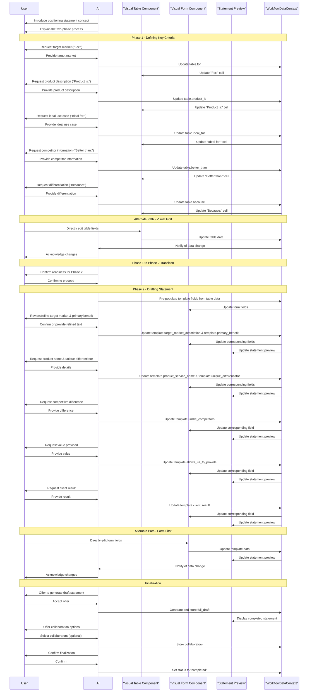

# Specification for Interactive Positioning Statement Workflow

## Goal & Purpose

The Positioning Statement workflow guides users through creating a clear, concise statement that defines their brand's unique value proposition in the market. This workflow helps users articulate what they offer, who they offer it to, and what makes them different from competitors. The resulting positioning statement serves as a foundational element that ensures internal alignment and guides all marketing and product development efforts.

This workflow follows the chat-driven workflow pattern defined in [`docs/strategy-components/chat-driven-workflow-pattern.md`](../../../chat-driven-workflow-pattern.md).

## Core Principles & Context

This workflow adheres to the following principles:

1. **User-Centricity**: The workflow guides users through a structured process that's intuitive and educational.
2. **Split-Panel UI**: Conversation in the left panel, visual components in the right panel.
3. **Phased Progression**: Clear separation between the criteria gathering phase and the statement drafting phase.
4. **Bidirectional Data Flow**: Changes made in either the chat or visual components are reflected in both places.
5. **AI as Guide**: The AI serves as a knowledgeable guide, explaining concepts and offering suggestions throughout.

### Context Requirements

This workflow relies on the following pre-existing data:

- `onboarding_company_name`: Used to personalize the experience and pre-populate relevant fields.
- `onboarding_team_members` (optional): Used for potential collaboration on the positioning statement.

## Overall Data Structure & WorkflowDataContext

The positioning statement data is stored within `WorkflowDataContext.positioning_statement`:

```typescript
WorkflowDataContext.positioning_statement = {
  status: string,                    // "draft", "completed", "in_review"
  last_updated: string,              // timestamp
  company_name: string,              // From onboarding_company_name
  table: {
    for: string,                     // Target market description
    product_is: string,              // Concise product description
    ideal_for: string,               // Best use case
    better_than: string,             // Primary competitor
    because: string                  // Key differentiation
  },
  template: {
    target_market_description: string,
    primary_benefit: string,
    product_service_name: string,
    unique_differentiator: string,
    unlike_competitors: string,
    allows_us_to_provide: string,
    client_result: string
  },
  full_draft: string,                // The final concatenated and user-approved positioning statement
  collaborators: Array<{
    name: string,
    email: string
  }>,
  notes: string,                     // Optional user notes
  version_history: Array<{           // Optional, for tracking iterations
    date: string,
    draft: string,
    author: string
  }>
}
```

## shadcn/ui Component Mapping

| UI Element | shadcn/ui Component | Usage |
|------------|---------------------|-------|
| Title Card | `Card`, `CardHeader`, `CardTitle`, `CardDescription`, `CardContent` | Top-level introduction to the workflow |
| Criteria Table | `Table`, `TableHeader`, `TableBody`, `TableRow`, `TableCell`, `TableHead` | Display the key criteria table with example and editable rows |
| Form Fields | `Form`, `FormField`, `FormItem`, `FormLabel`, `FormControl`, `FormDescription`, `FormMessage` | Input fields for the positioning statement template |
| Text Inputs | `Input`, `Textarea` | Capture user input for each component of the statement |
| Live Preview | `Card`, `CardContent`, `ScrollArea` | Display the real-time assembled positioning statement |
| Collaboration UI | `Select`, `SelectTrigger`, `SelectValue`, `SelectContent`, `SelectItem` | Team member selection for collaboration |
| Action Buttons | `Button`, with various variants | Primary and secondary actions throughout the workflow |
| Phase Navigation | `Tabs`, `TabsList`, `TabsTrigger`, `TabsContent` | Switch between Phase 1 and Phase 2 |

## Phased Breakdown

The workflow proceeds in two primary phases:

### Phase 1: Defining Key Criteria (The Table)

#### A. AI Chat Guidance & Data Collection (Left Panel)

1. **Introduction to Phase 1**:
   ```
   Welcome to the Positioning Statement Worksheet! 👋 This is a foundational step in clearly defining your brand's core message and unique value in the market. A strong positioning statement ensures internal alignment and guides all your marketing and product development efforts.
   
   For [onboarding_company_name], this will be a powerful tool to articulate what you offer, who you offer it to, and what truly makes you different from the competition.
   
   We'll work together through a structured process. First, we'll clarify key aspects of your product or service, then we'll use that to draft your concise positioning statement. This is often a collaborative and iterative process, leading to a highly refined outcome.
   
   Are you ready to build a powerful positioning statement for your business?
   ```

2. **Iterative Prompting for Each Column**:
   
   The AI will guide the user through each column, providing context and an example for clarity:

   a. **For: (Ideal Market Segment)**
   ```
   First, let's define your ideal market segment. Who is your product or service for? Think about the specific group of people or businesses you are trying to serve. For instance, the example provided is 'The business-person who is starting a new company'.
   ```
   Input Handling: Free text input.
   Data Captured: `positioning_statement.table.for`

   b. **Product is: (Concise Description)**
   ```
   Next, how would you provide a concise description of what your product is? What exactly does it do? The example states: 'Software that produces a business plan'.
   ```
   Input Handling: Free text input.
   Data Captured: `positioning_statement.table.product_is`

   c. **Ideal for: (Best Use or Application)**
   ```
   Now, describe the best use or application for your product. What specific situation or need does it address perfectly? The example clarifies: 'Quickly creating a professional plan quickly and easily'.
   ```
   Input Handling: Free text input.
   Data Captured: `positioning_statement.table.ideal_for`

   d. **Better than: (Primary Competitor or Competing Approach)**
   ```
   Who is your primary competitor or what is the common competing approach your target market currently uses to solve this problem? This could be a direct competitor, an indirect solution, or even the current 'do nothing' method. In the example, it's simply '[Competitor]'.
   ```
   Input Handling: Free text input.
   Data Captured: `positioning_statement.table.better_than`

   e. **Because: (Differentiation & Superiority)**
   ```
   Finally, why is your product truly better than the competitor or approach you just mentioned? Provide evidence or highlight the key differentiation that backs up your claim of superiority. The example says: 'It is a stand-alone product and requires no other programs to buy or learn'.
   ```
   Input Handling: Free text input.
   Data Captured: `positioning_statement.table.because`

3. **Confirmation & Review**:
   ```
   Great! We've completed the initial breakdown. Would you like to review or make any changes to any of the sections in the table, or shall we proceed with drafting the statement?
   ```
   
   If "Yes": AI prompts user to specify which section to edit and allows them to re-enter the information.
   If "No": Proceeds to Phase 2.

#### B. Corresponding Visual Component(s) (Right Panel)

Component: `DynamicTableForm`

Structure: A table mirroring the "Key Criteria" and "Your Product" rows of the worksheet.

```tsx
// Conceptual tsx representation of the DynamicTableForm
<Card>
  <CardHeader>
    <CardTitle>Positioning Statement Worksheet</CardTitle>
    <CardDescription>
      Define Your Unique Value and Market Position
    </CardDescription>
  </CardHeader>
  <CardContent>
    <Table>
      <TableHeader>
        <TableRow>
          <TableHead>Key Criteria</TableHead>
          <TableHead>For:</TableHead>
          <TableHead>Product is:</TableHead>
          <TableHead>Ideal for:</TableHead>
          <TableHead>Better than:</TableHead>
          <TableHead>Because:</TableHead>
        </TableRow>
      </TableHeader>
      <TableBody>
        {/* Example row - read only */}
        <TableRow>
          <TableCell>Example: Business Plan Pro</TableCell>
          <TableCell>The business-person who is starting a new company</TableCell>
          <TableCell>Software that produces a business plan</TableCell>
          <TableCell>Quickly creating a professional plan quickly and easily</TableCell>
          <TableCell>[Competitor]</TableCell>
          <TableCell>It is a stand-alone product and requires no other programs to buy or learn</TableCell>
        </TableRow>
        {/* Editable row for user input */}
        <TableRow>
          <TableCell>Your Product</TableCell>
          <TableCell>
            <Textarea 
              value={workflowData.positioning_statement.table.for}
              onChange={(e) => updateWorkflowData('positioning_statement.table.for', e.target.value)}
            />
          </TableCell>
          <TableCell>
            <Textarea 
              value={workflowData.positioning_statement.table.product_is}
              onChange={(e) => updateWorkflowData('positioning_statement.table.product_is', e.target.value)}
            />
          </TableCell>
          <TableCell>
            <Textarea 
              value={workflowData.positioning_statement.table.ideal_for}
              onChange={(e) => updateWorkflowData('positioning_statement.table.ideal_for', e.target.value)}
            />
          </TableCell>
          <TableCell>
            <Textarea 
              value={workflowData.positioning_statement.table.better_than}
              onChange={(e) => updateWorkflowData('positioning_statement.table.better_than', e.target.value)}
            />
          </TableCell>
          <TableCell>
            <Textarea 
              value={workflowData.positioning_statement.table.because}
              onChange={(e) => updateWorkflowData('positioning_statement.table.because', e.target.value)}
            />
          </TableCell>
        </TableRow>
      </TableBody>
    </Table>
  </CardContent>
</Card>
```

#### C. Data Captured in this Phase

All data from the user inputs is stored in the `positioning_statement.table` object:

```javascript
positioning_statement.table = {
  for: string,         // Target market description
  product_is: string,  // Concise product description
  ideal_for: string,   // Best use case
  better_than: string, // Primary competitor
  because: string      // Key differentiation
}
```

#### D. Transition Logic

When the user confirms they're ready to move forward, the AI will guide them to Phase 2, where they'll use the gathered criteria to construct the full positioning statement.

#### E. Key Decisions & Rationale

- **Table Format**: Using a table format for Phase 1 provides a clear, structured way to gather the key components needed for a positioning statement. This helps users understand the basic "building blocks" before crafting the full statement.
- **Example Row**: The example row provides a concrete reference that helps users understand what kind of information is expected in each field.
- **Progressive Information Gathering**: Breaking down the task into individual components reduces cognitive load and helps ensure thorough consideration of each aspect.

### Phase 2: Drafting the Positioning Statement (The Template)

#### A. AI Chat Guidance & Data Collection (Left Panel)

1. **Introduction to Phase 2**:
   ```
   Now, let's take these insights and craft your full positioning statement using a standard template. This structure is designed to be clear and impactful.
   ```

2. **Template Breakdown & Inputs**:
   
   a. **Target Market Description & Primary Benefit**:
   ```
   The template begins: For [target market description] who want/need [primary benefit]. Based on our previous discussion, we have '[positioning_statement.table.for]' as your market and '[positioning_statement.table.ideal_for]' as the ideal use, implying a primary benefit. Would you like to use these, or refine them for this statement?
   ```
   Input Handling: User confirms or provides new text for `target_market_description` and `primary_benefit`.
   Data Captured: `positioning_statement.template.target_market_description`, `positioning_statement.template.primary_benefit`

   b. **Product/Service Name & Unique Differentiator**:
   ```
   Next is: our [product/service name] is the [unique differentiator]. What is the precise name of the product or service we are positioning? And for the unique differentiator, we have '[positioning_statement.table.because]' from our table. Does this accurately capture what makes you truly unique?
   ```
   Input Handling: User provides `product_service_name` (new input) and confirms/refines `unique_differentiator`.
   Data Captured: `positioning_statement.template.product_service_name`, `positioning_statement.template.unique_differentiator`

   c. **Unlike Our Competitors, We Offer/Provide/Do**:
   ```
   Continuing on: Unlike our competitors, we offer/provide/do ___________. This is your chance to expand on how you deliver value differently than alternatives. What specific actions or capabilities do you provide?
   ```
   Input Handling: Free text input.
   Data Captured: `positioning_statement.template.unlike_competitors`

   d. **This Allows Us to Provide**:
   ```
   The next segment is: This allows us to provide ___________. What direct outcome or value does your unique approach enable for your customers?
   ```
   Input Handling: Free text input.
   Data Captured: `positioning_statement.template.allows_us_to_provide`

   e. **As a Result, Our Clients Are Able To**:
   ```
   Finally, what is the ultimate, tangible benefit or successful outcome our clients are able to achieve as a result of using your product or service? As a result, our clients are able to ___________.
   ```
   Input Handling: Free text input.
   Data Captured: `positioning_statement.template.client_result`

3. **Offer to Synthesize/Draft Initial Statement**:
   ```
   We've gathered all the necessary details. Would you like me to generate a preliminary draft of your full positioning statement based on the information we've entered?
   ```
   
   If the user agrees, the AI will use the `positioning_statement.template` object to construct the `positioning_statement.full_draft` as a single coherent sentence:
   
   ```
   For [target_market_description] who want/need [primary_benefit], our [product_service_name] is the [unique_differentiator]. Unlike our competitors, we offer/provide/do [unlike_competitors]. This allows us to provide [allows_us_to_provide]. As a result, our clients are able to [client_result].
   ```

4. **Offer Collaborative Review**:
   ```
   A strong positioning statement often benefits from team feedback. From your onboarding, I have [list names of onboarding_team_members up to 3, then 'and others'] listed as key team members. Would you like to invite them to review or contribute to this positioning statement?
   ```

   If user agrees:
   ```
   Great! Which team members should I send it to? You can select from your existing team, or add new collaborators.
   ```

#### B. Corresponding Visual Component(s) (Right Panel)

Component: `FormWithLivePreview`

```tsx
// Conceptual tsx representation of the FormWithLivePreview
<Card>
  <CardHeader>
    <CardTitle>Positioning Statement Template</CardTitle>
    <CardDescription>
      Complete each field to build your positioning statement
    </CardDescription>
  </CardHeader>
  <CardContent>
    <Tabs defaultValue="form">
      <TabsList>
        <TabsTrigger value="form">Input Form</TabsTrigger>
        <TabsTrigger value="preview">Live Preview</TabsTrigger>
      </TabsList>
      
      <TabsContent value="form">
        <Form>
          <FormField
            name="target_market_description"
            label="Target Market Description:"
            control={form.control}
            render={({ field }) => (
              <FormItem>
                <FormLabel>Target Market Description:</FormLabel>
                <FormControl>
                  <Textarea 
                    {...field}
                    value={workflowData.positioning_statement.template.target_market_description}
                    onChange={(e) => updateWorkflowData('positioning_statement.template.target_market_description', e.target.value)}
                  />
                </FormControl>
                <FormDescription>Who is your product or service for?</FormDescription>
              </FormItem>
            )}
          />
          
          {/* Similar FormField components for each template field */}
          <FormField name="primary_benefit" label="Primary Benefit (they want/need):" />
          <FormField name="product_service_name" label="Product/Service Name:" />
          <FormField name="unique_differentiator" label="Unique Differentiator (is the):" />
          <FormField name="unlike_competitors" label="Unlike our competitors, we offer/provide/do:" />
          <FormField name="allows_us_to_provide" label="This allows us to provide:" />
          <FormField name="client_result" label="As a result, our clients are able to:" />
        </Form>
      </TabsContent>
      
      <TabsContent value="preview">
        <Card>
          <CardHeader>
            <CardTitle>Your Current Positioning Statement Draft</CardTitle>
          </CardHeader>
          <CardContent>
            <ScrollArea className="h-[300px]">
              <div className="p-4 border rounded-md">
                {generateFullPositioningStatement(workflowData.positioning_statement.template)}
              </div>
            </ScrollArea>
          </CardContent>
        </Card>
      </TabsContent>
    </Tabs>
  </CardContent>
</Card>
```

Where `generateFullPositioningStatement` is a helper function that assembles the complete statement:

```typescript
function generateFullPositioningStatement(template) {
  return `For ${template.target_market_description || '[target market]'} who want/need ${template.primary_benefit || '[primary benefit]'}, our ${template.product_service_name || '[product/service name]'} is the ${template.unique_differentiator || '[unique differentiator]'}. Unlike our competitors, we ${template.unlike_competitors || '[offer/provide/do]'}. This allows us to provide ${template.allows_us_to_provide || '[value]'}. As a result, our clients are able to ${template.client_result || '[achieve outcome]'}.`;
}
```

#### C. Data Captured in this Phase

All data from the user inputs is stored in the `positioning_statement.template` object:

```javascript
positioning_statement.template = {
  target_market_description: string,
  primary_benefit: string,
  product_service_name: string,
  unique_differentiator: string,
  unlike_competitors: string,
  allows_us_to_provide: string,
  client_result: string
}
```

Additionally, the assembled statement is stored in:

```javascript
positioning_statement.full_draft = string
```

If collaboration is enabled:

```javascript
positioning_statement.collaborators = [
  { name: string, email: string }
]
```

#### D. Transition Logic

Upon completing the positioning statement and optionally setting up collaboration, the user is prompted to finalize this step or make further refinements.

#### E. Key Decisions & Rationale

- **Structured Template Approach**: The template format ensures all key components of an effective positioning statement are included, following best practices in marketing strategy.
- **Live Preview**: The real-time preview allows users to immediately see how their statement comes together, facilitating iterative refinement.
- **Tabs Interface**: Separating the form inputs from the preview provides a clean UI while still allowing quick toggling between views.
- **Pre-population from Phase 1**: Pre-filling fields based on Phase 1 inputs reduces repetitive work while allowing refinement.

## Workflow Sequence Diagram



## Integration Patterns

This workflow integrates with other components in the system through several key patterns:

### Chat-to-Visual Coordination

When users provide information via chat, the corresponding visual components update in real-time:

```typescript
// Example: Update table data from chat response
function handleChatResponse(response) {
  if (response.data?.positioning_statement?.table) {
    setTableData(prevData => ({
      ...prevData,
      ...response.data.positioning_statement.table
    }));
  }
}
```

### Visual-to-Chat Coordination

When users directly edit visual components, the AI acknowledges these changes:

```typescript
// Example: Notify AI of visual component change
function handleTableCellChange(field, value) {
  // Update local state
  setTableData(prev => ({
    ...prev,
    [field]: value
  }));
  
  // Update WorkflowDataContext
  updateWorkflowData(`positioning_statement.table.${field}`, value);
  
  // Notify AI of the change
  chatContext.notifyDataChange({
    component: 'positioning_statement_table',
    field: field,
    value: value
  });
}
```

### Layout Integration

The workflow uses the standard split-panel layout with ResizablePanelGroup:

```tsx
<ResizablePanelGroup direction="horizontal">
  <ResizablePanel defaultSize={50} minSize={30}>
    <ChatInterface />
  </ResizablePanel>
  <ResizableHandle />
  <ResizablePanel defaultSize={50} minSize={30}>
    {currentPhase === 'criteria' ? <DynamicTableForm /> : <FormWithLivePreview />}
  </ResizablePanel>
</ResizablePanelGroup>
```

### Workflow Data Context Integration

All components access and update data through the shared WorkflowDataContext:

```tsx
const { workflowData, updateWorkflowData } = useWorkflowDataContext();

// Access data
const tableData = workflowData.positioning_statement.table;

// Update data
function handleInputChange(field, value) {
  updateWorkflowData(`positioning_statement.${field}`, value);
}
```

## Key AI Capabilities

This workflow leverages the following AI capabilities:

1. **Contextual Guidance**: The AI explains the purpose and structure of a positioning statement, helping users understand its importance.

2. **Intelligent Defaults**: The AI suggests pre-populated fields based on Phase 1 inputs when transitioning to Phase 2.

3. **Natural Language Processing**: The AI interprets user responses to populate structured data fields.

4. **Content Generation**: The AI can synthesize a complete positioning statement draft from user-provided components.

5. **Educational Support**: The AI provides examples and explanations for each component of the positioning statement.

6. **Progress Awareness**: The AI maintains awareness of completed sections and guides users through the process.

7. **Bidirectional Communication**: The AI acknowledges changes made in visual components and maintains conversation continuity.

## Cross-Cutting Concerns

### Accessibility (a11y) Considerations

- All form fields have proper labels and descriptions
- Table uses proper headers and row relationships
- Color contrast meets WCAG 2.1 AA standards
- All interactive elements are keyboard accessible
- Tab order follows a logical flow between phases
- Error states provide clear guidance

### Performance Considerations

- Template rendering is optimized to prevent re-renders
- Data state updates are batched where possible
- Large text fields use lazy loading for rendering
- Preview updates are debounced to prevent excessive renders

### Security Considerations

- User data is stored securely in the WorkflowDataContext
- Collaboration features require proper authentication
- No sensitive data is exposed in the UI or chat

### Internationalization & Localization

- All UI text is stored in translatable string resources
- Date formats follow locale-specific patterns
- Text inputs support multilingual content
- Templates accommodate varying text lengths across languages

## Concluding the Workflow

When the user finalizes their positioning statement:

1. The complete statement is saved to `WorkflowDataContext.positioning_statement.full_draft`
2. The status is updated to "completed"
3. The AI acknowledges completion and offers next steps
4. The saved statement becomes available for use in other strategic modules
