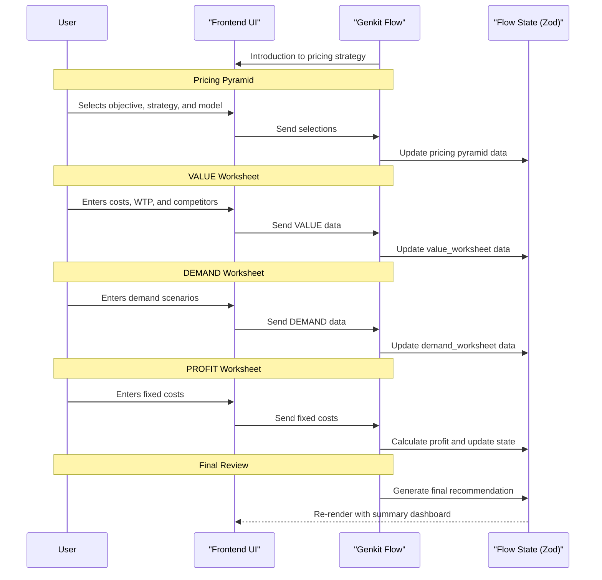

# Genkit Flow: Pricing Strategy

## 1. Overview & Purpose

This Genkit flow guides users through developing a comprehensive pricing strategy. Using the Pricing Pyramid concept, it helps users define their pricing objective, strategy, and model, and then apply these decisions through worksheets analyzing value, demand, and profit.

## 2. Target User & Context

**User:** Product managers, marketing strategists, business owners, and pricing specialists.

**Context:** This flow helps users make strategic pricing decisions backed by financial analysis. It can be used for new product launches, pricing reviews, or entering new markets.

## 3. Core Flow & UI Interaction

### General Principle
The Genkit flow orchestrates the conversation, while the frontend UI dynamically displays the pricing pyramid framework, data input forms, and interactive visualizations.

### Phase 1: Introduction and Project Setup

**Genkit Flow Logic (Left Panel):**
- Introduces the Pricing Strategy Worksheet and its purpose.
- Confirms the project name, using the company name from onboarding as a default.

**Frontend UI (Right Panel):**
- Displays a title card: "Pricing Strategy Worksheet."
- Provides a text input for the project name, pre-filled with the company name.

### Phase 2: The Pricing Pyramid - Objective

**Genkit Flow Logic (Left Panel):**
- Explains the first layer of the Pricing Pyramid: the Pricing Objective.
- Lists common objectives (e.g., Maximize profitability, Maximize market share) and asks the user to choose one.

**Frontend UI (Right Panel):**
- Displays the "Pricing Pyramid" graphic.
- Shows a list of radio buttons for the user to select their primary pricing objective.

### Phase 3: The Pricing Pyramid - Strategy

**Genkit Flow Logic (Left Panel):**
- Explains the second layer: Pricing Strategy.
- Describes different strategies like Cost Plus, Competition-based, and Value-based, as well as the Price and Quality/Differentiation matrix.
- Prompts the user to select a strategy.

**Frontend UI (Right Panel):**
- Presents a set of radio buttons for the primary pricing strategies.
- If the user selects the "Price and Quality/Differentiation Matrix," it conditionally displays a sub-selection of options (Economy, Penetration, Skimming, Premium).

### Phase 4: The Pricing Pyramid - Model

**Genkit Flow Logic (Left Panel):**
- Explains the final layer of the pyramid: the Pricing Model.
- Lists common models (e.g., Per unit, Per user, Subscription) and asks the user to choose one.

**Frontend UI (Right Panel):**
- Shows a list of radio buttons for the user to select their pricing model.

### Phase 5: Pricing Your Product - VALUE Worksheet

**Genkit Flow Logic (Left Panel):**
- Introduces the VALUE Worksheet.
- Prompts the user for their product's variable costs per unit, the maximum price a customer is willing to pay, and a list of competitors with their prices.

**Frontend UI (Right Panel):**
- Displays input fields for "Variable Costs per Unit" and "Maximum Price a Customer Would Pay."
- Provides a table for adding competitors and their prices.
- Shows a "Pricing Thermometer" graphic that visualizes the entered data.

### Phase 6: Pricing Your Product - DEMAND Worksheet

**Genkit Flow Logic (Left Panel):**
- Introduces the DEMAND Worksheet.
- Asks the user to provide the expected price per unit and quantity per year for three different scenarios to build a demand curve.

**Frontend UI (Right Panel):_
- Provides input fields for three scenarios, each with "Price/Unit" and "Quantity/Year."
- Displays a "Demand Curve" graph that plots the three data points.

### Phase 7: Pricing Your Product - PROFIT Worksheet

**Genkit Flow Logic (Left Panel):**
- Introduces the PROFIT Worksheet.
- Prompts the user for their total fixed costs.
- The flow then calculates the total profit for each of the three demand scenarios.

**Frontend UI (Right Panel):**
- An input field for "Fixed Costs."
- A table that automatically calculates and displays the revenue, total costs, and profit for each scenario.
- A "Profit at Different Price Points" bar chart visualizing the profit for each scenario.

### Phase 8: Final Review & Conclusion

**Genkit Flow Logic (Left Panel):**
- Confirms the completion of the worksheet.
- Offers to compile a summary and a recommendation based on the highest profit scenario.

**Frontend UI (Right Panel):**
- A comprehensive summary dashboard displaying all the collected and calculated data, including the AI's recommendation for the most profitable scenario.
- "Download Summary" and "Save Strategy" buttons.

## 4. Zod Schema for Flow State

The state of the Genkit flow will be defined by the following Zod schema:

```javascript
import { z } from 'zod';

const CompetitorSchema = z.object({
  name: z.string(),
  price: z.number(),
});

const DemandScenarioSchema = z.object({
  scenario_id: z.string(),
  price_per_unit: z.number(),
  quantity_per_year: z.number(),
});

const ProfitAnalysisSchema = z.object({
  scenario_id: z.string(),
  revenue: z.number(),
  total_variable_costs: z.number(),
  total_costs: z.number(),
  profit_net_margin: z.number(),
});

const PricingStrategyStateSchema = z.object({
  project_name: z.string(),
  pricing_objective: z.string(),
  pricing_strategy: z.string(),
  price_quality_matrix_strategy: z.string().nullable(),
  pricing_model: z.string(),
  value_worksheet: z.object({
    variable_costs_per_unit: z.number(),
    maximum_price_customer_pay: z.number(),
    competitors: z.array(CompetitorSchema),
    suggested_price_range_lower: z.number(),
    suggested_price_range_upper: z.number(),
  }),
  demand_worksheet: z.object({
    scenarios: z.array(DemandScenarioSchema),
  }),
  profit_worksheet: z.object({
    fixed_costs: z.number(),
    profit_analysis: z.array(ProfitAnalysisSchema),
  }),
  final_pricing_recommendation: z.object({
    recommended_scenario_id: z.string(),
    recommended_profit_value: z.number(),
    summary_text: z.string(),
  }).nullable(),
  status: z.enum(['in_progress', 'completed']).default('in_progress'),
  last_updated_at: z.string().datetime(),
});
```

## 5. Genkit Implementation Notes

-   **Stateful Flow**: The entire pricing strategy workflow will be a single, stateful Genkit flow that manages the state defined by the `PricingStrategyStateSchema`.
-   **Calculation Tools**: The calculations for the profit analysis should be implemented in a Genkit `tool`. This separates the complex business logic from the conversational flow, making it easier to test and maintain.
-   **Frontend Integration**: The frontend will be responsible for rendering the UI based on the state returned by the Genkit flow. It will send user inputs to the flow and receive the updated state in response.
-   **Observability**: Genkit's tracing will be invaluable for debugging the flow's logic, especially the interactions with the calculation tool and the conditional paths based on user selections.

## 6. Workflow Sequence Diagram



## 7. Cross-Cutting Concerns

This section remains highly relevant. Key considerations include:
-   **Accessibility**: Ensuring the frontend UI and all visualizations are accessible.
-   **Performance**: Optimizing the real-time calculations and chart rendering.
-   **Security**: Protecting sensitive pricing and profit data.
-   **Internationalization**: Supporting different currencies and number formats.
