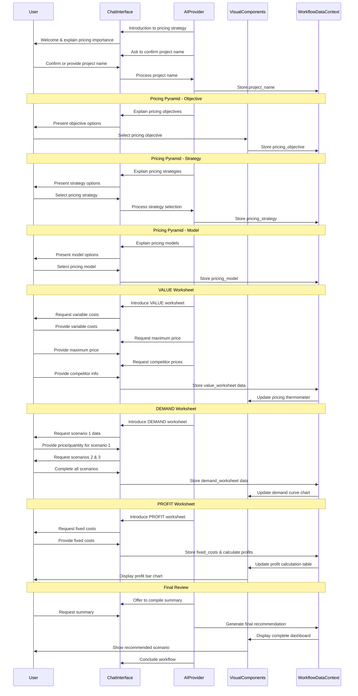

# Pricing Strategy Workflow

## 1. Overview & Purpose

This AI-powered conversational tool guides users through the process of developing a comprehensive pricing strategy for their products or services. Using a structured approach based on the Pricing Pyramid concept, it helps users define their pricing objective, strategy, and model, then apply these decisions through practical worksheets analyzing value, demand, and profit. The result is a data-driven pricing recommendation that aligns with business goals and market realities.

## 2. Target User & Context

**User:** Product managers, marketing strategists, business owners, and pricing specialists who need to establish or refine pricing for products or services.

**Context:** This workflow helps users make strategic pricing decisions backed by financial analysis rather than gut feelings. It can be used for new product launches, pricing reviews of existing products, or when entering new markets. The process complements other marketing strategy components like market segmentation and competitive analysis.

## 3. Core Conversational Flow

### General Principle
As the AI guides the user through the pricing strategy development process, the right visual panel will dynamically display the pricing pyramid framework, data input forms, and interactive visualizations of calculations. This follows the **Visual Augmentation** and **Bidirectional Updates** principles from the Chat-Driven Workflow Pattern.

### Phase 1: Introduction and Project Setup

**AI Chat (Left Panel):**
"Hello! I'm here to help you develop a robust pricing strategy for your product or service using our Pricing Strategy Worksheet.816 This tool will guide you through understanding key considerations for establishing optimal pricing.816"

"Setting the right price is crucial as it influences who buys your product, the competitors you encounter, and how customers perceive your product's capabilities and quality.816"

"We'll start by defining the project. From your onboarding, I have your company name as [onboarding_company_name]. Is this correct for our pricing project today, or would you prefer a different name for this specific exercise?"

**User Response (Example):**
"Yes, that's correct.": "Great, we'll use [onboarding_company_name] as the project name."
"No, I'd like to use something else.": "Understood. Please tell me the name you'd like to use for this pricing project." (AI waits for input and updates project_name accordingly).

**Visual Components (Right Panel):**
- Title Card: "Pricing Strategy Worksheet" with a brief introductory text: "Determine critical factors for establishing product pricing, including objectives, strategies, models, and practical calculations for value, demand, and profit."
- Input Form:
  - Label: "Project Name:"
  - Input Field: Text input, pre-filled with onboarding_company_name.
  - Buttons: "Confirm Name" (if onboarding_company_name is present and selected), "Edit Name" (if user wants to change).

**Data Captured:**
```typescript
project_name: string // e.g., "Sprocket", initially onboarding_company_name
```

### Phase 2: The Pricing Pyramid - Objective

**AI Chat (Left Panel):**
"Our pricing journey begins with the Pricing Pyramid.810 The first layer is setting your Pricing Objective.81626 This defines what your pricing aims to accomplish.810"

"While many objectives exist, it's generally best to choose one primary objective to focus on to avoid conflicting goals.816 Common objectives include: Maximize profitability, Maximize revenue, Maximize market share, Reinforce brand perception, Stabilize the market, Achieve Return-on-investment, Become the price leader, Create product interest, or Discourage entry of new competitors into your market.816"

"Which of these objectives best aligns with your primary goal for this product's pricing?"

**Visual Components (Right Panel):**
- Image: Display the "Pricing Pyramid" graphic from the document.
- Section Title: "1. Pricing Objective"
- Description: "The philosophy under which you define a strategy, build a pricing model, and set prices. Choose one primary objective."
- Selection Component: A list of radio buttons for single selection:
  - Maximize profitability816
  - Maximize revenue816
  - Maximize market share816
  - Reinforce brand perception816
  - Stabilize the market816
  - Achieve Return-on-investment8
  - Become the price leader816
  - Create product interest816
  - Discourage entry of new competitors into your market816

**Data Captured:**
```typescript
pricing_objective: string // e.g., "Maximize profitability"
```

### Phase 3: The Pricing Pyramid - Strategy

**AI Chat (Left Panel):**
"Now, let's define your Pricing Strategy, which is the plan for achieving your objective.816"

"We can consider: Cost Plus (price based on costs + markup), Competition-based (price based on competitors' pricing), or Value-based (price based on perceived customer value).8161929 Value-based pricing often fosters product value but can be harder to quantify.816"

"Alternatively, you might use a Price and Quality/Differentiation matrix, which includes:
- Economy: Low price for low-frills products.
- Penetration: Artificially low initial price to gain market share fast.
- Skimming: High initial price for unique products, gradually lowered.
- Premium: High price for differentiated products with strong brand perception.8"

"Which strategic approach will you pursue?"

**Visual Components (Right Panel):**
- Section Title: "2. Pricing Strategy"
- Description: "The plan for determining the optimal pricing model and price, influenced by your objective."8
- Selection Component: A primary set of radio buttons:
  - "Cost Plus"829
  - "Competition-based"8111929
  - "Value-based"81929
  - "Price and Quality/Differentiation Matrix"8
- Conditional Display (if "Price and Quality/Differentiation Matrix" is selected):
  - Image: Display the "Price and Quality/Differentiation matrix" from the document.
  - Sub-Selection (Radio Buttons): "Economy", "Penetration", "Skimming", "Premium" with brief explanations as provided by the AI.

**Data Captured:**
```typescript
pricing_strategy: string // e.g., "Value-based"
price_quality_matrix_strategy: string // conditional, e.g., "Premium"
```

### Phase 4: The Pricing Pyramid - Model

**AI Chat (Left Panel):**
"The next step is to choose your Pricing Model.816 This is the specific system for how you will charge customers."8

"When selecting a model, consider factors like market maturity, product category, demand volume, perceived value, competitive landscape, quality perception, product differentiation, and brand strength.816"

"Common pricing models include: Per unit, Per user, Per usage, Per unit of infrastructure, or Subscription.8"

"Which of these pricing models are you considering for your product?"

**Visual Components (Right Panel):**
- Section Title: "3. Pricing Model"
- Description: "The implementation of your pricing strategy, considering influencing criteria like: Market Maturity, Product Category, Demand, Value, Competition, Quality/perception of quality, Differentiation, Brand premium."816
- Selection Component: A list of radio buttons for single selection:
  - "Per unit"8
  - "Per user"8
  - "Per usage"8
  - "Per unit of infrastructure"8
  - "Subscription"8

**Data Captured:**
```typescript
pricing_model: string // e.g., "Per unit"
```

### Phase 5: Pricing Your Product - VALUE Worksheet

**AI Chat (Left Panel):**
"Now, let's apply our strategy to the VALUE Worksheet.8 This helps you understand your product's market value by analyzing costs, customer willingness to pay, and competitor pricing.891418"

"First, please tell me your product's variable costs per unit.781727 This is the cost that directly changes with each unit produced, like raw materials or direct labor.1727"

User Input (Example): "6.00"

"Got it. Next, what is the maximum price a customer is willing to pay for your product?59141820 This 'willingness to pay' is the highest price they'd consider before looking elsewhere.591418"

User Input (Example): "4000.00"

"Great. Finally, let's gather information on your competitive pricing.28111224 To get a clear picture of your product's relative value, please list up to five key competitors and their product's current selling price. You can add them one by one."24812

User Input (Example): "Competitor A, 2000.00"

AI: "Excellent, I've added 'Competitor A' with a price of £2,000. Would you like to add another competitor, or are you ready to proceed?"

(Loop until user says "no" or provides a stopping cue like "I'm done"): "Okay, please provide the next competitor's name and price, or tell me you're finished."

**Visual Components (Right Panel):**
- Section Title: "4. VALUE Worksheet"
- Input Fields:
  - Label: "Variable Costs per Unit"
  - Input Field: Number type, pre-filled with "£ 6.00" (or user input).
  - Label: "Maximum Price a Customer Would Pay"
  - Input Field: Number type, pre-filled with "£ 4,000.00" (or user input).
- Competitive Pricing Table:
  - Header Columns: "Competitor Name", "Price (£)"
  - Dynamic Rows: Rows are added dynamically as the user provides data in the chat.
  - Input Fields for new row: Text for name, Number for price.
- Visual: "Pricing Thermometer" graphic (as in the document), dynamically updating to reflect the entered data (variable cost, max price, competitor prices) and potentially the calculated price range.

**Data Captured in this Phase:**
```typescript
value_worksheet: {
  variable_costs_per_unit: float,
  maximum_price_customer_pay: float,
  competitors: Array<{name: string, price: float}>,
  suggested_price_range_lower: float, // calculated, e.g., the variable_costs_per_unit
  suggested_price_range_upper: float  // calculated, e.g., maximum_price_customer_pay
}
```

**AI-Assisted Actions (Results & Analysis for VALUE):**
- AI: "Based on your inputs, your product's optimal price should generally fall between a lower bound (e.g., covering variable costs and competitive pricing) and an upper bound (your customer's maximum willingness to pay).8 Would you like me to elaborate on the concepts of pricing: 'Above the Maximum Price,' 'Between Cost and the Maximum Price,' or 'Between Cost and Zero'?"
- Visual Components (Right Panel):
  - Results Area: Displays the calculated "Suggested Price Range" (e.g., "Between £6.00 and £4,000.00").
  - Expandable Sections: Each section ("Above the Maximum Price", "Between Cost and the Maximum Price", "Between Cost and Zero") contains the document's descriptive text, visible upon expansion.

### Phase 6: Pricing Your Product - DEMAND Worksheet

**AI Chat (Left Panel):**
"Moving on to the Demand Worksheet!8 This section helps us understand how price changes affect your sales volume and visualizes your product's demand curve.32325"

"To create your demand curve, please provide the Price/Unit and the corresponding Quantity/Year you expect to sell for three different scenarios."13

"Let's start with Scenario 1. What price per unit, and what quantity per year do you expect to sell at that price?"

User Input (Example): "500.00, 10000000"

AI: "Okay, Scenario 1 set at £500 per unit with 10,000,000 units per year. Now for Scenario 2... What are your expected price and quantity?"

(Continues for Scenario 3.)

**Visual Components (Right Panel):**
- Section Title: "5. DEMAND Worksheet"
- Input Fields for 3 Scenarios:
  - For each of "SCENARIO 1", "SCENARIO 2", "SCENARIO 3":
    - Label: "PRICE/UNIT (£)"
    - Input Field: Number type, pre-filled with example values (e.g., 500.00).
    - Label: "QUANTITY/YEAR"
    - Input Field: Number type, pre-filled with example values (e.g., 10,000,000).
- Dynamic Chart: A "Demand Curve" graph (as in the document) that plots the three price/quantity data points as they are entered, drawing a line to represent the product's demand curve.2325

**Data Captured:**
```typescript
demand_worksheet: {
  scenarios: Array<{
    scenario_id: string,
    price_per_unit: float,
    quantity_per_year: number
  }>
}
```

**AI-Assisted Actions (Results & Analysis for DEMAND):**
- AI: "The demand curve visually represents how sales volume reacts to price changes. A steeper curve suggests a more price-sensitive product, where small price changes significantly impact quantity demanded. A flatter curve indicates less price sensitivity. Would you like more detail on interpreting your demand curve, such as what makes a product price-sensitive or less price-sensitive?"62123
- Visual Components (Right Panel):
  - Display Area: The "Demand Curve" chart.
  - RESULTS Text: Provides explanations for interpreting the curve (similar to the document's text, e.g., "A less price-sensitive product will have a demand curve with a steeper slope...").

### Phase 7: Pricing Your Product - PROFIT Worksheet

**AI Chat (Left Panel):**
"The final practical step is the Profit Worksheet.128 This allows us to analyze the profitability of your product across the scenarios we've just defined.1928"

"To calculate profit, we need to know your fixed costs. These are costs that do not change regardless of your production volume, such as rent, insurance, or certain salaries.72227 What are your total fixed costs for this product per period (e.g., annually)?"

User Input (Example): "300000.00"

"We will then use your variable costs per unit (which we determined earlier as £[value_worksheet.variable_costs_per_unit]) and the price/quantity data from your demand scenarios to calculate the total profit for each scenario."

**Visual Components (Right Panel):**
- Section Title: "6. PROFIT Worksheet"
- Input Field:
  - Label: "FIXED COSTS (£)"
  - Input Field: Number type, pre-filled with example value (e.g., 300,000.00).
- Profit Calculation Table: This table should automatically populate:
  - Rows: SCENARIO 1, SCENARIO 2, SCENARIO 3
  - Columns (populated from previous stages): "PRICE/UNIT", "QUANTITY/YEAR"
  - Calculated Columns:
    - "VARIABLE COSTS/UNIT" (pre-filled from value_worksheet.variable_costs_per_unit)
    - "TOTAL VARIABLE COSTS" (Calculated: variable_costs_per_unit * quantity_per_year)
    - "TOTAL FIXED COSTS" (pre-filled with fixed_costs)
    - "REVENUE" (Calculated: price_per_unit * quantity_per_year)
    - "TOTAL COSTS" (Calculated: Total Variable Costs + Fixed Costs)
    - "PROFIT/NET MARGIN" (Calculated: Revenue - Total Costs)
- Dynamic Chart: "Profit at Different Price Points" bar chart (as in the document), dynamically displaying the calculated profit for each scenario.

**Data Captured:**
```typescript
profit_worksheet: {
  fixed_costs: float,
  profit_analysis: Array<{
    scenario_id: string,
    revenue: float,
    total_variable_costs: float,
    total_costs: float,
    profit_net_margin: float
  }>
}
```

**AI-Assisted Actions (Results & Analysis for PROFIT):**
- AI: "You can now see the projected profit for each of your pricing scenarios.128 The aim is typically to maximize profitability, which means identifying the price point that generates the highest profit.828 Review these results to help determine your optimal pricing strategy.815 Would you like deeper insights into these profit results and how to identify the best scenario?"
- Visual Components (Right Panel):
  - Display Area: The full calculation table and the "Profit at Different Price Points" bar chart.
  - RESULTS Text: Provides explanations for interpreting the profit data (similar to the document's text, e.g., "We suggest analyzing your results, considering the goals for your product or service...").

### Phase 8: Final Review & Conclusion

**AI Chat (Left Panel):**
"We've now completed the entire Pricing Strategy Worksheet process for [project_name]!"

"You've clearly defined your pricing objective, strategy, and model, and completed practical analyses of value, demand, and profit for your product."

"The final step is to refine your pricing. Remember to compare your pricing to the competition, ensure it accounts for positioning and functional differences, and always make sure your pricing is easy for the market to understand and explain.38"

"Would you like me to compile a summary of all the data and strategic choices we've made, along with a recommendation based on the highest profit scenario?"

User Response (Example): "Yes, please summarize."

AI (if user accepts): "Great! Here is a summary of your pricing strategy for [project_name], highlighting the key insights from our analysis. We recommend focusing on [Scenario ID with highest profit] as it currently yields the highest projected profit of £[Highest Profit Value]. You can always come back and adjust any of your inputs to explore different pricing outcomes."

AI: "This summary will also be available for review in the right panel. What would you like to do next? We can refine the current strategy, explore other strategy modules, or conclude this session."

**Visual Components (Right Panel):**
- Summary Dashboard: A comprehensive, read-only display compiling all collected and calculated data:
  - Project Overview: Project Name, Pricing Objective, Strategy, Model.
  - VALUE Summary: Variable Costs, Max WTP, Competitor list, Suggested Price Range.
  - DEMAND Summary: All scenarios, Demand Curve chart.
  - PROFIT Summary: Fixed Costs, Full profit calculation table, Profit bar chart.
  - AI Recommendation: Clear display of the AI-selected recommended scenario and its highest profit.
  - Action Buttons: "Download Summary (PDF/CSV)", "Save Strategy to Platform", "Edit Strategy".

## 4. Visual Components

### shadcn/ui Component Mapping

| UI Element | shadcn/ui Component | Usage |
|------------|---------------------|-------|
| Main Container | `<ResizablePanelGroup>` | Split-panel layout for chat and visual components |
| Pricing Pyramid Image | `<Image>` | Display of the pricing pyramid framework |
| Radio Button Groups | `<RadioGroup>`, `<RadioGroupItem>` | Selection of pricing objective, strategy, and model |
| Number Inputs | `<Input type="number">` | Variable costs, maximum price, scenario data |
| Data Tables | `<Table>` with related components | Competitive pricing table, profit calculations |
| Charts | Custom charting component | Demand curve, profit bar chart |
| Summary Cards | `<Card>`, `<CardHeader>`, `<CardContent>` | Sections for each worksheet and final summary |
| Action Buttons | `<Button>` with variants | Confirm selections, download summary |
| Expandable Sections | `<Collapsible>` | For detailed explanations of pricing concepts |

### Example Price Analysis Component (Conceptual)

```tsx
import { useState, useEffect } from 'react';
import { Card, CardHeader, CardTitle, CardDescription, CardContent } from "@/components/ui/card";
import { Input } from "@/components/ui/input";
import { Table, TableHeader, TableBody, TableRow, TableHead, TableCell } from "@/components/ui/table";
import { Button } from "@/components/ui/button";
import { Line } from 'react-chartjs-2'; // Example charting library

interface Competitor {
  name: string;
  price: number;
}

interface PriceAnalysisProps {
  variableCosts: number;
  maximumCustomerPrice: number;
  competitors: Competitor[];
  onUpdate: (field: string, value: any) => void;
}

export function PriceAnalysisComponent({
  variableCosts,
  maximumCustomerPrice,
  competitors,
  onUpdate
}: PriceAnalysisProps) {
  const [newCompetitorName, setNewCompetitorName] = useState('');
  const [newCompetitorPrice, setNewCompetitorPrice] = useState<number | ''>('');
  
  // Calculate suggested price range
  const suggestedLower = variableCosts;
  const suggestedUpper = maximumCustomerPrice;
  
  const handleAddCompetitor = () => {
    if (newCompetitorName && newCompetitorPrice !== '') {
      const newCompetitor = {
        name: newCompetitorName,
        price: Number(newCompetitorPrice)
      };
      onUpdate('competitors', [...competitors, newCompetitor]);
      setNewCompetitorName('');
      setNewCompetitorPrice('');
    }
  };

  // Prepare data for the pricing thermometer visualization
  const competitorPrices = competitors.map(c => c.price);
  const pricesForChart = [variableCosts, ...competitorPrices, maximumCustomerPrice].sort((a, b) => a - b);
  
  // Chart data configuration (conceptual)
  const chartData = {
    labels: ['Variable Cost', ...competitors.map(c => c.name), 'Max WTP'],
    datasets: [{
      label: 'Price Points',
      data: pricesForChart,
      backgroundColor: 'rgba(75, 192, 192, 0.2)',
      borderColor: 'rgba(75, 192, 192, 1)',
      borderWidth: 1
    }]
  };

  return (
    <Card className="w-full">
      <CardHeader>
        <CardTitle>VALUE Worksheet</CardTitle>
        <CardDescription>Analyze your product's market value based on costs, customer WTP, and competition</CardDescription>
      </CardHeader>
      <CardContent className="space-y-6">
        <div className="space-y-4">
          <div className="grid grid-cols-2 gap-4">
            <div>
              <label className="text-sm font-medium">Variable Costs per Unit (£)</label>
              <Input
                type="number"
                value={variableCosts}
                onChange={(e) => onUpdate('variableCosts', parseFloat(e.target.value))}
                min={0}
                step={0.01}
              />
            </div>
            <div>
              <label className="text-sm font-medium">Maximum Price a Customer Would Pay (£)</label>
              <Input
                type="number"
                value={maximumCustomerPrice}
                onChange={(e) => onUpdate('maximumCustomerPrice', parseFloat(e.target.value))}
                min={0}
                step={0.01}
              />
            </div>
          </div>
          
          <div>
            <h3 className="text-sm font-medium mb-2">Competitive Pricing</h3>
            <Table>
              <TableHeader>
                <TableRow>
                  <TableHead>Competitor Name</TableHead>
                  <TableHead className="text-right">Price (£)</TableHead>
                  <TableHead className="w-[100px] text-center">Actions</TableHead>
                </TableRow>
              </TableHeader>
              <TableBody>
                {competitors.map((competitor, index) => (
                  <TableRow key={index}>
                    <TableCell>{competitor.name}</TableCell>
                    <TableCell>{competitor.price.toFixed(2)}</TableCell>
                    <TableCell className="text-center">
                      <Button
                        variant="ghost"
                        size="sm"
                        onClick={() => onUpdate('competitors', competitors.filter((_, i) => i !== index))}
                      >
                        Remove
                      </Button>
                    </TableCell>
                  </TableRow>
                ))}
                <TableRow>
                  <TableCell>
                    <Input
                      placeholder="Competitor name"
                      value={newCompetitorName}
                      onChange={(e) => setNewCompetitorName(e.target.value)}
                    />
                  </TableCell>
                  <TableCell>
                    <Input
                      type="number"
                      placeholder="Price"
                      value={newCompetitorPrice}
                      onChange={(e) => setNewCompetitorPrice(e.target.value === '' ? '' : parseFloat(e.target.value))}
                      min={0}
                      step={0.01}
                    />
                  </TableCell>
                  <TableCell className="text-center">
                    <Button onClick={handleAddCompetitor} disabled={!newCompetitorName || newCompetitorPrice === ''}>
                      Add
                    </Button>
                  </TableCell>
                </TableRow>
              </TableBody>
            </Table>
          </div>
          
          <div className="mt-6">
            <h3 className="text-sm font-medium mb-2">Pricing Thermometer</h3>
            <div className="h-60">
              {/* Placeholder for chart visualization */}
              {/* Example: <CustomPricingThermometerChart data={pricesForChart} /> */}
              <div className="p-4 border rounded bg-slate-50 text-center flex items-center justify-center h-full">
                Pricing Thermometer Visualization
              </div>
            </div>
          </div>
          
          <div className="mt-4 p-4 border rounded bg-blue-50">
            <h3 className="font-medium mb-2">Suggested Price Range:</h3>
            <p>Between £{suggestedLower.toFixed(2)} and £{suggestedUpper.toFixed(2)}</p>
          </div>
        </div>
      </CardContent>
    </Card>
  );
}
```

## 5. Data Structure & Integration

### Complete Data Structure

```typescript
{
  "project_name": string, // e.g., "Sprocket", initially onboarding_company_name
  "pricing_objective": string, // e.g., "Maximize profitability"
  "pricing_strategy": string, // e.g., "Value-based"
  "price_quality_matrix_strategy": string | null, // Conditional, based on pricing_strategy
  "pricing_model": string, // e.g., "Per unit"
  
  "value_worksheet": {
    "variable_costs_per_unit": number,
    "maximum_price_customer_pay": number,
    "competitors": [
      {
        "name": string,
        "price": number
      }
    ],
    "suggested_price_range_lower": number,
    "suggested_price_range_upper": number
  },
  
  "demand_worksheet": {
    "scenarios": [
      {
        "scenario_id": string,
        "price_per_unit": number,
        "quantity_per_year": number
      }
    ]
  },
  
  "profit_worksheet": {
    "fixed_costs": number,
    "profit_analysis": [
      {
        "scenario_id": string,
        "revenue": number,
        "total_variable_costs": number,
        "total_costs": number,
        "profit_net_margin": number
      }
    ]
  },
  
  "final_pricing_recommendation": {
    "recommended_scenario_id": string,
    "recommended_profit_value": number,
    "summary_text": string
  },
  
  // Metadata
  "last_updated_at": string, // ISO date string
  "status": 'in_progress' | 'completed',
  "created_by": string // User ID
}
```

### Integration with Other Workflows

The Pricing Strategy workflow integrates with other marketing strategy components:

1. **Market Segmentation**: The segmentation data can inform different pricing strategies for different market segments.

2. **Competitor Analysis**: Competitive insights feed directly into the VALUE worksheet's competitor pricing section.

3. **Brand Assessment**: Brand strength assessment helps determine whether premium pricing is viable.

4. **Marketing Strategy Scorecard**: Pricing objectives can be incorporated into the marketing scorecard as KPIs.

5. **Balanced Scorecard**: Pricing objectives typically align with the Financial perspective of the balanced scorecard.

## 6. Workflow Sequence Diagram



## 7. Cross-Cutting Concerns

### Accessibility Considerations
- Ensure all input fields have proper labels and ARIA attributes
- Provide text alternatives for visualizations (pricing thermometer, demand curve, profit chart)
- Maintain sufficient color contrast for pricing displays and charts
- Support keyboard navigation for all interactive elements, especially radio button selections

### Performance Considerations
- Implement efficient calculation logic for profit analysis with large datasets
- Optimize chart rendering for real-time updates as users change inputs
- Consider server-side calculation for complex profit scenarios with many competitors
- Cache pricing data appropriately to improve responsiveness

### Security Considerations
- Apply appropriate access controls for sensitive pricing data
- Sanitize all user inputs, especially in competitor name fields
- Implement role-based permissions for viewing vs. editing pricing strategies
- Securely store profit margin data which could be competitively sensitive

### Internationalization & Localization
- Support currency symbols and formats based on user locale
- Provide localized descriptions of pricing concepts
- Consider cultural differences in pricing perception
- Support various date and number formats for different regions
