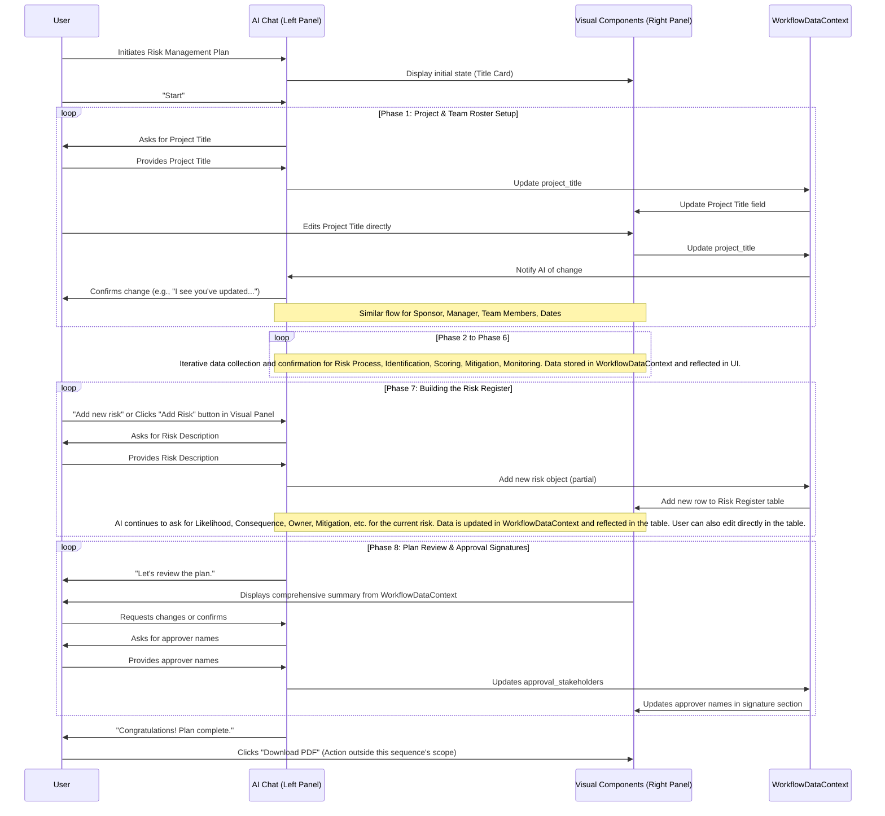

# Specification for Interactive Risk Management Plan Workflow

## Goal / Purpose

This document outlines the specification for an interactive, chat-driven workflow component designed to help users create a comprehensive Risk Management Plan. The primary goal is to create a seamless and efficient experience for the user, leveraging pre-existing information where possible to reduce redundant data entry. Users will be guided through identifying, analyzing, and managing potential risks throughout their project's lifecycle.

This workflow aligns with the principles and patterns described in the [`docs/strategy-components/chat-driven-workflow-pattern.md`](docs/strategy-components/chat-driven-workflow-pattern.md).

## Core Principles & Context

*   **User-Centricity and Efficiency:** The primary goal is to create a seamless and efficient experience for the user.
*   **Leverage Pre-existing Information:** Utilize onboarding data where possible to reduce redundant data entry.
*   **Clear Review and Correction:** Always provide clear ways for the user to review, confirm, and easily correct or update any pre-filled information.
*   **Split-Panel UI:** The workflow utilizes a split-panel interface, with AI chat guidance on the left and corresponding visual components on the right.
*   **Phased Progression:** The process is broken down into logical, sequential phases.
*   **Bidirectional Data Flow:** Information can be updated via chat or direct interaction with visual components, with changes reflected in a central data context.
*   **AI as Guide:** The AI facilitates the process, asks clarifying questions, and can provide suggestions.

### Pre-existing Onboarding Information Context:

*   `onboarding_company_name`: string (The user's company name)
*   `onboarding_team_members`: Array<{ name: string, email?: string, position?: string }> (A list of key team members, often executives.)

## `shadcn/ui` Component Mapping

| Descriptive UI Element        | `shadcn/ui` Component (Anticipated) | Notes                                                                 |
| :-------------------------- | :---------------------------------- | :-------------------------------------------------------------------- |
| Text Input Field            | `Input`                             | For single-line text entries like Project Title, Names, Email, Phone. |
| Dropdown                    | `Select`                            | For selecting from a list (e.g., Project Sponsor, Team Members).      |
| Date Picker                 | `DatePicker` (from `react-day-picker`) / `Input` with validation | For Project Start Date and End Date.                                  |
| Sortable, Editable List/Table | `Table`                             | For Project Team Members, Risk Register.                              |
| "Add Member" Button         | `Button`                            |                                                                       |
| "Remove" Icon               | `Button` (variant="ghost") with Icon |                                                                       |
| Multi-select Checklist      | `Checkbox` (multiple instances)     | For Risk Identification Methods.                                      |
| Cards                       | `Card`                              | For displaying Likelihood/Consequence scales, Mitigation Strategies.  |
| Infographic/Diagram         | Custom SVG or Image component       | For Risk Management Process Overview.                                 |
| Summary Text Block          | `p`, `div` with appropriate styling | For Monitoring Protocol summary.                                      |
| Checkbox / Toggle           | `Checkbox` / `Switch`               | For confirmations like Change Request Process familiarity.            |
| "Add Risk" Button           | `Button`                            |                                                                       |
| Edit/Delete Icons           | `Button` (variant="ghost") with Icons | For table row actions.                                                |
| "Download PDF" Button       | `Button`                            |                                                                       |
| "Go to Dashboard" Button    | `Button`                            |                                                                       |

## Interactive Phases Overview

The workflow is deconstructed into the following interactive phases:

### Phase 1: Project & Team Roster Setup
#### A. AI Chat Guidance & Data Collection (Left Panel):

AI: "Let's start by gathering some general information about your project and team.
First, what is the Title of the Project for which you're creating this risk plan?"
Expected Input: Free text (Project Title)
AI: "Great. Next, we need to identify the key individuals involved.
From your company's onboarding information, I have the following team members. I'll ask about the roles for this project, and you can confirm or update."
AI (for Project Sponsor): "Who will be the Project Sponsor for this plan? Often, this is a senior executive.
Leverage onboarding_team_members.
Is it someone from your pre-existing team list like [onboarding_team_members[0].name] (e.g., Jane Doe, VP) or should we add someone new?"
If user confirms an existing member: AI uses that member's details.
If user provides a name not in list or "Add new": AI prompts for name, position (optional), email (optional), phone (optional).
Input Handling: Name (free text), or selection from a list of pre-existing team members.
AI (for Project Manager): "And who will serve as the Project Manager and primary Risk Manager for this project?
Leverage onboarding_team_members.
Is it [onboarding_team_members[1].name] (e.g., Jim Thompson, Director) or someone else?"
Same logic as Project Sponsor regarding pre-existing data and new entry.
AI (for Project Team Members): "Now, let's list the Project Team Members who will be involved in this project and the risk management process.
From your onboarding, I have these individuals: [List onboarding_team_members names excluding confirmed Sponsor/Manager].
Do you want to include these, add others, or start fresh? You can list names, one by one, or 'Done' when finished."
If user confirms/selects pre-existing: AI populates them.
If user says "Add": AI prompts for Name, and optionally, Position. Loop: "Anyone else, or 'Done'?"
Input Handling: Free text for adding new names, or affirmation/negation for pre-populated.
AI (for Project Dates): "Finally, what are the Project Start Date and Project End Date for this project?"
Input Handling: Date format (e.g., "October 1" or "10/01/2023"). AI confirms parsed dates.
#### B. Corresponding Visual Component(s) (Right Panel):

Component Choice: A dynamic form with clearly labeled fields for each piece of information.
Component Structure:
Project Title: Text Input field.
Project Sponsor: Dropdown (pre-filled with onboarding_team_members + "Add New"), and if "Add New" selected, additional Name, Position, Email, Phone text fields appear.
Project Manager: Similar dropdown and fields as Project Sponsor.
Project Team Members: A sortable, editable list/table. Initially pre-populated with confirmed onboarding_team_members. Each row: Name (editable text), Position (editable text, optional). An "Add Member" button and "Remove" icon for each row.
Project Start Date: Date Picker / Text input with date format validation.
Project End Date: Date Picker / Text input with date format validation.
Pre-population & Chat-to-Visual Update:
As the AI progresses through the questions, the relevant fields in the right panel are pre-filled or dynamically updated based on user input and confirmations.
For team members, the onboarding data is displayed in the list/table for user review and modification.
Visual-to-Chat Update (Bidirectional Flow):
If the user directly edits a field (e.g., changes Project Title, adds a team member via the "Add Member" button in the visual), the AI acknowledges: "I see you've updated the Project Title to 'X' / added 'Y' as a team member. Is that correct?" and incorporates the change into its context.
#### C. Data Captured in this Phase:

project_title: string
project_sponsor: { name: string, email?: string, position?: string }
project_manager: { name: string, email?: string, position?: string }
project_team_members: Array<{ name: string, position?: string }>
project_start_date: date (ISO format)
project_end_date: date (ISO format)
### Phase 2: Risk Management Process Overview
Phase 1: Project & Team Roster Setup
A. AI Chat Guidance & Data Collection (Left Panel):

AI: "Let's start by gathering some general information about your project and team.
First, what is the Title of the Project for which you're creating this risk plan?"
Expected Input: Free text (Project Title)
AI: "Great. Next, we need to identify the key individuals involved.
From your company's onboarding information, I have the following team members. I'll ask about the roles for this project, and you can confirm or update."
AI (for Project Sponsor): "Who will be the Project Sponsor for this plan? Often, this is a senior executive.
Leverage onboarding_team_members.
Is it someone from your pre-existing team list like [onboarding_team_members[0].name] (e.g., Jane Doe, VP) or should we add someone new?"
If user confirms an existing member: AI uses that member's details.
If user provides a name not in list or "Add new": AI prompts for name, position (optional), email (optional), phone (optional).
Input Handling: Name (free text), or selection from a list of pre-existing team members.
AI (for Project Manager): "And who will serve as the Project Manager and primary Risk Manager for this project?
Leverage onboarding_team_members.
Is it [onboarding_team_members[1].name] (e.g., Jim Thompson, Director) or someone else?"
Same logic as Project Sponsor regarding pre-existing data and new entry.
AI (for Project Team Members): "Now, let's list the Project Team Members who will be involved in this project and the risk management process.
From your onboarding, I have these individuals: [List onboarding_team_members names excluding confirmed Sponsor/Manager].
Do you want to include these, add others, or start fresh? You can list names, one by one, or 'Done' when finished."
If user confirms/selects pre-existing: AI populates them.
If user says "Add": AI prompts for Name, and optionally, Position. Loop: "Anyone else, or 'Done'?"
Input Handling: Free text for adding new names, or affirmation/negation for pre-populated.
AI (for Project Dates): "Finally, what are the Project Start Date and Project End Date for this project?"
Input Handling: Date format (e.g., "October 1" or "10/01/2023"). AI confirms parsed dates.
B. Corresponding Visual Component(s) (Right Panel):

Component Choice: A dynamic form with clearly labeled fields for each piece of information.
Component Structure:
Project Title: Text Input field.
Project Sponsor: Dropdown (pre-filled with onboarding_team_members + "Add New"), and if "Add New" selected, additional Name, Position, Email, Phone text fields appear.
Project Manager: Similar dropdown and fields as Project Sponsor.
Project Team Members: A sortable, editable list/table. Initially pre-populated with confirmed onboarding_team_members. Each row: Name (editable text), Position (editable text, optional). An "Add Member" button and "Remove" icon for each row.
Project Start Date: Date Picker / Text input with date format validation.
Project End Date: Date Picker / Text input with date format validation.
Pre-population & Chat-to-Visual Update:
As the AI progresses through the questions, the relevant fields in the right panel are pre-filled or dynamically updated based on user input and confirmations.
For team members, the onboarding data is displayed in the list/table for user review and modification.
Visual-to-Chat Update (Bidirectional Flow):
If the user directly edits a field (e.g., changes Project Title, adds a team member via the "Add Member" button in the visual), the AI acknowledges: "I see you've updated the Project Title to 'X' / added 'Y' as a team member. Is that correct?" and incorporates the change into its context.
C. Data Captured in this Phase:

project_title: string
project_sponsor: { name: string, email?: string, position?: string }
project_manager: { name: string, email?: string, position?: string }
project_team_members: Array<{ name: string, position?: string }>
project_start_date: date (ISO format)
project_end_date: date (ISO format)
Phase 2: Risk Management Process Overview
A. AI Chat Guidance & Data Collection (Left Panel):

AI: "Excellent, we have the core project details! Now, let's briefly review the overarching process for risk management, which will guide our next steps.
As the Project Manager (who is also the Risk Manager), your key responsibilities will be to proactively identify, score, rank, and manage project risks. This involves four main steps:
Identify, Score & Rank Project Risks: Discover what could go wrong, quantify its impact and likelihood.
Add Risks to the Project Schedule: Integrate identified risks into planning.
Communicate Risks in Status Report: Keep stakeholders informed.
Share Risks with the PMO: Ensure alignment with broader organizational risk practices.
This is an iterative cycle throughout the project. Does this high-level process align with your understanding?"
Input Handling: "Yes, that makes sense" / "No, can you elaborate on X?" / "How does this fit into our specific project (project_title)?"
AI will provide further explanation if needed.
B. Corresponding Visual Component(s) (Right Panel):

Component Choice: An infographic or diagram illustrating the risk management process described by the AI, possibly animated or with tooltips for each step.
Component Structure: A visual representation of the "Process" diagram from the document, perhaps with descriptions dynamically appearing as AI talks about each step.
Pre-population & Chat-to-Visual Update: N/A (mostly informational visual).
Visual-to-Chat Update: Clicking on parts of the diagram could prompt the AI for more info: "You clicked on 'Identify, Score & Rank'. Would you like to delve deeper into how we'll do that?"
C. Data Captured in this Phase:

(No new specific data variables captured, this is an informational phase preparing for subsequent steps.)
Phase 3: Defining Risk Identification Sources/Methods
A. AI Chat Guidance & Data Collection (Left Panel):

AI: "Alright, let's move to Risk Identification. This is about systematically discovering potential risks.
Common approaches include reviewing project documents, conducting expert interviews, holding team meetings, and leveraging lessons from past projects.
Which of these methods do you anticipate using for identifying risks for the project_title project, or do you have other methods in mind? You can select multiple."
AI prompts: "Expert interviews", "Team meetings", "Reviewing past project information", "Performing a risk assessment", "Reviewing project documents (WBS, estimates, etc.)", "Other (please specify)".
Explanation: "For example, reviewing your project's Work Breakdown Structure (WBS) can reveal scope-related risks."
Input Handling: Multiple choice selection, or free text for "Other."
B. Corresponding Visual Component(s) (Right Panel):

Component Choice: A multi-select checklist or card-based selection UI.
Component Structure: A list of checkboxes:
[ ] Expert interviews
[ ] Team meetings
[ ] Reviewing information from past projects
[ ] Conducting a risk assessment
[ ] Reviewing project documents (e.g., deliverables, assumptions, WBS, estimates)
[ ] Other (with an accompanying text field)
Pre-population & Chat-to-Visual Update: N/A.
Visual-to-Chat Update: Checkbox selections or text input in "Other" field update AI's understanding. "I see you've selected 'Expert interviews' and 'Reviewing project documents'."
C. Data Captured in this Phase:

risk_identification_methods: Array<string> (e.g., ["Expert interviews", "Team meetings", "Other: Brainstorming sessions"])
Phase 4: Understanding Risk Scoring & Impact Criteria
A. AI Chat Guidance & Data Collection (Left Panel):

AI: "Now that we know how we'll identify risks, let's establish how we'll Score them. This helps us prioritize which risks need the most attention. We'll assess each risk based on its Likelihood and Consequence.
Likelihood:
Almost Certain: >70% probability of occurrence
Possible: Between 30% and 70% probability
Unlikely: <30% probability
Consequence (Impact):
Catastrophic: Greatly impacts cost, schedule, or performance.
Moderate: Slightly impacts cost, schedule, or performance.
Insignificant: Has very little impact.
Do these categories make sense for your project? We can adjust the definitions if needed."
Input Handling: "Yes, clear." / "Could you give an example of 'Catastrophic'?" / "Can we add 'High' and 'Low' for impact?"
AI will offer to adjust or explain further based on user input.
B. Corresponding Visual Component(s) (Right Panel):

Component Choice: Two separate cards or a single table/matrix displaying the Likelihood and Consequence scales.
Component Structure:
Likelihood Scale:
Almost Certain (>70%)
Possible (30-70%)
Unlikely (<30%)
Consequence Scale:
Catastrophic (Great impact)
Moderate (Slight impact)
Insignificant (Little impact)
Optionally, an interactive matrix (e.g., 3x3) where the user can click cells to see an example of a risk with that combination of likelihood/consequence.
Pre-population & Chat-to-Visual Update: N/A.
Visual-to-Chat Update: If user clicks on a category, AI could offer more detail: "You're curious about 'Almost Certain' likelihood. This implies a very high chance of occurrence."
C. Data Captured in this Phase:

risk_scoring_likelihood_definitions: { "Almost Certain": string, "Possible": string, "Unlikely": string } (Default but editable)
risk_scoring_consequence_definitions: { "Catastrophic": string, "Moderate": string, "Insignificant": string } (Default but editable)
(Note: Users are not defining new risks here, just confirming the definition of the scoring categories.)
Phase 5: Outlining Risk Mitigation Strategies
A. AI Chat Guidance & Data Collection (Left Panel):

AI: "Understood. Now that we know how to score risks, let's talk about Mitigation. Once a risk is identified and prioritized, we need a plan to address it. We have four primary strategies:
Avoid: Eliminate the threat by eliminating the cause (e.g., changing scope).
Mitigate: Reduce the probability or impact of the risk (e.g., adding a contingency).
Accept: Do nothing, accepting the potential consequences (usually for low-priority risks).
Transfer: Make another party responsible for the risk (e.g., insurance, outsourcing).
Do these strategies resonate with how your team typically handles risks? We can refine their descriptions or consider project-specific examples as we go."
Input Handling: "Yes, we use these." / "Can you give an example of 'Transfer'?" / "What if a risk needs a combination?"
B. Corresponding Visual Component(s) (Right Panel):

Component Choice: A list or set of cards, each describing a mitigation strategy.
Component Structure: Four distinct cards, each with a title (Avoid, Mitigate, Accept, Transfer) and a concise description of the strategy.
Pre-population & Chat-to-Visual Update: N/A.
Visual-to-Chat Update: Clicking on a strategy card could prompt the AI for more details or examples: "You're interested in 'Mitigate'. This is often the most common approach. For instance, if a risk is a critical component failure, mitigation might involve redundant systems or rigorous testing."
C. Data Captured in this Phase:

risk_mitigation_strategies: Array<string> (Default list of strategy names, could be customized later if user requests new types).
Phase 6: Establishing Risk Monitoring & Reporting Protocol
A. AI Chat Guidance & Data Collection (Left Panel):

AI: "Great. The final procedural step before we start listing actual risks is Monitoring. A risk plan isn't a one-time document; it needs continuous tracking and reporting.
Typically, the Project Manager (project_manager.name) monitors risks, and their status is reported regularly. In this plan, we'll establish that risks are tracked, monitored, and reported by project_manager.name in ongoing project status reports.
Do you have a specific frequency for risk status updates (e.g., bi-weekly, monthly, on-demand), or will it be part of your standard project status report cycle?"
Explanation: "Important changes to risks, or critical new risks, should also trigger notification to the Project Sponsor (project_sponsor.name) and other key stakeholders."
Input Handling: Free text for frequency, or confirmation of "standard project status report cycle."
AI: "Also, any significant changes to the project due to risks will require a formal change request. Are you familiar with your organization's 'Project Change Request Form' process?"
Input Handling: Yes/No.
B. Corresponding Visual Component(s) (Right Panel):

Component Choice: A summary text block and a simple form for reporting frequency.
Component Structure:
A read-only summary of the monitoring protocol, explicitly mentioning project_manager.name, project_sponsor.name, and the project change request form.
Risk Status Update Frequency: Text input field (e.g., "Bi-weekly meetings," "Monthly report," "As needed").
Confirmation of Change Request Process: A checkbox or toggle ("I confirm familiarity with the Project Change Request Form process.")
Pre-population & Chat-to-Visual Update: Pre-populate manager/sponsor names. Update frequency field based on user input.
Visual-to-Chat Update: If user changes frequency or confirms change request familiarity in the visual, AI acknowledges.
C. Data Captured in this Phase:

risk_monitoring_frequency: string (e.g., "Bi-weekly via project team meetings")
requires_change_request_form_confirmation: boolean
Phase 7: Building the Risk Register
A. AI Chat Guidance & Data Collection (Left Panel):

AI: "Excellent! We've set up the foundation. Now for the core part: Building your Risk Register. This is where we'll list each individual risk, assign an owner, assess its likelihood and impact, and define its mitigation plan.
Let's start with your first risk for the project_title project. What is the description of a potential risk you foresee?"
Looping: After collecting details for one risk, AI asks: "Great. Do you have another risk to add, or are you ready to review what we have?"
For each risk:
AI: "For '[Risk Description]', what is its Likelihood? (Almost Certain, Possible, or Unlikely)"
AI: "And what is its Consequence if it occurs? (Catastrophic, Moderate, or Insignificant)"
AI: "Based on that, I've calculated its priority score. Now, who will be the Risk Owner for '[Risk Description]'? This person will be responsible for managing it."
Leverage project_team_members for selection.
AI: "What is the Mitigation Strategy for '[Risk Description]'? (Avoid, Mitigate, Accept, or Transfer). And please provide a brief description of the specific action plan."
AI: "Are there any specific Trigger Conditions that would indicate this risk is about to occur or has occurred?"
B. Corresponding Visual Component(s) (Right Panel):

Component Choice: A robust, editable table (the "Risk Register") with an "Add Risk" button.
Component Structure: Table columns:
Risk ID: (Auto-generated)
Risk Description: Text input (multi-line)
Likelihood: Dropdown (Almost Certain, Possible, Unlikely)
Consequence: Dropdown (Catastrophic, Moderate, Insignificant)
Score/Priority: Read-only (calculated from Likelihood & Consequence, e.g., High, Medium, Low, or a numerical score)
Risk Owner: Dropdown (pre-populated with project_team_members and project_manager)
Mitigation Strategy: Dropdown (Avoid, Mitigate, Accept, Transfer)
Mitigation Action Plan: Text input (multi-line)
Trigger Conditions: Text input (multi-line)
Status: (e.g., "Open", "Closed", "On Hold") - Default: "Open"
Actions: Edit/Delete icons for each row.
Pre-population & Chat-to-Visual Update:
As the user adds risks via the chat, new rows are dynamically added to this table and populated with the entered data.
If the user edits a risk directly in the table, the AI detects the change.
Visual-to-Chat Update (Bidirectional Flow):
User can click "Add Risk" in the table: AI responds, "Okay, let's add a new risk. What's the description?"
User edits a row in the table: AI notes, "I see you've updated the 'Mitigation Action Plan' for Risk ID [X]. Is that correct?"
C. Data Captured in this Phase:

risk_register: Array of objects, each representing a risk:
risk_id: string (UUID)
description: string
likelihood: string ("Almost Certain", "Possible", "Unlikely")
consequence: string ("Catastrophic", "Moderate", "Insignificant")
score: string (calculated, e.g., "High", "Medium", "Low") or number.
owner: string (name of risk owner)
mitigation_strategy: string ("Avoid", "Mitigate", "Accept", "Transfer")
mitigation_action_plan: string
trigger_conditions: string
status: string ("Open", "Closed", "On Hold", etc.)
AI-Assisted Actions (If Applicable):

AI: "Would you like me to suggest some common risks for a project_title project based on typical project management scenarios, to help you get started or ensure comprehensiveness?"
If yes: AI suggests 1-2 generic risk descriptions and asks if the user wants to add them (e.g., "Resource unavailability leading to project delays."). If confirmed, AI prompts for details for the suggested risk.
Phase 8: Plan Review & Approval Signatures
A. AI Chat Guidance & Data Collection (Left Panel):

AI: "Fantastic! We've built out your initial Risk Register. Now, let's review the complete Risk Management Plan for project_title.
On the right, you'll see a summary of all the information we've collected. Please review it carefully. You can still make changes directly in the summary table or tell me what you'd like to adjust."
Input Handling: "Looks good!" / "Can we change X in section Y?" / "I need to add another team member."
AI (after review): "To finalize the plan, we need sign-offs from key stakeholders. Who will be the Executive signing off on this plan, besides the Project Sponsor?"
Leverage onboarding_team_members and project_team_members data.
AI: "Perfect. Once these individuals have reviewed and approved, this plan will be formally adopted."
B. Corresponding Visual Component(s) (Right Panel):

Component Choice: A comprehensive summary view, potentially a scrollable document-like preview, incorporating all data from previous phases. This summary should include:
Project Overview (Title, Sponsor, Manager, Dates, Team)
Risk Identification Methods
Scoring Criteria Definitions
Mitigation Strategies Overview
Monitoring Protocol Summary
The full, editable Risk Register table.
A section for Approval Signatures:
Project Sponsor Name: project_sponsor.name (read-only)
Signature line / Date (placeholder)
Other Key Stakeholder Name: Text input (with dropdown suggesting onboarding_team_members)
Signature line / Date (placeholder)
Executive Name: Text input (with dropdown suggesting onboarding_team_members)
Signature line / Date (placeholder)
Project Manager Name: project_manager.name (read-only)
Signature line / Date (placeholder)
Pre-population & Chat-to-Visual Update: All data collected so far is displayed. User input for "Other Key Stakeholder" and "Executive" immediately updates the visual.
Visual-to-Chat Update: If user clicks an "Edit" button next to a section in the summary, AI can guide them: "You want to edit the Project Team Members. What changes would you like to make?"
C. Data Captured in this Phase:

approval_stakeholders: {
project_sponsor_name: string (from Phase 1)
other_key_stakeholder_name: string (newly captured)
executive_approver_name: string (newly captured)
project_manager_name: string (from Phase 1)
(Actual signature images/timestamps would be captured post-process, possibly via e-sign integration.)
finalized_plan_review_timestamp: datetime
Concluding the Workflow Step
AI Chat (Left Panel):

AI: "Congratulations! You have successfully completed your Risk Management Plan for project_title. All the information has been compiled.
This plan provides a clear framework for proactive risk management. Remember to regularly monitor your risks, communicate updates to stakeholders, and leverage this plan throughout the project lifecycle.
Would you like to download a PDF of this plan, or are you ready to proceed to another module?"
Final Recommendations/Calls to Action: Regular monitoring, communication to stakeholders, leveraging the plan. Download option, or next module.
Visual Components (Right Panel):

Final State: The comprehensive summary view remains active, acting as the finalized "document".
"Download PDF" button clearly visible.
"Go to Dashboard" or "Proceed to [Next Workflow Step]" button.
The empty signature lines could display placeholders like "[Awaiting Signature]" or be ready for e-signature integration.

## Cross-Cutting Concerns

### Accessibility (a11y) Considerations
*   Ensure all interactive elements are keyboard navigable.
*   Provide appropriate ARIA attributes for custom components.
*   Ensure sufficient color contrast for text and UI elements.
*   Provide alt text for any meaningful images or icons.

### Performance Considerations
*   For the Risk Register table, consider pagination or virtualization if a very large number of risks (e.g., 50+) is anticipated, though not expected for typical use cases.
*   Ensure efficient updates to the `WorkflowDataContext` to prevent UI lag, especially with direct manipulation in the visual panel.

### Security Considerations
*   All user-provided free-text input should be appropriately sanitized if displayed directly in HTML to prevent XSS vulnerabilities (though primarily handled by React's default behavior and Lexical editor if used for rich text).
*   If integrating with external systems for data fetching or e-signatures, ensure secure API communication (HTTPS, authentication).

## Mermaid Workflow Sequence Diagram


## Integration Patterns

This workflow adheres to the `chat-driven-workflow-pattern.md` by:
*   **Using `WorkflowDataContext` as the Single Source of Truth:** All data collected through chat or direct UI manipulation is stored and retrieved from a central `WorkflowDataContext` object. This ensures consistency between the AI's understanding and the visual representation.
*   **Bidirectional Data Flow:**
    *   **Chat-to-Visual:** When the user provides information to the AI, the `WorkflowDataContext` is updated, and these changes are reactively rendered in the corresponding visual components in the right panel.
    *   **Visual-to-Chat:** If the user directly interacts with a form field or table in the right panel, the `WorkflowDataContext` is updated. The AI can be designed to observe these changes and acknowledge them or adjust its conversational flow accordingly (e.g., "I see you've updated the Project Manager to [New Name].").
*   **Phased Progression:** The workflow is broken down into logical phases, with the AI guiding the user sequentially through each step. Visual components in the right panel are typically tailored to the current phase.
*   **AI as a Guide:** The AI initiates prompts, clarifies information, and can offer suggestions or pre-fill data based on context or previous inputs.

Conceptual `tsx` examples for layout (e.g., using `ResizablePanelGroup` from `shadcn/ui` for the split-panel) and complex interactive elements (like the Risk Register table) would be detailed during the implementation phase, following `shadcn/ui` best practices.

## Overall Data Structure & `WorkflowDataContext`
The complete data object for this "Risk Management Plan" workflow step (e.g., `risk_management_plan_data`) would be structured as a single JSON object, stored within the broader `WorkflowDataContext`. This structure facilitates storage and ensures availability for other strategy modules or for persisting user progress.

Example:
```json
{
  "project_title": "Project Management Office (PMO)",
  "project_sponsor": {
    "name": "Jane Doe",
    "position": "Vice President",
    "email": "jane.doe@example.com"
  },
  "project_manager": {
    "name": "Jim Thompson",
    "position": "Director",
    "email": "jim.thompson@example.com",
    "phone": "+1 (555) 555-5555"
  },
  "project_team_members": [
    { "name": "Tim Smith", "position": "Developer" },
    { "name": "Bob Park", "position": "QA Lead" },
    { "name": "Jill Smith", "position": "UI/UX Designer" },
    { "name": "Ted Donahue", "position": "Business Analyst" },
    { "name": "Amanda Hunter", "position": "Marketing Specialist" }
  ],
  "project_start_date": "2023-10-01",
  "project_end_date": "2023-11-01",
  "risk_identification_methods": [
    "Expert interviews",
    "Team meetings",
    "Reviewing information from past projects",
    "Reviewing project documents (e.g., deliverables, assumptions, WBS, estimates)"
  ],
  "risk_scoring_likelihood_definitions": {
    "Almost Certain": ">70% probability of occurrence",
    "Possible": "Between 30% and 70% probability",
    "Unlikely": "<30% probability"
  },
  "risk_scoring_consequence_definitions": {
    "Catastrophic": "Greatly impacts cost, schedule, or performance",
    "Moderate": "Slightly impacts cost, schedule, or performance",
    "Insignificant": "Has very little impact"
  },
  "risk_mitigation_strategies": [
    "Avoid",
    "Mitigate",
    "Accept",
    "Transfer"
  ],
  "risk_monitoring_frequency": "Bi-weekly via project team meetings, and as part of standard status reports.",
  "requires_change_request_form_confirmation": true,
  "risk_register": [
    {
      "risk_id": "RISK-001",
      "description": "Key resource (lead developer) departure impacting project timeline.",
      "likelihood": "Possible",
      "consequence": "Catastrophic",
      "score": "High",
      "owner": "Jim Thompson",
      "mitigation_strategy": "Mitigate",
      "mitigation_action_plan": "Cross-train other developers, document all critical modules, establish a knowledge transfer plan with lead developer prior to departure.",
      "trigger_conditions": "Notice of resignation from key lead developer; unexpected prolonged absence.",
      "status": "Open"
    },
    {
      "risk_id": "RISK-002",
      "description": "Scope creep due to changing stakeholder requirements mid-project.",
      "likelihood": "Almost Certain",
      "consequence": "Moderate",
      "score": "Medium",
      "owner": "Ted Donahue",
      "mitigation_strategy": "Avoid",
      "mitigation_action_plan": "Implement strict change control process; ensure all requirements are baseline and signed-off before development begins; regular stakeholder reviews of scope baseline.",
      "trigger_conditions": "New requirement requests outside current scope; high frequency of change requests from stakeholders.",
      "status": "Open"
    }
  ],
  "approval_stakeholders": {
    "project_sponsor_name": "Jane Doe",
    "other_key_stakeholder_name": "John Smith (Head of Operations)",
    "executive_approver_name": "Sarah Miller (CEO)",
    "project_manager_name": "Jim Thompson"
  },
  "finalized_plan_review_timestamp": "2023-10-27T10:30:00Z"
}