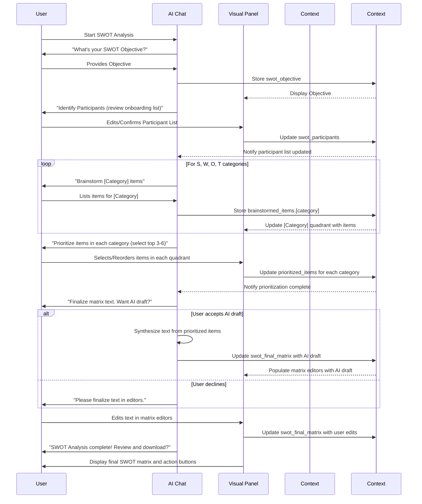

# Specification for Interactive SWOT Analysis Workflow

**Goal:** To guide users through conducting a comprehensive SWOT (Strengths, Weaknesses, Opportunities, Threats) analysis for their company or a specific objective, using an interactive, chat-driven experience within a split-panel UI. This aligns with the `chat-driven-workflow-pattern.md`.

## I. Core Principles & Context

*   **User-Centricity & Efficiency:** Leverage pre-existing `onboarding_company_name` and `onboarding_team_members` to streamline input. Provide clear feedback and easy correction mechanisms.
*   **Split-Panel UI:** Left panel for AI chat, Right panel for dynamic visual components (forms, SWOT matrix). This implements the pattern's architecture.
*   **Phased Progression:** Structure the analysis into logical phases (Objective, Participants, Brainstorming, Prioritization, Finalization), embodying the Progressive Disclosure pattern.
*   **Bidirectional Data Flow:** Ensure real-time synchronization between chat inputs and visual component displays.
*   **AI as Guide & Facilitator:** AI provides contextual explanations, intelligent prompts, error handling, data validation, and can assist in synthesizing information. The AI maintains **Persistent Context**.

**Pre-existing Onboarding Information Context:**
*   `onboarding_company_name: string`
*   `onboarding_team_members: Array<{ id: string, name: string, position?: string, email?: string }>`

## II. Overall Data Structure & `WorkflowDataContext`

The workflow's state is managed within `WorkflowDataContext.swot_analysis`.

```json
{
  "swot_analysis": {
    "workflow_step_name": "SWOT Analysis",
    "company_name": "string", // Confirmed or from onboarding
    "swot_objective": "string", // e.g., "Decide on new market entry"
    "swot_participants": [ // Array of participant objects
      {
        "id": "string", // Unique ID for participant
        "name": "string",
        "role": "string", // e.g., "CEO", "Marketing Lead"
        "email": "string", // Optional
        "contribution_area": "string" // Optional, e.g., "Strategy", "Sales Insights"
      }
    ],
    "brainstormed_items": {
      "strengths": ["string"], // Initial list of strengths
      "weaknesses": ["string"],
      "opportunities": ["string"],
      "threats": ["string"]
    },
    "prioritized_items": { // User-selected top items
      "strengths": ["string"], 
      "weaknesses": ["string"],
      "opportunities": ["string"],
      "threats": ["string"]
    },
    "swot_final_matrix": { // Final, potentially synthesized text for each quadrant
      "strengths_text": "string",
      "weaknesses_text": "string",
      "opportunities_text": "string",
      "threats_text": "string"
    },
    "ai_synthesis_used": "boolean", // True if user accepted AI help for final matrix text
    "status": "in_progress" | "completed",
    "created_at": "string", // ISO 8601 Timestamp
    "last_updated_at": "string" // ISO 8601 Timestamp
  }
}
```

## III. `shadcn/ui` Component Mapping

| Descriptive Element                      | `shadcn/ui` Component (Tentative) | Notes                                                                 |
|------------------------------------------|-----------------------------------|-----------------------------------------------------------------------|
| Main Layout                              | `ResizablePanelGroup`, `ResizablePanel`, `ResizableHandle` | Standard split-panel.                                                 |
| Title Card / Section Headers             | `Card`, `CardHeader`, `CardTitle` | For each phase/section.                                               |
| SWOT Objective Input                     | `Input` with `Label`, or `Select` with `Textarea` for "Other" | For defining the analysis objective.                                  |
| Participant Table                        | `Table` with `Input` in cells, `Button` for Add/Remove | Editable list of participants.                                        |
| SWOT Matrix (Brainstorming/Prioritizing) | Custom Grid (e.g., 4 `Card` components) with internal list builders | Each quadrant (S,W,O,T) allows adding, viewing, removing, selecting/reordering items. |
| List Item Input (in SWOT Quadrant)       | `Input` + `Button` ("Add")        | For adding new S, W, O, or T items.                                   |
| Displayed List Items (in SWOT Quadrant)  | `Badge` or styled `div` with `Button` ("X" to remove) | For showing brainstormed items.                                       |
| Prioritization Mechanism                 | `Checkbox` per item, or drag-and-drop list | For selecting top items.                                              |
| Final SWOT Matrix Editor (Phase 5)       | 4 `Textarea` components within the matrix layout | For final rich text editing of each quadrant.                         |
| Action Buttons                           | `Button` (various variants)       | "Next", "Confirm", "Download Report", "Save".                         |

## IV. Phased Breakdown

### Phase 1: Defining the SWOT Objective

**A. AI Chat (Left Panel):**
1.  **Introduction:** AI: "Hello! Let's conduct a SWOT analysis for [onboarding_company_name]..."
2.  **Objective Prompt:** AI: "What's the main objective for this SWOT? (e.g., strategic planning, new initiative assessment)."
    *   User provides objective. Stored in `swot_objective`.
    *   Error Handling: If vague, AI: "Could you be more specific about the goal of this SWOT?"
3.  **Confirmation:** AI: "Objective: '[swot_objective]'. Correct?"

**B. Visual Components (Right Panel):**
*   `<Card>`: "SWOT Analysis Objective"
    *   `<Label htmlFor="swotObjective">SWOT Objective:</Label>`
    *   `<Input id="swotObjective" value={swot_objective} />` (or `<Textarea>`)

### Phase 2: Deciding Who to Include

**A. AI Chat (Left Panel):**
1.  **Importance of Diverse Perspectives:** AI: "A successful SWOT benefits from diverse views. Let's list key contributors."
2.  **Leverage Onboarding Data:** AI: "From onboarding, I have: [List `onboarding_team_members`]. Shall we start with these, or do you need to update the list for this SWOT?"
3.  **Guidance for Changes:** If changes needed, AI: "Please use the table on the right to add, remove, or modify participants."

**B. Visual Components (Right Panel):**
*   `<Card>`: "SWOT Participants"
    *   `<Table>`: Columns: Name, Role, Email, Contribution Area. Pre-populated.
    *   `<Button>Add Participant</Button>`, Remove buttons per row.

**C. `tsx` Example: `ParticipantRow` (Conceptual)**
```tsx
import { TableCell, TableRow } from '@/components/ui/table';
import { Input } from '@/components/ui/input';
import { Button } from '@/components/ui/button';
import { Trash2 } from 'lucide-react';

interface Participant { id: string; name: string; role: string; email?: string; contribution_area?: string; }
interface ParticipantRowProps {
  participant: Participant;
  onUpdateParticipant: (id: string, field: keyof Participant, value: string) => void;
  onRemoveParticipant: (id: string) => void;
}
export function ParticipantRow({ participant, onUpdateParticipant, onRemoveParticipant }: ParticipantRowProps) {
  return (
    <TableRow>
      <TableCell><Input value={participant.name} onChange={(e) => onUpdateParticipant(participant.id, 'name', e.target.value)} /></TableCell>
      <TableCell><Input value={participant.role} onChange={(e) => onUpdateParticipant(participant.id, 'role', e.target.value)} /></TableCell>
      <TableCell><Input type="email" value={participant.email || ''} onChange={(e) => onUpdateParticipant(participant.id, 'email', e.target.value)} /></TableCell>
      <TableCell><Input value={participant.contribution_area || ''} onChange={(e) => onUpdateParticipant(participant.id, 'contribution_area', e.target.value)} /></TableCell>
      <TableCell><Button variant="ghost" size="icon" onClick={() => onRemoveParticipant(participant.id)}><Trash2 className="h-4 w-4"/></Button></TableCell>
    </TableRow>
  );
}
```

### Phase 3: Gathering Initial Thoughts (Brainstorming S, W, O, T)

**A. AI Chat (Left Panel):**
1.  **Introduction:** AI: "Now, let's brainstorm for each SWOT category."
2.  **Iterate Categories (Strengths, Weaknesses, Opportunities, Threats):**
    *   AI: "Let's focus on **Strengths**: internal capabilities that help achieve '[swot_objective]'. What are your top 3-5?" (Provides examples if asked).
    *   User lists items (comma-separated or one-by-one). Parsed into `brainstormed_items.strengths`.
    *   AI: "Great. Anything else for Strengths, or move to Weaknesses?"
    *   Error Handling: If user provides non-textual input, AI: "Please describe the strength/weakness in a few words."
    *   (Repeat for W, O, T with tailored explanations/examples).

**B. Visual Components (Right Panel):**
*   A 2x2 grid layout representing the SWOT matrix. Each quadrant (`<Card>` titled "Strengths", "Weaknesses", etc.) contains:
    *   An `<Input>` field and an "Add Item" `<Button>`.
    *   A list of added items (e.g., as `<Badge>` components with a remove "X" button).

**C. `tsx` Example: `SWOTQuadrant` (Conceptual)**
```tsx
import { useState } from 'react';
import { Card, CardHeader, CardTitle, CardContent } from '@/components/ui/card';
import { Input } from '@/components/ui/input';
import { Button } from '@/components/ui/button';
import { Badge } from '@/components/ui/badge';
import { XIcon } from 'lucide-react';

interface SWOTQuadrantProps {
  title: "Strengths" | "Weaknesses" | "Opportunities" | "Threats";
  items: string[];
  onAddItem: (category: SWOTQuadrantProps['title'], item: string) => void;
  onRemoveItem: (category: SWOTQuadrantProps['title'], itemIndex: number) => void;
}
export function SWOTQuadrant({ title, items, onAddItem, onRemoveItem }: SWOTQuadrantProps) {
  const [newItem, setNewItem] = useState('');
  const handleAdd = () => { if (newItem.trim()) { onAddItem(title, newItem.trim()); setNewItem(''); } };
  return (
    <Card>
      <CardHeader><CardTitle>{title}</CardTitle></CardHeader>
      <CardContent>
        <div className="flex space-x-2 mb-2">
          <Input value={newItem} onChange={(e) => setNewItem(e.target.value)} placeholder={`Add a ${title.toLowerCase().slice(0, -1)}...`} 
                 onKeyPress={(e) => { if (e.key === 'Enter') handleAdd(); }}/>
          <Button onClick={handleAdd}>Add</Button>
        </div>
        <div className="space-y-1">
          {items.map((item, index) => (
            <Badge key={index} variant="secondary" className="mr-1 p-1 pr-2">
              {item} <Button variant="ghost" size="icon" className="h-4 w-4 ml-1" onClick={() => onRemoveItem(title, index)}><XIcon className="h-3 w-3"/></Button>
            </Badge>
          ))}
        </div>
      </CardContent>
    </Card>
  );
}
```

### Phase 4: Review and Prioritization

**A. AI Chat (Left Panel):**
1.  **Introduction:** AI: "Excellent brainstorming! Now, let's prioritize, focusing on items most relevant to '[swot_objective]'."
2.  **Guide Prioritization per Category:**
    *   AI: "For Strengths, select the top 3-6 most important ones using the checkboxes in the right panel, or tell me."
    *   (Repeat for W, O, T with specific guidance on what to focus on).

**B. Visual Components (Right Panel):**
*   SWOT matrix quadrants now display brainstormed items with `<Checkbox>` next to each.
*   User selects top items. Selected items could be visually distinct.

### Phase 5: Completing and Finalizing the SWOT Matrix

**A. AI Chat (Left Panel):**
1.  **Introduction:** AI: "We've prioritized key items. Now, let's refine these into concise statements for your final SWOT matrix."
2.  **AI-Assisted Synthesis Offer:** AI: "Would you like me to help draft a summary statement for each category based on your prioritized items?"
3.  **If Yes:** AI generates text for each quadrant (e.g., "For Strengths: Based on your priorities, key strengths include [synthesized text]..."). User reviews/edits.
4.  **If No:** AI: "Okay, please finalize the text for each quadrant in the editors on the right."

**B. Visual Components (Right Panel):**
*   SWOT matrix quadrants now contain `<Textarea>` components, pre-filled with prioritized items or AI-synthesized text. User can freely edit.

### Phase 6: Conclusion and Next Steps

**A. AI Chat (Left Panel):**
1.  **Confirmation:** AI: "Congratulations! Your SWOT analysis for '[swot_objective]' is complete."
2.  **Summary & Call to Action:** AI: "The final matrix is on the right. Remember to revisit this. Would you like to download a report or explore other strategy modules?"

**B. Visual Components (Right Panel):**
*   Final SWOT matrix (read-only or with an "Edit" button).
*   Buttons: "Download Report (PDF)", "Share", "Return to Dashboard".

## V. Integration Patterns
```tsx
import { ResizablePanelGroup, ResizablePanel, ResizableHandle } from "@/components/ui/resizable";

export function SWOTAnalysisWorkflowPage() {
  // Main state (WorkflowDataContext.swot_analysis) and handlers
  return (
    <ResizablePanelGroup direction="horizontal" className="h-full max-h-[calc(100vh-theme(spacing.16))]">
      <ResizablePanel defaultSize={40} minSize={30} maxSize={50}>
        <div className="h-full p-4"> {/* Chat Interface Component */} </div>
      </ResizablePanel>
      <ResizableHandle withHandle />
      <ResizablePanel defaultSize={60}>
        <div className="h-full overflow-auto p-6"> {/* Visual Components based on currentPhase */} </div>
      </ResizablePanel>
    </ResizablePanelGroup>
  );
}
```
(Brief explanation of `WorkflowDataContext` for chat-visual sync)

## VI. Workflow Sequence Diagram (Mermaid)


## VII. Key AI Capabilities Leveraged
(List as in original document: NLU, Context Retention, Error Handling, Personalization, Flexibility, AI-Assisted Drafting/Synthesis)

This refined specification provides a comprehensive guide for the Interactive SWOT Analysis Workflow.