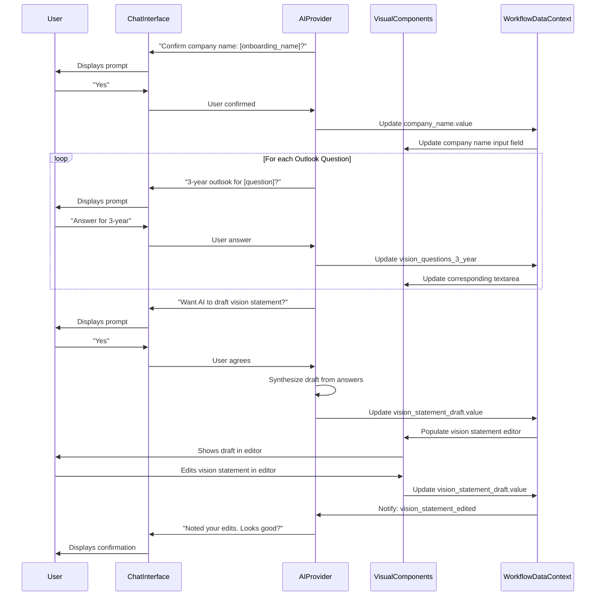

# Specification for Interactive Vision Statement Workflow

**Goal:** To transform the static "Vision Statement Worksheet" into a dynamic, interactive, chat-driven experience within a split-panel UI, leveraging pre-existing data and AI assistance. This document outlines the specification to achieve this, aligning with the `chat-driven-workflow-pattern.md`.

## I. Core Principles & Context

*   **User-Centricity & Efficiency:** Minimize redundant input, pre-fill where possible, provide clear feedback. This aligns with keeping chat focused and minimizing cognitive load.
*   **Split-Panel UI:** Left panel for AI chat, Right panel for dynamic visual components. This is a direct implementation of the pattern's architecture.
*   **Phased Progression:** Structured flow for logical completion, embodying the Progressive Disclosure pattern.
*   **Bidirectional Data Flow:** Real-time synchronization between chat and visual components, a key aspect of the pattern's Chat-to-Visual Coordination.
*   **AI as Guide & Facilitator:** Contextual explanation, intelligent prompting, and drafting assistance. The AI maintains awareness of the workflow state (Persistent Context).

**Pre-existing Onboarding Information Context:**
*   `onboarding_data.company_name: string`
*   `onboarding_data.team_members: Array<{ id: string, name: string, position?: string, email?: string }>` (if applicable for context, though not directly used for vision statement creation itself).

## II. Overall Data Structure & WorkflowDataContext

The entire workflow's state will be managed within a central `WorkflowDataContext` object.

```json
// workflow_data_context.json
{
  "workflow_step_name": "Vision Statement Worksheet",
  "company_name": {
    "value": "string",
    "source": "onboarding" | "user_chat" | "user_ui"
  },
  "vision_questions_3_year": {
    "why_exist": { "answer": "string", "last_edited_by": "user_chat" | "user_ui" | "ai_suggestion" },
    "known_for": { "answer": "string", "last_edited_by": "user_chat" | "user_ui" | "ai_suggestion" },
    "customer": { "answer": "string", "last_edited_by": "user_chat" | "user_ui" | "ai_suggestion" },
    "financial_goals": { "answer": "string", "last_edited_by": "user_chat" | "user_ui" | "ai_suggestion" },
    "services": { "answer": "string", "last_edited_by": "user_chat" | "user_ui" | "ai_suggestion" },
    "culture": { "answer": "string", "last_edited_by": "user_chat" | "user_ui" | "ai_suggestion" },
    "membership_appeal": { "answer": "string", "last_edited_by": "user_chat" | "user_ui" | "ai_suggestion" }
  },
  "vision_questions_5_year": {
    "why_exist": { "answer": "string", "last_edited_by": "user_chat" | "user_ui" | "ai_suggestion" },
    "known_for": { "answer": "string", "last_edited_by": "user_chat" | "user_ui" | "ai_suggestion" },
    "customer": { "answer": "string", "last_edited_by": "user_chat" | "user_ui" | "ai_suggestion" },
    "financial_goals": { "answer": "string", "last_edited_by": "user_chat" | "user_ui" | "ai_suggestion" },
    "services": { "answer": "string", "last_edited_by": "user_chat" | "user_ui" | "ai_suggestion" },
    "culture": { "answer": "string", "last_edited_by": "user_chat" | "user_ui" | "ai_suggestion" },
    "membership_appeal": { "answer": "string", "last_edited_by": "user_chat" | "user_ui" | "ai_suggestion" }
  },
  "vision_statement_draft": {
    "value": "string",
    "last_edited_by": "user_chat" | "user_ui" | "ai_suggestion",
    "ai_generated_initial_draft": "boolean"
  },
  "status": "in_progress" | "completed",
  "last_updated_at": "string"
}
```

## III. shadcn/ui Component Mapping

| UI Element                        | shadcn/ui Component              | Usage                                                                                       |
|---------------------------------|------------------------------------|---------------------------------------------------------------------------------------------|
| Main Page Container             | `<ResizablePanelGroup>`            | Overall split-panel layout.                                                                 |
| Section Cards/Containers        | `<Card>`, `<CardHeader>`, `<CardTitle>`, `<CardContent>` | For introduction, question sections, vision editor, and summary.                        |
| Input Fields                    | `<Input>`                          | For company name.                                                                           |
| Text Areas for Questions        | `<Textarea>`                       | For user answers to 3-year and 5-year outlook questions in the visual panel.              |
| Vision Statement Editor         | `<Textarea>` (or a dedicated Rich Text Editor component) | For drafting and refining the vision statement.                                           |
| Buttons                         | `<Button>` (various variants)      | "Yes", "No", "Next", "Draft with AI", "Finalize".                                         |
| Examples Display                | `<Accordion>` or `<Collapsible>`   | To show/hide vision statement examples.                                                     |
| Question Table (Visual Panel)   | `<Table>`, `<TableHeader>`, `<TableBody>`, `<TableRow>`, `<TableHead>`, `<TableCell>` | To display outlook questions and textareas for answers.                                   |
| Progress Indicator (Optional)   | `<Progress>`                       | To show overall workflow progress.                                                          |
| Labels                          | `<Label>`                          | For form elements.                                                                          |

## IV. Phased Breakdown with Implementation Details

### Phase 1: Introduction & Company Confirmation

**A. AI Chat (Left Panel):**

1.  **Initial Greeting & Purpose:**
    *   AI: "Hi there! Today, we're going to dive into creating your company's Vision Statement. This is a concise, forward-looking summary of what your organization aspires to achieve. It provides direction, inspires your team, and helps guide decision-making. It's different from a mission statement, which typically describes what your company does now."
2.  **Company Name Confirmation:**
    *   AI (if `onboarding_data.company_name` exists): "I have your company name listed as '[onboarding_data.company_name]'. Is this correct for our Vision Statement exercise today?"
    *   AI (if no `onboarding_data.company_name`): "To start, what is the full name of your company for this Vision Statement?"
    *   User Input: Yes/No or company name.
    *   NLU: Handle variations.
    *   Data Update: Update `WorkflowDataContext.company_name`. AI confirms: "Great! We'll use [company_name.value]."
    *   Error Handling: If user provides an empty name after being prompted, AI: "Please provide a company name to proceed."
3.  **Examples Offer:**
    *   AI: "Before we jump into crafting yours, would you like to see some examples of Vision Statements from well-known companies for inspiration?"
    *   User Input: Yes/No. If "Yes", AI displays examples and triggers visual update.

**B. Visual Components (Right Panel):**

*   `<Card>`: "Vision Statement Worksheet"
    *   `<CardHeader>`: `<CardTitle>Your Guiding Star for the Future</CardTitle>`
    *   `<CardContent>`:
        *   `<Label htmlFor="companyNameInput">Company Name:</Label>`
        *   `<Input id="companyNameInput" value={WorkflowDataContext.company_name.value} onBlur={handleCompanyNameEdit} placeholder="Enter company name" />`
        *   (Pre-populated from `onboarding_data.company_name`)
        *   `<Collapsible>` for "Vision Statement Examples" (initially closed, opened by AI or user click). Content: bullet points of examples (e.g., Amazon, Toyota).

**C. Bidirectional Flow (UI to Context & Chat for Company Name):**
*   `handleCompanyNameEdit` (on blur of input):
    *   Updates `WorkflowDataContext.company_name.value` and `WorkflowDataContext.company_name.source = "user_ui"`.
    *   Notifies AI: "I see you've updated the company name in the panel to '[new name]'. Got it!"

**D. Transition Logic:**
*   Proceed to Phase 2 once `WorkflowDataContext.company_name.value` is confirmed and example viewing (if any) is complete. AI can prompt: "Ready to start envisioning the future for [company_name.value]?"

### Phase 2: Envisioning the Future - Guided Questions

**A. AI Chat (Left Panel):**

1.  **Phase Introduction:**
    *   AI: "Excellent! Now, let's start picturing where [company_name.value] will be in the future. We'll consider both a 3-year and a 5-year outlook for several key aspects of your business."
2.  **Iterative Questioning Loop (for each of the 7 questions):**
    *   Question Structure (example for "why_exist"):
        *   `id: "why_exist"`
        *   `text: "Why do we exist? This gets to the fundamental purpose and the core problem your company solves or the core need it fulfills."`
    *   AI: "Let's tackle: '[question.text]'."
    *   AI: "First, looking ahead **3 years**, how would you describe this for [company_name.value]?"
    *   User Input: Free text.
    *   Data Update: `WorkflowDataContext.vision_questions_3_year[question.id].answer = userInput;`
    *   AI: "And what about **5 years** from now? What's your ultimate aspiration for this aspect?"
    *   User Input: Free text.
    *   Data Update: `WorkflowDataContext.vision_questions_5_year[question.id].answer = userInput;`
    *   AI Confirmation: "Thanks, I've noted that down. Let's move to the next question..."
    *   Error Handling: If input is very short (e.g., one word) for a complex question, AI: "Could you elaborate a bit more on that? A few more details would be helpful."

**B. Visual Components (Right Panel):**

*   `<Card>`: "Envisioning Your Future"
    *   `<CardContent>`:
        *   `<Table id="vision-questions-table">`
            *   `<TableHeader>`: Question, 3-Year Outlook, 5-Year Outlook
            *   `<TableBody>`: 7 `<TableRow>` elements, one for each question.
                *   Each row: `<TableCell>` for question text.
                *   `<TableCell>` with `<Textarea id="q_{question.id}_3y" value={WorkflowDataContext.vision_questions_3_year[question.id].answer} onBlur={handleTableEdit} placeholder="Your 3-year outlook..." />`
                *   `<TableCell>` with `<Textarea id="q_{question.id}_5y" value={WorkflowDataContext.vision_questions_5_year[question.id].answer} onBlur={handleTableEdit} placeholder="Your 5-year outlook..." />`
*   **Active Row Highlighting:** The row corresponding to the current AI question is visually highlighted.

**C. Bidirectional Flow (UI to Context & Chat for Table Edits):**
*   `handleTableEdit` (on blur of textarea):
    *   Identifies question ID and timeframe (3y/5y) from `event.target.id`.
    *   Updates the relevant `WorkflowDataContext.vision_questions_...[question.id].answer` and sets `last_edited_by = "user_ui"`.
    *   Notifies AI: "I see you've updated the [3/5]-year outlook for '[question_text]' in the table. Thanks!"

**D. Example `tsx` for Question Row (Conceptual):**
```tsx
import { TableCell, TableRow } from '@/components/ui/table';
import { Textarea } from '@/components/ui/textarea';
import { Label } from '@/components/ui/label';

interface QuestionOutlookProps {
  questionId: string;
  questionText: string;
  answer3Year: string;
  answer5Year: string;
  onOutlookChange: (questionId: string, timeframe: '3_year' | '5_year', newAnswer: string) => void;
  isCurrentQuestion?: boolean;
}

export function QuestionOutlookRow({ questionId, questionText, answer3Year, answer5Year, onOutlookChange, isCurrentQuestion }: QuestionOutlookProps) {
  return (
    <TableRow className={isCurrentQuestion ? "bg-muted/50" : ""}>
      <TableCell className="font-semibold align-top pt-3">
        <Label htmlFor={`q_${questionId}_3y`}>{questionText}</Label>
      </TableCell>
      <TableCell>
        <Textarea
          id={`q_${questionId}_3y`}
          value={answer3Year}
          onChange={(e) => onOutlookChange(questionId, '3_year', e.target.value)}
          placeholder="Your 3-year outlook..."
          rows={3}
        />
      </TableCell>
      <TableCell>
        <Textarea
          id={`q_${questionId}_5y`}
          value={answer5Year}
          onChange={(e) => onOutlookChange(questionId, '5_year', e.target.value)}
          placeholder="Your 5-year outlook..."
          rows={3}
        />
      </TableCell>
    </TableRow>
  );
}
```

**E. Transition Logic:**
*   Once all 14 answers are filled (or user explicitly skips), AI prompts: "Great, we've explored your future outlook. Ready to craft the vision statement?"

### Phase 3: Crafting the Vision Statement

**A. AI Chat (Left Panel):**

1.  **Transition & Formula Introduction:**
    *   AI: "Excellent! We've gathered some truly insightful answers about [company_name.value]'s future. Now, let's use these insights to craft your core Vision Statement."
    *   AI: "A common helpful formula is: 'Five years from now, [company_name.value] will ______ by ______.' But feel free to use any structure that resonates."
2.  **AI-Assisted Draft Offer:**
    *   AI: "Based on your answers, particularly your 5-year outlook, I can help draft an initial statement. Would you like me to try?"
    *   User Input: Yes/No.
3.  **Drafting Logic (if "Yes"):**
    *   AI synthesizes key phrases from `vision_questions_5_year` (e.g., `known_for`, `why_exist`, `services` for the first blank; `culture`, `membership_appeal` for the second).
    *   `initial_draft = "Five years from now, [company_name.value] will [synthesized_phrase1] by [synthesized_phrase2]."`
    *   Updates `WorkflowDataContext.vision_statement_draft.value = initial_draft; ai_generated_initial_draft = true; last_edited_by = "ai_suggestion";`
    *   AI: "Alright! Here's a starting draft: '[initial_draft]'. How does this feel? You can edit it directly in the panel on the right, or tell me any changes you'd like."
4.  **User-Guided Drafting (if AI assist declined):**
    *   AI: "No problem. Please type out your initial draft for the Vision Statement in the editor on the right, or tell it to me here."
5.  **Refinement Loop:**
    *   AI: "How does the current draft look? What would you like to adjust, add, or remove?"
    *   NLU for refinement: "change X to Y", "make it shorter", "add Z". AI updates `WorkflowDataContext.vision_statement_draft.value` and confirms.

**B. Visual Components (Right Panel):**

*   `<Card>`: "Craft Your Vision Statement"
    *   `<CardContent>`:
        *   `<Label htmlFor="visionStatementEditor">Your Vision Statement:</Label>`
        *   `<Textarea id="visionStatementEditor" value={WorkflowDataContext.vision_statement_draft.value} onBlur={handleVisionStatementEdit} rows={8} placeholder="Five years from now, [Company Name] will... by..." />`
        *   `<Button onClick={requestAIDraft}>Help me draft (AI)</Button>` (if not already drafted by AI).

**C. Bidirectional Flow (UI to Context & Chat for Vision Statement Editor):**
*   `handleVisionStatementEdit` (on blur of textarea):
    *   Updates `WorkflowDataContext.vision_statement_draft.value` and `last_edited_by = "user_ui"`.
    *   Notifies AI: "I see you've updated the Vision Statement in the editor. The new version is: '[new draft]'. What are your thoughts?"

**D. Transition Logic:**
*   User indicates satisfaction (e.g., "Looks good", "That's it") or clicks a "Finalize Draft" button.

### Phase 4: Review & Finalize

**A. AI Chat (Left Panel):**

1.  **Confirmation & Read-back:**
    *   AI: "Fantastic! You've successfully crafted your Vision Statement for [company_name.value]."
    *   AI: "Your final Vision Statement is: '[WorkflowDataContext.vision_statement_draft.value]'"
2.  **Reinforce Importance:**
    *   AI: "This powerful statement will serve as your guiding star, ensuring everyone is aligned and moving towards the same future."
3.  **Call to Action / Next Steps:**
    *   AI: "You can always revisit and refine this Vision Statement as [company_name.value] evolves. Would you like to save this, or is there anything else you'd like to review or adjust?"
    *   User Input: "Save", "Review details", etc.

**B. Visual Components (Right Panel):**

*   `<Card>`: "Final Vision & Outlook Summary"
    *   `<CardHeader>`: `<CardTitle>Company: {WorkflowDataContext.company_name.value}</CardTitle>`
    *   `<CardContent>`:
        *   `<h3>Your Vision Statement:</h3>`
        *   `<p className="text-lg font-semibold p-4 border rounded bg-muted">{WorkflowDataContext.vision_statement_draft.value}</p>`
        *   `<Accordion type="single" collapsible className="w-full">`
            *   `<AccordionItem value="3-year">`
                *   `<AccordionTrigger>3-Year Outlook Summary</AccordionTrigger>`
                *   `<AccordionContent>` (Display `vision_questions_3_year` answers in a read-only format, perhaps as a list or simple table).
            *   `<AccordionItem value="5-year">`
                *   `<AccordionTrigger>5-Year Outlook Summary</AccordionTrigger>`
                *   `<AccordionContent>` (Display `vision_questions_5_year` answers).
        *   `<Button onClick={handleEdit}>Edit Vision or Outlooks</Button>` (navigates back to relevant phase/UI state).
        *   `<Button onClick={handleSaveAndFinalize}>Save and Finalize Vision</Button>`

**C. Finalization Logic:**
*   `handleSaveAndFinalize`: Sets `WorkflowDataContext.status = "completed"`, updates `last_updated_at`, and triggers serialization to backend.
*   AI confirms save: "Your Vision Statement and outlooks have been saved successfully!"

## V. Integration Patterns (Alignment with Chat-Driven Workflow Pattern)

**1. Resizable Split Panel Layout:**
```tsx
import { ResizablePanelGroup, ResizablePanel, ResizableHandle } from "@/components/ui/resizable";
// Assume ChatInterface and VisionStatementVisuals components exist

export function VisionStatementWorkflowPage() {
  // State management for WorkflowDataContext, currentPhase, etc.
  // Handlers for chat updates and visual component interactions

  return (
    <ResizablePanelGroup direction="horizontal" className="h-full max-h-[calc(100vh-theme(spacing.16))]">
      <ResizablePanel defaultSize={40} minSize={30} maxSize={50}>
        <div className="h-full p-4">
          {/* <VisionStatementChatInterface dataContext={workflowData} onUpdate={updateDataContext} /> */}
          <p className="text-muted-foreground">AI Chat Interface Area</p>
        </div>
      </ResizablePanel>
      <ResizableHandle withHandle />
      <ResizablePanel defaultSize={60}>
        <div className="h-full overflow-auto p-6">
          {/* <VisionStatementVisuals currentPhase={currentPhase} dataContext={workflowData} onUpdate={updateDataContext} /> */}
           <p className="text-muted-foreground">Visual Components Area (Company Info, Questions, Editor, Summary)</p>
        </div>
      </ResizablePanel>
    </ResizablePanelGroup>
  );
}
```

**2. Chat-to-Visual and Visual-to-Chat Coordination:**
The `WorkflowDataContext` is the single source of truth. Changes from chat update the context, triggering UI re-renders. Changes in the UI update the context and notify the AI.

## VI. Workflow Sequence Diagram (Mermaid - Simplified)


This comprehensive specification should guide the development of an effective and user-friendly interactive Vision Statement workflow.
Goal: To transform the static "Vision Statement Worksheet" into a dynamic, interactive, chat-driven experience within a split-panel UI, leveraging pre-existing data and AI assistance.

Core Principles:

User-Centricity & Efficiency: Minimize redundant input, pre-fill where possible, provide clear feedback.
Split-Panel UI: Left for AI chat, Right for dynamic visual components.
Phased Progression: Structured flow for logical completion.
Bidirectional Data Flow: Real-time synchronization between chat and visual components.
AI as Guide & Facilitator: Contextual explanation, intelligent prompting, and drafting assistance.
I. Overall Data Structure & WorkflowDataContext
The entire workflow's state will be managed within a central WorkflowDataContext object, which will be saved upon completion and can be revisited.

// workflow_data_context.json
{
  "workflow_step_name": "Vision Statement Worksheet",
  "company_name": {
    "value": "string",
    "source": "onboarding" | "user_chat" | "user_ui"
  },
  "vision_questions_3_year": {
    "why_exist": "string",
    "known_for": "string",
    "customer": "string",
    "financial_goals": "string",
    "services": "string",
    "culture": "string",
    "membership_appeal": "string"
  },
  "vision_questions_5_year": {
    "why_exist": "string",
    "known_for": "string",
    "customer": "string",
    "financial_goals": "string",
    "services": "string",
    "culture": "string",
    "membership_appeal": "string"
  },
  "vision_statement_draft": "string",
  "ai_generated_initial_draft": "boolean", // True if AI generated the first draft
  "last_edited_by": "user_chat" | "user_ui" // Last source of edit for current element
}
II. Phased Breakdown with Implementation Details
Phase 1: Introduction & Company Confirmation
A. AI Chat (Left Panel):

Initial Greeting & Purpose:
AI Logic: print(f"Hi there! Today, we're going to dive into creating your company's Vision Statement. This is a concise, forward-looking summary...")
Context: Explain the 'why' (guidance, alignment, decision-making) and differentiate from mission statements.
Company Name Confirmation:
AI Logic:
if onboarding_data.company_name:
    company_name_to_confirm = onboarding_data.company_name
    print(f"I have your company name listed as '{company_name_to_confirm}'. Is this correct for our Vision Statement exercise today?")
else:
    print("To start, what is the full name of your company for this Vision Statement?")
User Input Expectation: BOOLEAN (yes/no/confirm) or FREE_TEXT (new name).
NLU for Confirmation: Handle variations like "yes," "yep," "that's right," "correct," "no," "nope," "it's different," "change it to X."
Data Update Flow (Chat to Context):
If confirmed: WorkflowDataContext.company_name.value = company_name_to_confirm; WorkflowDataContext.company_name.source = "onboarding"
If new name provided: WorkflowDataContext.company_name.value = user_input; WorkflowDataContext.company_name.source = "user_chat"
After update: AI acknowledges (print(f"Great! We'll use {WorkflowDataContext.company_name.value}."))
Examples Offer:
AI Logic: print("Before we jump in, would you like to see some examples of Vision Statements from well-known companies for inspiration?")
User Input Expectation: BOOLEAN.
Conditional Display: If "Yes", AI prints examples and triggers visual component update.
B. Visual Components (Right Panel):

Initial State:
div#title-card: Displays "Vision Statement Worksheet" (H1), "Your Guiding Star for the Future" (P).
div#company-name-section:
<label for="companyNameInput">Company Name:</label>
<input type="text" id="companyNameInput" bind:value={WorkflowDataContext.company_name.value} on:blur={handleCompanyNameEdit} />
Initial Populate: id="companyNameInput" is pre-populated with onboarding_data.company_name if available.
Bidirectional Flow (UI to Context & Chat):
handleCompanyNameEdit function:
Updates WorkflowDataContext.company_name.value to the new input.
Sets WorkflowDataContext.company_name.source = "user_ui".
Triggers an AI notification: "I see you've updated the company name in the visual panel to '{WorkflowDataContext.company_name.value}'. Got it!" (This ensures the AI's context is always in sync).
Examples Display (Conditional):
div#vision-examples (Hidden until requested):
<details><summary>Vision Statement Examples</summary>...</details>
Populated with bullet points/text blocks of Amazon, Toyota, etc., from the document.
Visibility Toggle: Controlled by AI's print command triggered by user "Yes."
C. Transition Logic:

Once WorkflowDataContext.company_name.value is set and confirmed (either by chat or UI edit), and optional example viewing is complete, the system proceeds to Phase 2.
Phase 2: Envisioning the Future - Guided Questions
A. AI Chat (Left Panel):

Phase Introduction:
AI Logic: print(f"Excellent! Now, let's start picturing where {WorkflowDataContext.company_name.value} will be in the future...")
Iterative Questioning Loop:
AI Logic: Loops through predefined questions array, for both "3 Years" and "5 Years".
Dynamic Prompting:
questions = [
    {"id": "why_exist", "text": "Why do we exist? This gets to the fundamental purpose..."},
    // ... all 7 questions
]
for question in questions:
    print(f"Let's tackle '{question.text}'.")

    // Ask for 3-year outlook
    print(f"How would you describe this for {WorkflowDataContext.company_name.value} in **3 years** from now?")
    user_input_3y = await get_chat_input()
    // Store and update UI
    WorkflowDataContext.vision_questions_3_year[question.id] = user_input_3y
    // UI refresh based on data context change

    // Ask for 5-year outlook
    print(f"And what about **5 years** from now? What's your ultimate aspiration for {question.id}?")
    user_input_5y = await get_chat_input()
    // Store and update UI
    WorkflowDataContext.vision_questions_5_year[question.id] = user_input_5y
Error Handling/Clarification:
If input is very short or generic and NLU indicates uncertainty: "Could you elaborate a little more on that? Or would you like me to give an example?"
await get_chat_input(): This function handles processing of user input, including potential NLU for intent (e.g., if user types "skip," AI asks "Would you like to skip this question and come back later?").
B. Visual Components (Right Panel):

Dynamic Table:
table#vision-questions-table:
Structure: <thead> (Question, 3 Years, 5 Years), <tbody> with 7 rows.
Each cell in 3-Year and 5-Year columns contains a <textarea> element.
Binding: <textarea id="q_{question.id}_3y" bind:value={WorkflowDataContext.vision_questions_3_year[question.id]} rows="3" on:blur={handleTableEdit} />
Active Row Highlighting: The current question being asked by the AI (left panel) should visually highlight its corresponding row in the table (right panel), guiding the user's eye.
Bidirectional Flow (UI to Context & Chat):
handleTableEdit function:
Identifies which textarea was edited (e.g., via event.target.id).
Updates the specific field in WorkflowDataContext.vision_questions_3_year or WorkflowDataContext.vision_questions_5_year.
Triggers an AI acknowledgment: "I see you've filled out the 5-year outlook for '{question_text}' in the table. Thanks!"
C. Transition Logic:

Once all 14 questions (7 for 3-year, 7 for 5-year) have received an answer (even if brief), the system enables transition to Phase 3. A "Next Step" button could appear in the UI, or the AI automatically progresses.
Phase 3: Crafting the Vision Statement
A. AI Chat (Left Panel):

Transition & Formula Introduction:
AI Logic: print("Excellent! We've gathered some truly insightful answers about {WorkflowDataContext.company_name.value}'s future. Now, let's use these insights to craft your core Vision Statement.")
AI Logic: print("The worksheet suggests a helpful formula: 'Five years from now, (my company name) will _______ by ______.'")
AI-Assisted Draft Offer:
AI Logic: print("Based on your answers, particularly your 5-year outlook, I can help draft an initial statement if you'd like. Would you like me to try drafting a preliminary statement for {WorkflowDataContext.company_name.value}?")
User Input Expectation: BOOLEAN.
Drafting Logic (if accepted):
AI Logic (Pseudo-code for generation):
phrase1_candidates = [
    WorkflowDataContext.vision_questions_5_year.known_for,
    WorkflowDataContext.vision_questions_5_year.why_exist,
    WorkflowDataContext.vision_questions_5_year.services
]
phrase2_candidates = [
    WorkflowDataContext.vision_questions_5_year.culture,
    WorkflowDataContext.vision_questions_5_year.membership_appeal
]
// Simple heuristic: Take the first sensible sentence/phrase from 'known_for' for blank 1,
// and a phrase from 'culture' or 'membership_appeal' for blank 2, or synthesize.
// More advanced: Use NLP techniques (e.g., TF-IDF on keywords, sentence embeddings)
// to extract most representative phrases from 5-year outlook.

draft_blank1 = extract_key_phrase(phrase1_candidates, "focus on becoming known for...")
draft_blank2 = extract_key_phrase(phrase2_candidates, "fostering a culture of...")

initial_draft = f"Five years from now, {WorkflowDataContext.company_name.value} will {draft_blank1} by {draft_blank2}."

WorkflowDataContext.vision_statement_draft = initial_draft
WorkflowDataContext.ai_generated_initial_draft = True

print(f"Alright! Here's a starting draft for {WorkflowDataContext.company_name.value}: {initial_draft}")
print("Feel free to tell me what you'd like to change, add, or remove to make it perfect. You can also edit it directly in the right panel.")
User-Guided Drafting (if AI-assist declined):
AI Logic: print("No problem. Please type out your initial draft for the Vision Statement using {WorkflowDataContext.company_name.value} and the 'Five years from now...' formula, or any structure you prefer.")
User Input Expectation: FREE_TEXT (long-form).
Data Update Flow: WorkflowDataContext.vision_statement_draft = user_input; WorkflowDataContext.ai_generated_initial_draft = False
Refinement Loop:
AI Logic: After initial draft (or user input), continuously prompt for refinement.
print("How does this resonate with you? Is there anything you'd like to adjust?")
`NLU for Refinement:**
"change X to Y": AI updates the WorkflowDataContext.vision_statement_draft and confirms.
"make it shorter/longer": AI offers suggestions or rewrites.
"add Z": AI incorporates phrases.
B. Visual Components (Right Panel):

Rich Text Editor:
div#vision-statement-editor-container:
<label for="visionStatementEditor">Your Vision Statement:</label>
<textarea id="visionStatementEditor" bind:value={WorkflowDataContext.vision_statement_draft} rows="8" class="rich-text-editor" on:blur={handleVisionStatementEdit} />
Placeholder/Hint: "Start typing your vision statement here, or let the AI draft one for you."
Pre-population/Dynamic Update:
If AI generates: WorkflowDataContext.vision_statement_draft immediately populates the editor.
User chat input updates WorkflowDataContext.vision_statement_draft, which then updates the editor.
Bidirectional Flow (UI to Context & Chat):
handleVisionStatementEdit function:
Updates WorkflowDataContext.vision_statement_draft with the editor's content.
Sets WorkflowDataContext.last_edited_by = "user_ui".
Triggers AI acknowledgment: "I see you've made an edit to the Vision Statement in the editor. The new version is now: '{WorkflowDataContext.vision_statement_draft}'. Is that correct?"
C. Transition Logic:

A "Looks Good / Finalize Draft" button in the UI, or a specific chat command, signifies completion of this phase.
Phase 4: Review & Finalize
A. AI Chat (Left Panel):

Confirmation & Read-back:
AI Logic: print(f"Fantastic! You've successfully crafted your Vision Statement for {WorkflowDataContext.company_name.value}.")
print(f"Your final Vision Statement is: '{WorkflowDataContext.vision_statement_draft}'")
Reinforce Importance:
AI Logic: Briefly reiterate the purpose and impact of the vision statement (guidance, organizational alignment, leader responsibility).
Call to Action / Next Steps:
AI Logic: print("You can always revisit and refine your Vision Statement here as {WorkflowDataContext.company_name.value} evolves. Would you like to review everything we've put together, or are you ready to finalize this step?")
User Input Expectation: BOOLEAN (review/finalize) or CMD (e.g., "export", "save").
B. Visual Components (Right Panel):

Summary View:
div#summary-container:
Company Name: <p><b>Company Name:</b> {WorkflowDataContext.company_name.value}</p>
Final Vision Statement: <div class="card"><p><b>Your Vision Statement:</b></p><p class="large-text">{WorkflowDataContext.vision_statement_draft}</p></div>
Detailed Outlooks (Collapsible/Accordion):
<h2>Your 3-Year Outlook</h2>
table#summary-3y-outlook: Display vision_questions_3_year data in a read-only table format (similar to Phase 2, but static).
<h2>Your 5-Year Outlook</h2>
table#summary-5y-outlook: Display vision_questions_5_year data.
Action Buttons:
<button id="editBtn" on:click={handleEdit}>Edit</button> (Allows user to jump back to previous phases).
<button id="saveBtn" on:click={handleSave}>Save and Finalize</button> (Triggers saving WorkflowDataContext).
<button id="exportBtn" on:click={handleExport}>Export as PDF/Doc</button> (Potential future feature).
C. Finalization Logic:

handleSave function: Serializes WorkflowDataContext to the backend database.
Upon successful save, AI provides a confirmation message and potentially suggests next steps within the broader marketing strategy platform.