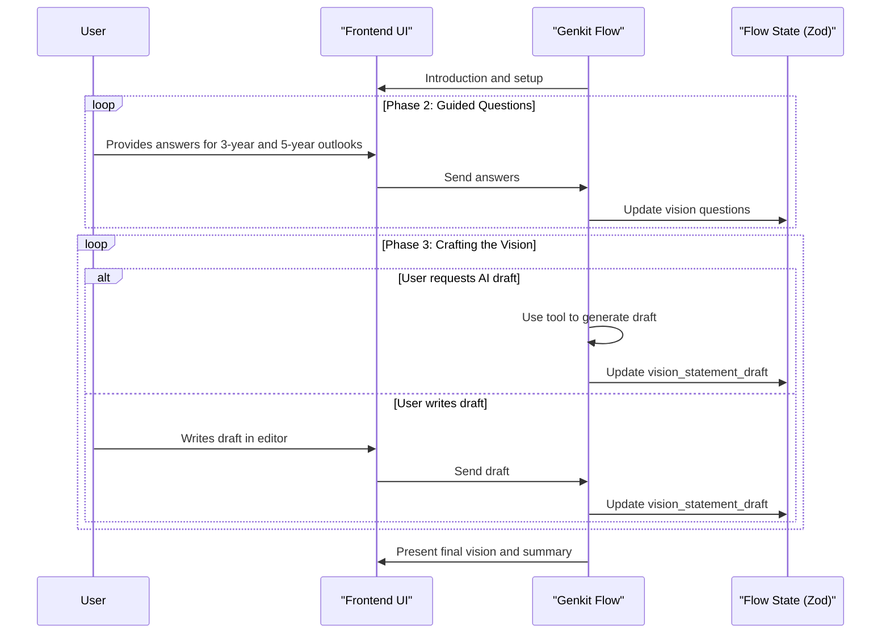

# Genkit Flow: Vision Statement

**Goal:** To transform the static "Vision Statement Worksheet" into a dynamic, interactive, chat-driven experience, implemented as a stateful Genkit flow.

## I. Zod Schema for Flow State

The entire state of the workflow is managed by the following Zod schema:

```javascript
import { z } from 'zod';

const VisionQuestionsSchema = z.object({
  why_exist: z.string().optional(),
  known_for: z.string().optional(),
  customer: z.string().optional(),
  financial_goals: z.string().optional(),
  services: z.string().optional(),
  culture: z.string().optional(),
  membership_appeal: z.string().optional(),
});

const VisionStatementStateSchema = z.object({
  company_name: z.string(),
  vision_questions_3_year: VisionQuestionsSchema,
  vision_questions_5_year: VisionQuestionsSchema,
  vision_statement_draft: z.string().optional(),
  ai_generated_initial_draft: z.boolean().default(false),
  status: z.enum(['in_progress', 'completed']).default('in_progress'),
  last_updated_at: z.string().datetime(),
});
```

## II. Phased Breakdown

### Phase 1: Introduction & Company Confirmation

**A. Genkit Flow Logic (Left Panel):**
1.  **Introduction:** The flow begins by explaining the purpose of a vision statement and how the process will work.
2.  **Company Name:** The flow confirms the user's company name, using the `onboarding_data.company_name` as a default.
3.  **Examples:** The flow offers to show examples of vision statements from well-known companies.

**B. Frontend UI (Right Panel):**
-   A card titled "Vision Statement Worksheet."
-   An input field for the company name, pre-filled and editable.
-   A collapsible section to display the vision statement examples if requested.

### Phase 2: Envisioning the Future - Guided Questions

**A. Genkit Flow Logic (Left Panel):**
1.  **Introduction:** The flow introduces the guided questions for the 3-year and 5-year outlooks.
2.  **Iterative Questioning:** The flow iterates through each of the seven questions, asking for both a 3-year and a 5-year perspective.

**B. Frontend UI (Right Panel):**
-   A card titled "Envisioning Your Future."
-   A table with columns for "Question," "3-Year Outlook," and "5-Year Outlook."
-   Each row corresponds to one of the seven questions, with text areas for the user's answers.
-   The row for the current question being discussed is highlighted.

### Phase 3: Crafting the Vision Statement

**A. Genkit Flow Logic (Left Panel):**
1.  **Introduction:** The flow explains how to use the answers from the previous phase to craft a vision statement.
2.  **AI-Assisted Drafting:** The flow offers to generate an initial draft of the vision statement by using a `tool` to synthesize the user's 5-year outlook answers.
3.  **Refinement:** The flow guides the user through refining the draft, accepting changes and providing suggestions.

**B. Frontend UI (Right Panel):**
-   A card titled "Craft Your Vision Statement."
-   A text area for drafting and editing the vision statement.
-   A button to trigger the AI-assisted drafting.

### Phase 4: Review & Finalize

**A. Genkit Flow Logic (Left Panel):**
1.  **Confirmation:** The flow reads back the final vision statement for confirmation.
2.  **Next Steps:** The flow suggests next steps, such as saving the vision statement or moving on to another workflow.

**B. Frontend UI (Right Panel):**
-   A card titled "Final Vision & Outlook Summary."
-   Displays the final vision statement prominently.
-   An accordion to show the user's answers to the 3-year and 5-year outlook questions.
-   Buttons to "Save and Finalize" or "Edit."

## III. Genkit Implementation Notes

-   **Stateful Flow**: This entire workflow is a single, stateful Genkit `flow`, with the state managed by the `VisionStatementStateSchema`.
-   **AI Drafting Tool**: The AI-assisted drafting of the vision statement should be implemented as a Genkit `tool`. This tool will take the user's 5-year outlook answers as input and use a generative model to synthesize a draft.
-   **Frontend Integration**: The frontend will interact with the Genkit flow by sending user inputs and receiving the updated state to re-render the UI.
-   **Observability**: Genkit's tracing will be useful for debugging the conversational flow and the behavior of the AI drafting tool.

## IV. Workflow Sequence Diagram


